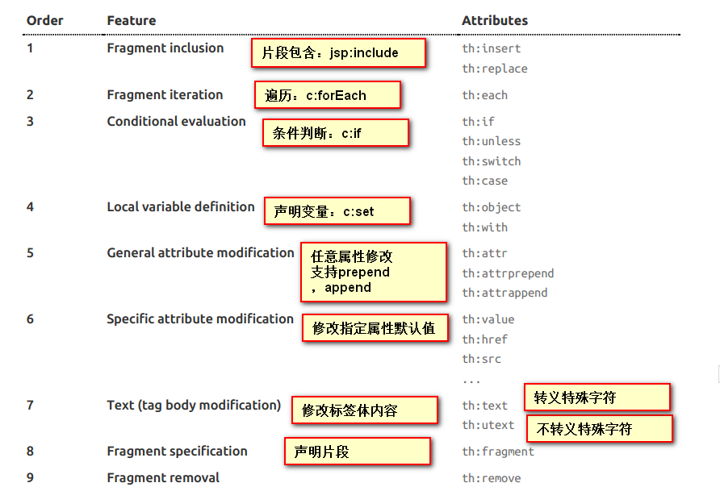

# Thymeleaf

## 模板引擎


Thymeleaf 是一个跟 Velocity、FreeMarker 类似的模板引擎，它可以完全替代 JSP 。相较与其他的模板引擎，它有如下三个特点

- Thymeleaf 在有网络和无网络的环境下皆可运行，即它可以让美工在浏览器查看页面的静态效果，也可以让程序员在服务器查看带数据的动态页面效果。这是由于它支持 html 原型，然后在 html 标签里增加额外的属性来达到模板 + 数据的展示方式。浏览器解释 html 时会忽略未定义的标签属性，所以 thymeleaf 的模板可以静态地运行；当有数据返回到页面时，Thymeleaf 标签会动态地替换掉静态内容，使页面动态显示。
- Thymeleaf 开箱即用的特性。它提供标准和 Spring 标准两种方言，可以直接套用模板实现 JSTL、 OGNL 表达式效果，避免每天套模板、改 JSTL、改标签的困扰。同时开发人员也可以扩展和创建自定义的方言。
- Thymeleaf 提供 Spring 标准方言和一个与 SpringMVC 完美集成的可选模块，可以快速的实现表单绑定、属性编辑器、国际化等功能。

如果希望以 Jar 形式发布模块则尽量不要使用 JSP 相关知识，这是**因为 JSP 在内嵌的 Servlet 容器上运行有一些问题 (内嵌 Tomcat、 Jetty 不支持 Jar 形式运行 JSP**，Undertow 不支持 JSP)。Spring Boot 提供了大量模板引擎，包括：

- FreeMarker
- Groovy
- Mustache
- **Thymeleaf**
- Velocity
- **Beetl**（国产）

## 引入

[官方文档查看更详细内容](https://www.thymeleaf.org/)

```xml
<dependency>
  <groupId>org.springframework.boot</groupId>
  <artifactId>spring-boot-starter-thymeleaf</artifactId>
</dependency>
<!--允许使用非严格的 HTML 语法。可以不添加该依赖-->
<dependency>
  <groupId>net.sourceforge.nekohtml</groupId>
  <artifactId>nekohtml</artifactId>
</dependency>
```

自动配置类如下：

```java
@ConfigurationProperties(prefix = "spring.thymeleaf")
public class ThymeleafProperties {

    private static final Charset DEFAULT_ENCODING = Charset.forName("UTF-8");

    private static final MimeType DEFAULT_CONTENT_TYPE = MimeType.valueOf("text/html");

    public static final String DEFAULT_PREFIX = "classpath:/templates/";

    public static final String DEFAULT_SUFFIX = ".html";
	
   // ......
}
```

## 配置

```yaml
# 在 application.yml 配置 Thymeleaf
spring:
  thymeleaf:
    cache: false # 开发时关闭缓存,不然没法看到实时页面
    mode: HTML # 用非严格的 HTML
    encoding: UTF-8
    servlet:
      content-type: text/html
```

## Hello World

只要我们把HTML页面放在`/templates`，thymeleaf就能自动渲染。在 IDEA 中输入 `html:5`并按下 Tab 键即可生成如下。还需添加 `xmlns:th`

```html
<html lang="en" xmlns:th="http://www.thymeleaf.org"> <!--导入thymeleaf的名称空间，才能有语法提示-->
<head>
    <meta charset="UTF-8">
    <meta name="viewport"
          content="width=device-width, user-scalable=no, initial-scale=1.0, maximum-scale=1.0, minimum-scale=1.0">
    <meta http-equiv="X-UA-Compatible" content="ie=edge">
    <title>Document</title>
</head>
<body>
    <span th:text="${hello}"></span>

</body>
</html>
```

```java
@Controller
public class ThymeleafController {

    @GetMapping("/hello/thymeleaf")
    public String helloThymeleaf(Model model){
        model.addAttribute("hello","helloThymeleaf");
        return "index";
    }
}
```

## 语法

- `th:text`：改变当前元素里面的文本内容，转移特殊字符。`th:utext`不转义。**th:任意html属性**：来替换原生属性的值。
- `th:each`：遍历

  ```html
  <tr th:each="p : ${pageInfo.list}">
      <td th:text="${p.id}"></td>
      <td th:text="${p.name}"></td>


  ```



上图有优先级顺序

- Simple expressions:（表达式语法）

  - **Variable Expressions: `${...}`**：获取变量值；底层是OGNL；

    - 获取对象的属性、调用方法。
    - 使用内置的基本对象：

      - `${#ctx}` : the context object.
      - `${#vars}`: the context variables.
      - `${#locale}` : the context locale. 如`${#locale.country}`
      - `${#request}` : (only in Web Contexts) the HttpServletRequest object.
      - `${#response}` : (only in Web Contexts) the HttpServletResponse object.
      - `${#session}`session : (only in Web Contexts) the HttpSession object.
      - `${#servletContext}` : (only in Web Contexts) the ServletContext object.
    - 使用内置的**工具**对象（同上，放在`${...}`里）：

      - `#execInfo` : information about the template being processed.
      - `#messages` : methods for obtaining externalized messages inside variables expressions, in the same way as they would be obtained using {…} syntax.
      - `#uris` : methods for escaping parts of URLs/URIs
      - `#conversions` : methods for executing the configured conversion service (if any).
      - `#dates` : methods for java.util.Date objects: formatting, component extraction, etc.
      - `#calendars` : analogous to dates , but for java.util.Calendar objects.
      - `#numbers` : methods for formatting numeric objects.
      - `#strings` : methods for String objects: contains, startsWith, prepending/appending, etc.
      - `#objects` : methods for objects in general.
      - `#bools` : methods for boolean evaluation.
      - `#arrays` : methods for arrays.
      - `#lists` : methods for lists.
      - `#sets` : methods for sets.
      - `#maps` : methods for maps.
      - `#aggregates` : methods for creating aggregates on arrays or collections.
      - `#ids` : methods for dealing with id attributes that might be repeated (for example, as a result of an iteration).
  - Selection Variable Expressions: `*{...}`：选择表达式：和`${...}`在功能上是一样；配合`th:object`使用如下：

    ```html
    <div th:object="${session.user}">
        <p>Name: <span th:text="*{firstName}">Sebastian</span>.</p>	<!--${session.user.firstName}-->
        <p>Surname: <span th:text="*{lastName}">Pepper</span>.</p>	<!--${session.user.lastName}-->
        <p>Nationality: <span th:text="*{nationality}">Saturn</span>.</p>	<!--${session.user.nationality}-->
    </div>

    ```
  - Message Expressions: `#{...}`：获取国际化内容
  - **Link URL Expressions**: `@{...}`：定义URL；在需要参数时，放在`()`里。

    ```html
    <li><a href="" th:href="@{/user}" aria-label="Previous">首页</a></li>
    <li><a href="" th:href="@{/user(pageNum=${pageInfo.pageNum}-1)}">上一页</a></li>
    <li th:each="i:${#numbers.sequence(1,pageInfo.pages)}"><a href="" th:href="@{/user(pageNum=${i})}" th:text="${i}"></a></li> 暂时不会使用thymeleaf写页码
    <li><a href="" th:href="@{/user(pageNum=${pageInfo.pageNum}+1)}">下一页</a></li>
    <li><a href="" th:href="@{/user(pageNum=${pageInfo.pages})}" aria-label="Next">尾页</a></li>
    若使用Pagehelper，无需考虑越界

    <form th:action="@{/user/}+${user.id}" method="POST">
        <input type="hidden" name="_method" value="PUT">
        <input type="hidden" name="id" th:value="${user.id}">
        <input type="radio" th:name="sex" value="男" th:checked="${user.sex}=='男'?true:false">
    </form>

    <script th:src="@{/plugins/bootstrap/js/bootstrap.min.js}"></script>

    ```
  - Fragment Expressions: `~{...}`：片段引用表达式
  - Literals（字面量）

    - Text literals: 'one text' , 'Another one!' ,…
    - Number literals: 0 , 34 , 3.0 , 12.3 ,…
    - Boolean literals: true , false
    - Null literal: null
    - Literal tokens: one , sometext , main ,…
  - Text operations:（文本操作）

    - String concatenation: +
    - Literal substitutions: |The name is ${name}|
  - Arithmetic operations:（数学运算）

    - Binary operators: + , - , * , / , %
    - Minus sign (unary operator): -
  - Boolean operations:（布尔运算）

    - Binary operators: and , or
    - Boolean negation (unary operator): ! , not
  - Comparisons and equality:（比较运算）

    - Comparators: > , < , >= , <= ( gt , lt , ge , le )
    - Equality operators: == , != ( eq , ne )
  - Conditional operators:条件运算（三元运算符）

    - If-then: (if) ? (then)
    - If-then-else: (if) ? (then) : (else)
    - Default: (value) ?: (defaultvalue)
  - Special tokens:

    - No-Operation: _

## 公共页面的抽取

```html
1、抽取公共片段
<footer th:fragment="copy" id="footer1">
© 2011 The Good Thymes Virtual Grocery
</footer>

2、引入方式（每个templates下的html都是模板，其去掉后缀就是模板名）
~{templatename::selector}：模板名::选择器（CSS选择器）
~{templatename::fragmentname}:模板名::片段名
使用以下属性进行引入，可以不用写~{}
行内写法可以加上：[[~{}]];[(~{})]；一个是转义，一个不转义
<div th:insert="footer :: copy"></div> 	<!--将公共片段整个插入到声明引入的元素中-->
<div th:replace="footer :: copy"></div>	<!--将声明引入的元素替换为公共片段-->
<div th:include="footer :: copy"></div>	<!--将被引入的片段的内容（只有内容）包含进这个标签中-->

<div th:include="footer :: #footer1"></div> <!--显示效果同include-->

效果
<div>
    <footer>
    © 2011 The Good Thymes Virtual Grocery
    </footer>
</div>

<footer>
© 2011 The Good Thymes Virtual Grocery
</footer>

<div>
© 2011 The Good Thymes Virtual Grocery
</div>

```

引入片段的时候传入参数（动态显示高亮等用处）：

```html
<nav class="col-md-2 d-none d-md-block bg-light sidebar" id="sidebar">
    <div class="sidebar-sticky">
        <ul class="nav flex-column">
            <li class="nav-item">
                <a class="nav-link active"
                   th:class="${activeUri=='main.html'?'nav-link active':'nav-link'}"
                   href="#" th:href="@{/main.html}">
                    <svg xmlns="http://www.w3.org/2000/svg" width="24" height="24" viewBox="0 0 24 24" fill="none" stroke="currentColor" stroke-width="2" stroke-linecap="round" stroke-linejoin="round" class="feather feather-home">
                        <path d="M3 9l9-7 9 7v11a2 2 0 0 1-2 2H5a2 2 0 0 1-2-2z"></path>
                        <polyline points="9 22 9 12 15 12 15 22"></polyline>
                    </svg>
                    Dashboard <span class="sr-only">(current)</span>
                </a>
            </li>

<!--引入侧边栏;传入参数-->
<div th:replace="commons/bar::#sidebar(activeUri='emps')"></div>

```