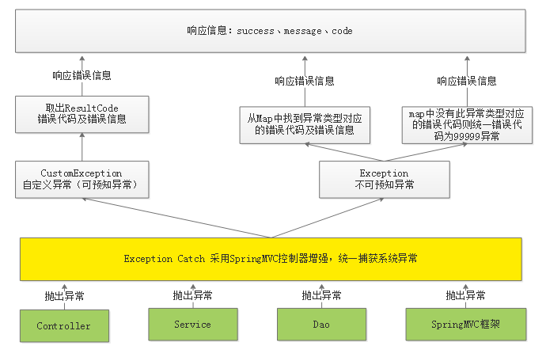

# 异常处理 & 统一错误响应

## 为什么需要异常处理？🔥

* 异常时把**所有信息**都返回给客户端吗？许多老系统中发生异常，直接**暴露出数据库等各种错误，极其不安全**！！！

* 异常时返回给客户端**简单的信息**吗？如`错误代码：11111，失败信息：操作失败`，**无法区别具体的错误信息**。
* **Service 层方法在执行过程中出现异常该不该捕获**？如果该，则 Service 层中会有太多的 try、catch 代码，代码冗余不易维护；如果不该，则抛到 Controller 层，那无论如何还得捕获，否则直接暴露给 JVM，则还是会出现第一种情况！

所以，需要一个能同一处理异常的地方！

* 无需 Service、Controller 来捕获异常，直接**在统一异常处理类中去捕获，并记录日志**，最后统一向用户返回**规范的响应信息**！
* 此时在 Service 中的方法在编码时就可以**先校验判断**，有问题**直接抛出**具体的异常信息，**然后执行具体业务逻辑**，**最后返回成功的信息**！


## 使用 HTTP 协议状态码 & 全部返回 200 ？🔥

这个无法给出具体答案。

* 我认为在自己的业务系统中，可以使用 HTTP 的状态码来表示，前端异常处理就可以在 error 中捕获了，无需在 success 中判断 code 码！
* 对于国内运营商来说，有些 HTTP 状态码会被过滤了。

总得来说，根据需要吧，反正也不需要使用太多的不常用 HTTP 状态码，应该没有问题！

该章节演示HTTP 协议状态码的使用，全部返回 200 更简单，修改一下即可！


## UnifyResponse 统一错误响应 🔥

```java
@Builder
@Data
public class UnifyResponse {

    private int code;
    private String message;
    private String request;
}
```

config/code-message.properties

```properties
# ========== 不可预知异常 start ==========
lin.codes[9999] = 😳服务器未知异常
lin.codes[9998] = 😳非法参数异常
# ========== 不可预知异常 end ==========


lin.codes[10000] = 通用异常

lin.codes[30003] = 商品信息不存在
lin.codes[30005] = Banner类资源不存在
```

```java
/**
 * 该类用于关联 code-message.properties 配置文件
 */
@PropertySource("classpath:config/code-message.properties")
@ConfigurationProperties(prefix = "lin")
@Configuration
public class CodeConfiguration {


    /** codes 属性对应配置文件中的 codes */
    private Map<Integer, String> codes = new HashMap<>();

    /** 必须提供 setter 方法， 以便 Spring Boot 自动映射配置文件到属性 */
    public void setCodes(Map<Integer, String> codes) {
        this.codes = codes;
    }

    public String getMessage(int code){
        return codes.get(code);
    }
}
```

返回值如下：

```json
{
    "code": 10000,
    "message": "hello",
    "body": null,
    "request": url
}
```

其中 code 和 message 可以使用错误信息清单配置文件集中管理，也方便 i18n。

当然使用枚举也行，只是不知道如何 i18n。


## 错误信息清单 & 枚举 ？🔥

* 错误信息清单可以更好的进行国际化。枚举就不知道如何操作了。
* 该章节演示错误信息清单的使用。枚举其实更简单。


## 错误信息清单使用步骤 🔥


### 1 自定义异常类—可预知异常

由于是程序员抛出的异常，通常异常信息比较齐全，程序员在抛出时会指定错误代码及错误信息，获取异常信息也比较方便。

```java
@EqualsAndHashCode(callSuper = true)
@Data
public class HttpException extends RuntimeException{

    /** 业务状态码 */
    private int code;

    /** HTTP 状态 */
    private HttpStatus httpStatus;


    /**
     * 通用构造类
     * @param code code
     * @param httpStatus httpStatus
     */
    public HttpException(int code, HttpStatus httpStatus){
        this.code = code;
        this.httpStatus = httpStatus;
    }


    /**
     * 500
     * @param code code
     */
    public HttpException(int code){
        this.code = code;
        this.httpStatus = HttpStatus.INTERNAL_SERVER_ERROR;
    }

}
```

```java
public class NotFoundException extends HttpException {

    public NotFoundException(int code){
        super(code, HttpStatus.NOT_FOUND); // 404
    }
}
```

```java
public class ForbiddenException extends HttpException {

    public ForbiddenException(int code){
        super(code, HttpStatus.FORBIDDEN); // 403
    }
}
```


### 2 不可预知异常

不可预知异常通常是由于系统出现bug、或一些不要抗拒的错误（比如网络中断、服务器宕机等），异常类型为 RuntimeException类型（运行时异常）

如使用 Postman 测试报错信息如下：`org.springframework.http.converter.HttpMessageNotReadableException`，此异常是 SpringMVC 在进行参数转换时报的错误。

针对不可预知异常问题其解决方案是：

1. 我们在map中配置HttpMessageNotReadableException和错误代码。
2. 在异常捕获类中对Exception异常进行捕获，并从map中获取异常类型对应的错误代码，如果存在错误代码则返回此错误，否则统一返回9999错误。


### 3 全局异常捕获—处理（不）可预知异常

```java
/**
 * 全局异常处理
 */
@RestControllerAdvice
@Slf4j
public class GlobalExceptionAdvice {

    @Autowired
    private CodeConfiguration codeConfiguration;


    // 这个不可预知异常完全可以直接抛出9999类似的服务器异常，无需写这些
    //使用EXCEPTIONS存放异常类型和错误代码的映射，ImmutableMap的特点的一旦创建不可改变，并且线程安全
    private static ImmutableMap<Class<? extends Throwable>, Integer> EXCEPTIONS;
    //使用builder来构建一个异常类型和错误代码的异常
    protected static ImmutableMap.Builder<Class<? extends Throwable>, Integer> builder = ImmutableMap.builder();

    //在这里加入一些基础的异常类型判断。这里只添加了一个示例
    static {
        builder.put(HttpMessageNotReadableException.class, 9998);
    }


    /**
     * 可预知异常（自定义异常类型）
     */
    @ExceptionHandler(HttpException.class)
    public HttpEntity<UnifyResponse> handleHttpException(HttpException exception,
                                                         HttpServletRequest request,
                                                         HandlerMethod handlerMethod,
                                                         HttpMethod httpMethod) {
        UnifyResponse unifyResponse = UnifyResponse.builder()
                .code(exception.getCode())
                .message(codeConfiguration.getMessage(exception.getCode()))
                .request(httpMethod + " " + request.getRequestURI())
                .build();
        log.warn("{}, 方法为：{}, 异常为：{}", codeConfiguration.getMessage(exception.getCode()), handlerMethod, exception);
        // ResponseEntity 继承了 HttpEntity
        return new ResponseEntity<>(unifyResponse, exception.getHttpStatus());
    }


    /**
     * 不可预知异常
     * 已经使用了 @ResponseStatus(HttpStatus.INTERNAL_SERVER_ERROR) 所以无需返回 HttpEntity
     */
    @ExceptionHandler(Exception.class)
    @ResponseStatus(HttpStatus.INTERNAL_SERVER_ERROR)
    public UnifyResponse handleException(Exception exception,
                                         HttpServletRequest request,
                                         HandlerMethod handlerMethod,
                                         HttpMethod httpMethod) {
        if (EXCEPTIONS == null) {
            EXCEPTIONS = builder.build();
        }

        Integer code = EXCEPTIONS.get(exception.getClass());
        UnifyResponse unifyResponse;
        if (Objects.nonNull(code)){
            unifyResponse = new UnifyResponse(code, codeConfiguration.getMessage(code), httpMethod + " " + request.getRequestURI());
        } else {
            unifyResponse = new UnifyResponse(9999, codeConfiguration.getMessage(9999), httpMethod + " " + request.getRequestURI());
        }


        log.warn("系统未知异常, 方法为：{}, 异常为：{}", handlerMethod, exception);
        return unifyResponse;
    }

  
    // ====================后面这些是参数校验时使用======================

    /**
     * 参数校验异常 （JSON 格式）
     * 已经使用了 @ResponseStatus(HttpStatus.BAD_REQUEST) 所以无需返回 HttpEntity
     */
    @ExceptionHandler(MethodArgumentNotValidException.class)
    @ResponseStatus(HttpStatus.BAD_REQUEST)
    public UnifyResponse handleMethodArgumentNotValidException(MethodArgumentNotValidException exception,
                                                               HttpServletRequest request,
                                                               HandlerMethod handlerMethod,
                                                               HttpMethod httpMethod) {

        // 日！这获取到的 error 还是随机顺序 ...
        List<ObjectError> allErrors = exception.getBindingResult().getAllErrors();
        String message = formatAllErrorsMessage(allErrors);

        UnifyResponse unifyResponse = new UnifyResponse(10001, message, httpMethod + " " + request.getRequestURI());
        log.warn("系统未知异常, 方法为：{}, 异常为：{}", handlerMethod, exception);
        // ResponseEntity 继承了 HttpEntity
        return unifyResponse;
    }

    /**
     * 参数校验异常 URL 及查询参数（JSON 格式）
     * 已经使用了 @ResponseStatus(HttpStatus.BAD_REQUEST) 所以无需返回 HttpEntity
     */
    @ExceptionHandler(ConstraintViolationException.class)
    @ResponseStatus(HttpStatus.BAD_REQUEST)
    public UnifyResponse handleConstraintViolationException(ConstraintViolationException exception,
                                                            HttpServletRequest request,
                                                            HandlerMethod handlerMethod,
                                                            HttpMethod httpMethod) {

        Set<ConstraintViolation<?>> constraintViolations = exception.getConstraintViolations();
        String message = formatAllErrorsMessage(constraintViolations);
        // String message = formatAllErrorsMessage(allErrors);

        UnifyResponse unifyResponse = new UnifyResponse(10001, message, httpMethod + " " + request.getRequestURI());
        log.warn("系统未知异常, 方法为：{}, 异常为：{}", handlerMethod, exception);
        // ResponseEntity 继承了 HttpEntity
        return unifyResponse;
    }


    /**
     * 格式化参数校验错误信息
     */
    private String formatAllErrorsMessage(List<ObjectError> allErrors) {
        StringJoiner stringJoiner = new StringJoiner(";");
        allErrors.forEach(error -> stringJoiner.add(error.getDefaultMessage()));
        return stringJoiner.toString();
    }


    /**
     * 格式化参数校验错误信息
     */
    private String formatAllErrorsMessage(Set<ConstraintViolation<?>> constraintViolations) {
        StringJoiner stringJoiner = new StringJoiner(";");
        constraintViolations.forEach(error -> {
            String format = String.format("['%s'无法通过校验, %s]", error.getInvalidValue(), error.getMessage());
            stringJoiner.add(format.toString());
        });
        return stringJoiner.toString();
    }


    // TODO 表单提交 org.springframework.validation.BindException: org.springframework.validation.BeanPropertyBindingResult: 1 errors

}
```


## 枚举 & 全200状态码使用步骤

### 1 自定义异常类—可预知异常

```java
@NoArgsConstructor
@AllArgsConstructor// 由构造方法传入
@Getter// 提供get方法获取具体信息
public class CustomException extends RuntimeException {

    private IStatusCode iStatusCode;

}
```


### 2 不可预知异常

使用 Postman 测试报错信息如下：`org.springframework.http.converter.HttpMessageNotReadableException`，此异常是 SpringMVC 在进行参数转换时报的错误。

针对不可预知异常问题其解决方案是：

1. 我们在map中配置HttpMessageNotReadableException和错误代码。
2. 在异常捕获类中对Exception异常进行捕获，并从map中获取异常类型对应的错误代码，如果存在错误代码则返回此错误，否则统一返回9999错误。


### 3 全局异常捕获—处理（不）可预知异常

此处代码理解即可

```java
@ControllerAdvice//控制器增强
public class ExceptionCatch {

    private static final Logger LOGGER = LoggerFactory.getLogger(ExceptionCatch.class);

    //使用EXCEPTIONS存放异常类型和错误代码的映射，ImmutableMap的特点的一旦创建不可改变，并且线程安全
    private static ImmutableMap<Class<? extends Throwable>, ResultCode> EXCEPTIONS;
    //使用builder来构建一个异常类型和错误代码的异常
    protected static ImmutableMap.Builder<Class<? extends Throwable>, ResultCode> builder =
        ImmutableMap.builder();

    //在这里加入一些基础的异常类型判断。这里只添加了一个示例
    static {
        builder.put(HttpMessageNotReadableException.class, CommonCode.INVALID_PARAM);
    }

    @ExceptionHandler(CustomException.class)//捕获 CustomException异常
    @ResponseBody//返回JSON数据
    public ResponseResult customException(CustomException e) {
        LOGGER.error("catch exception:\n" + e.getMessage(), e);//catch到异常记录日志
        return new ResponseResult(e.getResultCode());
    }

    @ExceptionHandler(Exception.class)//捕获 Exception异常
    @ResponseBody//返回JSON数据
    public ResponseResult exception(Exception e) {
        LOGGER.error("catch exception:\n" + e.getMessage(), e);//catch到异常记录日志
        if (EXCEPTIONS == null) {
            EXCEPTIONS = builder.build();
        }
        ResponseResult responseResult;
        ResultCode resultCode = EXCEPTIONS.get(e.getClass());
        if (resultCode != null) {
            responseResult = new ResponseResult(resultCode);
        } else {
            responseResult = new ResponseResult(CommonCode.SERVER_ERROR);//99999异常
        }
        return responseResult;
    }
}
```

还需再启动类上注解要扫描异常类所在包

```java
@ComponentScan("top.conanan.framework")
```

或使用 @Componet 注解注册该Bean


### 异常的抛出及处理流程总结 🔥



1. 在**Controller、Service、Dao中程序员抛出自定义异常**；**SpringMVC 等框架抛出框架异常类型**。统一由**异常捕获类捕获异常**，并进行处理
2. 捕获到**自定义异常则直接取出错误代码及错误信息**
3. 捕获到**非自定义异常类型首先从Map中找**该异常类型是否对应具体的错误代码，如果有则取出错误代码和错误信息并响应给用户，如果从Map中找不到异常类型所对应的错误代码则统一为99999错误代码
4. 将**错误代码及错误信息以JSON格式响应给用户**


## ResponseBodyAdvice 对全 200 状态码增强 🔥

参考挺哥的[语雀](https://www.yuque.com/bravo1988/java/iodh7z)

### ResponseBodyAdvice 简介

* Spring提供的一个接口，和AOP一样的，XxxAdvice都是用来增强的
* 配合@RestControllerAdvice注解，可以“拦截”返回值
* 通过supports()方法判断是否需要“拦截”

```java
@RestControllerAdvice
public class CommonResponseDataAdvice implements ResponseBodyAdvice<Object> {


    @Override
    public boolean supports(MethodParameter methodParameter, Class<? extends HttpMessageConverter<?>> aClass) {
        // 对所有返回值起作用
        return true;
    }

    @Override
    public Object beforeBodyWrite(Object o,
                                  MethodParameter methodParameter,
                                  MediaType mediaType,
                                  Class<? extends HttpMessageConverter<?>> aClass,
                                  ServerHttpRequest serverHttpRequest,
                                  ServerHttpResponse serverHttpResponse) {
		// 改一行代码即可：把Object返回值用Result封装
        return Result.success(o);
    }
}
```


### 定义@CosmoController

```java
@RestController
@Retention(RetentionPolicy.RUNTIME)
@Target({ElementType.TYPE})
public @interface CosmoController {
}
```


### ResponseBodyAdvice统一结果封装

目标是：

* 如果使用了@CosmoController，就在CommonResponseDataAdvice中使用Result封装结果
* 如果使用了原生的@RestController，就原样返回，不做任何处理

且需要考虑到：

* 如果Controller返回值已经用Result封装过了呢，此时会造成重复嵌套！
* 标注了@CosmoController后，内部个别方法不希望用Result封装该怎么做？可以单独再定一个注解

  ```java
  @Retention(RetentionPolicy.RUNTIME)
  @Target({ElementType.TYPE, ElementType.METHOD})
  public @interface IgnoreCosmoResult {
  }
  ```
* 诸如参数校验失败等情况怎么处理呢？

最终代码如下：

```java
@RestControllerAdvice
public class CommonResponseDataAdvice implements ResponseBodyAdvice<Object> {


    @Override
    public boolean supports(MethodParameter methodParameter, Class<? extends HttpMessageConverter<?>> aClass) {
        // 标注了@CosmoController，且类及方法上都没有标注@IgnoreCosmoResult的方法才进行包装
        return methodParameter.getDeclaringClass().isAnnotationPresent(CosmoController.class)
                && !methodParameter.getDeclaringClass().isAnnotationPresent(IgnoreCosmoResult.class)
                && !methodParameter.getMethod().isAnnotationPresent(IgnoreCosmoResult.class);
    }

    @Override
    public Object beforeBodyWrite(Object o,
                                  MethodParameter methodParameter,
                                  MediaType mediaType,
                                  Class<? extends HttpMessageConverter<?>> aClass,
                                  ServerHttpRequest serverHttpRequest,
                                  ServerHttpResponse serverHttpResponse) {
		// 已经包装过的，不再重复包装
        if (o instanceof Result) {
            return o;
        }

        return Result.success(o);
    }
}
```


## SSM—非前后分离版

- SpringMVC在处理请求过程中出现异常信息交由异常处理器进行处理，自定义异常处理器可以实现一个系统的异常处理逻辑
- 思路：

  - 系统中异常包括两类：**预期异常**和运行时异常**RuntimeException**，前者通过捕获异常从而获取异常信息，后者主要通过规范代码开发、测试通过手段减少运行时异常的发生
  - 系统的dao、service、controller出现都通过throws Exception向上抛出，最后由SpringMVC**前端控制器交由异常处理器**进行异常处理
- **自定义异常类(继承Exception或RuntimeException)**：为了区别不同的异常,通常根据异常类型进行区分

  ```java
  public class MyException{
      public MyException(){};
      public MyException(String msg){
          super(msg);
      };
  }
  ```
- **自定义异常处理器(实现HandlerExceptionResolver)**，并**在`spring-config.xml`中配置或使用`@Component`**

  ```java
  @Component
  public class CustomExceptionResolver implements HandlerExceptionResolver {
     	//handler:异常处理器对象。发生异常的地方，包名+类名+方法名(形参)的字符串，用于日志
      @Override
      public ModelAndView resolveException(HttpServletRequest request, HttpServletResponse response, Object handler,Exception exception) {

          ModelAndView modelAndView = new ModelAndView();
          // 定义异常信息
          String msg = "";

          // 判断异常类型
          if (exception instanceof MyException) {
              // 如果是自定义异常，读取异常信息
              msg = exception.getMessage();
          } else {
              //简写
              msg = "服务器访问量过大，请您稍后..."
              //或 如果是运行时异常，则取错误堆栈，从堆栈中获取异常信息
              //Writer out = new StringWriter();
              //PrintWriter s = new PrintWriter(out);
              //exception.printStackTrace(s);
              //msg = out.toString();

          }
          // 把错误信息发给相关人员,邮件,短信等方式
          // 返回错误页面，给用户友好页面显示错误信息

          modelAndView.addObject("msg", msg);
          modelAndView.setViewName("error");

          return modelAndView;
      }
  }
  ```