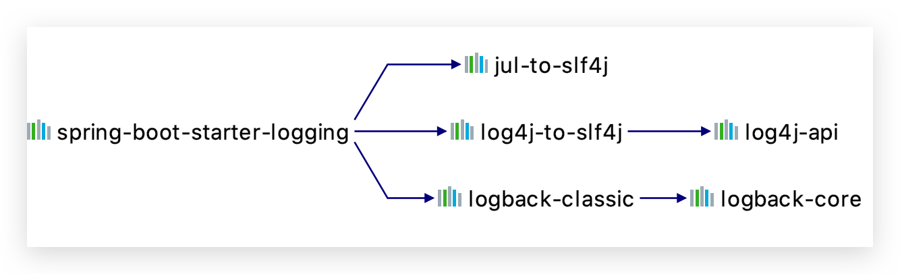
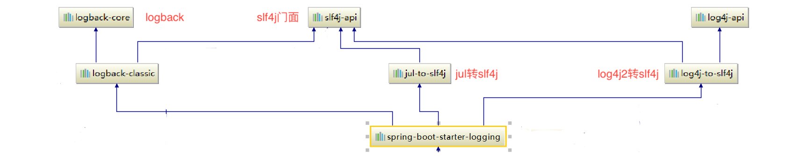

# Log

> 也可查看 Spring Boot 官方文档[日志篇](https://docs.spring.io/spring-boot/docs/2.2.2.RELEASE/reference/htmlsingle/#boot-features-logging)
>

Spring Boot 对所有内部日志使用通用日志记录，但保留底层日志实现的开放。为 JUL、Log4J2 和 Logback 提供了默认配置。在每种情况下，日志记录器都预先配置为使用控制台输出，并提供可选的文件输出。

默认情况下，如果使用“Starters”， 则 Logback 将被用来日志记录。还包括适当的 Logback 路由，以确保使用 Java Util Logging, Commons Logging, Log4J 或 SLF4J 的依赖库都能正常工作。

## 日志框架

借鉴 JDBC 设计模式，写一个统一的日志抽象接口层即**日志门面**，给项目中导入具体的日志实现就行了。我们之前的日志框架都是实现的抽象层；市面上的日志框架如下：

|                  门面                  |
| :-------------------------------------: |
|     JCL（Jakarta Commons Logging）     |
| SLF4j（Simple Logging Facade for Java） |

写了一个统一的接口层；日志门面（日志的一个抽象层）；logging-abstract.jar；

|         日志实现         |
| :----------------------: |
|          Log4j          |
| JUL（java.util.logging） |
|       **Logback**       |
|          Log4j2          |

**SpringBoot 默认选用 SLF4j 和 logback**

## 日志格式

Spring Boot 的默认日志输出类似于下面的示例

```
2020-01-12 00:42:19.350 ERROR 6565 --- [           main] c.e.studylog.StudyLogApplicationTests    : error
```

输出下列项目：

- 日期和时间：毫秒精度，容易排序
- 日志级别：`ERROR` `WARN` `INFO` `DEBUG` `TRACE`。Logback 没有 `FATAL` 级别，它被映射到 `ERROR`级别
- 进程 ID
- 分隔符 `---` 以区分实际日志消息的开始
- 线程名：用方括号括起来（对于控制台输出可能会被截断）
- 记录器名称：一般是全限定类名（通常缩写）。
- 日志信息

## 控制台输出 🔥

默认的日志配置在消息写入时将消息回显到控制台。默认情况下，会记录 `ERROR` `WARN` `INFO`。

可以通过使用`--debug`标志启动应用程序来启用调试模式。还可以在 application.yaml 中指定 `debug=true`。

```bash
java -jar myapp.jar --debug
```

启用`debug`模式后，将配置一些核心记录器（嵌入式容器，Hibernate 和 Spring Boot）以输出更多信息。 启用`debug`模式不会将您的应用程序配置为记录所有具有`DEBUG`级别的消息。或者，您可以通过使用`--trace`标志（或 application.yaml 中的`trace = true`）启动应用程序来启用“跟踪”模式。 这样做可以为某些核心记录器（嵌入式容器，Hibernate 模式生成以及整个 Spring 产品组合）启用跟踪记录。

### 彩色编码输出

如果你的终端支持 ANSI，颜色输出用于帮助可读性。你可以设置`spring.output.ansi.enabled` 启用到受支持的值来覆盖自动检测。颜色编码是通过使用`%clr`转换字来配置的。在其最简单的形式中，转换器根据日志级别对输出进行着色，如下面的示例所示

```
%clr(%5p)
```

下表描述了日志级别到颜色的映射：

| Level   | Color  |
| :------ | :----- |
| `FATAL` | Red    |
| `ERROR` | Red    |
| `WARN`  | Yellow |
| `INFO`  | Green  |
| `DEBUG` | Green  |
| `TRACE` | Green  |

另外，您可以通过将其提供为转换的选项来指定应使用的颜色或样式。 例如，要使文本变黄，请使用以下设置：

```
%clr(%d{yyyy-MM-dd HH:mm:ss.SSS}){yellow}
```

支持以下颜色和样式：

- `blue`
- `cyan`
- `faint`
- `green`
- `magenta`
- `red`
- `yellow`

## 文件输出 🔥

**默认**情况下，Spring Boot **仅记录到控制台，不写日志文件**。 如果除了控制台输出外还想写日志文件，则需要在 application.yaml 中设置`logging.file.name` 或`logging.file.path`属性。

下表显示了如何结合使用 `logging.*` 属性：

| `logging.file.name`🔥 | `logging.file.path` | Example    | Description                                                                          |
| :-------------------- | :------------------ | :--------- | :----------------------------------------------------------------------------------- |
| _(none)_              | _(none)_            |            | 仅在控制台输出                                                                       |
| Specific file         | _(none)_            | `my.log`   | 写入指定的日志文件。名称可以是**绝对位置**，也可以是**相对于当前目录的位置**         |
| _(none)_              | Specific directory  | `/var/log` | 将`spring.log`写入指定目录。名称可以是**绝对位置**，也可以是**相对于当前目录的位置** |

日志文件达到 10 MB 时会压缩，并且与控制台输出一样，默认情况下会记录`ERROR`级别，`WARN`级别和`INFO`级别的消息。

可以使用`logging.file.max-size`属性**更改大小限制**。 除非已设置`logging.file.max-history`属性，否则以前压缩的文件将无限期存档。

可以使用`logging.file.total-size-cap`限制**日志归档文件的总大小**。 当日志归档的总大小超过该阈值时，**将删除备份**。 要在应用**程序启动时强制清除日志归档文件**，请使用`logging.file.clean-history-on-start`属性。

日志属性独立于实际的日志基础架构。因此特定的配置（如`logback.configurationFile` ）不是由 spring Boot 管理的。

### 自定义日志配置 🔥

> 其实使用的比较少，因为其功能比较少。一般直接导入具体实现框架的配置
>

可以**通过在类路径中包括适当的库来激活各种日志记录系统**，并可以通过在类路径的根目录中或在以下 Spring Environment 属性指定的位置中提供适当的配置文件来进一步自定义日志文件：logging.config。为了方便自定义，将一些其他属性从 Spring Environment 转移到 System 属性，见[文档](https://docs.spring.io/spring-boot/docs/2.2.2.RELEASE/reference/htmlsingle/#boot-features-custom-log-configuration)

给**类路径**下放上**每个日志框架自己的配置文件**即可；SpringBoot 就不使用他默认配置的了。根据您的日志记录系统，将加载以下文件：

| Logging System          | Customization                                                                     |
| :---------------------- | :-------------------------------------------------------------------------------- |
| Logback                 | `logback-spring.xml`, `logback-spring.groovy`, `logback.xml`, or `logback.groovy` |
| Log4j2                  | `log4j2-spring.xml` or `log4j2.xml`                                               |
| JDK (Java Util Logging) | `logging.properties`                                                              |

如果可能，我们建议您在日志配置中使用`-spring`变体（例如，`logback-spring.xml`而不是`logback.xml`）。 如果使用标准配置位置，Spring 将无法完全控制日志初始化。

- **logback-spring.xml**：**推荐！**日志框架就不直接加载日志的配置项，**由 SpringBoot 解析日志配置**，可以使用 SpringBoot 的**高级 Profile 功能**

  ```xml
  <springProfile name="staging">
      <!-- configuration to be enabled when the "staging" profile is active -->
    	可以指定某段配置只在某个环境下生效
  </springProfile>
  ```

  如下：

  ```xml
  <appender name="stdout" class="ch.qos.logback.core.ConsoleAppender">
      <layout class="ch.qos.logback.classic.PatternLayout">
          <springProfile name="dev">
              <pattern>%d{yyyy-MM-dd HH:mm:ss.SSS} ----> [%thread] ---> %-5level %logger{50} - %msg%n</pattern>
          </springProfile>
          <springProfile name="!dev">
              <pattern>%d{yyyy-MM-dd HH:mm:ss.SSS} ==== [%thread] ==== %-5level %logger{50} - %msg%n</pattern>
          </springProfile>
      </layout>
  </appender>
  ```

  如果使用 logback.xml 作为日志配置文件，还要使用 profile 功能，会有以下错误`no applicable action for [springProfile]`

具体各实现的配置文件自己找

## 日志等级

所有被支持的日志系统都可以通过使用`logging.level.<logger-name>=<level>`（其中 `level` 是 `TRACE`, `DEBUG`, `INFO`, `WARN`, `ERROR`, `FATAL`, 或 `OFF`）在 Spring `Environment`中（例如，在 application.yaml 中）设置日志记录器级别。可以使用`logging.level.root`配置`root`记录器。

以下示例显示了 application.yaml 中的日志记录设置：

```yaml
logging:
level:
root: warn
org.springframework.web: debug
org.hibernate: error
```

也可以使用环境变量设置日志记录级别。 例如，`LOGGING_LEVEL_ORG_SPRINGFRAMEWORK_WEB = DEBUG`会将`org.springframework.web`设置为`DEBUG`。

## 日志组

能够将相关记录器分组在一起通常是很有用的，以便可以同时配置它们。 例如，您可能通常会更改所有与 Tomcat 相关的记录器的记录级别，但是您不容易记住顶层软件包。

为了解决这个问题，Spring Boot 允许您在 Spring Environment 中定义日志记录组。 例如，以下是通过将“tomcat”组添加到 application.yaml 来定义它的方法：

```yaml
logging:
group:
tomcat: org.apache.catalina, org.apache.coyote, org.apache.tomcat
```

一旦定义后，您可以使用一行更改该组中所有记录器的级别：

```yaml
logging:
level:
tomcat: TRACE
```

Spring Boot 包含以下预定义的日志记录组，它们可以直接使用：

| Name | Loggers                                                                                                                                                                                                                     |
| :--- | :-------------------------------------------------------------------------------------------------------------------------------------------------------------------------------------------------------------------------- |
| web  | `org.springframework.core.codec`<br/>`org.springframework.http`<br/>`org.springframework.web`<br/>`org.springframework.boot.actuate.endpoint.web`<br/>`org.springframework.boot.web.servlet.ServletContextInitializerBeans` |
| sql  | `org.springframework.jdbc.core`<br/>`org.hibernate.SQL`<br/>`org.jooq.tools.LoggerListener`                                                                                                                                 |

## 统一日志框架

- a 系统（slf4j+logback）: Spring（commons-logging）、Hibernate（jboss-logging）、MyBatis、xxxx
- **统一日志记录**，即**如何让系统中所有的日志都统一到 slf4j？**

  - **将系统中其他日志框架先排除出去；**
  - **用桥接器来替换原有的日志框架；**
  - **我们导入 slf4j 其他的实现**


## SLF4j + logback🔥

### Java 项目使用

- 给系统里面导入 SLF4j 的 jar 和 logback 的实现 jar
- 每一个日志的实现框架都有自己的配置文件。使用 slf4j**配置文件还是做成日志实现框架自己本身的配置文件；**

### Spring Boot 使用

默认`spring-boot-starter`以及依赖此的 starter 都会自动导入`spring-boot-starter-logging`

**SpringBoot 能自动适配所有的日志，而且底层使用 slf4j+logback 的方式记录日志。其底层依赖关系如下**（Spring Boot 2.0 后）：





```java
//记录器
Logger logger = LoggerFactory.getLogger(getClass());

@Test
public void contextLoads() {

    //日志的级别；由低到高
      trace<debug<info<warn<error
    //可以调整输出的日志级别；日志就只会在这个级别以以后的高级别生效
    logger.trace("系统详细信息, 主要开发人员用, 一般来说线上系统可以认为是临时输出, 而且随时可以通过开关将其关闭");
    logger.debug("主要给开发人员看,开发环境中使用");
    //SpringBoot默认给我们使用的是info级别的，没有指定级别的就用SpringBoot默认规定的级别；root级别
    logger.info("重要的业务逻辑处理完成. 在理想情况下, INFO的日志信息要能让高级用户和系统管理员理解, 并从日志信息中能知道系统当前的运行状态");
    logger.warn("系统能继续运行, 但是必须引起关注");
    logger.error("系统发生了严重的错误, 必须马上进行处理, 否则系统将无法继续运行");

}

```

SpringBoot 修改日志的默认配置

```yaml
#指定某个包的日志记录级别
logging:
	level:
		top.conanan: trace

# 可以指定完整的路径，也可以相对路径
logging:
	file: ../log/springboot.log

# 在当前磁盘的根路径下创建spring文件夹和里面的log文件夹；使用 spring.log 作为默认文件
logging:
	path: /spring/log

# 在控制台输出的日志的格式
logging:
	pattern:
		console: %d{yyyy-MM-dd} [%thread] %-5level %logger{50} - %msg%n
# 指定文件中日志输出的格式
logging:
	pattern:
		file: %d{yyyy-MM-dd} === [%thread] === %-5level === %logger{50} ==== %msg%n
```

具体 logback 文件自己找

## SLF4j + Log4j2🔥

可以按照 slf4j 的日志适配图，进行相关的切换


切换为 log4j2🔥

```xml
<dependency>
    <groupId>org.springframework.boot</groupId>
    <artifactId>spring-boot-starter-web</artifactId>
    <exclusions>
      <!-- 排除 logback -->
        <exclusion>
            <artifactId>spring-boot-starter-logging</artifactId>
            <groupId>org.springframework.boot</groupId>
        </exclusion>
    </exclusions>
</dependency>

<dependency>
    <groupId>org.springframework.boot</groupId>
    <artifactId>spring-boot-starter-log4j2</artifactId>
</dependency>
```

其他获取 Logger 方式还是一样