# 基础操作

## 环境准备

### Maven 或 Gradle 项目

不多逼逼了，IDEA 直接创建即可。选择 spring-boot-starter-data-jpa、mysql-connector-java，其余根据需要选择

```gradle
plugins {
	id 'org.springframework.boot' version '2.4.1'
	id 'io.spring.dependency-management' version '1.0.10.RELEASE'
	id 'java'
}
```

### application.yml

```yml
server:
  port: 10000
spring:
  datasource:
    url: jdbc:mysql:///demo?characterEncoding=utf-8&serverTimezone=GMT%2B8
    username: root
    password: w111111
  jpa:
    show-sql: true # 显示sql
    #generate-ddl: true # 自动生成表，有则不生成（生产中不推荐，测试hibernate中可以用spring.jpa.hibernate它的配置）
    properties: # jpa 实现框架特有的属性配置
      hibernate: # 如 hibernate
        format_sql: false
    hibernate:
      #自动创建数据库表，注意，字段的增删不会触发！
      #create: 程序运行时创建数据库表（如果有表，先删除表再创建）
      #update: 程序运行时创建表（如果有表，不会创建表，注意修改字段也不会重新生成表）
      #create-drop: 一般用在测试, 会话完成后清空表
      #none: 默认值，不会创建表，后续会置为 none
      ddl-auto: create
```

### Entity

```java
@Getter
@Setter
@ToString
@Builder
@NoArgsConstructor
@AllArgsConstructor
@Entity // 告诉 JPA 这是一个实体类
@Table(name = "article")//@Table建立了实体类和数据表的关系，name指向表名。当类名和数据表的名一致时，此注解可省略
public class Article {

    //标识这是主键字段
    @Id
    //指定主键生成策略，GenerationType.IDENTITY就是对应到mysql中的数据自增策略
    @GeneratedValue(strategy = GenerationType.IDENTITY)
    private Long aid;

    //使用@Column映射类的属性和数据表的字段关系，name指定表中的字段名。当类的属性名和数据表的字段名一致时，此注解可省略
    @Column(name = "author")
    private String author;

    private String title;

    private LocalDateTime createTime;
}
```

### Repository

注意：JpaSpecificationExecutor 在动态查询中会用到

```java
public interface UserRepository extends JpaRepository<User, Long>, JpaSpecificationExecutor<Article> {
}
```

## JPA 接口默认增删改查 🔥

```java
@DataJpaTest
// DataJpaTest、MybatisTest 会默认使用其测试数据源替代，若要使用自己配置的，需要添加如下注解
@AutoConfigureTestDatabase(replace = AutoConfigureTestDatabase.Replace.NONE)
public class ArticleRepositoryTest {

    @Autowired
    private ArticleRepository articleRepository;


    @Test
    // @Test 单元测试默认测试完会回滚，可以配置如下注解来防止回滚
    @Rollback(false)
    void testSave() {
        Article article = Article.builder().title("牛逼").author("男哥").createTime(LocalDateTime.now()).build();
        // save 的 entity 中若 id 为 null，则persist，否则执行merge（源码中会进行id是否为null等判断）
        Article save = articleRepository.save(article);
        Assertions.assertNotNull(save);
    }


    @Test
    // @Test 单元测试默认测试完会回滚，可以配置如下注解来防止回滚
    @Rollback(false)
    void testUpdate() {
        Article article = Article.builder().aid(2L).author("男神").build();
        // save 的 entity 中若 id 为 null，则persist，否则执行merge（源码中会进行id是否为null等判断）
        // 注意，实体类中当前为null的字段也会被更新为null，可以配置更改该策略，DynamicUpdate策略
        Article save = articleRepository.save(article);
        Assertions.assertNotNull(save);
    }


    @Test
    // @Test 单元测试默认测试完会回滚，可以配置如下注解来防止回滚
    @Rollback(false)
    void testDelete() {
        Article article = Article.builder().aid(3L).author("男神").build();
        articleRepository.deleteById(2L);// 根据id查询后删除

        articleRepository.delete(article);// 根据entity中id查询后删除

        ArrayList<Article> articles = new ArrayList<>();
        articles.add(Article.builder().aid(3L).author("男神").build());

        articleRepository.deleteAll(articles);

        articleRepository.deleteInBatch(articles);// 优化后的，继承 JpaRepository

        articleRepository.deleteAll();

        articleRepository.deleteAllInBatch();// 优化后的，继承 JpaRepository
    }


    @Test
    public void testFind() {
        // 根据id/ids查询
        Optional<Article> articleOptional = articleRepository.findById(5L);
        Assertions.assertNotNull(articleOptional.orElse(null));

        ArrayList<Long> articleIds = new ArrayList<>();
        articleIds.add(1L);
        articleRepository.findAllById(articleIds);

        // 是否存在
        boolean b1 = articleRepository.existsById(5L);// 底层根据数量是否 == 1
        boolean b2 = articleRepository.exists(Example.of(Article.builder().author("男神").build()));


        // 单个条件查询
        Optional<Article> one = articleRepository.findOne(Example.of(Article.builder().author("男神").build()));

        // 多个条件查询，可分页、排序
        articleRepository.findAll(Example.of(Article.builder().author("男哥").build()));


        // 统计
        long count1 = articleRepository.count();
        long count2 = articleRepository.count(Example.of(Article.builder().author("男神").build()));

    }

    /**
     * 立即加载
     */
    @Test
    void testFindOne() {
        Optional<Article> articleOptional = articleRepository.findOne(Example.of(Article.builder().aid(6L).build()));
        Assertions.assertNotNull(articleOptional.orElse(null));
    }

    /**
     * 延迟加载（懒加载），底层调用getReference，使用的时候才查询数据库。一般使用这个（序列化时可能报错？）
     * IDEA需要去掉Debug中几个选项才可以看到
     */
    @Test
    void testGetOne() {
        Article article = articleRepository.getOne(6L);
        Assertions.assertNotNull(article);
    }
}
```

## DQM—方法名 单表查询、删除 🔥

### 简介【了解】

Spring Data JPA 的最大特色是利用**方法名定义查询方法**（Defining Query Methods）来做 CRUD 操作。还能统一方法名的语义、命名规范。DQM 是**对 JPQL 更深层次封装？**。DQM 语法共有 2 种：

* @Query 手动在方法上定义
* 直接通过方法名就可以实现（本节重点，示例如下）🔥

  会根据**先后顺序**传参！！名称无所谓具体的关键字

```java
public interface ArticleRepository extends JpaRepository<Article, Long> {

    Article findByAuthorAndTitle(String author, String title);

    // 返回 stream
    Stream<Article> streamByAuthorAndTitleLike(String author, String title);

    // find 也可以直接返回 stream
    Stream<Article> findByAuthorAndTitleLike(String author, String title);

}
```

```java
@DataJpaTest
// DataJpaTest、MybatisTest 会默认使用其测试数据源替代，若要使用自己配置的，需要添加如下注解
@AutoConfigureTestDatabase(replace = AutoConfigureTestDatabase.Replace.NONE)
public class ArticleMethodRepositoryTest {

    @Autowired
    private ArticleRepository articleRepository;


    @Test
    void testFindByAuthorAndTitle() {
        Article article = articleRepository.findByAuthorAndTitle("男哥", "牛逼");
        Assertions.assertNotNull(article);
    }


    @Test
    void testFindByAuthorAndTitleLike() {
        // 返回 stream
        Stream<Article> articleStream1 = articleRepository.streamByAuthorAndTitleLike("男哥", "牛%");
        articleStream1.forEach(System.out::println);
        System.out.println("-------------");

        Stream<Article> articleStream2 = articleRepository.streamByAuthorAndTitleLike("男哥", "牛_");
        articleStream2.forEach(System.out::println);
        System.out.println("-------------");

        Stream<Article> articleStream3 = articleRepository.findByAuthorAndTitleLike("男哥", "牛%");
        articleStream3.forEach(System.out::println);


    }
}
```

### 选择性暴露方法【掌握】🔥

方法名只需继承 Repository 接口或其子类接口即可使用，因为最终的实现类都是 SimpleJpaRepository。也可以根据此原理来**选择性暴露方法**。

```java
@NoRepositoryBean
interface MyBaseRepository<T, ID extends Serializable> extends Repository<T, ID> {
    T findOne(ID id); 
    T save(T entity);
}

interface UserRepository extends MyBaseRepository<User, Long> {
     User findByEmailAddress(String emailAddress);
}
```

这样在 Service 层就只有 findOne、save、findByEmailAddress 这 3 个方法可以调用，不会有更多方法了，我们可以对 SimpleJpaRepository 里面任意已经实现的方法做选择性暴露。

### 方法的查询策略设置 【☠️】

目前在实际生产中还没有遇到要修改默认策略的情况。这两种方式切换规则即**方法的查询策略设置**可以通过 @EnableJpaRepositories 注解来配置方法的查询策略

```java
@EnableJpaRepositories(queryLookupStrategy= QueryLookupStrategy.Key.CREATE_IF_NOT_FOUND)
// 放在配置类上即可，如@SpringBootApplication
```

其中，QueryLookupStrategy.Key 的值共 3 个，具体如下：

- **Create**：直接根据方法名进行创建，规则是根据方法名称的构造进行尝试，一般的方法是从方法名中删除给定的一组已知前缀，并解析该方法的其余部分。如果方法名不符合规则，启动的时候会报异常，这种情况可以理解为，即使配置了 @Query 也是没有用的。
- **USE_DECLARED_QUERY**：声明方式创建，启动的时候会尝试找到一个声明的查询，如果没有找到将抛出一个异常，可以理解为必须配置 @Query。
- **CREATE_IF_NOT_FOUND**：这个是**默认**的，除非有特殊需求，可以理解为这是以上 2 种方式的兼容版。先用声明方式（@Query）进行查找，如果没有找到与方法相匹配的查询，那用 Create 的方法名创建规则创建一个查询；这两者都不满足的情况下，启动就会报错。

### DQM 语法【掌握】🔥

语法：带查询功能的方法名由**查询策略（关键字）**+ **查询字段** + 一些**限制性条件**组成。如下：

```java
interface PersonRepository extends Repository<User, Long> {

    // and 的查询关系
    List<User> findByEmailAddressAndLastname(EmailAddress emailAddress, String lastname);

    // 包含 distinct 去重，or 的 sql 语法
    List<User> findDistinctPeopleByLastnameOrFirstname(String lastname, String firstname);

    // 根据 lastname 字段查询忽略大小写
    List<User> findByLastnameIgnoreCase(String lastname);

    // 根据 lastname 和 firstname 查询 equal 并且忽略大小写
    List<User> findByLastnameAndFirstnameAllIgnoreCase(String lastname, String firstname); 

    // 对查询结果根据 lastname 排序，正序
    List<User> findByLastnameOrderByFirstnameAsc(String lastname);

    // 对查询结果根据 lastname 排序，倒序
    List<User> findByLastnameOrderByFirstnameDesc(String lastname);

}

```

下面表格是一个我们在上面 DQM 方法语法里常用的关键字列表

| **Keyword**       | **Sample**                               | **JPQL**                                                        |
| ----------------- | ---------------------------------------- | --------------------------------------------------------------- |
| And               | findByLastnameAndFirstname               | … where x.lastname = ?1 and x.firstname = ?2                   |
| Or                | findByLastnameOrFirstname                | … where x.lastname = ?1 or x.firstname = ?2                    |
| Is,Equals         | findByFirstnameIs, findByFirstnameEquals | … where x.firstname = ?1                                       |
| Between           | findByStartDateBetween                   | … where x.startDate between ?1 and ?2                          |
| LessThan          | findByAgeLessThan                        | … where x.age < ?1                                             |
| LessThanEqual     | findByAgeLessThanEqual                   | … where x.age ⇐ ?1                                            |
| GreaterThan       | findByAgeGreaterThan                     | … where x.age > ?1                                             |
| GreaterThanEqual  | findByAgeGreaterThanEqual                | … where x.age >= ?1                                            |
| After             | findByStartDateAfter                     | … where x.startDate > ?1                                       |
| Before            | findByStartDateBefore                    | … where x.startDate < ?1                                       |
| IsNull            | findByAgeIsNull                          | … where x.age is null                                          |
| IsNotNull,NotNull | findByAge(Is)NotNull                     | … where x.age not null                                         |
| Like              | findByFirstnameLike                      | … where x.firstname like ?1                                    |
| NotLike           | findByFirstnameNotLike                   | … where x.firstname not like ?1                                |
| StartingWith      | findByFirstnameStartingWith              | … where x.firstname like ?1 (parameter bound with appended %)  |
| EndingWith        | findByFirstnameEndingWith                | … where x.firstname like ?1 (parameter bound with prepended %) |
| Containing        | findByFirstnameContaining                | … where x.firstname like ?1 (parameter bound wrapped in %)     |
| OrderBy           | findByAgeOrderByLastnameDesc             | … where x.age = ?1 order by x.lastname desc                    |
| Not               | findByLastnameNot                        | … where x.lastname <> ?1                                       |
| In                | findByAgeIn(Collection ages)             | … where x.age in ?1                                            |
| NotIn             | findByAgeNotIn(Collection age)           | … where x.age not in ?1                                        |
| TRUE              | findByActiveTrue()                       | … where x.active = true                                        |
| FALSE             | findByActiveFalse()                      | … where x.active = false                                       |
| IgnoreCase        | findByFirstnameIgnoreCase                | … where UPPER(x.firstame) = UPPER(?1)                          |

综上，总结 3 点经验：

- 方法名的表达式通常是实体属性连接运算符的组合，如 And、or、Between、LessThan、GreaterThan、Like 等属性连接运算表达式，不同的数据库（NoSQL、MySQL）可能产生的效果不一样，如果遇到问题，我们可以打开 SQL 日志观察。
- **IgnoreCase 可以针对单个属性**（如 findByLastnameIgnoreCase(…)），**也可以针对查询条件里面所有的实体**属性忽略大小写（所有属性必须在 String 情况下，如 findByLastnameAndFirstnameAllIgnoreCase(…)）。
- OrderBy 可以在某些属性的排序上提供方向（Asc 或 Desc），称为**静态排序**，也可以通过一个方便的**参数 Sort 实现指定字段的动态排序**的查询方法（如 repository.findAll(Sort.by(Sort.Direction.ASC, "myField"))）。

上面的表格虽然大多是 find 开头的方法，除此之外，JPA 还支持read、get、query、**stream**、**count**、**exists**、**delete**、**remove**等前缀，如字面意思一样。我们来看看 count、delete、remove 的例子，其他前缀可以举一反三

```java
interface UserRepository extends CrudRepository<User, Long> {

    long countByLastname(String lastname);//查询总数

    long deleteByLastname(String lastname);//根据一个字段进行删除操作，并返回删除行数

    List<User> removeByLastname(String lastname);//根据Lastname删除一堆User,并返回删除的User

}

```

有的时候随着版本的更新，也会有更多的语法支持，或者不同的版本语法可能也不一样，我们通过源码来看一下上面说的几种语法

org.springframework.data.repository.query.parser.PartTree 查看相关源码的逻辑和处理方法。关键源码如下：

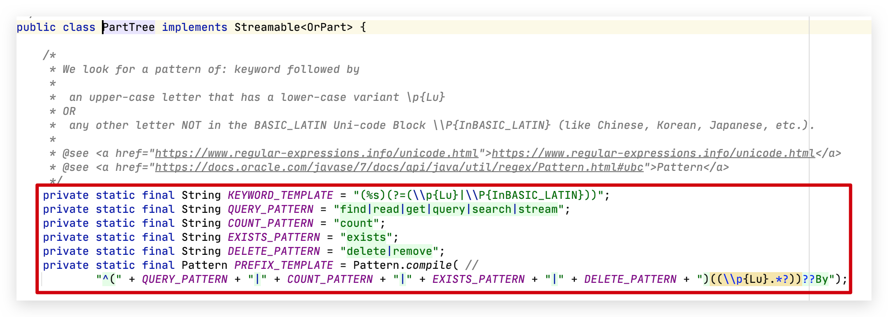


根据源码我们也可以分析出来，query method 包含其他的表达式，比如 find、count、delete、exist 等关键字在 by 之前通过正则表达式匹配


由此可知，我们方法中的关键字不是乱填的，是枚举帮我们定义好的。枚举类 Type 源码格式化后如下：

```java
public static enum Type {

    BETWEEN(2, new String[]{"IsBetween", "Between"}),

    IS_NOT_NULL(0, new String[]{"IsNotNull", "NotNull"}),

    IS_NULL(0, new String[]{"IsNull", "Null"}),

    LESS_THAN(new String[]{"IsLessThan", "LessThan"}),

    LESS_THAN_EQUAL(new String[]{"IsLessThanEqual", "LessThanEqual"}),

    GREATER_THAN(new String[]{"IsGreaterThan", "GreaterThan"}),

    GREATER_THAN_EQUAL(new String[]{"IsGreaterThanEqual", "GreaterThanEqual"}),

    BEFORE(new String[]{"IsBefore", "Before"}),

    AFTER(new String[]{"IsAfter", "After"}),

    NOT_LIKE(new String[]{"IsNotLike", "NotLike"}),

    LIKE(new String[]{"IsLike", "Like"}),

    STARTING_WITH(new String[]{"IsStartingWith", "StartingWith", "StartsWith"}),

    ENDING_WITH(new String[]{"IsEndingWith", "EndingWith", "EndsWith"}),

    IS_NOT_EMPTY(0, new String[]{"IsNotEmpty", "NotEmpty"}),

    IS_EMPTY(0, new String[]{"IsEmpty", "Empty"}),

    NOT_CONTAINING(new String[]{"IsNotContaining", "NotContaining", "NotContains"}),

    CONTAINING(new String[]{"IsContaining", "Containing", "Contains"}),

    NOT_IN(new String[]{"IsNotIn", "NotIn"}),

    IN(new String[]{"IsIn", "In"}),

    NEAR(new String[]{"IsNear", "Near"}),

    WITHIN(new String[]{"IsWithin", "Within"}),

    REGEX(new String[]{"MatchesRegex", "Matches", "Regex"}),

    EXISTS(0, new String[]{"Exists"}),

    TRUE(0, new String[]{"IsTrue", "True"}),

    FALSE(0, new String[]{"IsFalse", "False"}),

    NEGATING_SIMPLE_PROPERTY(new String[]{"IsNot", "Not"}),

    SIMPLE_PROPERTY(new String[]{"Is", "Equals"});

    //....
}

```

看源码就可以知道框架支持了哪些逻辑关键字，比如 NotIn、Like、In、Exists 等，有的时候比查文档和博客都准确、还快

### 特定类型的参数：Sort Pageable【掌握】🔥

Sort 源码（Spring Boot 2.4.1 版本推荐用如下方式，构造方法都已经私有了）

```java
/**
	 * Creates a new {@link Sort} for the given {@link Order}s.
	 *
	 * @param orders must not be {@literal null}.
	 * @return
	 */
public static Sort by(Order... orders) {

    Assert.notNull(orders, "Orders must not be null!");

    return new Sort(Arrays.asList(orders));
}
```

Pageable 在查询的时候可以实现**分页**效果和**动态排序**双重效果

下面代码定义了根据 Lastname 查询 User 的分页和排序的实例，此段代码是在 UserRepository 接口里面定义的方法

```java
public interface UserRepository extends JpaRepository<User, Long> {
    //根据分页参数查询User，返回一个带分页结果的Page(下一课时详解)对象（方法一）
    Page<User> findByLastname(String lastname, Pageable pageable);

    //我们根据分页参数返回一个Slice的user结果（方法二）
    Slice<User> findByLastname(String lastname, Pageable pageable);

    //根据排序结果返回一个List（方法三）
    List<User> findByLastname(String lastname, Sort sort);

    //根据分页参数返回一个List对象（方法四）
    List<User> findByLastname(String lastname, Pageable pageable);

}
```

【掌握】**方法一**：允许将 org.springframework.data.domain.Pageable 实例传递给查询方法，将分页参数添加到静态定义的查询中，通过 Page 返回的结果得知可用的元素和页面的总数。这种分页查询方法可能是**昂贵**的（会默认执行一条 **count** 的 SQL 语句），所以用的时候要考虑一下使用场景（**数据量小的项目可以尝试**）。

【**掌握**】**方法二**：返回结果是 Slice，因为只知道是否有下一个 Slice 可用，而不知道 count，所以当查询较大的结果集时，只知道数据是足够的，也就是说用在业务场景中时**不用关心一共有多少页**。

【掌握】**方法三**：如果**只需要排序**，需在 org.springframework.data.domain.Sort 参数中添加一个参数，正如上面看到的，只需返回一个 List 也是有可能的。

【掌握】**方法四**：**排序选项也通过 Pageable 实例处理**，**返回 List** ，在这种情况下，Page 将不会创建构建实际实例所需的附加元数据（即不需要计算和查询分页相关数据），而仅仅用来做限制查询给定范围的实体。

那么如何使用呢？我们再来看一下源码，也就是 Pageable 的实现类


由此可知，我们可以通过 PageRequest 里面提供的几个 of 静态方法（多态），分别构建页码、页面大小、排序等。示例：

```java
public interface UserRepository extends JpaRepository<User, Long> {

    //查询user里面的lastname=jk的第一页，每页大小是20条；并会返回一共有多少页的信息
    Page<User> users = userRepository.findByLastname("jk",PageRequest.of(1, 20));

    //查询user里面的lastname=jk的第一页的20条数据，不知道一共多少条
    Slice<User> users = userRepository.findByLastname("jk",PageRequest.of(1, 20));

    //查询出来所有的user里面的lastname=jk的User数据，并按照name正序返回List
    List<User> users = userRepository.findByLastname("jk",Sort.by(Sort.Order.asc("name")))

        //按照createdAt倒序，查询前一百条User数据
        List<User> users = userRepository
        .findByLastname("jk",PageRequest.of(0, 100, Sort.Direction.DESC, "createdAt"));
}
```

### 限制查询结果 First 和 Top【掌握】🔥

有的时候我们想直接查询前几条数据，也不需要动态排序，那么就可以简单地在方法名字中使用 First 和 Top 关键字，来限制返回条数

```java
public interface UserRepository extends JpaRepository<User, Long> {

    User findFirstByOrderByLastnameAsc();

    User findTopByOrderByAgeDesc();

    List<User> findDistinctUserTop3ByLastname(String lastname, Pageable pageable);

    List<User> findFirst10ByLastname(String lastname, Sort sort);

    List<User> findTop10ByLastname(String lastname, Pageable pageable);

}
```

其中：

- 查询方法在使用 First 或 Top 时，数值可以追加到 First 或 Top 后面，指定返回最大结果的大小；
- 如果数字被省略，则假设结果大小为 1；
- 限制表达式也支持 Distinct 关键字；
- 支持将结果包装到 Optional 中（下一课时详解）。
- 如果将 Pageable 作为参数，以 Top 和 First 后面的数字为准，即分页将在限制结果中应用。

### @NonNull、@NonNullApi、@Nullable【了解】

从 Spring Data 2.0 开始，JPA 新增了[@NonNull](https://docs.spring.io/spring/docs/5.2.8.RELEASE/javadoc-api/org/springframework/lang/NonNull.html) [@NonNullApi](https://docs.spring.io/spring/docs/5.2.8.RELEASE/javadoc-api/org/springframework/lang/NonNullApi.html) [@Nullable](https://docs.spring.io/spring/docs/5.2.8.RELEASE/javadoc-api/org/springframework/lang/Nullable.html)，是对 null 的参数和返回结果做的支持。

- **@NonNullApi**：在包级别用于声明参数，以及返回值的默认行为是不接受或产生空值的。
- **@NonNull**：用于不能为空的参数或返回值（在 @NonNullApi 适用的参数和返回值上不需要）。
- **@Nullable**：用于可以为空的参数或返回值。

我在自己的 Repository 所在 package 的 package-info.java 类里面做如下声明：

```java
@org.springframework.lang.NonNullApi

package com.myrespository;

```

myrespository 下面的 UserRepository 实现如下：

```java
package com.myrespository;                                             

import org.springframework.lang.Nullable;

interface UserRepository extends Repository<User, Long> {

  User getByEmailAddress(EmailAddress emailAddress); 

}
```

这个时候当 emailAddress 参数为 null 的时候就会抛异常，当返回结果为 null 的时候也会抛异常。因为我们在package 的 package-info.java里面指定了NonNullApi，所有返回结果和参数不能为 Null。

下面改为特例情况：

```java
@Nullable
User findByEmailAddress(@Nullable EmailAddress emailAdress);//当我们添加@Nullable 注解之后，参数和返回结果这个时候就都会允许为 null 了；          

Optional<User> findOptionalByEmailAddress(EmailAddress emailAddress); //返回结果允许为 null,参数不允许为 null 的情况

```

### 思考：Service 层封装【了解】

Spring Data Common 里面的 repository 基类，我们是否可以应用推广到 service 层？类似 Mybatis Plus。看下面的实战例子：

```java
public interface BaseService<T, ID> {

    Class<T> getDomainClass();

    <S extends T> S save(S entity);

    <S extends T> List<S> saveAll(Iterable<S> entities);

    void delete(T entity);

    void deleteById(ID id);

    void deleteAll();

    void deleteAll(Iterable<? extends T> entities);

    void deleteInBatch(Iterable<T> entities);

    void deleteAllInBatch();

    T getOne(ID id);

    <S extends T> Optional<S> findOne(Example<S> example);

    Optional<T> findById(ID id);

    List<T> findAll();

    List<T> findAll(Sort sort);

    Page<T> findAll(Pageable pageable);

    <S extends T> List<S> findAll(Example<S> example);

    <S extends T> List<S> findAll(Example<S> example, Sort sort);

    <S extends T> Page<S> findAll(Example<S> example, Pageable pageable);

    List<T> findAllById(Iterable<ID> ids);

    long count();

    <S extends T> long count(Example<S> example);

    <S extends T> boolean exists(Example<S> example);

    boolean existsById(ID id);

    void flush();

    <S extends T> S saveAndFlush(S entity);

}

```

模仿JpaRepository接口也自定义了一个自己的BaseService，声明了常用的CRUD操作，上面的代码是**生产代码**，可以作为参考。当然了我们也可以建立自己的 PagingAndSortingService、ComplexityService、SampleService 等来划分不同的 service接口，供不同目的 Service 子类继承

再来模仿一个 SimpleJpaRepository，来实现自己的 BaseService 的实现类。

```java
public class BaseServiceImpl<T, ID, R extends JpaRepository<T, ID>> implements BaseService<T, ID> {
    private static final Map<Class, Class> DOMAIN_CLASS_CACHE = new ConcurrentHashMap<>();
    private final R repository;
    public BaseServiceImpl(R repository) {
        this.repository = repository;
    }
    @Override
    public Class<T> getDomainClass() {
        Class thisClass = getClass();
        Class<T> domainClass = DOMAIN_CLASS_CACHE.get(thisClass);
        if (Objects.isNull(domainClass)) {
            domainClass = GenericsUtils.getGenericClass(thisClass, 0);
            DOMAIN_CLASS_CACHE.putIfAbsent(thisClass, domainClass);
        }
        return domainClass;
    }
    protected R getRepository() {
        return repository;
    }
    @Override
    public <S extends T> S save(S entity) {
        return repository.save(entity);
    }
    @Override
    public <S extends T> List<S> saveAll(Iterable<S> entities) {
        return repository.saveAll(entities);
    }
    @Override
    public void delete(T entity) {
        repository.delete(entity);
    }
    @Override
    public void deleteById(ID id) {
        repository.deleteById(id);
    }
    @Override
    public void deleteAll() {
        repository.deleteAll();
    }
    @Override
    public void deleteAll(Iterable<? extends T> entities) {
        repository.deleteAll(entities);
    }
    @Override
    public void deleteInBatch(Iterable<T> entities) {
        repository.deleteInBatch(entities);
    }
    @Override
    public void deleteAllInBatch() {
        repository.deleteAllInBatch();
    }
    @Override
    public T getOne(ID id) {
        return repository.getOne(id);
    }
    @Override
    public <S extends T> Optional<S> findOne(Example<S> example) {
        return repository.findOne(example);
    }
    @Override
    public Optional<T> findById(ID id) {
        return repository.findById(id);
    }
    @Override
    public List<T> findAll() {
        return repository.findAll();
    }
    @Override
    public List<T> findAll(Sort sort) {
        return repository.findAll(sort);
    }
    @Override
    public Page<T> findAll(Pageable pageable) {
        return repository.findAll(pageable);
    }
    @Override
    public <S extends T> List<S> findAll(Example<S> example) {
        return repository.findAll(example);
    }
    @Override
    public <S extends T> List<S> findAll(Example<S> example, Sort sort) {
        return repository.findAll(example, sort);
    }
    @Override
    public <S extends T> Page<S> findAll(Example<S> example, Pageable pageable) {
        return repository.findAll(example, pageable);
    }
    @Override
    public List<T> findAllById(Iterable<ID> ids) {
        return repository.findAllById(ids);
    }
    @Override
    public long count() {
        return repository.count();
    }
    @Override
    public <S extends T> long count(Example<S> example) {
        return repository.count(example);
    }
    @Override
    public <S extends T> boolean exists(Example<S> example) {
        return repository.exists(example);
    }
    @Override
    public boolean existsById(ID id) {
        return repository.existsById(id);
    }
    @Override
    public void flush() {
        repository.flush();
    }
    @Override
    public <S extends T> S saveAndFlush(S entity) {
        return repository.saveAndFlush(entity);
    }
}
```

以上代码就是 BaseService 常用的 CURL 实现代码，我们这里面大部分也是直接调用 Repository 提供的方法。需要注意的是，当继承 BaseServiceImpl 的时候需要传递自己的 Repository，如下面实例代码：

```java
@Service
public class UserServiceImpl extends BaseServiceImpl<User, Long, UserRepository> implements UserService {
    public UserServiceImpl(UserRepository repository) {
        super(repository);
    }
    // .....
}
```

## 利用 Repository 中的方法返回值 🔥

### 返回类型总览【了解】

这一课时我们来看下Repository 支持的返回结果有哪些，以及 DTO 类型的返回结果如何自定义，在实际工作场景中我们如何做。

之前已经介绍过了 Repository 的接口，那么现在来看一下这些接口支持的返回结果有哪些，如下图所示


打开 SimpleJpaRepository 直接看它的 Structure 就可以知道，它实现的方法，以及父类接口的方法和返回类型包括：Optional、Iterable、List、Page、Long、Boolean、Entity 对象等，而实际上支持的返回类型还要多一些。

### Streamable【了解】

由于 Repository 里面支持 Iterable，所以其实 java 标准的 List、Set 都可以作为返回结果，并且也会支持其子类，Spring Data 里面定义了一个特殊的子类 Streamable，Streamable 可以替代 Iterable 或任何集合类型。它还提供了方便的方法来访问 Stream，可以直接在元素上进行 ….filter(…) 和 ….map(…) 操作，并将 Streamable 连接到其他元素。我们看个关于 UserRepository 直接继承 JpaRepository 的例子。

````java
public interface UserRepository extends JpaRepository<User,Long> {

}
````

```java
@DataJpaTest
// DataJpaTest、MybatisTest 会默认使用其测试数据源替代，若要使用自己配置的，需要添加如下注解
@AutoConfigureTestDatabase(replace = AutoConfigureTestDatabase.Replace.NONE)
public class RepositoryTest {

    @Autowired
    private UserRepository userRepository;


    @Test
    void test() {
        User user = userRepository.save(User.builder()
                                        .name("jackxx")
                                        .email("123456@126.com")
                                        .sex("man")
                                        .address("shanghai")
                                        .build());
        Assert.assertNotNull(user);

        Streamable<User> userStreamable = userRepository.findAll(PageRequest.of(0,10)).and(User
                 .builder()
                 .name("jack222")
                 .build());

        userStreamable.forEach(System.out::println);
    }
}
```

然后我们就会得到如下输出：

```
User(id=1, name=jackxx, email=123456@126.com, sex=man, address=shanghai)
User(id=null, name=jack222, email=null, sex=null, address=null)
```

这个例子 Streamable`<User>` userStreamable，实现了 Streamable 的返回结果，如果想自定义方法，可以进行如下操作。

官方给我们提供了自定义 Streamable 的方法，不过在实际工作中很少出现要自定义保证结果类的情况，在这里我简单介绍一下方法，看如下例子：

```java
class Product { // (1)
    MonetaryAmount getPrice() {
        //..
    }
}

@RequiredArgConstructor(staticName = "of")
class Products implements Streamable<Product> { //(2)
    private Streamable<Product> streamable;
    public MonetaryAmount getTotal() { //(3)
        return streamable.stream() 
            .map(Priced::getPrice)
            .reduce(Money.of(0), MonetaryAmount::add);
    }
}

interface ProductRepository implements Repository<Product, Long> {
    Products findAllByDescriptionContaining(String text); //(4)
}
```

以上四个步骤介绍了自定义 Streamable 的方法，分别为：

（1）Product 实体，公开 API 以访问产品价格。

（2）Streamable`<Product>` 的包装类型可以通过 Products.of(…) 构造（通过 Lombok 注解创建的工厂方法）。

（3）包装器类型在 Streamable`<Product>` 上公开了计算新值的其他 API。

（4）可以将包装器类型直接用作查询方法返回类型。无须返回 Stremable`<Product>` 并将其手动包装在存储库 Client 端中。

通过以上例子你就可以做到自定义 Streamable，其原理很简单，就是实现Streamable接口，自己定义自己的实现类即可。我们也可以看下源码 QueryExecutionResultHandler 里面是否有 Streamable 子类的判断，来支持自定义 Streamable，关键源码如下：

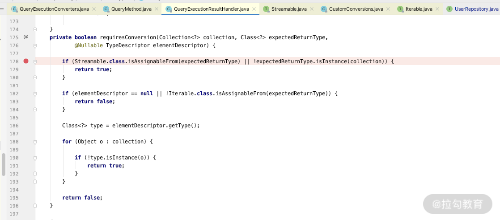

通过源码你会发现 Streamable 为什么生效，下面来看看常见的集合类的返回实现。

### List/Stream/Page/Slice【掌握】🔥

在实际开发中，我们如何返回 List/Stream/Page/Slice 呢？

新建我们的 UserRepository：

```java
public interface UserRepository extends JpaRepository<User,Long> {
   //自定义一个查询方法，返回Stream对象，并且有分页属性
    @Query("select u from User u")
    Stream<User> findAllByCustomQueryAndStream(Pageable pageable);
    //测试Slice的返回结果
    @Query("select u from User u")
    Slice<User> findAllByCustomQueryAndSlice(Pageable pageable);
}
```

测试用例类

```java
@DataJpaTest
public class UserRepositoryTest {
    @Autowired
    private UserRepository userRepository;
    @Test
    public void testSaveUser() throws JsonProcessingException {
        //我们新增7条数据方便测试分页结果
        userRepository.save(User.builder()
                            .name("jack1").email("12356@126.com").sex("man").address("shanghai").build());
        userRepository.save(User.builder()
                            .name("jack2").email("12456@126.com").sex("man").address("shanghai").build());
        userRepository.save(User.builder()
                            .name("jack3").email("12456@126.com").sex("man").address("shanghai").build());
        userRepository.save(User.builder()
                            .name("jack4").email("12356@126.com").sex("man").address("shanghai").build());
        userRepository.save(User.builder()
                            .name("jack5").email("12356@126.com").sex("man").address("shanghai").build());
        userRepository.save(User.builder()
                            .name("jack6").email("12346@126.com").sex("man").address("shanghai").build());
        userRepository.save(User.builder()
                            .name("jack7").email("12346@126.com").sex("man").address("shanghai").build());
  
        //我们利用ObjectMapper将我们的返回结果Json to String
        ObjectMapper objectMapper = new ObjectMapper();
        //返回Stream类型结果（1）
        Stream<User> userStream = userRepository.findAllByCustomQueryAndStream(PageRequest.of(1,3));
        userStream.forEach(System.out::println);
        //返回分页数据（2）
        Page<User> userPage = userRepository.findAll(PageRequest.of(0,3));
        System.out.println(objectMapper.writeValueAsString(userPage));
        //返回Slice结果（3）
        Slice<User> userSlice = userRepository.findAllByCustomQueryAndSlice(PageRequest.of(0,3));
        System.out.println(objectMapper.writeValueAsString(userSlice));
        //返回List结果（4）
        List<User> userList = userRepository.findAllById(Lists.newArrayList(1L,2L));
        System.out.println(objectMapper.writeValueAsString(userList));
    }
}
```

这个时候我们分别看下四种测试结果：

**第一种：通过**Stream`<User>`**取第二页的数据，得到结果如下：**

```
User(id=4, name=jack4, email=123456@126.com, sex=man, address=shanghai)
User(id=5, name=jack5, email=123456@126.com, sex=man, address=shanghai)
User(id=6, name=jack6, email=123456@126.com, sex=man, address=shanghai)
```

Spring Data 的支持可以通过使用 Java 8 Stream 作为返回类型来逐步处理查询方法的结果。**需要注意的是：流的关闭问题**，try catch 是一种常用的关闭方法，如下所示：

```java
Stream<User> stream;
try {
   stream = repository.findAllByCustomQueryAndStream()
   stream.forEach(…);
} catch (Exception e) {
   e.printStackTrace();
} finally {
   if (stream!=null){
      stream.close();
   }
}
```

**第二种：返回 Page`<User>` 的分页数据结果，如下所示：**

```json
{
   "content":[
      {
         "id":1,
         "name":"jack1",
         "email":"123456@126.com",
         "sex":"man",
         "address":"shanghai"
      },
      {
         "id":2,
         "name":"jack2",
         "email":"123456@126.com",
         "sex":"man",
         "address":"shanghai"
      },
      {
         "id":3,
         "name":"jack3",
         "email":"123456@126.com",
         "sex":"man",
         "address":"shanghai"
      }
   ],
   "pageable":{
      "sort":{
         "sorted":false,
         "unsorted":true,
         "empty":true
      },
      "pageNumber":0,//当前页码
      "pageSize":3,//页码大小
      "offset":0,//偏移量
      "paged":true,//是否分页了
      "unpaged":false
   },
   "totalPages":3,//一共有多少页
   "last":false,//是否是到最后
   "totalElements":7,//一共多少调数
   "numberOfElements":3,//当前数据下标
   "sort":{
      "sorted":false,
      "unsorted":true,
      "empty":true
   },
   "size":3, // 当前content大小
   "number":0,// 当前页面码的索引
   "first":true,// 是否是第一页
   "empty":false//是否有数据
}
```

这里我们可以看到 Page`<User>` 返回了第一个页的数据，并且告诉我们一共有三个部分的数据：

- **content**：数据的内容，现在指 User 的 List 3 条。
- **pageable**：分页数据，包括排序字段是什么及其方向、当前是第几页、一共多少页、是否是最后一条等。
- **当前数据的描述**：“size”：3，当前 content 大小；“number”：0，当前页面码的索引； “first”：true，是否是第一页；“empty”：false，是否没有数据。

通过这三部分数据我们可以知道要查数的分页信息。

**第三种：返回 Slice`<User>` 结果，如下所示：**

```json
{
   "content":[
      {
         "id":4,
         "name":"jack4",
         "email":"123456@126.com",
         "sex":"man",
         "address":"shanghai"
      },
      {
         "id":5,
         "name":"jack5",
         "email":"123456@126.com",
         "sex":"man",
         "address":"shanghai"
      },
      {
         "id":6,
         "name":"jack6",
         "email":"123456@126.com",
         "sex":"man",
         "address":"shanghai"
      }
   ],
   "pageable":{
      "sort":{
         "sorted":false,
         "unsorted":true,
         "empty":true
      },
      "pageNumber":1,
      "pageSize":3,
      "offset":3,
      "paged":true,
      "unpaged":false
   },
   "numberOfElements":3,
   "sort":{
      "sorted":false,
      "unsorted":true,
      "empty":true
   },
   "size":3,
   "number":1,
   "first":false,
   "last":false,
   "empty":false
}
```

这时我们发现上面的 Page 返回结果少了，那么一共有多少条结果、多少页的数据呢？我们再比较一下第二种和第三种测试结果的执行 SQL：

第二种执行的是普通的分页查询 SQL：

```sql
-- 查询分页数据
select user0_.id as id1_0_, user0_.address as address2_0_, user0_.email as email3_0_, user0_.name as name4_0_, user0_.sex as sex5_0_ from user user0_ limit ?
-- 计算分页数据
select count(user0_.id) as col_0_0_ from user user0_
```

第三种执行的 SQL 如下：

```sql
select user0_.id as id1_0_, user0_.address as address2_0_, user0_.email as email3_0_, user0_.name as name4_0_, user0_.sex as sex5_0_ from user user0_ limit ? offset ?
```

通过对比可以看出，只查询偏移量，不计算分页数据，这就是 Page 和 Slice 的主要区别

**第四种：返回 List`<User>` 结果如下：**

```json
[
    {
    "id":1,
    "name":"jack1",
    "email":"123456@126.com",
    "sex":"man",
    "address":"shanghai"
},
 {
     "id":2,
     "name":"jack2",
     "email":"123456@126.com",
     "sex":"man",
     "address":"shanghai"
 }
]
```

到这里，我们可以很简单地查询出来 ID=1 和 ID=2 的数据，没有分页信息。

上面四种方法介绍了常见的多条数据返回结果的形式，单条的我就不多介绍了，相信你一看就懂，无非就是对 JDK8 的 Optional 的支持。比如支持了 Null 的优雅判断，再一个就是支持直接返回 Entity，或者一些存在 / 不存在的 Boolean 的结果和一些 count 条数的返回结果而已。

### 对 Feature/CompletableFuture 异步返回结果的支持

我们可以使用 Spring 的异步方法执行Repository查询，这意味着方法将在调用时立即返回，并且实际的查询执行将发生在已提交给 Spring TaskExecutor 的任务中，比较适合定时任务的实际场景。异步使用起来比较简单，直接加@Async 注解即可，如下所示：

```java
@Async
Future<User> findByFirstname(String firstname); (1)
@Async
CompletableFuture<User> findOneByFirstname(String firstname); (2)
@Async
ListenableFuture<User> findOneByLastname(String lastname);(3)
```

上述三个异步方法的返回结果，分别做如下解释：

- 第一处：使用 java.util.concurrent.Future 的返回类型；
- 第二处：使用 java.util.concurrent.CompletableFuture 作为返回类型；
- 第三处：使用 org.springframework.util.concurrent.ListenableFuture 作为返回类型。

以上是对 @Async 的支持，关于实际使用需要注意以下三点内容：

- 在实际工作中，直接在 Repository 这一层使用异步方法的场景不多，一般都是把异步注解放在 Service 的方法上面，这样的话，可以有一些额外逻辑，如发短信、发邮件、发消息等配合使用；
- 使用异步的时候一定要配置线程池，这点切记，否则“死”得会很难看；
- 万一失败我们会怎么处理？关于事务是怎么处理的呢？这种需要重点考虑的，我将会在 14 课时（乐观锁机制和重试机制在实战中应该怎么用?）中详细介绍。

接下来看看 Repository 对Reactive 是如何支持的。

### 对 Reactive 支持 flux 与 Mono

可能有同学会问，看到Spring Data Common里面对React还是有支持的，那为什么在JpaRespository里面没看到有响应的返回结果支持呢？其实Common里面提供的只是接口，而JPA里面没有做相关的Reactive 的实现，但是本身Spring Data Common里面对 Reactive 是支持的。

下面我们在 gradle 里面引用一个Spring Data Common的子模块implementation 'org.springframework.boot:spring-boot-starter-data-mongodb' 来加载依赖，这时候我们打开 Repository 看 Hierarchy 就可以看到，这里多了一个 Mongo 的 Repsitory 的实现，天然地支持着 Reactive 这条线。

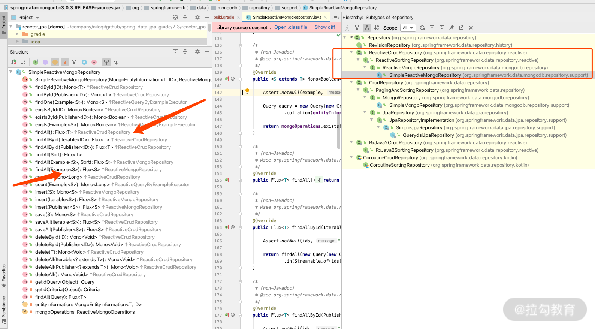

相信到这里你能感受到 Spring Data Common 的强大支持，对 Repository 接口的不同实现也有了一定的认识。对于以上讲述的返回结果，你可以自己测试一下加以理解并运用，那么接下来我们进行一个总结。

### 返回结果支持总结

下面打开 ResultProcessor 类的源码看一下支持的类型有哪些。

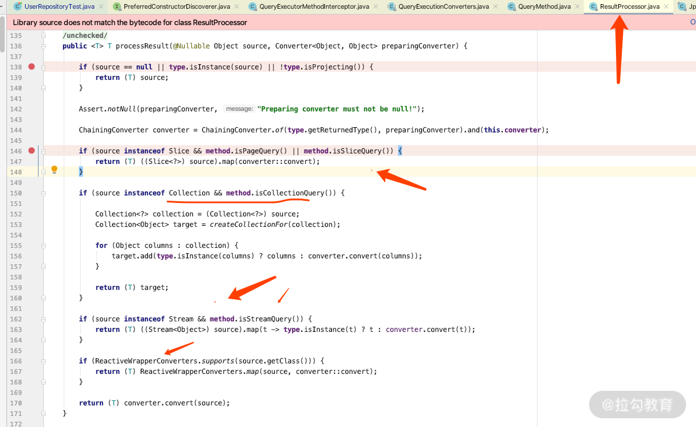

从上图可以看出 processResult 的时候分别对 PageQuery、Stream、Reactiv 有了各自的判断，我们 debug 到这里的时候来看一下 convert，进入到类里面。

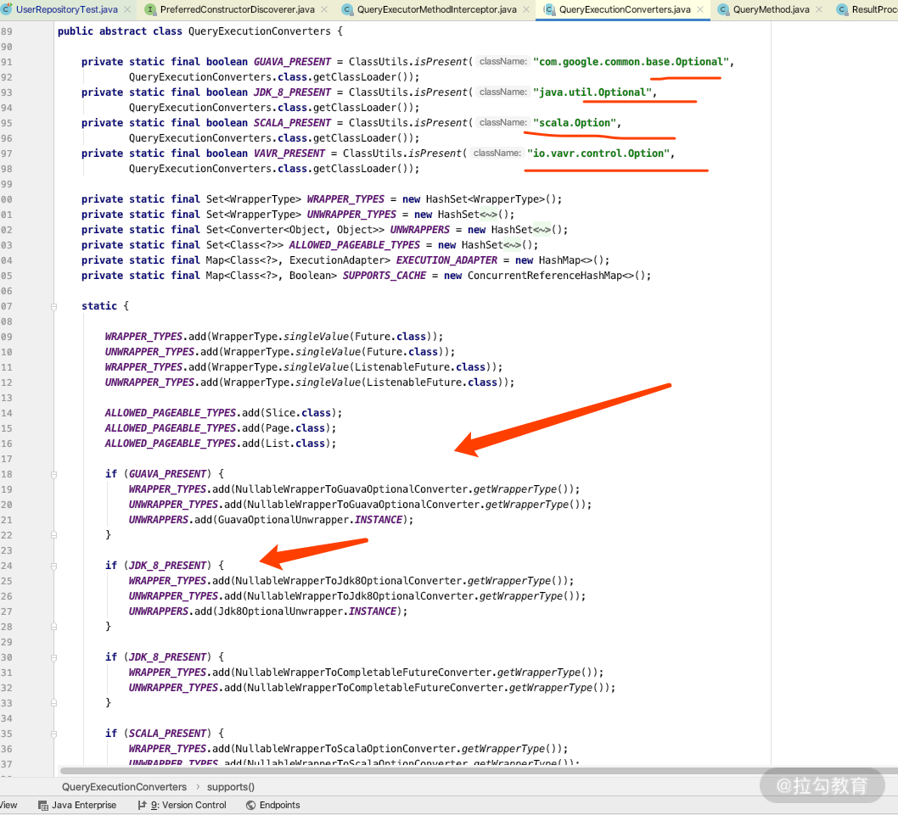

可以看到 QueryExecutorConverters 里面对 JDK8、Guava、vavr 也做了各种支持，如果你有兴趣可以课后去仔细看看源码。

这里我们先用表格总结一下返回值，下表列出了 Spring Data JPA Query Method 机制支持的方法的返回值类型：


### 最常见的 DTO 返回结果的支持方法有哪些【掌握】

上面我们讲解了 Repository 不同的返回类型，下面我们着重说一下除了 Entity，还能返回哪些 POJO 呢？我们先了解一个概念：**Projections**。

#### Projections 的概念 【掌握】

Spring JPA 对 Projections 扩展的支持，我个人觉得这是个非常好的东西，从字面意思上理解就是映射，指的是和 DB 的查询结果的字段映射关系。一般情况下，返回的字段和 DB 的查询结果的字段是一一对应的；但有的时候，需要返回一些指定的字段，或者返回一些复合型的字段，而不需要全部返回。

原来我们的做法是自己写各种 entity 到 view 的各种 convert 的转化逻辑，而 Spring Data 正是考虑到了这一点，允许对专用返回类型进行建模，有选择地返回同一个实体的不同视图对象。

下面还以我们的 User 查询对象为例，看看怎么自定义返回 DTO：

```java
@Entity
@Data
@Builder
@AllArgsConstructor
@NoArgsConstructor
public class User {
   @Id
   @GeneratedValue(strategy= GenerationType.AUTO)
   private Long id;
   private String name;
   private String email;
   private String sex;
   private String address;
}
```

看上面的原始 User 实体代码，如果我们只想返回 User 对象里面的 name 和 email，应该怎么做？下面我们介绍三种方法。

#### 方法一：新建一张表的不同 Entity

首先，我们新增一个Entity类：通过 @Table 指向同一张表，这张表和 User 实例里面的表一样都是 user，完整内容如下：

```java
@Entity
@Table(name = "user")
@Data
@Builder
@AllArgsConstructor
@NoArgsConstructor
public class UserOnlyNameEmailEntity {
   @Id
   @GeneratedValue(strategy= GenerationType.AUTO)
   private Long id;
   private String name;
   private String email;
}
```

然后，新增一个 UserOnlyNameEmailEntityRepository，做单独的查询：

```java
public interface UserOnlyNameEmailEntityRepository extends JpaRepository<UserOnlyNameEmailEntity,Long> {
}
```

最后，我们的测试用例里面的写法如下：

```java
@Test
public void testProjections() {
  userRepository.save(User.builder().id(1L).name("jack12").email("123456@126.com").sex("man").address("shanghai").build());
    List<User> users= userRepository.findAll();
    System.out.println(users);
    UserOnlyNameEmailEntity uName = userOnlyNameEmailEntityRepository.getOne(1L);
    System.out.println(uName);
}
```

我们看一下输出结果：

```
Hibernate: insert into user (address, email, name, sex, id) values (?, ?, ?, ?, ?)
Hibernate: select user0_.id as id1_0_, user0_.address as address2_0_, user0_.email as email3_0_, user0_.name as name4_0_, user0_.sex as sex5_0_ from user user0_
[User(id=1, name=jack12, email=123456@126.com, sex=man, address=shanghai)]
Hibernate: select useronlyna0_.id as id1_0_0_, useronlyna0_.email as email3_0_0_, useronlyna0_.name as name4_0_0_ from user useronlyna0_ where useronlyna0_.id=?
UserOnlyNameEmailEntity(id=1, name=jack12, email=123456@126.com)
```

上述结果可以看到，当在 user 表里面插入了一条数据，而 userRepository 和 userOnlyNameEmailEntityRepository 查询的都是同一张表 user，这种方式的好处是简单、方便，很容易可以想到；缺点就是通过两个实体都可以进行 update 操作，如果同一个项目里面这种实体比较多，到时候就容易不知道是谁更新的，从而导致出 bug 不好查询，实体职责划分不明确。我们来看第二种返回 DTO 的做法。

#### 方法二：定义一个 UserOnlyNameEmailDto

首先，我们新建一个 DTO 类来返回我们想要的字段，它是 UserOnlyNameEmailDto，用来接收 name、email 两个字段的值，具体如下：

```java
@Data
@Builder
@AllArgsConstructor
public class UserOnlyNameEmailDto {
    private String name,email;
}
```

其次，在 UserRepository 里面做如下用法：

```java
public interface UserRepository extends JpaRepository<User,Long> {
    //测试只返回name和email的DTO
    UserOnlyNameEmailDto findByEmail(String email);
}
```

然后，测试用例里面写法如下：

```java
@Test
public void testProjections() {
    userRepository.save(User.builder()
                        .id(1L).name("jack12").email("123456@126.com").sex("man").address("shanghai").build());
    UserOnlyNameEmailDto userOnlyNameEmailDto =  userRepository.findByEmail("123456@126.com");
    System.out.println(userOnlyNameEmailDto);
}
```

最后，输出结果如下：

```
Hibernate: select user0_.name as col_0_0_, user0_.email as col_1_0_ from user user0_ where user0_.email=?
UserOnlyNameEmailDto(name=jack12, email=123456@126.com)
```

这里需要注意的是，如果我们去看源码的话，看关键的 PreferredConstructorDiscoverer 类时会发现，UserDTO 里面只能有一个全参数构造方法，如下所示：

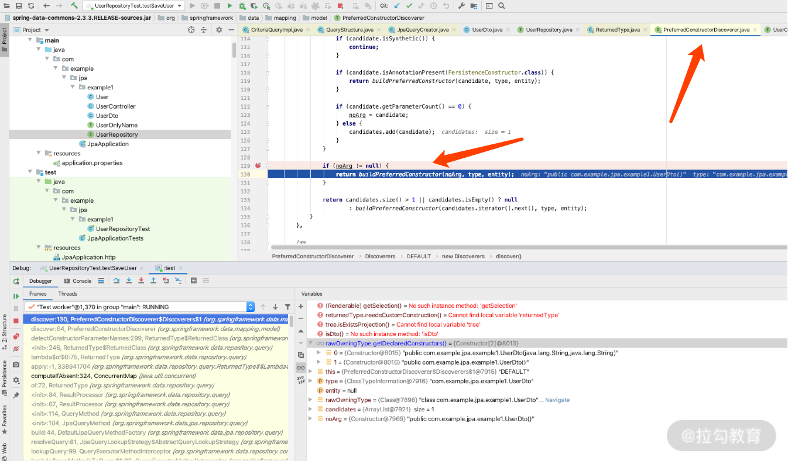

如上图所示，Constructor 选择的时候会帮我们做构造参数的选择，如果 DTO 里面有多个构造方法，就会报转化错误的异常，这一点需要注意，异常是这样的：

```
No converter found capable of converting from type [com.example.jpa.example1.User] to type [com.example.jpa.example1.UserOnlyNameEmailDto
```

所以这种方式的优点就是返回的结果不需要是个实体对象，对 DB 不能进行除了查询之外的任何操作；缺点就是有 set 方法还可以改变里面的值，构造方法不能更改，必须全参数，这样如果是不熟悉 JPA 的新人操作的时候很容易引发 Bug。

#### 方法三：返回结果为 POJO 的接口【掌握】🔥

我们再来学习一种返回不同字段的方式，这种方式与上面两种的区别是只需要定义接口，它的好处是只读，不需要添加构造方法，我们使用起来非常灵活，一般很难产生 Bug，那么它怎么实现呢？

首先，定义一个 UserOnlyName 的接口：

```java
public interface UserOnlyName {
    String getName();
    String getEmail();
}
```

其次，我们的 UserRepository 写法如下：

```java
public interface UserRepository extends JpaRepository<User,Long> {
    /**
     * 接口的方式返回DTO
     * @param address
     * @return
     */
    UserOnlyName findByAddress(String address);
}
```

然后，测试用例的写法如下：

```java
@Test
public void testProjections() {
    userRepository.save(User.builder()
                        .name("jack12").email("123456@126.com").sex("man").address("shanghai").build());
    UserOnlyName userOnlyName = userRepository.findByAddress("shanghai");
    System.out.println(userOnlyName);
}
```

最后，我们的运行结果如下：

```
Hibernate: select user0_.name as col_0_0_, user0_.email as col_1_0_ from user user0_ where user0_.address=?
org.springframework.data.jpa.repository.query.AbstractJpaQuery$TupleConverter$TupleBackedMap@1d369521
```

这个时候会发现我们的 userOnlyName 接口成了一个代理对象，里面通过 Map 的格式包含了我们的要返回字段的值（如：name、email），我们用的时候直接调用接口里面的方法即可，如 userOnlyName.getName() 即可；这种方式的优点是接口为只读，并且语义更清晰，所以这种是我比较推荐的做法。

其中源码是如何实现的，我来说一个类，你可以通过 debug，看一下最终 DTO 和接口转化执行的 query 有什么不同，看下图中老师 debug 显示的 Query 语句的位置：

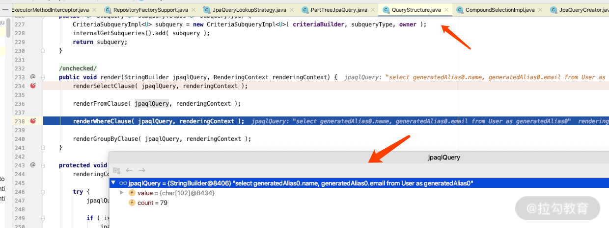

图一：是返回 DTO 接口形式的 query 生成的 JPQL。

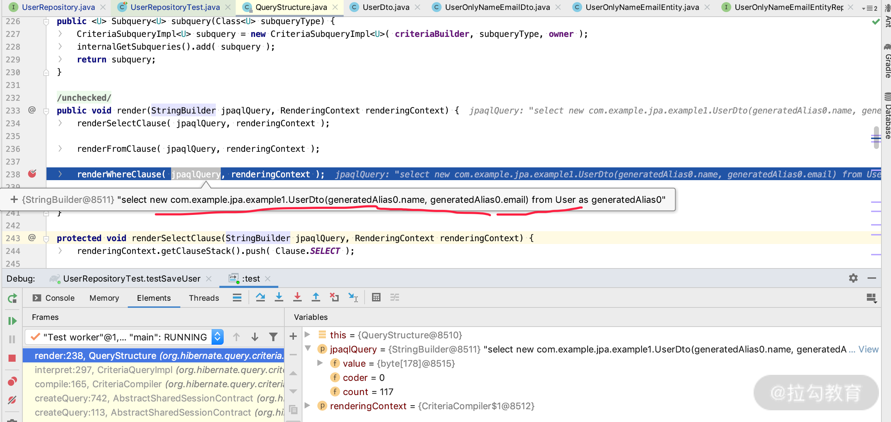

图二：是返回 DTO 类的时候 QueryStructure 生成的 JPQL 语句。

两种最大的区别是 DTO 类需要构造方法 new 一个对象出来，这就是我们第二种方法里面需要注意的 DTO 构造函数的问题；而通过图一我们可以看到接口直接通过 as 别名，映射成 hashmap 即可，非常灵活。

#### 方法四：@Query

以上就是返回 DTO 的几种常见的方法了，你在实际应用时，要不断 debug 和仔细体会。当然除了这些外，还有 @Query 注解也是可以做到

## DQM—JPQL @Query 单、多表增删改查 🔥

JPQL（Java Persistence Query Language）。基于首次在EJB2.0中引入的EJB查询语言(EJB QL)，Java持久化查询语言(JPQL)是一种可移植的查询语言，旨在以面向对象表达式语言的表达式，将SQL语法和简单查询语义绑定在一起，使用这种语言编写的查询是可移植的，可以被编译成所有主流数据库服务器上的SQL。避免了程序与数据库 SQL 语句耦合严重，比较适合跨数据源的场景（一会儿 MySQL，一会儿 Oracle 等）

其特征与原生SQL语句类似，并且完全**面向对象**，通过**类名**和**属性**访问，而**不是表名和表中字段**。不支持`SELECT *`，但是支持`COUNT(*)`。**单表多表都支持**！

使用如下：

* 特有的查询：需要在 Repository 接口上配置方法
* 在配置的方法上，使用`@Query`注解的形式配置JPQL语句

```java
public interface ArticleRepository extends JpaRepository<Article, Long> {
  
    /**
     * ?1 代表参数的占位符，其中1代表对应方法中的参数索引（参数索引从1开始）
     */
    @Query("from Article where author = ?1 and title = ?2")
    Article jpqlFindByAuthorAndTitle(String author, String title);

  
  
    /**
     * ?1 代表参数的占位符，其中1代表对应方法中的参数索引（参数索引从1开始）
     */
    @Query("update Article set author = ?1 where aid = ?2")
    @Modifying// 代表修改操作（update、delete、insert 都可以）
    void updateAuthorById(String author, Long aid);

    /**
     * 不指定则按照方法中参数位置对应。“:参数名称“ 也可以当做占位符
     */
    @Query("update Article set author = :author where aid = :aid")
    @Modifying// 代表修改操作（update、delete、insert 都可以）
    void updateAuthorById2(String author, Long aid);
}
```

```java
@DataJpaTest
// DataJpaTest、MybatisTest 会默认使用其测试数据源替代，若要使用自己配置的，需要添加如下注解
@AutoConfigureTestDatabase(replace = AutoConfigureTestDatabase.Replace.NONE)
public class ArticleJpqlRepositoryTest {

    @Autowired
    private ArticleRepository articleRepository;


    @Test
    void testJpqlFindByAuthorAndTitle() {
        Article article = articleRepository.jpqlFindByAuthorAndTitle("男神", "牛逼");
        Assertions.assertNotNull(article);
    }


    // @Test 单元测试默认测试完会回滚，可以配置如下注解来防止回滚
    @Test
    @Rollback(false)
    void testUpdateAuthorById() {
        articleRepository.updateAuthorById("男神1", 5L);
    }

    // @Test 单元测试默认测试完会回滚，可以配置如下注解来防止回滚
    @Test
    @Rollback(false)
    void testUpdateAuthorById2() {
        articleRepository.updateAuthorById2("男神2", 6L);
    }
}
```

### 快速体验 @Query 的方法

开始之前，首先来看一个 Demo，沿用我们之前的例子，新增一个 @Query 的方法，快速体验一下 @Query 的使用方法，如下所示：

```java
public interface UserDtoRepository extends JpaRepository<User,Long> {
   //通过query注解根据name查询user信息
   @Query("From User where name=:name")
   User findByQuery(@Param("name") String nameParam);
}
```

然后，我们新增一个测试类：

```java
@DataJpaTest
// DataJpaTest、MybatisTest 会默认使用其测试数据源替代，若要使用自己配置的，需要添加如下注解
@AutoConfigureTestDatabase(replace = AutoConfigureTestDatabase.Replace.NONE)
public class UserRepositoryQueryTest {
   @Autowired
   private UserDtoRepository userDtoRepository;
   @Test
   public void testQueryAnnotation() {
//新增一条数据方便测试      userDtoRepository.save(User.builder().name("jackxx").email("123456@126.com").sex("man").address("shanghai").build());
      //调用上面的方法查看结果
      User user2 = userDtoRepository.findByQuery("jack");
      System.out.println(user2);
   }
}
```

最后，看到运行的结果如下：

```
Hibernate: insert into user (address, email, name, sex, version, id) values (?, ?, ?, ?, ?, ?)
Hibernate: select user0_.id as id1_0_, user0_.address as address2_0_, user0_.email as email3_0_, user0_.name as name4_0_, user0_.sex as sex5_0_, user0_.version as version6_0_ from user user0_ where user0_.name=?
User(id=1, name=jack, email=123456@126.com, version=0, sex=man, address=shanghai)
```

通过上面的例子我们发现，这次不是通过方法名来生成查询语法，而是 @Query 注解在其中起了作用，使 "From User where name=:name"JPQL 生效了。那么它的实现原理是什么呢？我们通过源码来看一下。

### JpaQueryLookupStrategy 关键源码剖析

我们在 03 课时已经介绍过 QueryLookupStrategy 的策略值有哪些，那么我们来看下源码是如何起作用的。

我们先打开 QueryExecutorMethodInterceptor 类，找到如下代码：


再运行上面的测试用例，这时候在这里设置一个断点，可以看到默认的策略是CreateIfNotFound，也就是如果有@Query注解，那么以@Query的注解内容为准，可以忽略方法名。

我们继续往后面看，进入到 lookupStrategy.resolveQuery 里面，如下所示：

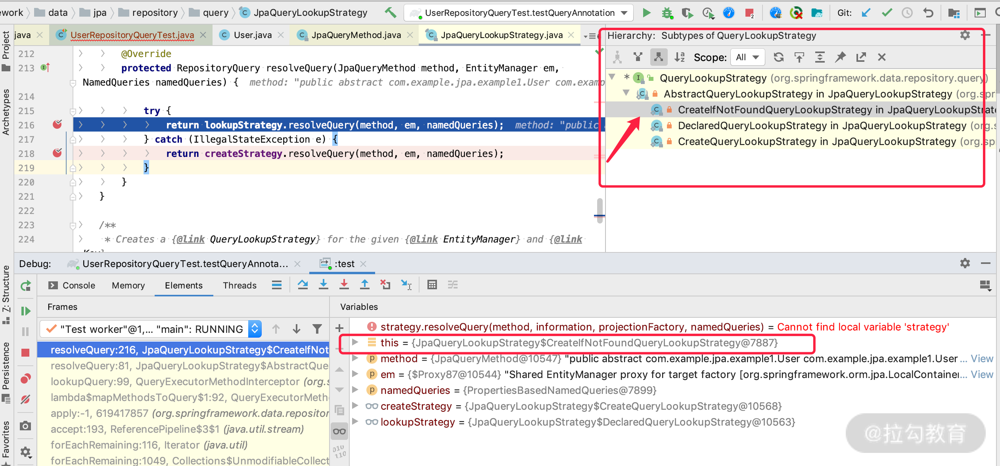

通过上图的断点和红框之处，我们也发现了，Spring Data JPA 这个地方使用了策略、模式，当我们自己写策略模式的时候也可以进行参考。

那么接着往下 debug，进入到 resolveQuery 方法里面，如下图所示：

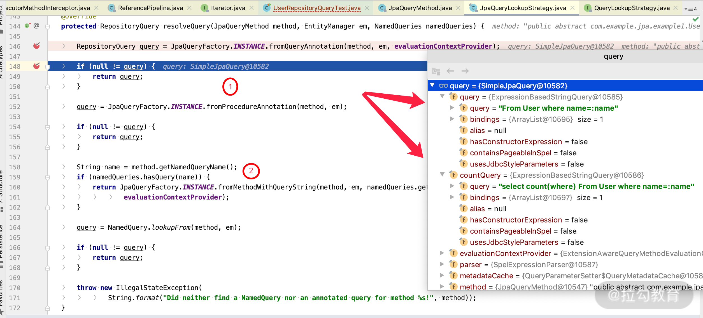

我们可以看到图中 ①处，如果 Query 注解找到了，就不会走到 ② 处了（即我们第 03 课时中讲的 Defined Query Method 语法）。

这时我们点开 Query 里面的 Query 属性的值看一下，你会发现这里同时生成了两个 SQL：一个是查询总数的 Query 定义，另一个是查询结果 Query 定义。

到这里我们已经基本明白了，如果想看看 Query 具体是怎么生成的、上面的 @Param 注解是怎么生效的，可以在上面的图 ① 处 debug 继续往里面看，如下所示：


我们继续一路 debug 就可以看到怎么通过 @Query 去生成 SQL 了，这个不是本节的重点，我在这里就简单带过了，你有兴趣可以自己去 debug 看一下。

那么原理我们掌握了，接下来看看 @Query 给我们提供了哪些语法吧，先看下基本用法。

### @Query 的基本介绍【了解】

```java
public @interface Query {
   /**
    * 指定JPQL的查询语句。（nativeQuery=true的时候，是原生的Sql语句）
	*/
   String value() default "";
   /**
	* 指定count的JPQL语句，如果不指定将根据query自动生成。
    * （如果当nativeQuery=true的时候，指的是原生的Sql语句）
    */
   String countQuery() default "";
   /**
    * 根据哪个字段来count，一般默认即可。
	*/
   String countProjection() default "";
   /**
    * 默认是false，表示value里面是不是原生的sql语句
	*/
   boolean nativeQuery() default false;
   /**
    * 可以指定一个query的名字，必须唯一的。
	* 如果不指定，默认的生成规则是：
    * {$domainClass}.${queryMethodName}
    */
   String name() default "";
   /*
    * 可以指定一个count的query的名字，必须唯一的。
	* 如果不指定，默认的生成规则是：
    * {$domainClass}.${queryMethodName}.count
    */
   String countName() default "";
}
```

所以到这里你会发现， @Query 用法是使用 JPQL 为实体创建声明式查询方法。我们一般只需要关心 @Query 里面的 value 和 nativeQuery、countQuery 的值即可，因为其他的不常用。

使用声明式 JPQL 查询有个好处，就是启动的时候就知道你的语法正确不正确。那么我们简单介绍一下 JPQL 语法。

### JPQL 的语法

我们先看一下查询的语法结构，代码如下：

```
SELECT ... FROM ...
[WHERE ...]
[GROUP BY ... [HAVING ...]]
[ORDER BY ...]
```

你会发现它的语法结构有点类似我们 SQL，唯一的区别就是 JPQL FROM 后面跟的是对象，而 SQL 里面的字段对应的是对象里面的属性字段。

同理我们看一下 update 和 delete 的语法结构：

```
DELETE FROM ... [WHERE ...]
UPDATE ... SET ... [WHERE ...]
```

其中“...”省略的部分是实体对象名字和实体对象里面的字段名字，而其中类似 SQL 一样包含的语法关键字有：SELECT FROM WHERE UPDATE DELETE JOIN OUTER INNER LEFT GROUP BY HAVING FETCH DISTINCT OBJECT NULL TRUE FALSE NOT AND OR BETWEEN LIKE IN AS UNKNOWN EMPTY MEMBER OF IS AVG MAX MIN SUM COUNT ORDER BY ASC DESC MOD UPPER LOWER TRIM POSITION CHARACTER_LENGTH CHAR_LENGTH BIT_LENGTH CURRENT_TIME CURRENT_DATE CURRENT_TIMESTAMP NEW EXISTS ALL ANY SOME 这么多，我们就不一一介绍了。

这个语法用起来不复杂，遇到问题时，简单想一下 SQL 就可以知道了，我推荐一个 Oracle 的文档地址：https://docs.oracle.com/html/E13946_04/ejb3_langref.html，你也可以通过查看这个文档，找到解决问题的办法。

那么 JPQL 的语法你已经大概了解了，我们再来看下 @Query 怎么使用。

### @Query 用法案例【掌握】🔥

我们通过几个案例来了解一下 @Query 的用法，你就可以知道 @Query 怎么使用、怎么传递参数、怎么分页等。

**案例 1：** 要在 Repository 的查询方法上声明一个注解，这里就是 @Query 注解标注的地方。

```java
public interface UserRepository extends JpaRepository<User, Long>{
  @Query("select u from User u where u.emailAddress = ?1")
  User findByEmailAddress(String emailAddress);
}
```

**案例 2：** LIKE 查询，注意 firstname 不会自动加上“%”关键字。

```java
public interface UserRepository extends JpaRepository<User, Long> {
  @Query("select u from User u where u.firstname like %?1")
  List<User> findByFirstnameEndsWith(String firstname);
}
```

**案例 3：** 直接用原始 SQL，nativeQuery = true 即可。

```java
public interface UserRepository extends JpaRepository<User, Long> {
  @Query(value = "SELECT * FROM USERS WHERE EMAIL_ADDRESS = ?1", nativeQuery = true)
  User findByEmailAddress(String emailAddress);
}
```

注意：**nativeQuery 不支持直接 Sort 的**参数查询，需要手动加上 Sort 条件

**案例 4：** 下面是 nativeQuery 的排序错误的写法，会导致无法启动。

```java
public interface UserRepository extends JpaRepository<User, Long> {
    @Query(value = "select * from user_info where first_name=?1",nativeQuery = true)
    List<UserInfoEntity> findByFirstName(String firstName,Sort sort);
}
```

**案例 5：** nativeQuery 排序的正确写法。

```java
@Query(value = "select * from user_info where first_name=?1 order by ?2",nativeQuery = true)
List<UserInfoEntity> findByFirstName(String firstName,String sort);

//调用的地方写法last_name是数据里面的字段名，不是对象的字段名
repository.findByFirstName("jackzhang","last_name");
```

通过上面几个案例，我们看到了 @Query 的几种用法，你就会明白排序、参数、使用方法、LIKE、原始 SQL 怎么写。下面继续通过案例来看下 @Query 的排序。

### @Query 的排序 🔥

@Query中在用JPQL的时候，想要实现排序，方法上直接用 PageRequest 或者 Sort 参数都可以做到。

注意 **nativeQuery 不支持直接 Sort 的**参数查询，需要手动加上 Sort 条件。

在排序实例中，实际使用的属性需要与实体模型里面的字段相匹配，这意味着它们需要解析为查询中使用的属性或别名。我们看一下例子，这是一个`state_field_path_expression JPQL`的定义，并且 Sort 的对象支持一些特定的函数。

**案例 6：** Sort and JpaSort 的使用，它可以进行排序。

```java
public interface UserRepository extends JpaRepository<User, Long> {
    @Query("select u from User u where u.lastname like ?1%")
    List<User> findByAndSort(String lastname, Sort sort);
    @Query("select u.id, LENGTH(u.firstname) as fn_len from User u where u.lastname like ?1%")
    List<Object[]> findByAsArrayAndSort(String lastname, Sort sort);
}

//调用方的写法，如下：
repo.findByAndSort("lannister", new Sort("firstname"));
repo.findByAndSort("stark", new Sort("LENGTH(firstname)"));
repo.findByAndSort("targaryen", JpaSort.unsafe("LENGTH(firstname)"));
repo.findByAsArrayAndSort("bolton", new Sort("fn_len"));
```

### @Query 的分页 🔥

@Query 的分页分为两种情况，分别为 JPQL 的排序和 nativeQuery 的排序。看下面的案例。

**案例 7**：直接用 Page 对象接受接口，参数直接用 Pageable 的实现类即可。

```java
public interface UserRepository extends JpaRepository<User, Long> {
  @Query(value = "select u from User u where u.lastname = ?1")
  Page<User> findByLastname(String lastname, Pageable pageable);
}

//调用者的写法
repository.findByFirstName("jackzhang",new PageRequest(1,10));
```

**案例 8：**@Query 对原生 SQL 的分页支持，并不是特别友好，因为这种写法比较“骇客”，可能随着版本的不同会有所变化。我们以 MySQL 为例。

```java
public interface UserRepository extends JpaRepository<UserInfoEntity, Integer>, JpaSpecificationExecutor<UserInfoEntity> {
   @Query(value = "select * from user_info where first_name=?1 /* #pageable# */",
         countQuery = "select count(*) from user_info where first_name=?1",
         nativeQuery = true)
   Page<UserInfoEntity> findByFirstName(String firstName, Pageable pageable);
}

//调用者的写法
return userRepository.findByFirstName("jackzhang",new PageRequest(1,10, Sort.Direction.DESC,"last_name"));
//打印出来的sql
select  *   from  user_info  where  first_name=? /* #pageable# */  order by  last_name desc limit ?, ?
```

**这里需要注意：这个注释 `/* #pageable# */` 必须有。**
另外，随着版本的变化，这个方法有可能会进行优化。此外还有一种实现方法，就是自己写两个查询方法，自己手动分页。

关于 @Query 的用法，还有一个需要了解的内容，就是 @ Param 用法。

### @Param 用法 🔥

@Param 注解指定方法参数的具体名称，通过绑定的参数名字指定查询条件，这样不需要关心参数的顺序。**我比较推荐这种做法，因为它比较利于代码重构**。如果不用 @Param 也是可以的，参数是有序的，这使得查询方法对参数位置的重构容易出错。我们看个案例。

**案例 9**：根据 firstname 和 lastname 参数查询 user 对象。

```java
public interface UserRepository extends JpaRepository<User, Long> {
  @Query("select u from User u where u.firstname = :firstname or u.lastname = :lastname")
  User findByLastnameOrFirstname(@Param("lastname") String lastname,
                                 @Param("firstname") String firstname);
}
```

**案例 10：** 根据参数进行查询，**top 10 前面说的“query method”关键字照样有用**，如下所示：

```java
public interface UserRepository extends JpaRepository<User, Long> {
    @Query("select u from User u where u.firstname = :firstname or u.lastname = :lastname")
    User findTop10ByLastnameOrFirstname(@Param("lastname") String lastname,
                                        @Param("firstname") String firstname);
}
```

**这里说下我的经验之谈：你在通过 @Query 定义自己的查询方法时，我建议也用 Spring Data JPA 的 name query 的命名方法，这样下来风格就比较统一了。**
上面我介绍了 @Query 的基本用法，下面介绍一下 @Query 在我们的实际应用中最受欢迎的两处场景。

### @Query 之 Projections 应用返回指定 DTO【掌握】🔥

我们在之前的例子的基础上新增一张表 UserExtend，里面包含身份证、学号、年龄等信息，最终我们的实体变成如下模样：

```java
@Entity
@Data
@Builder
@AllArgsConstructor
@NoArgsConstructor
public class UserExtend { //用户扩展信息表
   @Id
   @GeneratedValue(strategy= GenerationType.AUTO)
   private Long id;
   private Long userId;
   private String idCard;
   private Integer ages;
   private String studentNumber;
}
```

```java
@Entity
@Data
@Builder
@AllArgsConstructor
@NoArgsConstructor
public class User { //用户基本信息表
   @Id
   @GeneratedValue(strategy= GenerationType.AUTO)
   private Long id;
   private String name;
   private String email;
   @Version
   private Long version;
   private String sex;
   private String address;
}
```

如果我们想定义一个 DTO 对象，里面只要 name、email、idCard，这个时候我们怎么办呢？这种场景非常常见，但好多人使用的都不是最佳实践，我在这里介绍几种方式做一下对比。

#### 刚学 JPA 的时候别手别脚的写法

```java
public interface UserDtoRepository extends JpaRepository<User,Long> {
   /**
    * 查询用户表里面的name、email和UserExtend表里面的idCard
    * @param id
    * @return
    */
   @Query("select u.name,u.email,e.idCard from User u,UserExtend e where u.id= e.userId and u.id=:id")
   List<Object[]> findByUserId(@Param("id") Long id);
}
```

我们通过下面的测试用例来取上面 findByUserId 方法返回的数据组结果值，再塞到 DTO 里面，代码如下：

```java
@Test
public void testQueryAnnotation() {
    //新增一条用户数据  userDtoRepository.save(User.builder().name("jack").email("123456@126.com").sex("man").address("shanghai").build());
    //再新增一条和用户一对一的UserExtend数据  userExtendRepository.save(UserExtend.builder().userId(1L).idCard("shengfengzhenghao").ages(18).studentNumber("xuehao001").build());
    //查询我们想要的结果
    List<Object[]> userArray = userDtoRepository.findByUserId(1L);
    System.out.println(String.valueOf(userArray.get(0)[0])+String.valueOf(userArray.get(0)[1]));
    UserDto userDto = UserDto.builder().name(String.valueOf(userArray.get(0)[0])).build();
    System.out.println(userDto);
}
```

其实经验的丰富的“老司机”一看就知道这肯定不是最佳实践，这多麻烦呀，肯定会有更优解。那么我们再对此稍加改造，用 UserDto 接收返回结果。

#### 利用 UserDto 类

首先，我们新建一个 UserDto 类的内容。

```java
@Data
@Builder
@AllArgsConstructor
public class UserDto {
    private String name,email,idCard;
}
```

其次，我们看下利用 @Query 在 Repository 里面怎么写。

```java
public interface UserDtoRepository extends JpaRepository<User, Long> {
    @Query("select new com.example.jpa.example1.UserDto(CONCAT(u.name,'JK123'),u.email,e.idCard) from User u,UserExtend e where u.id= e.userId and u.id=:id")
    UserDto findByUserDtoId(@Param("id") Long id);
}
```

我们利用 JPQL，new 了一个 UserDto；再通过构造方法，接收查询结果。其中你会发现，我们用 CONCAT 的关键字做了一个字符串拼接，这时有的同学就会问了，这种方法支持的关键字有哪些呢？

你可以查看JPQL的 Oracal 文档，也可以通过源码来看支持的关键字有哪些。

首先，我们打开 ParameterizedFunctionExpression 会发现 Hibernate 支持的关键字有这么多，都是 MySQL 数据库的查询关键字，这里就不一一解释了。


然后，我们写一个测试方法，调用上面的方法测试一下。

```java
@Test
public void testQueryAnnotationDto() {
    userDtoRepository.save(User.builder()
                           .name("jack").email("123456@126.com").sex("man").address("shanghai").build());
    userExtendRepository.save(UserExtend
                              .builder()
                              .userId(1L)
                              .idCard("shengfengzhenghao")
                              .ages(18)
                              .studentNumber("xuehao001")
                              .build());
    UserDto userDto = userDtoRepository.findByUserDtoId(1L);
    System.out.println(userDto);
}
```

最后，我们运行一下测试用例，结果如下。这时你会发现，我们按照预期操作得到了 UserDto 的结果。

```
Hibernate: insert into user (address, email, name, sex, version, id) values (?, ?, ?, ?, ?, ?)
Hibernate: insert into user_extend (ages, id_card, student_number, user_id, id) values (?, ?, ?, ?, ?)
Hibernate: select (user0_.name||'JK123') as col_0_0_, user0_.email as col_1_0_, userextend1_.id_card as col_2_0_ from user user0_ cross join user_extend userextend1_ where user0_.id=userextend1_.user_id and user0_.id=?
UserDto(name=jackJK123, email=123456@126.com, idCard=shengfengzhenghao)
```

那么还有更简单的方法吗？答案是有，下面我们利用 UserDto 接口来实现一下。

#### 利用 UserDto 接口 🔥

首先，新增一个 UserSimpleDto 接口来得到我们想要的 name、email、idCard 信息。

```java
public interface UserSimpleDto {
   String getName();
   String getEmail();
   String getIdCard();
}
```

其次，在 UserDtoRepository 里面新增一个方法，返回结果是 UserSimpleDto 接口。

```java
public interface UserDtoRepository extends JpaRepository<User, Long> {
    //利用接口DTO获得返回结果，需要注意的是每个字段需要as和接口里面的get方法名字保持一样
    @Query("select CONCAT(u.name,'JK123') as name,UPPER(u.email) as email ,e.idCard as idCard from User u,UserExtend e where u.id= e.userId and u.id=:id")
    UserSimpleDto findByUserSimpleDtoId(@Param("id") Long id);
}
```

然后，测试用例写法如下。

```java
@Test
public void testQueryAnnotationDto() {
    userDtoRepository.save(User.builder()
                           .name("jack").email("123456@126.com").sex("man").address("shanghai").build());
    userExtendRepository.save(UserExtend.builder()
                              .userId(1L)
                              .idCard("shengfengzhenghao").ages(18).studentNumber("xuehao001").build());
    UserSimpleDto userDto = userDtoRepository.findByUserSimpleDtoId(1L);
    System.out.println(userDto);  System.out.println(userDto.getName()+":"+userDto.getEmail()+":"+userDto.getIdCard());
}
```

最后，我们执行可以得到如下结果。

```
org.springframework.data.jpa.repository.query.AbstractJpaQuery$TupleConverter$TupleBackedMap@373c28e5
jackJK123:123456@126.COM:shengfengzhenghao
```

我们发现，比起 DTO 我们不需要 new 了，并且接口只能读，那么我们返回的结果 DTO 的职责就更单一了，只用来查询。

**接口的方式是我比较推荐的做法，因为它是只读的，对构造方法没有要求，返回的实际是 HashMap。并且支持返回嵌套的对象**

返回结果介绍完了，那么我们来看下一个最常见的问题：如何用 @Query 注解实现动态查询？

### @Query 动态查询解决方法【掌握】🔥

我们看一个例子，来了解一下如何实现 @Query 的动态参数查询。

首先，新增一个 UserOnlyName 接口，只查询 User 里面的 name 和 email 字段。

```java
//获得返回结果
public interface UserOnlyName {
    String getName();
    String getEmail();
}
```

其次，在我们的 UserDtoRepository 里面新增两个方法：一个是利用 JPQL 实现动态查询，一个是利用原始 SQL 实现动态查询。

```java
public interface UserDtoRepository extends JpaRepository<User, Long> {
    /**
    * 利用JQPl动态查询用户信息
    * @param name
    * @param email
    * @return UserSimpleDto接口
    */
    @Query("select u.name as name,u.email as email from User u where (:name is null or u.name =:name) and (:email is null or u.email =:email)")
    UserOnlyName findByUser(@Param("name") String name,@Param("email") String email);
    /**
    * 利用原始sql动态查询用户信息
    * @param user
    * @return
    */
    @Query(value = "select u.name as name,u.email as email from user u where (:#{#user.name} is null or u.name =:#{#user.name}) and (:#{#user.email} is null or u.email =:#{#user.email})",nativeQuery = true)
    UserOnlyName findByUser(@Param("user") User user);
}
```

然后，我们新增一个测试类，测试一下上面方法的结果。

```java
@Test
public void testQueryDinamicDto() {
   userDtoRepository.save(User.builder()
                          .name("jack").email("123456@126.com").sex("man").address("shanghai").build());
   UserOnlyName userDto = userDtoRepository.findByUser("jack", null);
   System.out.println(userDto.getName() + ":" + userDto.getEmail());
   UserOnlyName userDto2 = userDtoRepository.findByUser(User.builder().email("123456@126.com").build());
   System.out.println(userDto2.getName() + ":" + userDto2.getEmail());
}
```

最后，运行结果如下。

```
Hibernate: insert into user (address, email, name, sex, version, id) values (?, ?, ?, ?, ?, ?)
 : binding parameter [1] as [VARCHAR] - [shanghai]
 : binding parameter [2] as [VARCHAR] - [123456@126.com]
 : binding parameter [3] as [VARCHAR] - [jack]
 : binding parameter [4] as [VARCHAR] - [man]
 : binding parameter [5] as [BIGINT] - [0]
 : binding parameter [6] as [BIGINT] - [1]
Hibernate: select user0_.name as col_0_0_, user0_.email as col_1_0_ from user user0_ where (? is null or user0_.name=?) and (? is null or user0_.email=?)
 : binding parameter [1] as [VARCHAR] - [jack]
 : binding parameter [2] as [VARCHAR] - [jack]
 : binding parameter [3] as [VARCHAR] - [null]
 : binding parameter [4] as [VARCHAR] - [null]
jack:123456@126.com
Hibernate: select u.name as name,u.email as email from user u where (? is null or u.name =?) and (? is null or u.email =?)
 : binding parameter [1] as [VARBINARY] - [null]
 : binding parameter [2] as [VARBINARY] - [null]
 : binding parameter [3] as [VARCHAR] - [123456@126.com]
 : binding parameter [4] as [VARCHAR] - [123456@126.com]
jack:123456@126.com
```

注意：其中我们打印了一下 SQL 传入的参数，是为了让我们更清楚参数都传入了什么值。
上面的两个方法，我们分别采用了 JPQL 的动态参数和 SPEL 的表达式方式获取参数（这个我们在第 26 课时“SpEL 解决了哪些问题”中再详细介绍）。

通过上面的实例可以看得出来，我们采用了 :email is null or s.email = :email 这种方式来实现动态查询的效果，实际工作中也可以演变得很复杂。所以，我们再看一个实际工作中复杂一点的例子。

**通过原始 sql，根据动态条件 room 关联 room_record 来获取 room_record 的结果。**

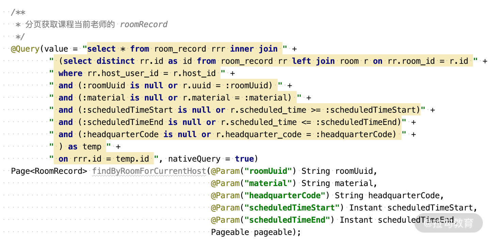

**通过 JPQL 动态参数查询 RoomRecord，如下图：**

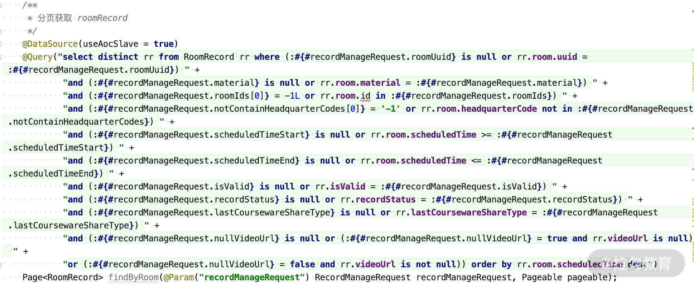

这两个例子就是比较复杂的动态查询的案例，和上面的简单动态查询语法是一样的，你仔细看一下就会明白，并且可以轻松应用到工作中进行动态查询。

### @Query 总结 🔥

到此，@Query 的常见用法，就已经讲完了。我们通过基本语法，分析了一些原理，讲解了常见的 DTO 和动态参数的实现方法，详细掌握了 @Query 的用法。

那么这个时候你可能会问了，我们知道定义方法名可以获得想要的结果，@Query 注解亦可以获得想要的结果，nativeQuery 也可以获得想要的结果，那么我们该如何做选择呢？**下面我从个人经验中总结了一些观点，分享给你。**

1. 能用方法名表示的，尽量用方法名表示，因为这样语义清晰、简单快速，基本上只要编译通过，一定不会有问题；
2. 能用 @Query 里面的 JPQL 表示的，就用 JPQL，这样与 SQL 无关，万一哪天换数据库了，基本上代码不用改变；
3. 最后实在没有办法了，可以选择 nativeQuery 写原始 SQL，特别是一开始从 MyBatis 转过来的同学，选择写 SQL 会更容易一些。

好的架构师写代码时报错的顺序是：编译 —启动 — 运行，即越早发现错误越好。


## Specification 动态查询 🔥

应该在**写框架时使用，其余应该使用@Query写JPQL**

Spring Data JPA中可以通过`JpaSpecificationExecutor`接口查询。相比JPQL，其优势是类型安全，更加的面向对象。


- `T findOne(Specification<T> spec);` 查询单个对象
- `List<T> findAll(Specification<T> spec);` 查询列表
- `Page<T> findAll(Specification<T> spec, Pageable pageable);`

  - Pageable：分页参数，包括排序
  - 返回值：Spring Data JPA提供的分页 Bean
- `List<T> findAll(Specification<T> spec, Sort sort);`排序查询
- `long count(Specification<T> spec);`统计查询

对于`JpaSpecificationExecutor`，这个接口基本是围绕着`Specification`接口来定义的。我们可以简单的理解为，`Specification`**构造的就是查询条件**。

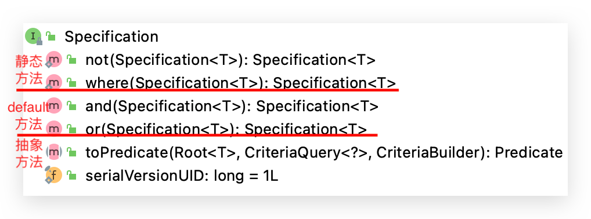

```java
/**
  *	root	：Root接口，代表查询的根对象，可以通过root获取实体中的属性
  *	query	：代表一个顶层查询对象，用来自定义查询（用的少，但是很强大）
  *	cb		：用来构建查询，此对象里有很多条件方法
  **/
public Predicate toPredicate(Root<T> root, CriteriaQuery<?> query, CriteriaBuilder cb);
```

使用方式如下：

```java
public interface ArticleRepository extends JpaRepository<Article, Long>, JpaSpecificationExecutor<Article> {}
```

主要是继承 JpaSpecificationExecutor 接口

```java
/**
 * 1.实现Specification接口（提供泛型：查询的对象类型）
 * 2.实现toPredicate方法（构造查询条件）
 * 3.需要借助方法参数中的两个参数（
 *  root：获取需要查询的对象属性（不是数据库中字段名！！）
 *  CriteriaBuilder：构造查询条件的，内部封装了很多的查询条件（模糊匹配，精准匹配）
 **/
@DataJpaTest
// DataJpaTest、MybatisTest 会默认使用其测试数据源替代，若要使用自己配置的，需要添加如下注解
@AutoConfigureTestDatabase(replace = AutoConfigureTestDatabase.Replace.NONE)
public class SpecificationTest {

    @Autowired
    private ArticleRepository articleRepository;

    @Autowired
    private LinkManRepository linkManRepository;


    /**
     * 单条件查询，根据作者查询文章（equal）
     */
    @Test
    void spec1() {

        Specification<Article> spec = (root, query, criteriaBuilder) -> {
            //1.获取比较的属性
            Path<Object> author = root.get("author");
            //2.构造查询条件
            //第1个参数为比较的属性（Path对象）；第2个参数为要比较的值
            return criteriaBuilder.equal(author, "男哥");
        };

        List<Article> articles = articleRepository.findAll(spec);
        articles.forEach(System.out::println);
    }


    /**
     * 多条件查询，根据author和title查询文章（equal，and）
     */
    @Test
    void spec2() {

        Specification<Article> spec = (root, query, criteriaBuilder) -> {
            //1.获取比较的属性
            Path<Object> author = root.get("author");
            Path<Object> title = root.get("title");
            //2.构造查询条件
            Predicate predicate1 = criteriaBuilder.equal(author, "男哥");
            Predicate predicate2 = criteriaBuilder.equal(title, "牛逼");
            //3.条件间关系
            return criteriaBuilder.and(predicate1, predicate2);
        };
        List<Article> articles = articleRepository.findAll(spec);
        articles.forEach(System.out::println);
    }


    /**
     * 普通查询；排序查询；分页查询，根据客户名模糊匹配查询客户列表（like）；
     *  equal: 直接的到path对象（属性），然后进行比较即可
     *  gt,lt,ge,le,like: 得到Path对象，根据Path指定比较的参数类型（字符串、数字等），再去进行比较
     */
    @Test
    void spec3() {
        Specification<Article> spec = (root, query, criteriaBuilder) -> {
            //1.获取比较的属性
            Expression<String> author = root.get("author").as(String.class);
            //2.构造查询条件
            //3.条件间关系
            return criteriaBuilder.like(author, "男哥%");
        };

        // 模糊查询
        List<Article> articles1 = articleRepository.findAll(spec);
        articles1.forEach(System.out::println);
        System.out.println("==================");


        // 排序查询
        Sort Sorts = Sort.by(Sort.Order.desc("createTime"), Sort.Order.asc("aid"));
        List<Article> articles2 = articleRepository.findAll(spec, Sorts);
        articles2.forEach(System.out::println);
        System.out.println("==================");


        // 分页查询
        Sort Sorts2 = Sort.by(Sort.Order.desc("createTime"), Sort.Order.asc("aid"));
        Pageable pageable = PageRequest.of(0, 5, Sorts2);// 页码（从0开始），每页显示条数
        Page<Article> page = articleRepository.findAll(spec, pageable);
        System.out.println("总记录数:" + page.getTotalElements());
        System.out.println("总页数:" + page.getTotalPages());
        System.out.println("分页查询的数据:" + page.getContent());
        System.out.println("==================");
    }


    /**
     * Specification的多表查询
     */
    @Test
    public void testFind() {
        Specification<LinkMan> specification = (root, criteriaQuery, criteriaBuilder) ->  {
            //Join代表链接查询，通过root对象获取
            //创建的过程中，第一个参数为关联对象的属性名称，第二个参数为连接查询的方式（inner，left，right）
            //JoinType.LEFT : 左外连接,JoinType.INNER：内连接,JoinType.RIGHT：右外连接
            Join<LinkMan, Customer> join = root.join("customer",JoinType.INNER);
            return criteriaBuilder.like(join.get("custName").as(String.class),"传智播客1");
        };

        List<LinkMan> list = linkManRepository.findAll(specification);
        for (LinkMan linkMan : list) {
            System.out.println(linkMan);
        }
    }
}
```

方法对应关系

| 方法名称                    | Sql对应关系          |
| --------------------------- | -------------------- |
| equle                       | filed = value        |
| gt（greaterThan ）          | filed > value        |
| lt（lessThan ）             | filed < value        |
| ge（greaterThanOrEqualTo ） | filed >= value       |
| le（ lessThanOrEqualTo）    | filed <= value       |
| notEqule                    | filed != value       |
| like                        | filed like value     |
| notLike                     | filed not like value |