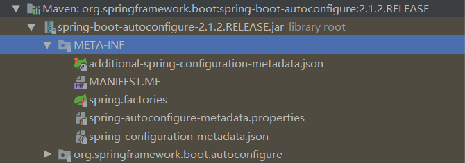

# 配置 & 容器 & 注册、注入组件

## 面向对象中应对变化的方案 🔥

### 策略模式 🔥

制定一个 Interface，用多个类实现该 Interface

常规配置：key: value；XML 配置：类/对象

*   @Autowired 的 byName 切换 Bean（不推荐）
*   @Qualifier 制定 name 的 Bean（可以，也不推荐，因为是主动注入，依赖的应该无需关系具体实现！由被依赖方决定）
*   有选择的只注入一个 Bean（其他注释掉）
*   `@Primary`首先注入，**推荐**
*   `@Conditional`等，**推荐**
*   `@Profile`


### 可配置属性 🔥

一个类，使用**属性（可读取配置）来解决变化**。如 JDBC 的 url 等。相比第一个方法不灵活（只能修改配置，不能修改类，当要增删属性时就必须修改类了），当然可以实现一个 Interface 来综合使用。

*   配置文件集中性
*   清晰，没有业务逻辑


根据需要选择上述两种方案，一般可以综合使用！


## @Configuration 配置类 🔥

### @Configuration 及其作用 🔥

用于**指定当前类是一个 Spring 配置类**，其底层还是`@Componet`，当创建容器时会从该类上加载注解。当**配置类**作为 AnnotationConfigApplicationContext 构造器的**参数**时，该注解可以不写（不推荐）

- `value`用于指定配置类的字节码，一般不用

作用：保持代码的相对稳定，才能逐步实现 OCP。但是代码中总会存在不稳定，需要**隔离这些不稳定因素（采用配置类、配置文件等方式）**，**保证其他的代码是稳定的**。即对象的实例化应该和其他分开！

*   配置文件的**集中性**
*   配置文件**清晰（但是多了后也不清晰），没有业务逻辑**


### 常用方式—配置类 + 配置文件 🔥

**可配置属性方式解决面向对象中变化**

#### @Value

用于注入基本类型和String数据

- `value`指定数据的值。
    - 基本类型和String

    - 使用SpEL（写法：`#{表达式}`）

    - `${}`结合`@PropertySource`可取出配置文件如 properties 或 yml 中的值（**也存在于运行环境变量里面**）

```java
@RestController
public class HelloController {

    @Value("${dog[0].name}")//数组或集合中保存对象
    private String name;

    @RequestMapping("/hello")
    public String hello(){
        return "hello spring boot "+name;
    }
}

```


#### @PropertySource

重复注解，用于**指定properties文件的位置**

- `value`指定文件的**名称和路径**数组。关键字：**classpath**，表示类路径下

```java
/**
 * 将配置文件中配置的每一个属性的值，映射到这个组件中
 * @ConfigurationProperties：告诉SpringBoot将本类中的所有属性和配置文件中相关的配置进行绑定；
 *      prefix = "person"：配置文件中哪个下面的所有属性进行一一映射
 *
 * 只有这个组件是容器中的组件，才能容器提供的@ConfigurationProperties功能；
 */
@PropertySource(value = {"classpath:person.properties"})
@Component
@ConfigurationProperties(prefix = "person")
public class Person {

    private String lastName;
    private Integer age;
    private Boolean boss;

```


#### @ConfigurationProperties

Spring Boot 特有，用于批量注入配置文件中的属性，可配合 @PropertySource 使用

通过注解 @ConfigurationProperties(prefix="配置文件中的key的前缀") 可以将配置文件中的配置自动与实体进行映射，**需要提供 setter 方法**

```java
@Component
@RestController
@ConfigurationProperties(prefix = "teacher")
public class HelloController {

    private String name;

    public String getName() {
        return name;
    }

    public void setName(String name) {
        this.name = name;
    }

    @RequestMapping("/hello")
    public String hello(){
        return "hello spring boot "+name;
    }
}

```

`@ConfigurationProperties`报错 Not registered via @EnableConfigurationProperties or marked as Spring component，添加了`@Component`注解后解决了

若出现以下提示，需要配置文件执行器，并在类中定义好属性和 set 方法后，如果在配置文件中编写配置会有提示！

```xml
<!--配置文件执行器配置-->
<dependency>
    <groupId>org.springframework.boot</groupId>
    <artifactId>spring-boot-configuration-processor</artifactId>
    <optional>true</optional>
</dependency>

```

**@Value 和 @ConfigurationProperties 比较**

|                      | @ConfigurationProperties | @Value     |
| -------------------- | ------------------------ | ---------- |
| 功能                 | 批量注入配置文件中的属性 | 一个个指定 |
| 松散绑定（松散语法） | 支持                     | 不支持     |
| SpEL                 | 不支持                   | 支持       |
| JSR303 数据校验      | 支持                     | 不支持     |
| 复杂类型封装         | 支持                     | 不支持     |

- **松散语法绑定**：last_name = last-name = lastName 他们取的值都是相同的
- 配置文件 yml 还是 properties 他们都能获取到值，怎么选择呢？
    - 若我们只是在某个业务逻辑中需要**获取**一下**配置文件**中的**某项值**，使用@Value；
    - 若我们专门编写了一个 javaBean 来和配置文件**映射**，我们就直接使用@ConfigurationProperties


#### 示例

application.yml

```yml
person.nickName: wangcai
```

Person.Class

```java
@Data
public class Person {

    @Value("张三")
    private String name;

    /**
     * SpEL
     */
    @Value("#{20-2}")
    private Long age;

    /**
     * 使用 @PropertySource 配合 ${} 获取配置文件中的值（也存在于运行环境变量 Environment 中）
     */
    @Value("${person.nickName}")
    private String nickName;
}
```

AssignmentConfig1.Class

```java
@Configuration
@PropertySource({"classpath:/application.yml"})
public class AssignmentConfig1 {

    @Bean
    public Person person(){
        return new Person();
    }

}
```

AssignmentConfig1Test.Class

```java
public class AssignmentConfig1Test {

    private ApplicationContext context;

    @BeforeEach
    public void init(){
        context = new AnnotationConfigApplicationContext(AssignmentConfig1.class);
        System.out.println("容器创建完成");
    }


    @Test
    public void test(){

        Person person = context.getBean(Person.class);
        System.out.println(person);

        Environment environment = context.getEnvironment();
        String nickName = environment.getProperty("person.nickName");
        System.out.println(nickName);

    }
}
```

若是配置数据库连接，可以采用该方式来解耦 ip、port 等变化！就是使用该思想！


### @Configuration 和 @Bean

- @ImportResource：**导入 Spring 的配置文件**，如 beans.xml，加载 bean，让配置文件里面的内容生效

    - Spring Boot 里面没有 Spring 的配置文件，我们自己编写的配置文件，也不能自动识别；

        想让 Spring 的配置文件生效，加载进来；@ImportResource 标注在一个配置类上

    ```xml
    <bean id="helloService" class="com.cuzz.springboot.service.HelloService"></bean>
    ```

    ```java
    @ImportResource(locations = {"classpath:beans.xml"})
    @SpringBootApplication
    public class SpringbootApplication {
    
    	public static void main(String[] args) {
    		SpringApplication.run(SpringbootApplication.class, args);
    	}
    }
    
    ```

- 还是**写配置类吧**！利用@Configuration 和@Bean

    ```java
    @Configuration
    public class MyAppConfig {
        // 将方法的返回值添加到容器中；容器中这个组件默认的id就是方法名
        @Bean
        public HelloService helloService02(){
            System.out.println("配置类@Bean给容器中添加组件了...");
            return new HelloService();
        }
    }
    
    ```


### 测试步骤

1.  Maven 依赖

    ```xml
    <dependencies>
        <!--context 默认传递依赖 core、beans、expression、aop 等-->
        <dependency>
            <groupId>org.springframework</groupId>
            <artifactId>spring-context</artifactId>
            <version>5.2.6.RELEASE</version>
        </dependency>
    
        <dependency>
            <groupId>org.projectlombok</groupId>
            <artifactId>lombok</artifactId>
            <version>1.18.12</version>
        </dependency>
    
    	<!-- junit5 使用查看 Github 示例 -->    
        <!-- https://mvnrepository.com/artifact/org.junit.jupiter/junit-jupiter-api -->
        <dependency>
            <groupId>org.junit.jupiter</groupId>
            <artifactId>junit-jupiter</artifactId>
            <version>5.6.2</version>
            <scope>test</scope>
        </dependency>
    </dependencies>
    ```

2.  此时使用 Maven 来编译会警告 Java 版本，可以在 POM.mxl 中添加如下配置（Spring Boot 就是添加的这种）。

    可查看 [Maven 文档](http://maven.apache.org/plugins/maven-compiler-plugin/examples/set-compiler-source-and-target.html)配置

    ```xml
    <properties>
        <java.version>1.8</java.version>
        <maven.compiler.source>${java.version}</maven.compiler.source>
        <maven.compiler.target>${java.version}</maven.compiler.target>
        <project.reporting.outputEncoding>UTF-8</project.reporting.outputEncoding>
        <project.build.sourceEncoding>UTF-8</project.build.sourceEncoding>
        <resource.delimiter>@</resource.delimiter>
    </properties>
    ```

3.  POJO

    ```java
    @Data
    @NoArgsConstructor
    @AllArgsConstructor
    public class Person {
    
        private String name;
        private Integer age;
    
    }
    ```

4.  配置类

    ```java
    // 配置类==配置文件
    @Configuration// //告诉Spring这是一个配置类。该类为 容器构造器参数时，可省略该注解（不推荐）
    // 每次测试时记得将其他 @Configuration 注释掉，或着注释掉 @ComponentScan
    public class IocConfig1 {
    
        @Bean
        public Person person(){
            return new Person("person",1);
        }
    
        @Bean
        @Primary
        public Person person2(){
            return new Person("person2",2);
        }
    
    }
    ```

5.  测试类

    ```java
    public class IocConfig1Test {
    
    
        @Test
        public void test(){
            ApplicationContext context = new AnnotationConfigApplicationContext(IocConfig1.class);
    
            // 根据 bean 名称获取。有多个时取第一个（使用@Primary也没用，暂时就这样）
            Person person1 = (Person) context.getBean("person");
            System.out.println(person1);
    
            // 根据 bean 类型（包括子类、实现类）获取。
            // 只要容器中有唯一一个 Bean 对象类型和要注入的变量类型匹配，就注入成功，一个都没有则报错
            // 如果有多个类型匹配到，则报错。可以使用 @Primary 来指定
            Person person2 = context.getBean(Person.class);
            System.out.println(person2);
    
            // 根据 bean 名称和类型获取
            Person person3 = context.getBean("person", Person.class);
            System.out.println(person3);
    
            // 获取所有该类型的 bean
            Map<String, Person> beansOfType = context.getBeansOfType(Person.class);
            beansOfType.forEach((name,person)->{
                System.out.println(name+":"+person);
            });
    
            // 获取所有该类型的 bean 名称
            String[] beanNamesForType = context.getBeanNamesForType(Person.class);
            System.out.println(Arrays.toString(beanNamesForType));
    
    
            // 获取容器中所有 bean 名称
            String[] beanDefinitionNames = context.getBeanDefinitionNames();
            System.out.println(Arrays.toString(beanDefinitionNames));
    
        }
    }
    ```

    


## 容器接口及其实现类

### 接口及实现类

* `BeanFactory`顶层容器接口。创建对象采用**延迟加载**方式（何时使用何时创建，多例适用）
* `ApplicationContext`容器接口。创建对象采用**立即加载**方式（**读完配置文件**，**默认情况下就创建(可修改)**，单例适用）
    * `ClassPathXmlApplicationContext`，基于xml配置的实现类。只能加载**类路径**下的配置文件
    * `FileSystemXmlApplicationContext`，基于xml配置的实现类。可以加载**磁盘任意路径**的配置文件（需有访问权限）
    * `AnnotationConfigApplicationContext`，基于注解配置的实现类。读取**注解**创建容器


### 常用方法

::: tip

获取容器时使用 `AnnotationConfigApplicationContext(有@Configuration 注解的类.class)`来创建`ApplicationContext`对象。由于本身也是`@Component`，所以指定@ComponentScan时可以跳过此类（了解）

:::

* `String[] getBeanDefinitionNames()`：查询这个IoC容器中所有Bean的名称
* `String[] getBeanNamesForType(Class c)`：查询这个IoC容器中指定类型的Bean的名称
* `Map<String, Class >getBeansOfType(Class c)`：查询这个IoC容器中所有Bean的名称、和Bean对象
* `Object getBean([String beanName] [,Class c])`


## 注册组件—包扫描 & 注解🔥

::: tip

适用于自己写的类

:::

### @ComponentScans

用于多个`@ComponentScan`。属性有`value`数组，可以包含多个` @ComponentScan`。Java 8 后使用下面的


### @ComponentScan  🔥

在JDK8之后是重复注解，直接写多个，不再使用上边那个

扫描规则：

*   指定 value 或 bashPackages 即Spring在**初始化容器**时**要扫描的包**，将扫描（不一定就注入容器）该包及其子包下的**所有类**，然后根据规则**排除**

*   不指定则扫**描配置类所在包及其子包下的所有类**，然后根据规则排除。

*   **默认包括 @Componet 及其派生类，如 @Componet、@Controller、@Service、@Repository、@Configuration 等**

属性：

* `value`或`basePackages`都是用于指定要扫描的包，都是数组类型

* `excludeFilters`指定扫描的时候按照什么规则排除那些组件

* `includeFilters`指定扫描的时候只需要包含哪些组件

    值为`Filter[]`，使用`@Filter`注解，属性有`type`（如下）、`classes`（Class类型）

    * `FilterType.ANNOTATION`：按照带有的**注解类型**
    * `FilterType.ASSIGNABLE_TYPE`：按照**给定的具体类型**
    * `FilterType.ASPECTJ`：使用ASPECTJ表达式
    * `FilterType.REGEX`：使用正则指定
    * `FilterType.CUSTOM`：使用自定义规则，需要自定义`TypeFilter`的实现类，重写`match`方法

* `useDefaultFilters`在**使用指定的规则时**需要将这个值设置为`false`。默认为`true`

    *   若该值为`true`，则扫描该五个注解并匹配上述规则。一般不会这样做（很傻逼）

    *   若该值为`false`，则**仅**需匹配上述规则

::: 注意

*   `@Componet`注解是上述四个注解的底层实现，若`exclude`后则四个注解都不会扫描到

*   `includeFilters` 和 `excludeFilters` 会共同作用，必须都满足（且以 `excludeFilters` 为准）
*   上述扫描的类型指的都是**该类及其子类**，**该注解及其子注解**

:::


### 自定义 FilterType  🔥

```java
/**
 * 自定义 TypeFilter
 */
public class MyTypeFilter implements TypeFilter {
    /**
     *
     * @param metadataReader 读取到的当前正在扫描的类的信息
     * @param metadataReaderFactory 可以获取到其他任何类信息的
     * @return boolean
     * @throws IOException
     */
    @Override
    public boolean match(MetadataReader metadataReader, MetadataReaderFactory metadataReaderFactory) throws IOException {
        //获取当前类注解的信息
        AnnotationMetadata annotationMetadata = metadataReader.getAnnotationMetadata();
        //获取当前正在扫描的类的类信息
        ClassMetadata classMetadata = metadataReader.getClassMetadata();
        //获取当前类资源（类的路径）
        Resource resource = metadataReader.getResource();

        String className = classMetadata.getClassName();
        if (className.endsWith("er")){
            System.out.println("er --->"+className);
            return true;
        } else {
            System.out.println("not er --->"+className);
            return false;
        }
    }
}
```

```java
/**
 * 包扫描 + 注解。实际中也不会这样写，太乱。可能只用简单的，或只使用自定义Filter
 */
// 配置类==配置文件
@Configuration// 告诉Spring这是一个配置类。该类为 容器构造器参数时，可省略该注解（不推荐）
// 每次测试时记得将其他 @Configuration 注释掉，或着注释掉 @ComponentScan
@ComponentScan(
        value = "top.conanan",
        includeFilters = {
                @ComponentScan.Filter(type = FilterType.ANNOTATION, classes = {Controller.class}),
                // Student 没有添加任何注解，也被注册到容器中了
                @ComponentScan.Filter(type = FilterType.ASSIGNABLE_TYPE, classes = {Student.class}),
                // CUSTOM 自定义 Filter
                @ComponentScan.Filter(type = FilterType.CUSTOM, classes = {MyTypeFilter.class})
        },
        excludeFilters = {
                @ComponentScan.Filter(type = FilterType.ANNOTATION, classes = {Service.class})
        },
        useDefaultFilters = false)
// includeFilters 和 excludeFilters 会共同作用，必须都满足（且以 excludeFilters 为准）
public class IocConfig2 {
}
```


### Stereotype Annotations 🔥

stereotype annotations：模式注解

- `@Component`：用于**把当前类对象存入Spirng容器中**。

    注解在实现类上不指定 value 会自动指定 value。且注册的是**对象**，所以抽象类或接口无法被注册，都是实**现类才能被注册**

    - 属性：`value`：用于指定 bean 的 id。不写时默认为**当前类名，且首字母小写**

- `@Controller`**或**`@RestController`：表现层

- `@Service`：业务层，标注在实现类上，一般业务代码不需要接口！其他会变化的应该使用接口，如**采用策略模式时**！

- `@Repository`：持久层

    以上三个注解的作用和属性与`@Componet`一致，且底层就是`@Componet`，是Spring提供明确的三层架构使用的注解，使三层对象更加清晰，也可以使用`@Scope`、`@Conditional`注解，详见注册组件—Bean章节：


## 注册组件—@Bean 🔥

::: tip

适用于第三方包

:::

### @Bean 🔥

用于把当前**方法的返回值**作为bean对象**注册存入Spring容器**中。该注解**只能写在方法上**

* `value`或`name`用于指定 **bean 的 id**。没写则默认为**当前方法的名称（去除getter、setter 的属性）**
* 细节：当我们使用注解配置方法时，如果**方法有参数**，Spring框架会去容器中查找有没有可用的bean对象。查找的方式和`@Autowired`注解的作用是一样的

**相比模式注解，该方式可以操作对象中的属性（即给属性赋值），可通过构造器、setter 等方式**


### @Scope & @Lazy 🔥

用于指定bean的作用范围。也可以放置注解在定义的4个组件上（除过 @Configuration，因为没作用）

`value`指定范围的取值。常用有：

- `singleton`：**单例**【默认】，一个应用只有一个对象的实例，**IoC容器启动时则会自动创建对象并放入容器**。需要注意的是此时也会**注入**组件，原因是 Bean 的实例化需要所有属性都实例化

    `@Lazy`：懒加载，**只针对单例对象**的创建时间，变为获取对象时才创建（只创建一次），但还是单例。但是需要注意的是，若该对象被一个非 lazy 对象引用了（包含该属性），则该对象的 lazy 不起作用！因为非 lazy 对象实例化时需要所属性都实例化了。

    可用于所有 Bean，不单单是`@Bean`，还有各种`@Componet`等等

- `prototype`：**多例**，IoC容器启动时不会创建对象，**只有每次获取对象时，才会重新创建对象实例**

- `request`：WEB 项目中，Spring 为**每个请求**创建一个bean实例

- `session`：WEB 项目中，Spring 为**每个会话**创建一个bean实例

- `global-session`：作用于**集群(Portlet)环境的全局会话范围**，当不是集群(Portlet)环境时，它就是session

```java
/**
 * 包扫描 + 注解
 */
// 配置类==配置文件
@Configuration// 告诉Spring这是一个配置类。该类为 容器构造器参数时，可省略该注解（不推荐）
// 每次测试时记得将其他 @Configuration 注释掉，或着注释掉 @ComponentScan
public class IocConfig2 {

    @Bean
    @Scope("prototype")
    public Person person() {
        System.out.println("给容器中添加 Bean person");
        return new Person("lisi",2);
    }
}
```


### @Primary 🔥

在Bean对象添加此注解，则**首先注入**这个Bean。若`@Qualifier`指定了，则这个注解失效


### @Conditional + Condition 接口 🔥

**条件判断**，**满足**当前条件，**这个 Bean 才能被注册到容器中**。**Spring Boot中使用非常多**

可以标在**类**：满足条件则类中所有 Bean 才会注册

可以标在**方法**：只限制这个方法的 Bean

* `value`为实现了`Condition`接口的实现类数组，实现类需重写`matches`方法

    ```java
    /**
     * Condition
     */
    // 配置类==配置文件
    @Configuration// 告诉Spring这是一个配置类。该类为 容器构造器参数时，可省略该注解（不推荐）
    // 每次测试时记得将其他 @Configuration 注释掉，或着注释掉 @ComponentScan
    public class IocConfig3 {
    
        @Bean("mac-person")
        @Conditional(MacCondition.class)
        public Person person(){
            return new Person("mac",18);
        }
    
        //可以标在类（满足条件则类中所有Bean才会注册）和方法（只限制这个方法的Bean）上
        @Conditional(LinuxCondition.class)
        @Bean("linus-person")
        public Person person02(){
            return new Person("linus", 48);
        }
    }
    ```

    ```java
    public class LinuxCondition implements Condition {
        /**
         *
         * @param context 判断条件能使用的上下文（环境）
         * @param metadata 注释信息
         * @return boolean
         */
        @Override
        public boolean matches(ConditionContext context, AnnotatedTypeMetadata metadata) {
            //1、能获取到ioc使用的beanfactory
            ConfigurableListableBeanFactory beanFactory = context.getBeanFactory();
            //2、获取类加载器
            ClassLoader classLoader = context.getClassLoader();
            //3、获取当前环境信息
            Environment environment = context.getEnvironment();
            //4、获取到bean定义的注册类
            BeanDefinitionRegistry registry = context.getRegistry();
            //可以判断容器中的bean注册情况，也可以给容器中注册bean
            boolean definition = registry.containsBeanDefinition("person");
    
            // 也可以直接获取 application.yml 等中的配置
            String property = environment.getProperty("os.name");
            System.out.println("os.name:"+property);
            return Objects.requireNonNull(property).contains("linux");
        }
    }
    ```

    ```java
    public class MacCondition implements Condition {
        /**
         *
         * @param context 判断条件能使用的上下文（环境）
         * @param metadata 注释信息
         * @return boolean
         */
        @Override
        public boolean matches(ConditionContext context, AnnotatedTypeMetadata metadata) {
    
            //1、能获取到ioc使用的beanfactory
            ConfigurableListableBeanFactory beanFactory = context.getBeanFactory();
            //2、获取类加载器
            ClassLoader classLoader = context.getClassLoader();
            //3、获取当前环境信息
            Environment environment = context.getEnvironment();
            //4、获取到bean定义的注册类
            BeanDefinitionRegistry registry = context.getRegistry();
            //可以判断容器中的bean注册情况，也可以给容器中注册bean
            boolean definition = registry.containsBeanDefinition("person");
    
            // 也可以直接获取 application.yml 等中的配置
            String property = environment.getProperty("os.name");
            System.out.println("os.name:"+property);
            return Objects.requireNonNull(property).contains("Mac");
        }
    }
    ```

    ```java
    public class IocConfig3Test {
    
        private ApplicationContext context;
    
        @BeforeEach
        public void init(){
            context = new AnnotationConfigApplicationContext(IocConfig3.class);
            System.out.println("容器创建完成");
        }
    
        @Test
        public void test(){
        }
    
        @AfterEach
        public void destroy(){
    
            System.out.println("======获取容器中所有 Person bean 名称=====");
            String[] beanNamesForType = context.getBeanNamesForType(Person.class);
            for (String s : beanNamesForType) {
                System.out.println(s);
            }
        }
    }
    ```


::: tip

Mac 下无法通过 IDEA 的 VM options 来切换 OS

:::


### @Conditional 派生注解 🔥

Spring注解版原生的@Conditional作用

作用：必须是@Conditional**指定的条件成立**，才给容器中**添加组件**，**配置类**里面的所有内容才**生效**

| @Conditional扩展注解            | 作用（判断是否满足当前指定条件）                             |
| ------------------------------- | ------------------------------------------------------------ |
| @ConditionalOnJava              | 系统的 JVM 版本是否符合要求                                  |
| @ConditionalOnBean              | 容器中存在指定Bean                                           |
| @ConditionalOnMissingBean       | 容器中不存在指定Bean                                         |
| @ConditionalOnExpression        | 满足SpEL表达式                                               |
| @ConditionalOnClass             | 系统中有指定的类                                             |
| @ConditionalOnMissingClass      | 系统中没有指定的类                                           |
| @ConditionalOnSingleCandidate   | 容器中只有一个指定的Bean，或者有多个，但是这个Bean是首选Bean |
| @ConditionalOnProperty          | 系统中指定的属性是否有指定的值                               |
| @ConditionalOnResource          | **类路径**下是否存在指定资源文件                             |
| @ConditionalOnWebApplication    | 当前是web环境                                                |
| @ConditionalOnNotWebApplication | 当前不是web环境                                              |
| @ConditionalOnJndi              | JNDI存在时查找指定的位置                                     |

**@ConditionalOnProperty**

```java
/**
 * ConditionalOnProperty
 */
// 配置类==配置文件
@Configuration// 告诉Spring这是一个配置类。该类为 容器构造器参数时，可省略该注解（不推荐）
// 每次测试时记得将其他 @Configuration 注释掉，或着注释掉 @ComponentScan
public class IocConfig3 {

    // matchIfMissing 默认为 false，改为 true 后，若系统中没有 os.name 属性（不是没有值），则默认注入该 bean
    @Bean("mac-person")
    @ConditionalOnProperty(value="os.name", havingValue="Mac", matchIfMissing = true)
    public Person person(){
        return new Person("mac",18);
    }

    @ConditionalOnProperty(value="os.name", havingValue="linux")
    @Bean("linus-person")
    public Person person02(){
        return new Person("linus", 48);
    }
}
```


### @Profile 🔥

指定**组件**在哪个环境的情况下才能被注册到容器中，不指定，任何环境下都能注册这个组件

* 加了环境标识的**bean**，只有这个环境被激活的时候才能注册到容器中。默认不写是default环境，即没有标注环境标识的bean组件在任何环境下都将被注册到容器中

* 写在**配置类上**，只有是指定的环境的时候，整个配置类里面的所有配置才能开始生效

* 写在**方法**上，只限定方法返回的 Bean

    application.yml（目前解析只能这样写，缩近方式获取不到）

    ```yml
    db.url: jdbc:mysql://localhost:3306/test
    db.driverClass: com.mysql.cj.jdbc.Driver
    db.username: root
    db.password: 123456
    ```

    DataSourceConfig.Class

    ```java
    @Configuration
    @PropertySource("classpath:/application.yml")
    public class DataSourceConfig implements EmbeddedValueResolverAware {
    
        private StringValueResolver resolver;
    
        private String url;
    
        @Value("${db.username}")
        private String username;
    
        @Value("${db.driverClass}")
        private String driverClass;
    
        @Bean("hikariDataSource")
        @Profile({"prod"})
        public DataSource dataSourceProd(@Value("${db.password}") String password){
    
            HikariConfig config = new HikariConfig();
            url = resolver.resolveStringValue("${db.url}");
            config.setJdbcUrl(url);
            // config.setDriverClassName(driverClass);// 自动检测
            config.setUsername(username);
            config.setPassword(password);
            return new HikariDataSource(config);
        }
    
    
        @Bean("druidDataSource")
        @Profile({"dev"})
        public DataSource dataSourceDev(@Value("${db.password}") String password){
            DruidDataSource druidDataSource = new DruidDataSource();
            url = resolver.resolveStringValue("${db.url}");
            druidDataSource.setUrl(url);
            // druidDataSource.setDriverClassName(driverClass);// 自动检测
            druidDataSource.setUsername(username);
            druidDataSource.setPassword(password);
            return druidDataSource;
        }
    
        @Override
        public void setEmbeddedValueResolver(StringValueResolver resolver) {
            this.resolver = resolver;
        }
    }
    ```

使用（两种）：

* 运行时使用命令行动态参数：虚拟机参数位置写上`-Dspring.profiles.active=test`。Mac 下还是失败 😣

* 代码的方式激活某种环境

    ```java
    public class ProfileTest {
    
        private AnnotationConfigApplicationContext context;
    
        @BeforeEach
        public void init(){
            // context = new AnnotationConfigApplicationContext(DataSourceConfig.class);
            context = new AnnotationConfigApplicationContext();
            // 如下就是有参构造的内部实现，多了环境设置
            context.getEnvironment().setActiveProfiles("prod","test");// 设置需要激活的环境
            context.register(DataSourceConfig.class);// 注册主配置类
            context.refresh();// 启动刷新容器
            System.out.println("容器创建完成");
        }
    
        @Test
        public void test1(){
        }
    
        @AfterEach
        public void destroy(){
            // 获取容器中所有 bean 名称
            System.out.println("======获取容器中所有 bean 名称=====");
            String[] beanDefinitionNames = context.getBeanDefinitionNames();
            for (String beanDefinitionName : beanDefinitionNames) {
                System.out.println(beanDefinitionName);
            }
            System.out.println("======获取容器中所有 bean 名称=====");
    
        }
    }
    ```


## 注册组件—@Import 🔥

::: tip

用于**快速导入其他配置类（不像@Bean只能一个个导入）**，也可以理解为**直接导入第三方组件**，只能标注在类、接口、枚举类上

:::

### Class

`value`用于指定其他配置类的**Class**，是数组，被导入的其他配置类也不用加任何注解，只是一个普通类

*   注册的**Bean的id为组件的全类名**
*   **若是配置类则还会注册配置类配置的Bean**（id为指定的或方法名）

```java
@Import({Color.class,Red.class,MyImportSelector.class,MyImportBeanDefinitionRegistrar.class})
//@Import导入组件，id默认是组件的全类名
public class IOCConfig {}
```


### ImportSelector 🔥

`ImportSelector`接口：返回需要导入的组件的全类名数组，需要自定义类实现该接口。**Springboot中使用很多**🔥

*   注册的**Bean的id为组件的全类名**

```java
/**
 * 自定义逻辑返回需要导入的组件
 */
public class MyImportSelector implements ImportSelector {
    /**
     *
     * @param importingClassMetadata 当前标注@Import注解的类的其他所有注解
     * @return 要导入到容器中的组件全类名
     */
    @Override
    public String[] selectImports(AnnotationMetadata importingClassMetadata) {
        return new String[]{"top.conanan.bean.Yello",Blue.class.getName()};
    }

  	/**
  	 * TODO
  	 */
    @Override
    public Predicate<String> getExclusionFilter() {
        return null;
    }
}
```


### ImportBeanDefinitionRegistrar

`ImportBeanDefinitionRegistrar`接口，手动注册Bean到容器中，需要自定义类实现该接口。**可以指定 bean 名称**

```java
public class MyImportBeanDefinitionRegistrar implements ImportBeanDefinitionRegistrar {
    /**
     * 把所有需要添加到容器中的bean；调用BeanDefinitionRegistry.registerBeanDefinition手工注册进来
     *
     * @param importingClassMetadata 当前标注@Import注解的类的所有注解信息
     * @param registry BeanDefinition注册类
     * @param importBeanNameGenerator TODO
     */
    @Override
    public void registerBeanDefinitions(AnnotationMetadata importingClassMetadata, BeanDefinitionRegistry registry, BeanNameGenerator importBeanNameGenerator) {
        // 注意 Bean 名称
        boolean definition1 = registry.containsBeanDefinition("top.conanan.bean.Red");
        boolean definition2 = registry.containsBeanDefinition("top.conanan.bean.Yello");
        boolean definition3 = registry.containsBeanDefinition("top.conanan.bean.Blue");

        System.out.println(""+definition1+definition2+definition3);
        if (definition1 && definition2 && definition3){
            // 指定 Bean 的定义信息：Bean 的类型，Bean ...
            RootBeanDefinition rootBeanDefinition = new RootBeanDefinition(RainBow.class);
            // 可以指定 bean 名称
            registry.registerBeanDefinition("rainBow",rootBeanDefinition);
        }
    }
}
```


## 注册组件—FactoryBean 🔥

与`@Import`**调用无参构造创建Bean**不同的是，它**利用工厂获取Bean**。多用于**整合Spring和其他框架**的底层代码

不能在 ColorFactoryBean 类上使用 @Component 注解，没用！！！

```java
/**
 * 创建一个Spring定义的FactoryBean，范型代表要创建的对象类型
 */
public class ColorFactoryBean implements FactoryBean<Color> {
    /**
     * 返回一个Color对象，这个对象会添加到容器中
     *
     * @return 返回一个Color对象
     * @throws Exception
     */
    @Override
    public Color getObject() throws Exception {
        System.out.println("ColorFactoryBean...getObject...");
        return new Color();
    }

    @Override
    public Class<?> getObjectType() {
        return Color.class;
    }

    /**
     * 控制 Bean 是否为单例
     * * true：这个bean是单实例，在容器中保存一份
     * * false：多实例，每次获取都会创建一个新的bean；
     */
    @Override
    public boolean isSingleton() {
        return true;
    }
}
```

```java
/**
 * FactoryBean
 */
// 配置类==配置文件
@Configuration// 告诉Spring这是一个配置类。该类为 容器构造器参数时，可省略该注解（不推荐）。
// 每次测试时记得将其他 @Configuration 注释掉，或着注释掉 @ComponentScan
// @Import(ColorFactoryBean.class)// 也可以使用 @Bean 来注册 bean，并可以自定义 bean name
public class IocConfig7 {

    @Bean
    public ColorFactoryBean colorFactoryBean(){
        return new ColorFactoryBean();
    }

}
```

```java
/**
 * FactoryBean
 */
public class IocConfig7Test {

    private ApplicationContext context;

    @BeforeEach
    public void init(){
        context = new AnnotationConfigApplicationContext(IocConfig7.class);
        System.out.println("容器创建完成");
    }

    @Test
    public void test(){

        // 工厂Bean获取的是工厂bean调用getObject创建的对象。但是容器内始终没有通过getObject创建的对象，只有 ColorFactoryBean
        Object bean1 = context.getBean("colorFactoryBean");
        System.out.println(bean1.getClass());// class top.conanan.bean.Color
        Color bean3 = context.getBean(Color.class);
        System.out.println(bean3.getClass());// class top.conanan.bean.Color

        // 查看 BeanFactory 工厂类接口即可看到该 Field： String FACTORY_BEAN_PREFIX = "&";
        Object bean2 = context.getBean("&colorFactoryBean");
        System.out.println(bean2.getClass());// class top.conanan.bean.ColorFactoryBean
        ColorFactoryBean bean4 = context.getBean(ColorFactoryBean.class);
        System.out.println(bean4.getClass());// class top.conanan.bean.ColorFactoryBean

        // No bean named 'top.conanan.bean.Color' available. Color,color 都不行
        // Object color = context.getBean("color");
    }

    @AfterEach
    public void destroy(){
        // 获取容器中所有 bean 名称
        System.out.println("======获取容器中所有 bean 名称=====");
        String[] beanDefinitionNames = context.getBeanDefinitionNames();
        for (String beanDefinitionName : beanDefinitionNames) {
            System.out.println(beanDefinitionName);
        }
        System.out.println("======获取容器中所有 bean 名称=====");
    }
}
```


## 注册组件—总结

*   包扫描+组件标注注解（@Controller/@Service/@Repository/@Component）：**自己写的类**
*   `@Bean`：导入的**第三方**包里面的组件
*   `@Import`：**快速给容器中导入一个组件**
    *   @Import(要导入到容器中的组件)；容器中就会自动注册这个组件，id默认是全类名
    *   ImportSelector🔥：返回需要导入的组件的全类名数组。Spring Boot 中使用非常多
    *   ImportBeanDefinitionRegistrar：手动注册bean到容器中，可指定bean名称
*   使用Spring提供的 `FactoryBean`（工厂Bean）。多用于**整合Spring和其他框架**的底层代码
    *   默认获取到的是工厂bean调用getObject创建的对象
    *   要获取工厂Bean本身，我们需要给id前面加一个`&`，`&colorFactoryBean`
*   Spring 还提供了一种采用类似@Configuration + 实现接口的方式来注册组件


## 注入组件—自动注入

::: tip

作用和xml配置文件中的`<bean>`标签编写`<property>`标签实现功能一致。利用DI完成依赖关系赋值

AutowiredAnnotationBeanPostProcessor：后置处理器，解析完成自动装配功能（以下四个）	

:::


### @Autowired 被动注入🔥

*   **byType**：一般**在 IoC 容器启动时**自动**按照类型注入**。首先按照类型去找（**包括子类、实现类**），当容器中**有唯一一个** Bean 对象类型和要注入的变量**类型匹配**，就注入成功，**一个都没有**则**报错**，无法启动！类比仅使用 IoC 容器获取 Bean。

*   **byName**：如果有**多个类型匹配到**，则使用**变量名称**作为 Bean 的 id，在 Spring 容器查找，找到了也可以注入成功，否则报错。类比仅使用 IoC 容器获取 Bean。可以**据此来注入一个接口，但是变量名称修改为实现类的名称**，即可完成**切换**注入实现类（不理想，后续推荐**使用 @Qualifier 更方便**，因为**不用修改后面的代码**）。
*   可以使用`required=false`指定后，IoC 容器启动时注入失败也不会报错（了解）

* 出现的位置如下：
    * 标在构造器上：如果组件只有一个构造器且为有参构造器，这个有参构造器的@Autowired可以**省略**
    * @Bean + 方法参数：参数从容器中获取，则@Autowired可以**省略**


#### FIELD 属性

Spring 不推荐，但是最方便

```java
@ToString
public class Boss1 {

    @Autowired
    private Car car;

    public void print(){
        System.out.println(car);
    }
}
```

```java
public class Car {
}
```

```java
@Configuration
@Import({Boss1.class, Car.class})
public class DiConfig1 {

}
```

```java
public class DiConfig1Test {

    private ApplicationContext context;

    @BeforeEach
    public void init(){
        context = new AnnotationConfigApplicationContext(DiConfig1.class);
        System.out.println("容器创建完成");
    }

    @Test
    public void test1(){
        Boss1 boss1 = context.getBean(Boss1.class);
        boss1.print();

        Car car = context.getBean(Car.class);
        System.out.println(car);// 这个car和上面那个一致
    }
}
```


#### METHOD 方法注入（setter 注入）

Spring 容器创建当前对象时，就会调用该方法，完成赋值。方法参数的值会自动从容器中获取

```java
@ToString
public class Boss2 {

    private Car car;

    public Car getCar() {
        return car;
    }

    @Autowired// 必须有
    public void setCar(Car car) {
        this.car = car;
    }
}
```

```java
public class Car { }
```

```java
@Configuration
@Import({Boss2.class, Car.class})
public class DiConfig1 {

}
```

```java
public class DiConfig1Test {

    private ApplicationContext context;

    @BeforeEach
    public void init(){
        context = new AnnotationConfigApplicationContext(DiConfig1.class);
        System.out.println("容器创建完成");
    }

    @Test
    public void test2(){
        Boss2 boss2 = context.getBean(Boss2.class);
        System.out.println(boss2);

        Car car = context.getBean(Car.class);
        System.out.println(car);// 这个car和上面那个一致
    }
}
```


#### CONSTRUCTOR—构造器

*   Spring 官方不推荐使用 Field 注入，推荐使用构造器注入（就是比较麻烦），并且容易引发**循环依赖**！

*   **如果组件只有一个构造器且是有参构造器**，这个有参构造器上的@Autowired可以**省略**

```java
@ToString
public class Boss3 {

    private Car car;

    public Boss3(){
        System.out.println("Boss3 无参构造");
    }

    @Autowired// 有多个则不能省略
    public Boss3(Car car){
        this.car = car;
        System.out.println("Boss3 有参构造");
    }
}
```

```java
public class Car {
}
```

```java
@Configuration
@Import({Boss3.class, Car.class})
public class DiConfig1 {

}
```

```java
public class DiConfig1Test {

    private ApplicationContext context;

    @BeforeEach
    public void init(){
        context = new AnnotationConfigApplicationContext(DiConfig1.class);
        System.out.println("容器创建完成");
    }

    @Test
    public void test3(){
        Boss3 boss3 = context.getBean(Boss3.class);
        System.out.println(boss3);

        Car car = context.getBean(Car.class);
        System.out.println(car);// 这个car和上面那个一致
    }
}
```


#### PARAMETER—参数 🔥

*   @Bean+方法参数，则参数从容器中获取，此时@Autowired可以**省略**

```java
@ToString
public class Boss4 {

    private Car car;

    public Boss4(){
        System.out.println("Boss4 无参构造");
    }

    public Boss4(Car car){
        this.car = car;
        System.out.println("Boss4 有参构造");
    }
}
```

```java
public class Car {
}
```

```java
@Configuration
@Import({Car.class})
public class DiConfig1 {

    @Bean
    /*@Autowired*/
    public Boss4 boss4(/*@Autowired*/ Car car){
        return new Boss4(car);
    }
}
```

```java
public class DiConfig1Test {

    private ApplicationContext context;

    @BeforeEach
    public void init(){
        context = new AnnotationConfigApplicationContext(DiConfig1.class);
        System.out.println("容器创建完成");
    }

	 @Test
    public void test4(){
        Boss4 boss4 = context.getBean(Boss4.class);
        System.out.println(boss4);

        Car car = context.getBean(Car.class);
        System.out.println(car);// 这个car和上面那个一致
    }
}
```


### @Qualifier 主动注入🔥

*   在自动按照类型注入的**基础之上**，**再按照 Bean 的 id 注入**

*   在给**类成员注入时不能单独使用（配合 @Autowired）**，但是**给方法参数注入时可以单独使用**

- 属性：`value`用于指定注入的 Bean 的 ID

*   注意：`@Qualifier`给方法参数注入时可以单独使用，直接指定 Bean 的 ID


### @Primary 🔥

在 @Bean 对象添加此注解，则首先注入这个Bean。若`@Qualifier`指定了，则这个注解失效


### @Resource

JaveEE（JSR250）的注解，耦合性低

*   可以和@Autowired一样实现自动装配功能，默认是**按照组件名称进行装配的**，找不到再看类型装配。可以独立使用。

*   不支持@Primary功能；不支持@Autowired（reqiured=false）;

- 属性：`name`用于指定注入的bean的id


### @Inject

JaveEE（JSR330）的注解，耦合性低（也不一定，对于 Spring 开发来说）

- 需要导入`javax.inject`依赖。
- 和@Autowired的功能一样，可以使用@Qualifier，只是没有required=false的功能


## 注入组件—Aware接口

若自定义组件想要**使用 Spring 容器底层的一些组件**，如：ApplicationContext，BeanFactory 等到

* 自定义组件需要**实现 xxxAwar**e（参考Aware接口设计）：在**创建该组件对象**的时候，会调用接口规定的方法注入相关组件
* xxxAware：**功能实现使用对应的xxxProcessor**，如：ApplicationContextAware —> ApplicationContextAwareProcessor

```java
public class Red implements ApplicationContextAware, BeanNameAware, EmbeddedValueResolverAware {

    private ApplicationContext context;

    @Override
    public void setApplicationContext(ApplicationContext applicationContext) throws BeansException {
        this.context = applicationContext;
        System.out.println("传入的IoC: " + applicationContext);
        // 传入的IoC: org.springframework.context.annotation.AnnotationConfigApplicationContext@df27fae, started on Wed May 06 00:37:46 CST 2020
    }

    @Override
    public void setBeanName(String name) {
        System.out.println("当前 bean 的名字: " + name);
        // 当前 bean 的名字: top.conanan.aware.Red
    }

    @Override
    public void setEmbeddedValueResolver(StringValueResolver resolver) {
        String resolveStringValue = resolver.resolveStringValue("你好 ${os.name} 我是 #{20*18}");
        System.out.println("解析的字符串："+resolveStringValue);
        // 解析的字符串：你好 Mac OS X 我是 360
    }
}
```

```java
@Configuration
@Import(Red.class)
public class AwareConfig1 {

}
```

```java
public class AwareConfig1Test {

    private ApplicationContext context;

    @BeforeEach
    public void init(){
        context = new AnnotationConfigApplicationContext(AwareConfig1.class);
        System.out.println("容器创建完成");
    }

    @Test
    public void test1(){
    }

    @AfterEach
    public void destroy(){
        // 获取容器中所有 bean 名称
        System.out.println("======获取容器中所有 bean 名称=====");
        String[] beanDefinitionNames = context.getBeanDefinitionNames();
        for (String beanDefinitionName : beanDefinitionNames) {
            System.out.println(beanDefinitionName);
        }
        System.out.println("======获取容器中所有 bean 名称=====");
    }
}
```


## 自动配置 — @SpringBootApplication 🔥

### 为什么要有自动装配？ 🔥

对比 XML 时代的 Spring 配置，会发现虽然项目不同，但是有那么一部分（甚至一大部分）的配置都是不变的，像是从一个项目复制到另一个项目里。而 Spring Boot 的出现就是解决了这个问题，通过约定大于配置来默认自动配置。


### @SpringBootApplication

按住Ctrl点击查看启动类MySpringBootApplication上的注解@SpringBootApplication，源码如下：

```java
@Target(ElementType.TYPE)
@Retention(RetentionPolicy.RUNTIME)
@Documented
@Inherited
@SpringBootConfiguration
@EnableAutoConfiguration
@ComponentScan(excludeFilters = {
		@Filter(type = FilterType.CUSTOM, classes = TypeExcludeFilter.class),
		@Filter(type = FilterType.CUSTOM, classes = AutoConfigurationExcludeFilter.class) })
public @interface SpringBootApplication {

	/**
	 * Exclude specific auto-configuration classes such that they will never be applied.
	 * @return the classes to exclude
	 */
	@AliasFor(annotation = EnableAutoConfiguration.class)
	Class<?>[] exclude() default {};

	... ... ...

}
```


### @SpringBootConfiguration

等同与`@Configuration`，既标注该类是Spring的一个配置类


### @EnableAutoConfiguration

SpringBoot 自动配置功能开启。不是用于自己写的 Bean，而是**配置三方库中的 Bean**

按住Ctrl点击查看该注解

```java
@Target(ElementType.TYPE)
@Retention(RetentionPolicy.RUNTIME)
@Documented
@Inherited
@AutoConfigurationPackage
@Import(AutoConfigurationImportSelector.class)
public @interface EnableAutoConfiguration {
	... ... ...
}
```

#### @AutoConfigurationPackage

自动配置包**，**如下注解的简写

```java
@Import(AutoConfigurationPackages.Registrar.class)
```


#### @Import

Spring底层注解`@Import`，给容器中导入一个组件；导入的组件由`AutoConfigurationImportSelector.class`指定，这个类有一个方法，通过注解metadata，将主配置类（`@SpringBootApplication`）所在包及下面所有子包里面的所有组件扫描到Spring容器

按住Ctrl点击查看`AutoConfigurationImportSelector`源码

```java
public String[] selectImports(AnnotationMetadata annotationMetadata) {
    ... ... ...
        List<String> configurations = getCandidateConfigurations(annotationMetadata,
                                                                 attributes);
    configurations = removeDuplicates(configurations);
    Set<String> exclusions = getExclusions(annotationMetadata, attributes);
    checkExcludedClasses(configurations, exclusions);
    configurations.removeAll(exclusions);
    configurations = filter(configurations, autoConfigurationMetadata);
    fireAutoConfigurationImportEvents(configurations, exclusions);
    return StringUtils.toStringArray(configurations);
}


protected List<String> getCandidateConfigurations(AnnotationMetadata metadata,
                                                  AnnotationAttributes attributes) {
    List<String> configurations = SpringFactoriesLoader.loadFactoryNames(
        getSpringFactoriesLoaderFactoryClass(), getBeanClassLoader());

    return configurations;
}
```

其中，`SpringFactoriesLoader.loadFactoryNames` 方法的作用就是从`META-INF/spring.factories`文件中读取指定类对应的**全类名**的列表，如xxxAutoConfiguration



`spring-autoconfigure-metadata.properties` 文件中有关自动配置的配置信息如下：

```
org.springframework.boot.autoconfigure.web.reactive.function.client.WebClientAutoConfiguration,\
org.springframework.boot.autoconfigure.web.servlet.DispatcherServletAutoConfiguration,\
org.springframework.boot.autoconfigure.web.servlet.ServletWebServerFactoryAutoConfiguration,\
org.springframework.boot.autoconfigure.web.servlet.error.ErrorMvcAutoConfiguration,\
org.springframework.boot.autoconfigure.web.servlet.HttpEncodingAutoConfiguration,\
org.springframework.boot.autoconfigure.web.servlet.MultipartAutoConfiguration,\
......
```

上面配置文件存在大量的以Configuration为结尾的类名称，这些类就是存有自动配置信息的类，而SpringApplication在获取这些类名后再加载

我们以`ServletWebServerFactoryAutoConfiguration`为例来分析源码：

```java
@Configuration
@AutoConfigureOrder(Ordered.HIGHEST_PRECEDENCE)
@ConditionalOnClass(ServletRequest.class)
@ConditionalOnWebApplication(type = Type.SERVLET)
@EnableConfigurationProperties(ServerProperties.class)
@Import({ ServletWebServerFactoryAutoConfiguration.BeanPostProcessorsRegistrar.class,
		ServletWebServerFactoryConfiguration.EmbeddedTomcat.class,
		ServletWebServerFactoryConfiguration.EmbeddedJetty.class,
		ServletWebServerFactoryConfiguration.EmbeddedUndertow.class })
public class ServletWebServerFactoryAutoConfiguration {
	......
}

```

其中，`@EnableConfigurationProperties(ServerProperties.class) `代表加载`ServerProperties`服务器配置属性类

进入ServerProperties.class源码如下：

```java
@ConfigurationProperties(prefix = "server", ignoreUnknownFields = true)
public class ServerProperties {
    /**
	 * Server HTTP port.
	 */
    private Integer port;
    /**
	 * Network address to which the server should bind.
	 */
    private InetAddress address;
	......
}

```

其中，`prefix = "server"` 表示SpringBoot配置文件中的前缀，SpringBoot会将配置文件中以server开始的属性映射到该类的字段中。如在`application.properties`中配置`server.port=80`即可改变当前服务器的HTTP端口号


**自动配置总结**

- **SpringBoot启动会加载大量的自动配置类**
- **我们看我们需要的功能有没有SpringBoot默认写好的自动配置类；**
- **我们再来看这个自动配置类中到底配置了哪些组件；（只要我们要用的组件有，我们就不需要再来配置了）**
- **给容器中自动配置类添加组件的时候，会从properties类中获取某些属性。我们就可以在配置文件中指定这些属性的值；**
- **自动配置类对应属性类**
    - xxxxAutoConfigurartion：自动配置类；给容器中添加组件
    - xxxxProperties:封装配置文件中相关属性；


### SPI 机制的应用 🔥

Service Provider Interface，应对变化的解决方案，上面的 @EnableXXX 就是对 SPI 的应用。**基于 Interface 接口 + 策略模式 + 配置文件（如 spring.factories）**。

之前讲过的 @Primary 和 @Conditionxx 也可以解决，但是关注的粒度是**具体**类、对象。而 SPI 关注的是**整体解决方案**，关注许多类，对象的整体！


## 参考

*   [Spring Component Scan](https://dzone.com/articles/spring-component-scan)


## XML 配置（旧）

### 步骤

1. 在resources中创建`spring-config.xml`或`applicationContext.xml`文件。（约束在参考中搜索`xmlns`即可找到）

    ```xml
    <?xml version="1.0" encoding="UTF-8"?>
    <beans xmlns="http://www.springframework.org/schema/beans"
           xmlns:xsi="http://www.w3.org/2001/XMLSchema-instance"
           xsi:schemaLocation="http://www.springframework.org/schema/beans
            http://www.springframework.org/schema/beans/spring-beans.xsd">
    </beans>
    ```

2. 在配置文件中**配置让 spring 创建的对象**（原理和引入中工厂模式一致）

    ```xml
    <bean id="accountDao" class="com.itheima.dao.impl.AccountDaoImpl"></bean>
    <bean id="accountService" class="com.itheima.service.impl.AccountServiceImpl"></bean>
    ```

3. 获取Spring IoC核心容器，并根据id获取对象

    ```java
    ApplicationContext ac = new ClassPathXmlApplicationContext("spring-config.xml");
    AccountDao accountDao = (AccountDao) ac.getBean("accountDao"); //需要强转
    AccountService accountService = ac.getBean("accountService", AccountService.class); //传字节码文件对象，不用强转
    ```


### Spirng对Bean的管理细节

**bean标签**

* 作用：**配置对象让spring来创建的**。默认情况下它调用的是类中的**无参构造函数**。如果没有无参构造函数则不能创建成功。 
* 属性：
    * **`id`**：给对象在容器中提供一个**唯一标识**，用于获取对象
    * **`class`**：指定**类的全限定类名**，用于**反射创建对象**，默认情况下调用无参构造函数
    * **`scope`**：**指定对象的作用范围**
        * **`singleton`**：**单例**的（默认），一个应用只有一个对象的实例，它的作用范围就是**整个应用** 
        * **`prototype`**：**多例**的，每次访问对象时，都会重新创建对象实例。
        * `request`：WEB 项目中，Spring 为**每个请求**创建一个bean实例
        * `session`：WEB 项目中，Spring 为**每个会话**创建一个bean实例
        * `global-session`：作用于**集群(Portlet)环境的全局会话范围**，当不是集群(Portlet)环境时，它就是session
    * `init-method`：指定类中的初始化方法名称
    * `destroy-method`：指定类中销毁方法名称。单例中需要关闭容器（使用实现类的方法）

**Bean对象的生命周期**

- **单例对象：生命周期和容器相同**，一个应用只有一个对象的实例，它的作用范围就是整个应用
    - 出生：当容器创建时出生（读取完配置文件）
    - 存活：只要容器存在，对象一直存活
    - 死亡：容器销毁，对象消亡
- **多例对象**：每次访问对象时，都会重新创建对象实例。
    - **出生**：当我们**使用对象**时，**Spring框架为我们创建**
    - **存活**：对象只要在**使用过程中，就一直存活**
    - **死亡**：当对象**长时间不使用，且没有别的对象引用**时，由Java的**GC**机制回收

**创建Bean的三种方式**

1. **使用默认构造方法创建**

    配置文件中使用`bean`标签以及`id`和`class`属性，且没有其他属性和标签时~。若类中没有默认构造方法，则对象无法创建

    ```xml
    <bean id="accountDao" class="com.itheima.dao.impl.AccountDaoImpl"></bean>
    ```

2. 使用**普通工厂中的方法**创建对象（也称使用某个类中的方法创建对象），并存入Spirng容器

    ```xml
    <bean id="accountDaoFactory" class="com.itheima.factory.AccountDaoFactory"></bean>
    <bean id="accountDao" factory-bean="accountDaoFactory" factory-method="getAccountDao"></bean>
    ```

3. 使用**静态工厂中的静态方法**创建对象（也称使用某个类中的静态方法创建对象），并存入Spirng容器

    ```xml
    <bean id="accountDao" class="com.itheima.factory.AccountDaoFactory" factory-method="getAccountDao"></bean>
    ```


### 依赖注入

> 我们的业务层仍会调用持久层的方法，在使用 spring 之后，就让 **spring 来维护**了他们的**依赖关系**。就是让框架把持久层对象传入业务层，不用自己去获取。

DI（Dependency Injection）：**依赖注入**，即是**依赖关系的维护**交由Spirng管理。

能注入的数据有三类：（不适用于经常变换的数据）

* **基本类型和String**
* **其他bean类型**（在配置文件或注解中配置过的bean）
* **复杂类型/集合类型**：如Array、List、Set、Map、Properties


**构造方法注入**

使用类中的构造方法给成员变量赋值。注意：赋值的操作不是我们自己做的，而是通过配置的方式，让spring框架来为我们注入

* 要求：类中需要提供一个**对应参数列表的构造方法**
* 标签：`bean`标签中**`constructor-arg`**
    * 属性：
        * ~~`index`：指定参数在构造函数参数列表的索引位置，从0开始。不常用。~~
        * ~~`type`：指定参数在构造函数中的数据类型。不常用。~~
        * **`name`**：指定**参数在构造函数中的名称**
        * **`value`**：它能赋的值是**基本数据类型**和 **String 类型** 
        * **`ref`**：它能赋的值是**其他 bean 类型**，也就是说，必须得是**配置过的 bean** 

```xml
<bean id="accountService" class="com.itheima.service.impl.AccountServiceImpl"> 
    <constructor-arg name="name" value=" 张三 "></constructor-arg>  <!--String类型-->
    <constructor-arg name="age" value="18"></constructor-arg>       <!--基本类型-->
    <constructor-arg name="birthday" ref="now"></constructor-arg>   <!--其他bean类型-->
</bean> 
<bean id="now" class="java.util.Date"></bean> 
```

* 优势：在获取bean对象时，注入数据是必须的操作，否则对象无法创建成功。
* 弊端：优势也是其弊端，改变了bean对象的实例化方式。创建对象时，即使用不到这些数据，也必须提供。

> c-命名空间注入（本质是构造方法注入）：无法实现装配集合


**set方法注入(使用最多)**

* 要求：就是在类中**提供需要注入成**员的 **set 方法**
* 标签：`bean`标签中**`property`**
    * 属性：
        * **`name`**：找的是类中 **set 方法后面的部分** 
        * **`value`**：它能赋的值是**基本数据类型**和 **String 类型**
        * **`ref`**：它能赋的值是**其他 bean 类型**，也就是说，必须得是**配置过的 bean** 

```xml
<bean id="accountService" class="com.itheima.service.impl.AccountServiceImpl">   
    <property name="name" value="test"></property> <!--String类型-->
    <property name="age" value="21"></property>    <!--基本类型-->
    <property name="birthday" ref="now"></property> <!--其他bean类型-->
</bean> 
<bean id="now" class="java.util.Date"></bean>
```

* 优势：创建对象时，注入的参数没有明确限制，可以直接使用默认构造方法
* 弊端：优势也是其弊端，若某个成员必须有值，则获取对象时有可能set方法没有执行

> p-命名空间注入（本质还是调用 set 方法）：无法实现装配集合


**注入集合属性**

就是给类中的**集合成员传值**，可以采用set方法注入的方式，只不过变量的数据类型都是集合

* 注入集合数据：只要**结构相同，标签可以互换**
    * List结构可以用：array、list、set
    * Map结构可以用：map、entry；props、prop。但是properties只能存储键值都是字符串的数据。

```xml
<bean id="accountService" class="com.itheima.service.impl.AccountServiceImpl"> 
 <!-- 在注入集合数据时，只要结构相同，标签可以互换 -->  
    <!-- 给数组注入数据 -->  
    <property name="myStrs"> 
        <set>    
            <value>AAA</value>    
            <ref bean="car"></ref><!--也可以引用类型。只是列出来参考，实际不会这样存储不同类型数据-->
        </set> 
    </property> 
    <!-- 注入 list 集合数据 -->  
    <property name="myList">   
        <array>    
            <value>AAA</value>    
            <ref bean="car"></ref><!--也可以引用类型。只是列出来参考，实际不会这样存储不同类型数据-->
        </array>  
    </property>  
    <!-- 注入 set 集合数据 -->  
    <property name="mySet"> 
        <list>    
            <value>AAA</value>    
            <ref bean="car"></ref><!--也可以引用类型。只是列出来参考，实际不会这样存储不同类型数据-->
        </list>  
    </property> 
    <!--=============================================-->
    <!-- 注入 Map 数据 -->  
    <property name="myMap">   
        <map>    
            <entry key="testA" value="aaa"></entry> 
            <entry key-ref="car" value-ref="car"></entry> <!--key,value,key-ref,value-ref  共4种组合 -->
            
            <!--value-type="cn.itcast.pojo.Car"   可以不设置，设置后值类型唯一-->
      <!--  <entry key="testB">   也可以这样写，但是麻烦  
                <value>bbb</value> 
            </entry>  --> 
        </map>
    </property> 
    <!-- 注入 properties 数据--> 
    <property name="myProps"> 
          <props> 
            <prop key="testA">aaa</prop>    
            <prop key="testB">bbb</prop>   
        </props> 
    </property> 
</bean>
<!--========================被引用的测试bean =====================================-->
<bean name="car" class="cn.itcast.pojo.Car">
    <property name="name" value="BMW"></property>
    <property name="color" value="red"></property>
</bean>
```


