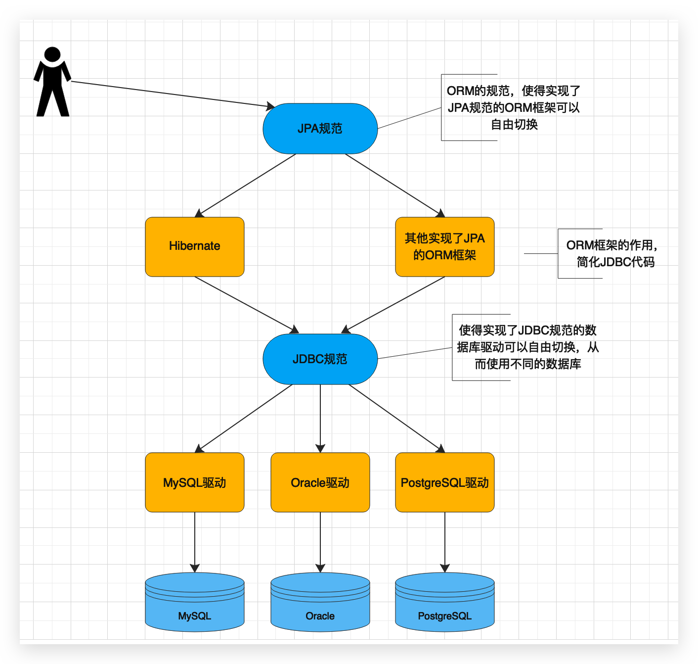

# 概述

## JDBC 操作数据库及思考 🔥

有一个用户表

```sql
create table t_user (
	id bigint auto_increament,
    username varchar(100),
    address varchar(255)
)
```

用户表对应的 model

```java
@Data
public class User {
    private Long userId;
    private String username;
    private String address;
    
}
```

JDBC 保存用户操作（只关注步骤，api 可能不对，且没有关注事务）

```java
String sql = "insert into t_user (username, address) values (?,?)";

// 1 获取连接
Connection conn = DriverManager.getConnection(url, username, password);
// 2 创建 statement 对象
PreparedStatement ps = conn.preparedStatment(sql);
// 3 对占位符赋值
ps.setString(1, user.getUsername());
ps.setString(2, user.getAddress());
// 4 保存
ps.executeUpdate();
```

上述操作总的来说很麻烦，当然可以**封装一个工具类**，**只写 sql、占位符赋值、执行操作**。但是**占位符赋值没有用到面向对象的思想**，那么怎么使用面向对象的思想来操作呢？

例如调用 repository.save(user) 即可保存到数据库中，从该语句中可以得出，save 动词可拼接出 sql：insert into __ values __，那么表名和占位符赋值则直接使用 user 对象可以获取到，然后执行操作即可。

所以，只需**建立 user 对象和 t_user 表的映射关系，user 的属性和 t_user 表字段的映射关系**即可使用面向对象来操作数据库了


## ORM & JPA 与 Hibernate

### ORM 思想

**ORM（Object-Relational Mapping）** 表示**对象关系映射**。简单的说：ORM就是**建立实体类和数据库表之间的关系**（包括**表和字段**），从而达到**操作实体类就相当于操作数据库表**的目的。解决了可能会写特别多数据访问层的代码、从数据库保存数据、修改数据、删除数据等重复代码问题。

常见的 ORM 框架：~~Mybatis（ibatis）~~、Hibernate


### JPA 及其优势

**JPA（Java Persistence API）**， 即**Java 持久化API**，是SUN公司推出的一套**基于ORM的规范**（**操作ORM框架，JDBC是操作不同数据库**），内部是由一系列的**接口和抽象类**构成。注意**不是框架**！

JPA 的优势如下：

- **标准化**

    JPA 是 JCP 组织发布的 Java EE 标准之一，因此任何声称符合 JPA 标准的框架都遵循同样的架构，提供相同的访问API，这保证了基于JPA开发的企业应用能够经过少量的修改就能够在不同的JPA框架下运行。

- **容器级特性的支持**

    JPA框架中支持大数据集、事务、并发等容器级事务，使得 JPA 超越了简单持久化框架的局限，在企业应用发挥更大作用。

- **简单方便**

    JPA的主要目标之一就是提供更加简单的编程模型：在JPA框架下创建实体和创建Java 类一样简单，没有任何的约束和限制，只需要使用 javax.persistence.Entity进行注释，JPA的框架和接口也都非常简单，没有太多特别的规则和设计模式的要求，开发者可以很容易的掌握。JPA基于非侵入式原则设计，因此可以很容易的和其它框架或者容器集成

- **查询能力**

    JPA的查询语言是**面向对象**而非面向数据库的，它以面向对象的自然语法构造查询语句，可以看成是Hibernate HQL的等价物。JPA定义了独特的JPQL（Java Persistence Query Language），JPQL是EJB QL的一种扩展，它是针对实体的一种查询语言，操作对象是实体，而不是关系数据库的表，而且能够支持批量更新和修改、JOIN、GROUP BY、HAVING 等通常只有 SQL 才能够提供的高级查询特性，甚至还能够支持子查询。

- **高级特性**

    JPA 中能够支持面向对象的高级特性，如类之间的继承、多态和类之间的复杂关系，这样的支持能够让开发者最大限度的使用面向对象的模型设计企业应用，而不需要自行处理这些特性在关系数据库的持久化。


### Hibernate 简介

Hibernate是一个开放源代码的对象关系映射框架，它对JDBC进行了非常**轻量级**的对象封装，实现类了 JPA 规范，它将POJO与数据库表建立映射关系，是一个**全自动的ORM框架**。Hibernate可以自动生成SQL语句，自动执行，使得Java程序员可以随心所欲的使用对象编程思维来操纵数据库。


### JPA、Hibernate、JDBC 关系 🔥

JPA和Hibernate的关系就像JDBC和JDBC驱动的关系，JPA是规范，Hibernate除了作为ORM框架之外，它也是一种JPA实现。JPA怎么取代Hibernate呢？JDBC规范可以驱动底层数据库吗？答案都是否定的，也就是说，如果使用JPA规范进行数据库操作，底层需要Hibernate作为其实现类完成数据持久化工作。


