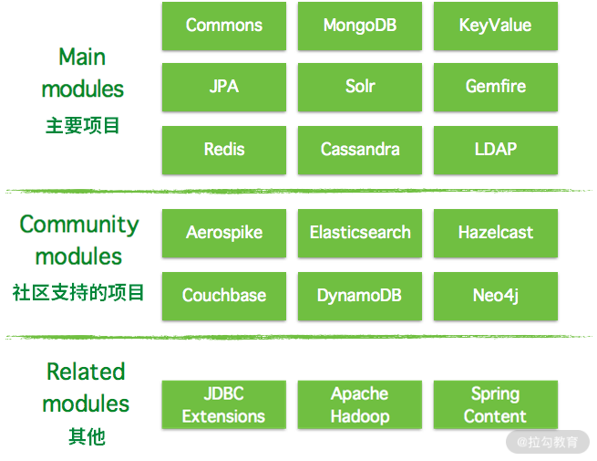
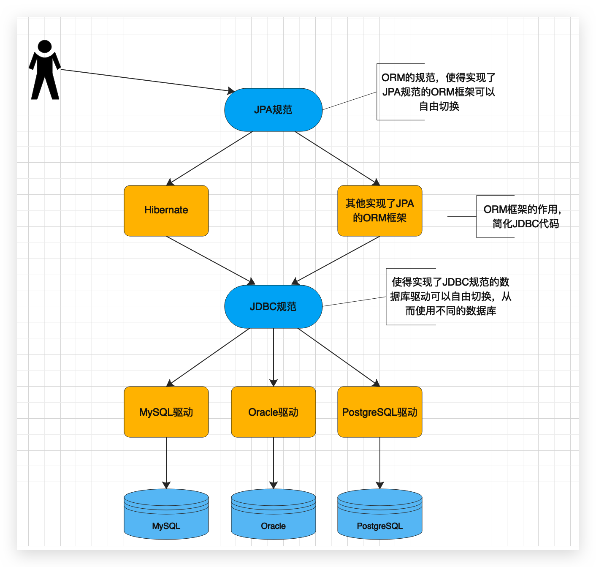
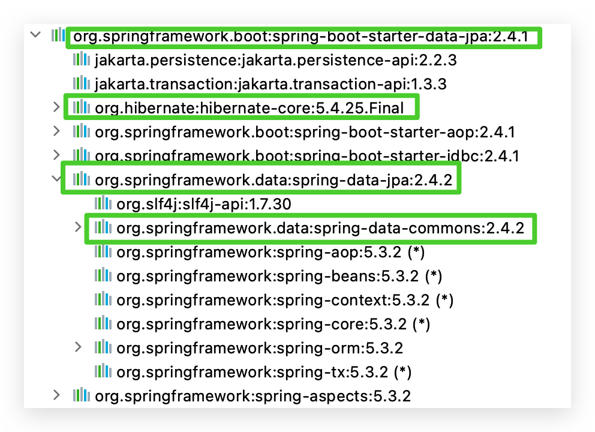
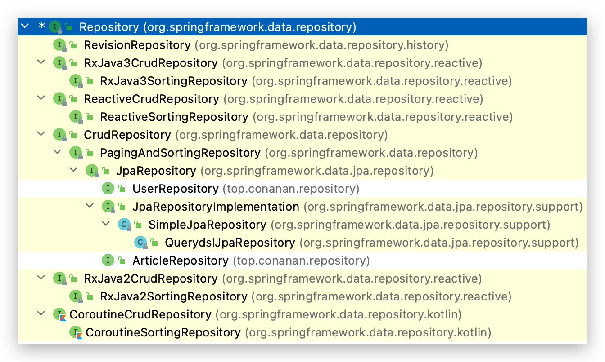
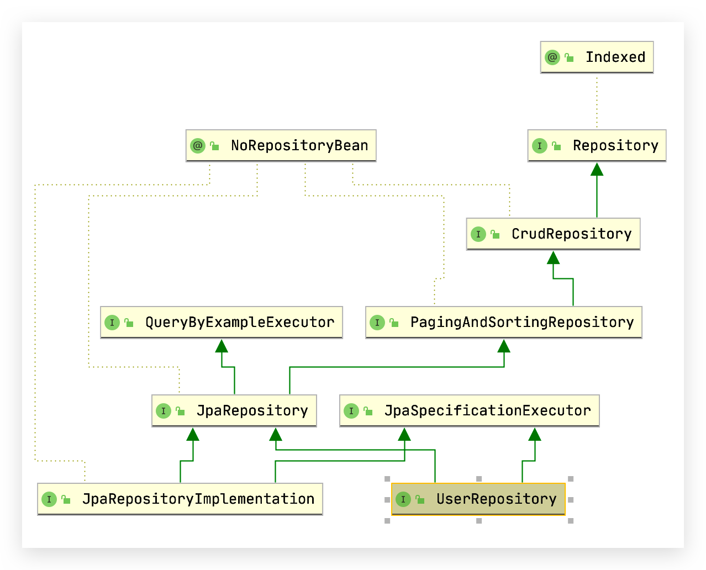
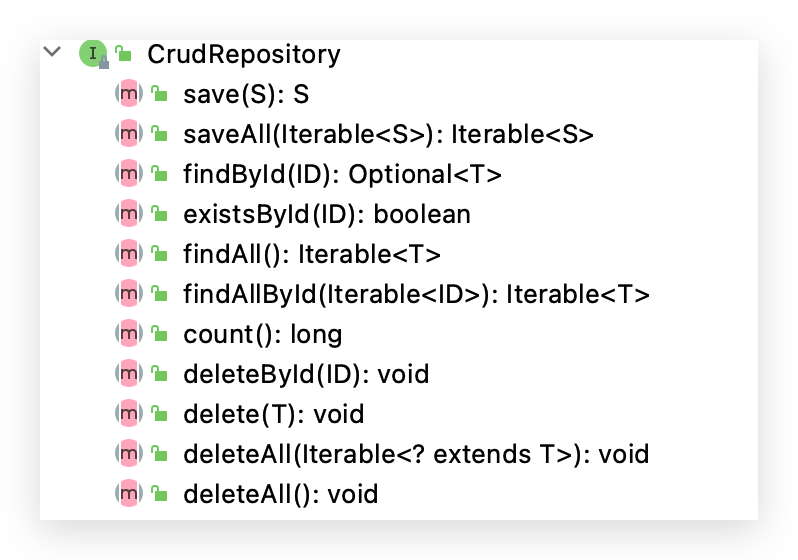
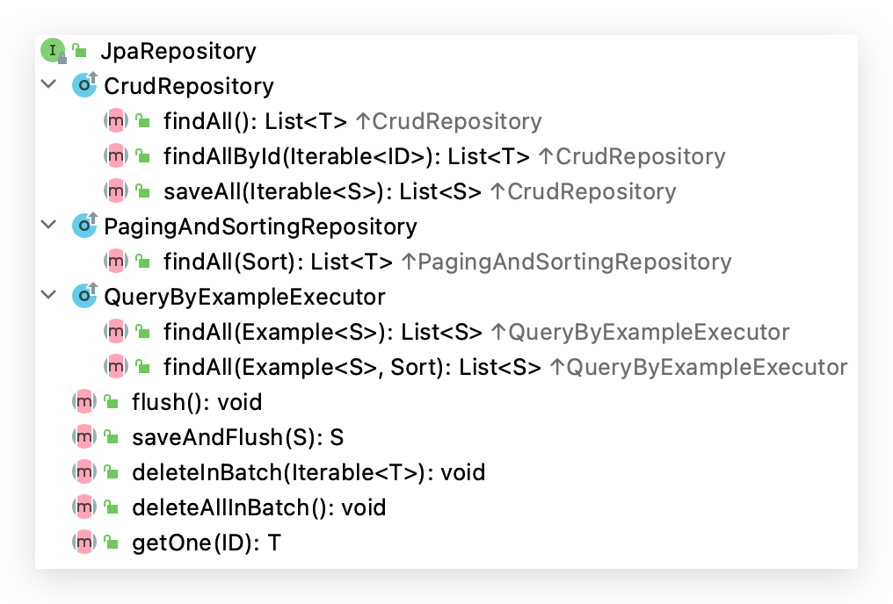
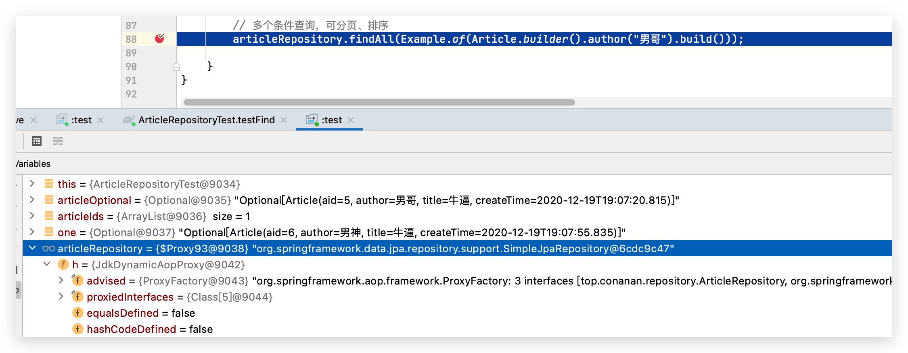
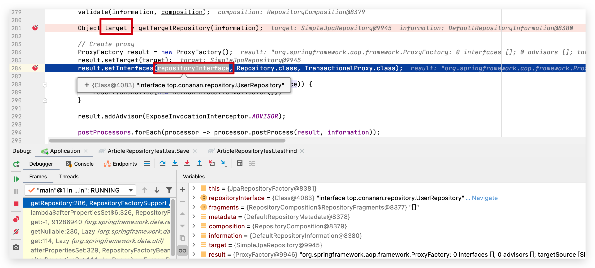

# SpringDataJPA 入门

## 持久层开发的问题

### 持久层开发的问题

随着互联网技术的发展，现在的企业开发中用到的用于数据存储的产品，不再仅仅是关系型数据库，而是要根据场景需要选择不同的存储技术，比如用于缓存热点数据的redis，用于存储文档数据的mongodb，用于支持强大搜索功能的elasticsearch等等。

在Java中，对于上面所说的产品都提供了优秀的访问技术。比如针对关系型数据库的mybatis、jpa等技术，针对于redis的jedis技术等等..... 这些技术虽然可以很好的针对各个存储产品进行访问操作，但同时也带来了新的问题，那就是不同的持久层技术的API是不一样的。这样一来，开发人员就必须同时掌握多种数据访问技术，这无疑增加了开发成本。那么我们会想，有没有这样一种技术，它可以使用**一套API支持各个不同的存储的访问**呢？就在这样的需求下，SpringData产生了。


### 什么是 Spring Data？

Spring Data 项目是从 2010 年开发发展起来的，Spring Data 利用一个大家熟悉的、一致的、基于“注解”的数据访问编程模型，做一些**公共操作的封装**，它可以轻松地让开发者使用数据库访问技术，**简化 DAO 层开发**，包括**关系数据库、非关系数据库**（NoSQL）。同时又有不同的数据框架的实现，保留了每个底层数据存储结构的特殊特性。

**Spring Data Common 是 Spring Data 所有模块的公共部分**，该项目提供了基于 Spring 的共享基础设施，它提供了基于 repository 接口以 DB 操作的一些封装，以及一个坚持在 Java 实体类上标注元数据的模型。

Spring Data 不仅对传统的数据库访问技术如 JDBC、Hibernate、JDO、TopLick、JPA、MyBatis 做了很好的支持和扩展、抽象、提供方便的操作方法，还对 MongoDb、KeyValue、Redis、LDAP、Cassandra 等非关系数据的 NoSQL 做了不同的实现版本，方便我们开发者触类旁通。


### Spring Data 的子项目

下图为目前 Spring Data 的框架分类结构图，里面都有哪些模块可以一目了然，也可以知道哪些是我们需要关心的项目



主要项目（Main Modules）：

*   **Spring Data Commons**，相当于定义了一套**抽象的接口**
*   Spring Data JDBC，对JDBC的Spring Data存储库支持
*   **Spring Data JPA**，我们关注的重点，对 Spring Data Common 的接口的 JPA 协议的实现
*   Spring Data Gemfire
*   Spring Data KeyValue
*   Spring Data LDAP
*   Spring Data MongoDB，对MongoDB的基于Spring对象文档的存储库支持
*   Spring Data REST
*   Spring Data Redis，封装Jedis技术，对redis实现访问操作
*   Spring Data for Apache Cassandra
*   Spring Data for Apache Solr

社区支持的项目（Community Modules）：

*   Spring Data Aerospike
*   Spring Data Couchbase
*   Spring Data DynamoDB
*   Spring Data Elasticsearch，对Elasticsearch实现访问操作（一般不太用，因为版本更新比较慢）
*   Spring Data Hazelcast
*   Spring Data Jest
*   Spring Data Neo4j
*   Spring Data Vault

其他（Related Modules）：

*   Spring Data JDBC Extensions
*   Spring for Apache Hadoop
*   Spring Content

关于 Spring Data 的子项目，除了上面这些，还有很多开源社区版本，比如 Spring Data、MyBatis 等


### Spring Data JPA 关系图 🔥

只需在 JPA 规范上面再添加一个 Spring Data JPA 即可




## Spring Data Common 之 Repository 🔥

Spring Data Common 定义了很多公用的接口和一些相对数据操作的公共实现（如分页排序、结果映射、Autiting 信息、事务等），而 Spring Data JPA 就是 Spring Data Common 的关系数据库的查询实现。本节了解下 Spring Data Common 的核心内容——Repository，从 Repository 的所有子类着手，逐步掌握 CrudRepository、PageingAndSortingRepository、JpaRepository的使用。

### Spring Data JPA 的依赖关系

先来看看 Spring Data JPA 所依赖的 jar 包关系是什么样的



数据库连接用的是 JDBC，连接池用的是 HikariCP（看 starter-jdbc），**强依赖 Hibernate（不能切换实现了JPA的其他框架）**；Spring Boot Starter Data JPA 依赖 Spring Data JPA；而 Spring Data JPA 依赖 Spring Data Commons。Spring Data Commons 是终极依赖。下面学习 DB 操作的入口 Repository及其子类


### Repository 接口、层次关系 🔥

#### Repository 接口

Repository 是 Spring Data Common 里面的顶级父类接口，操作 DB 的入口类。首先介绍 Repository 接口的源码、类层次关系和使用实例。

```java
package org.springframework.data.repository;
import org.springframework.stereotype.Indexed;

@Indexed
public interface Repository<T, ID> {

}
```

Resposiory 是 Spring Data 里面进行数据库操作顶级的抽象接口，里面什么方法都没有，但是如果任何接口继承它，就能得到一个 Repository，还可以实现 JPA 的一些默认实现方法（**如方法名称规则查询**）。这是 Spring 利用 Respository 作为 DAO 操作的 Type，以及利用 Java 动态代理机制实现的

Spring 在做动态代理的时候，只要是它的子类或者实现类，再利用 T 类以及 T 类的 主键 ID 类型作为泛型的类型参数，就可以来标记出来、并捕获到要使用的实体类型，就能帮助使用者进行数据库操作。


#### Repository 类层次关系

Type hierarchy 类的层次结构，使用 Ctrl + H（mac）即可看到



通过该层次结构视图，你就会明白基类 Repository 的用意，由此可知，存储库分为以下 4 个大类。

-   ReactiveCrudRepository 这条线是响应式编程，主要支持当前 NoSQL 方面的操作，因为这方面大部分操作都是分布式的，所以由此我们可以看出 Spring Data 想统一数据操作的“野心”，即想提供关于所有 Data 方面的操作。目前 Reactive 主要有 Cassandra、MongoDB、Redis 的实现。
-   RxJava2/3CrudRepository 这条线是为了支持 RxJava 2/3 做的标准响应式编程的接口。
-   CoroutineCrudRepository 这条继承关系链是为了支持 Kotlin 语法而实现的。
-   CrudRepository 这条继承关系链正是本课时我要详细介绍的 JPA 相关的操作接口，你也可以把我的这种方法应用到另外 3 种继承关系链里面学习。


点击 Show Diagram 显示层次结构图，其中 JpaSpecificationExecutor 也是继承了借口后出现的，也是需要学习的！



需要掌握和使用到的类如下所示：

**7 大 Repository 接口：**

*   Repository(org.springframework.data.repository)，没有暴露任何方法；
*   CrudRepository(org.springframework.data.repository)，简单的 Curd 方法；
*   PagingAndSortingRepository(org.springframework.data.repository)，带分页和排序的方法；
*   QueryByExampleExecutor(org.springframework.data.repository.query)，简单 Example 查询；
*   JpaRepository(org.springframework.data.jpa.repository)，JPA 的扩展方法；
*   JpaSpecificationExecutor(org.springframework.data.jpa.repository)，JpaSpecification 扩展查询；
*   QueryDslPredicateExecutor(org.springframework.data.querydsl)，QueryDsl 的封装。

**2 大 Repository 实现类：**

-   SimpleJpaRepository(org.springframework.data.jpa.repository.support)，JPA 所有接口的默认实现类；
-   QueryDslJpaRepository(org.springframework.data.jpa.repository.support)，QueryDsl 的实现类。

关于其他的类，后面我也会通过不同方式的讲解


### 测试 Entity—User

```java
@Entity
@Data
@Builder
@NoArgsConstructor
@AllArgsConstructor
public class User {
    @Id
    @GeneratedValue(strategy= GenerationType.AUTO)
    private Long id;
    private String name;
    private String email;
}
```


### Repository 接口示例—方法名称规则查询 🔥

利用 UserRepository 继承 Repository 来实现对 User 的两个查询方法（**方法名称规则查询**）

```java
public interface UserRepository extends Repository<User,Long> {
	//根据名称进行查询用户列表
	List<User> findByName(String name);
	// 根据用户的邮箱和名称查询
	List<User> findByEmailAndName(String email, String name);
}
```

由于 Repository 接口里面没有任何方法，所以此 UserRepository 对外只有两个可用方法


### CrudRepository 接口示例 🔥

通过 IDEA 工具，看下 CrudRepository 为我们提供的方法有哪些



-   `<S extends T> S save(S entity);` 保存/更新实体方法

    Entity 中若 id 为 null，则 persist，否则执行 merge（源码中会进行 id 是否为 null 等判断。**有的说根据id 查询了？乐观锁**）

    如果当传递的参数里面没有 ID，则直接 insert；若当传递的参数里面有 ID，则会触发 select 查询。此方法会去看一下数据库里面是否存在此记录，若存在，则 update，否则 insert

    注意更新时实体类中当前为null的字段也会被更新为null，可以配置更改该策略，**DynamicUpdate 策略**

    参数和返回结果可以是实体的子类

    ```java
    public <S extends T> S save(S entity) {
        if (entityInformation.isNew(entity)) {
            em.persist(entity);
            return entity;
        } else {
            return em.merge(entity);
        }
    }
    ```

-   `saveAll(Iterable<S> entities)` : 批量保存/更新，原理和 save方法相同，我们去看实现的话，就是 for 循环调用上面的 save 方法。

-   `void deleteById(ID id);` 根据主键删除，查看源码会发现，其是先根据主键查询出来再进行删除，**没查询到直接抛异常（需要处理该异常，但是一般删除操作不会产生并发）**；（实际使用时无需手动查询！）

    ```java
    public void deleteById(ID id) {
        Assert.notNull(id, ID_MUST_NOT_BE_NULL);
        // 没查询到直接抛异常
        delete(findById(id).orElseThrow(() -> new EmptyResultDataAccessException(
            String.format("No %s entity with id %s exists!", entityInformation.getJavaType(), id), 1)));
    }
    ```

-   `void delete(T entity)` 根据 Entity（其实是主键） 进行删除（底层和 deleteById 一样）；

-   `void deleteAll(Iterable<? extends T> entities)` 批量删除，还是for循环调用 delete(T entity) 

-   `void deleteAll()` 删除所有；原理可以通过刚才的类关系查看，CrudRepository 的实现方法如下：

    ```java
    //SimpleJpaRepository里面的deleteALL方法
    // 利用 for 循环调用 delete 方法进行删除操作
    public void deleteAll() {
       for (T element : findAll()) {
          delete(element);
       }
    }
    ```

-   `boolean existsById(ID id)` 根据主键判断实体是否存在；

-   `Optional<T> findById(ID id);` 根据主键查询实体，返回 JDK 1.8 的 Optional，这可以避免 null exception；

-   `Iterable<T> findAllById(Iterable ids);` 根据主键列表查询实体列表；

-   `Iterable<T> findAll();` 查询实体的所有列表；

-   `count()`: long 查询总数返回 long 类型；


上面这些方法是 CrudRepository 对外暴露的常见的 Crud 接口，我们在对数据库进行 Crud 的时候就会运用到，如下所示

```java
public interface UserRepository extends CrudRepository<User,Long> {
}
```


### PagingAndSortingRepository 接口示例 🔥

主要用于分页查询和排序查询。源码如下：

```java
@NoRepositoryBean
public interface PagingAndSortingRepository<T, ID> extends CrudRepository<T, ID> {
	Iterable<T> findAll(Sort sort); （1）
	Page<T> findAll(Pageable pageable); （2）
}
```

*   第一个方法 findAll 参数是 Sort，是根据排序参数，实现不同的排序规则获取所有的对象的集合
*   🔥 第二个方法 findAll 参数是 Pageable，是根据分页和排序进行查询，并用 Page 对返回结果进行封装。而 Pageable 对象包含 Page 和 Sort 对象

使用方式如下：

```java
public interface UserRepository extends PagingAndSortingRepository<User,Long> {
}
```

```java
/**
 * 验证排序和分页查询方法，Pageable的默认实现类：PageRequest
 * @return
 */
@GetMapping(path = "/page")
@ResponseBody
public Page<User> getAllUserByPage() {
   return userRepository.findAll(
         PageRequest.of(1, 20,Sort.by(new Sort.Order(Sort.Direction.ASC,"name"))));
}
/**
 * 排序查询方法，使用Sort对象
 * @return
 */
@GetMapping(path = "/sort")
@ResponseBody
public Iterable<User> getAllUsersWithSort() {
   return userRepository.findAll(Sort.by(new Sort.Order(Sort.Direction.ASC,"name")));
}
```


### JpaRepository 接口示例 🔥

到这里可以进入到分水岭了，**上面的那些都是 Spring Data 为了兼容 NoSQL 而进行的一些抽象封装**，而**从 JpaRepository 开始是对关系型数据库进行抽象封装**。从类图可以看出来它继承 PagingAndSortingRepository 类，也就继承了其所有方法，并且其实现类也是 SimpleJpaRepository。从类图上还可以看出 JpaRepository 继承和拥有了 QueryByExampleExecutor 的相关方法，我们先来看一下 JpaRepository 有哪些方法。



涉及 QueryByExample 的部分我们在 11 课时“JpaRepository 如何自定义”再详细介绍，

JpaRepository 里面重点新增了批量删除，优化了批量删除的性能，类似于之前 SQL 的 batch 操作，并不是像上面的 deleteAll 来 for 循环删除。

其中 flush() 和 saveAndFlush() 提供了手动刷新 session，把对象的值立即更新到数据库里面的机制。JPA 是 由 Hibernate 实现的，所以有 session 一级缓存的机制，当调用 save() 方法的时候，数据库里面是不会立即变化的，其原理我将在 21 课时“Persistence Context 所表达的核心概念是什么”再详细讲解

使用方式如下：

```java
public interface UserRepository extends JpaRepository<User,Long> {
}
```


### 具体实现类 SimpleJpaRepository 🔥

PagingAndSortingRepository 和 CrudRepository 都是 Spring Data Common 的标准接口，那么实现类是什么呢？如果我们采用 JPA，那对应的实现类就是 Spring Data JPA 的 jar 包里面的 SimpleJpaRepository。如果是其他 NoSQL的 实现如 MongoDB，那实现就在 Spring Data MongoDB 的 jar 里面的 MongoRepositoryImpl。JpaRepository 的实现类也是 SimpleJpaRepository

关系数据库的所有 Repository 接口的实现类就是 SimpleJpaRepository，如果有些业务场景需要进行扩展了，可以继续继承此类，如 QueryDsl 的扩展（虽然不推荐使用了，但我们可以参考它的做法，自定义自己的 SimpleJpaRepository），**如果能将此类里面的实现方法看透了，基本上 JPA 中的 API 就能掌握大部分内容**。

UserRepository 的实现类是 Spring 启动的时候，利用 Java 动态代理机制帮我们生成的实现类，而真正的实现类就是 SimpleJpaRepository。




它是在什么时候被动态代理生成的？在 RepositoryFactorySupport 设置一个断点，启动的时候，在我们的断点处就会发现 UserRepository 的接口会被 JdkDynamicAopProxy 动态代理成 SimpleJapRepository 的实现类（底层还是 InvocationHandler 的 invoke 方法；非接口的动态代理会使用 Cglib）。注意每一个 Repository 的子类，都会通过这里的动态代理生成实现类



部分源码如下：

```java
@Repository
@Transactional(readOnly = true)
public class SimpleJpaRepository<T, ID> implements JpaRepository<T, ID>, JpaSpecificationExecutor<T> {

    private static final String ID_MUST_NOT_BE_NULL = "The given id must not be null!";

    private final JpaEntityInformation<T, ?> entityInformation;

    private final EntityManager em;

    private final PersistenceProvider provider;

    private @Nullable CrudMethodMetadata metadata;

    // ......
    
    @Transactional
    public void deleteAllInBatch() {
        em.createQuery(getDeleteAllQueryString()).executeUpdate();
    }
    //......
}
```

通过此类的源码，我们可以挺清晰地看出 SimpleJpaRepository 的实现机制，是**通过 EntityManger 进行实体的操作（就是和JPA一样）**，而 JpaEntityInforMation 里面存在实体的相关信息和 Crud 方法的元数据等。


### 启发 🔥

*   上面的 7 个大 Repository 接口，在使用的时候可以根据实际场景**继承不同的接口**，从而选择暴露不同的 Spring Data Common 给我们提供的已有接口。这其实利用了 Java 语言的 interface 特性。

*   利用源码也可以很好地理解一下 Spring 中**动态代理**的作用，可以利用这种思想，在改善 MyBatis 的时候使用。


## @Entity 中的 JPA 注解 🔥

### Entity 实体是什么？

*   实体是直接进行数据库持久化操作的领域对象（即一个简单的 POJO，可以按照业务领域划分），必须通过 @Entity 注解进行标示。
*   实体必须有一个 public 或者 protected 的无参数构造方法。
*   持久化映射的注解可以标示在 Entity 的字段 field 上，也可以将持久化注解运用在 Entity 里面的 get/set 方法上，通常我们是放在 get 方法中。即 Entity 里面的注解生效只有两种方式：将注解写在字段上或者将注解写在方法上（JPA 里面称 Property）。但是**需要注意的是，在同一个 Entity 里面只能有一种方式生效**，也就是说，注解要么全部写在 field 上面，要么就全部写在 Property 上面
*   只要是在 @Entity 的实体里面被注解标注的字段，都会被映射到数据库中，除了使用 **@Transient** 注解的字段之外。
*   实体里面**必须要有一个主键**，主键标示的字段可以是单个字段，也可以是复合主键字段。

JPA 协议的官方地址：https://download.oracle.com/otn-pub/jcp/persistence-2_2-mrel-spec/JavaPersistence.pdf


### 详细的注解都有哪些？

利用 IEDA 工具，打开 @Entity 所在的包，就可以看到 JPA 里面支持的注解有哪些。如下所示；


这里只提及一些最常见的，包括 @Entity、@Table、@Access、@Id、@GeneratedValue、@Enumerated、@Basic、@Column、@Transient、@Lob、@Temporal 等。


### @Entity 

用于定义对象将会成为被 JPA 管理的实体，必填，将字段映射到指定的数据库表中，使用起来很简单，直接用在实体类上面即可，通过源码表达的语法如下：

```java
@Target(TYPE) //表示此注解只能用在class上面
public @interface Entity {
   //可选，默认是实体类的名字，整个应用里面全局唯一。
   String name() default "";
}
```


### @Table

用于指定数据库的表名，表示此实体对应的数据库里面的表名，非必填，默认表名和 entity 名字一样。

```java
@Target(TYPE) //一样只能用在类上面
public @interface Table {
   //表的名字，可选。如果不填写，系统认为好实体的名字一样为表名。
   String name() default "";
   //此表所在schema，可选
   String schema() default "";
   //唯一性约束，在创建表的时候有用，表创建之后后面就不需要了。
   UniqueConstraint[] uniqueConstraints() default { };
   //索引，在创建表的时候使用，表创建之后后面就不需要了。
   Index[] indexes() default {};
}
```


### @Access

用于指定 entity 里面的注解是写在字段上面，还是 get/set 方法上面生效，非必填。在默认不填写的情况下，当实体里面的第一个注解出现在字段上或者 get/set 方法上面，就以第一次出现的方式为准；也就是说，一个实体里面的注解既有用在 field 上面，又有用在 properties 上面的时候，看下面的代码你就会明白。

```java
@Id
private Long id;
@Column(length = 20, nullable = false)
public String getUserName(){
    return userName;
}
```

那么由于 @Id 是实体里面第一个出现的注解，并且作用在字段上面，所以所有写在 get/set 方法上面的注解就会失效。而 @Access 可以干预默认值，指定是在 fileds 上面生效还是在 properties 上面生效。我们通过源码看下语法：

```java
@Target( { TYPE, METHOD, FIELD })//表示此注解可以运用在class上(那么这个时候就可以指定此实体的默认注解生效策略了)，也可以用在方法上或者字段上(表示可以独立设置某一个字段或者方法的生效策略)；
@Retention(RUNTIME)
public @interface Access {
//指定是字段上面生效还是方法上面生效
    AccessType value();
}
public enum AccessType {
    FIELD,
    PROPERTY
}
```


### @Id

定义属性为数据库的主键，一个实体里面必须有一个主键，但不一定是这个注解，可以和 @GeneratedValue 配合使用或成对出现。


### @GeneratedValue

主键生成策略，如下所示：

```java
public @interface GeneratedValue {
    //Id的生成策略
    GenerationType strategy() default AUTO;
    //通过Sequences生成Id,常见的是Orcale数据库ID生成规则，这个时候需要配合@SequenceGenerator使用
    String generator() default "";
}
```

其中，GenerationType 一共有以下四个值：

```java
public enum GenerationType {
    //通过表产生主键，框架借由表模拟序列产生主键，使用该策略可以使应用更易于数据库移植。
    TABLE,
    //通过序列产生主键，通过 @SequenceGenerator 注解指定序列名， MySql 不支持这种方式；
    SEQUENCE,
    //采用数据库ID自增长， 一般用于mysql数据库
    IDENTITY,
//JPA 自动选择合适的策略，是默认选项；
    AUTO
}
```


### @Enumerated

这个注解很好用，因为它对 enum 提供了下标和 name 两种方式，用法直接映射在 enum 枚举类型的字段上。请看下面源码。

```java
@Target({METHOD, FIELD}) //作用在方法和字段上
public @interface Enumerated {
//枚举映射的类型，默认是ORDINAL（即枚举字段的下标）。
    EnumType value() default ORDINAL;
}
public enum EnumType {
    //映射枚举字段的下标
    ORDINAL,
    //映射枚举的Name
    STRING
}
```

再来看一个 User 里面关于性别枚举的例子，你就会知道 @Enumerated 在这里**没什么作用了**，如下所示：

```java
//有一个枚举类，用户的性别
public enum Gender {
    MAIL("男性"), FMAIL("女性");
    private String value;
    private Gender(String value) {
        this.value = value;
    }
}
//实体类@Enumerated的写法如下
@Entity
@Table(name = "tb_user")
public class User implements Serializable {
    @Enumerated(EnumType.STRING)
    @Column(name = "user_gender")
    private Gender gender;
    //.......................
}
```

这时候插入两条数据，数据库里面的值会变成 MAIL/FMAIL，而不是“男性” / 女性。

**经验分享：** 如果我们用 @Enumerated（EnumType.ORDINAL），这时候数据库里面的值是 0、1。但是实际工作中，不建议用数字下标，因为枚举里面的属性值是会不断新增的，如果新增一个，位置变化了就惨了。并且 0、1、2 这种下标在数据库里面看着非常痛苦，时间长了就会一点也看不懂了。


### @Basic

表示属性是到数据库表的字段的映射。如果实体的字段上没有任何注解，默认即为 @Basic。也就是说默认所有的字段肯定是和数据库进行映射的，并且默认为 Eager 类型。

```java
public @interface Basic {
    //可选，EAGER（默认）：立即加载；LAZY：延迟加载。（LAZY主要应用在大字段上面）
    FetchType fetch() default EAGER;
    //可选。这个字段是否可以为null，默认是true。
    boolean optional() default true;
}
```


### @Transient

表示该属性并非一个到数据库表的字段的映射，表示非持久化属性。JPA 映射数据库的时候忽略它，与 @Basic 有相反的作用。也就是每个字段上面 @Transient 和 @Basic 必须二选一，而什么都不指定的话，默认是 @Basic。


### @Column

定义该属性对应数据库中的列名。

```java
public @interface Column {
    //数据库中的表的列名；可选，如果不填写认为字段名和实体属性名一样。
    String name() default "";
    //是否唯一。默认flase，可选。
    boolean unique() default false;
    //数据字段是否允许空。可选，默认true。
    boolean nullable() default true;
    //执行insert操作的时候是否包含此字段，默认，true，可选。
    boolean insertable() default true;
    //执行update的时候是否包含此字段，默认，true，可选。
    boolean updatable() default true;
    //表示该字段在数据库中的实际类型。
    String columnDefinition() default "";
   //数据库字段的长度，可选，默认255
    int length() default 255;
}
```


### @Temporal

用来设置 Date 类型的属性映射到对应精度的字段，存在以下三种情况：

-   @Temporal(TemporalType.DATE)映射为日期 // date （**只有日期**）
-   @Temporal(TemporalType.TIME)映射为日期 // time （**只有时间**）
-   @Temporal(TemporalType.TIMESTAMP)映射为日期 // date time （**日期+时间**）


### 完整的例子

```java
@Entity
@Table(name = "user_topic")
@Access(AccessType.FIELD)
@Data
public class UserTopic {
   @Id
   @Column(name = "id", nullable = false)
   @GeneratedValue(strategy = GenerationType.IDENTITY)
   private Integer id;
   @Column(name = "title", nullable = true, length = 200)
   private String title;
   @Basic
   @Column(name = "create_user_id", nullable = true)
   private Integer createUserId;
   @Basic(fetch = FetchType.LAZY)
   @Column(name = "content", nullable = true, length = -1)
   @Lob
   private String content;
   @Basic(fetch = FetchType.LAZY)
   @Column(name = "image", nullable = true)
   @Lob
   private byte[] image;
   @Basic
   @Column(name = "create_time", nullable = true)
   @Temporal(TemporalType.TIMESTAMP)
   private Date createTime;
   @Basic
   @Column(name = "create_date", nullable = true)
   @Temporal(TemporalType.DATE)
   private Date createDate;
   @Enumerated(EnumType.STRING)
   @Column(name = "topic_type")
   private Type type;
   @Transient
   private String transientSimple;
   //非数据库映射字段，业务类型的字段
   public String getTransientSimple() {
      return title + "auto:jack" + type;
   }
   //有一个枚举类，主题的类型
   public enum Type {
      EN("英文"), CN("中文");
      private final String des;
      Type(String des) {
         this.des = des;
      }
   }
}
```

其实这里面的很多注解都可以省略，直接使用默认的就可以。如 @Basic、@Column 名字有一定的映射策略（我们在第 17 课时讲 DataSource 的时候会详细讲解映射策略），所以可以省略。此外，@Access 也可以省略，我们只要在这些类里面保持一致就可以了。学会**利用工具去生成 Entity 类**，将会节省很多时间。

首先，**打开 Persistence 视图，点击 Generate Persistence Mapping**，接着**点击选中数据源**，然后，**选择表和字段，并点击 OK**。

但是需要注意的是，在生产环境中我们要把外键关联关系关闭，不然会出现意想不到的 ERROR，毕竟生产环境不同开发环境，我们可以通过在开发环境生成的表导出 DDL 到生产执行。我经常会利用生成 DDL 来做测试和写案例， 这样省去了创建表的时间，只需要关注我的代码就行了。


### 联合主键

可以通过 javax.persistence.EmbeddedId 和 javax.persistence.IdClass 两个注解实现联合主键的效果。

#### 如何通过 @IdClass 做到联合主键？

我们先看一下怎么通过 @IdClass 做到联合主键。

第一步：新建一个 UserInfoID 类里面是联合主键。

```java
@Data
@Builder
@AllArgsConstructor
@NoArgsConstructor
public class UserInfoID implements Serializable {
   private String name,telephone;
}
```

第二步：再新建一个 UserInfo 的实体，采用 @IdClass 引用联合主键类。

```java
@Entity
@Data
@Builder
@IdClass(UserInfoID.class)
@AllArgsConstructor
@NoArgsConstructor
public class UserInfo {
   private Integer ages;
   @Id
   private String name;
   @Id
   private String telephone;
}
```

第三步：新增一个 UserInfoReposito 类来做 CRUD 操作。

```java
public interface UserInfoRepository extends JpaRepository<UserInfo,UserInfoID> {
}
```

第四步：写一个测试用例，测试一下。

```java
@DataJpaTest
public class UserInfoRepositoryTest {
   @Autowired
   private UserInfoRepository userInfoRepository;
   @Test
   public void testIdClass() {
   userInfoRepository.save(UserInfo.builder().ages(1).name("jack").telephone("123456789").build());
      Optional<UserInfo> userInfo = userInfoRepository.findById(UserInfoID.builder().name("jack").telephone("123456789").build());
      System.out.println(userInfo.get());
   }
}
```

```
Hibernate: create table user_info (name varchar(255) not null, telephone varchar(255) not null, ages integer, primary key (name, telephone))
Hibernate: select userinfo0_.name as name1_3_0_, userinfo0_.telephone as telephon2_3_0_, userinfo0_.ages as ages3_3_0_ from user_info userinfo0_ where userinfo0_.name=? and userinfo0_.telephone=?
UserInfo(ages=1, name=jack, telephone=123456789)
```

通过上面的例子我们可以发现，我们的表的主键是 primary key (name, telephone)，而 Entity 里面不再是一个 @Id 字段了。那么我来介绍另外一个注解 @Embeddable，也能做到这一点。


#### @Embeddable 与 @EmbeddedId 注解使用

第一步：在我们上面例子中的 UserInfoID 里面添加 @Embeddable 注解。

```java
@Data
@Builder
@AllArgsConstructor
@NoArgsConstructor
@Embeddable
public class UserInfoID implements Serializable {
   private String name,telephone;
}
```

第二步：改一下我们刚才的 User 对象，删除 @IdClass，添加 @EmbeddedId 注解，如下：

```java
@Entity
@Data
@Builder
@AllArgsConstructor
@NoArgsConstructor
public class UserInfo {
   private Integer ages;
   @EmbeddedId
   private UserInfoID userInfoID;
   @Column(unique = true)
   private String uniqueNumber;
}
```

第三步：UserInfoRepository 不变，我们直接修改一下测试用例。

```java
@Test
public void testIdClass() {
  userInfoRepository.save(UserInfo.builder().ages(1).userInfoID(UserInfoID.builder().name("jack").telephone("123456789").build()).build());
   Optional<UserInfo> userInfo = userInfoRepository.findById(UserInfoID.builder().name("jack").telephone("123456789").build());
   System.out.println(userInfo.get());
}
```

运行完之后，你可以得到相同的结果。那么 @IdClass 和 @EmbeddedId 的区别是什么？有以下两个方面：

1.  如上面测试用例，在使用的时候，Embedded 用的是对象，而 IdClass 用的是具体的某一个字段；

2.  二者的JPQL 也会不一样：

    用 @IdClass JPQL 的写法：SELECT u.name FROM UserInfo u

    用 @EmbeddedId 的 JPQL 的写法：select u.userInfoId.name FROM UserInfo u

联合主键还有需要注意的就是，它与唯一性索引约束的区别是写法不同，如上面所讲，唯一性索引的写法如下：

```java
@Column(unique = true)
private String uniqueNumber;
```

到这里，联合主键我们讲完了，那么在遇到联合主键的时候，利用 @IdClass、@EmbeddedId，你就可以应对联合主键了。

此外，Java 是面向对象的，肯定会用到多态的使用场景，那么场景都有哪些？公共父类又该如何写？我们来学习一下。


### 实体之间的继承关系如何实现？🔥

在 Java 面向对象的语言环境中，@Entity 之间的关系多种多样，而根据 JPA 的规范，我们大致可以将其分为以下几种：

1.  纯粹的继承，和表没关系，**对象之间的字段共享**。利用注解 **@MappedSuperclass**，**协议规定父类不能是 @Entity**。
2.  单表多态问题，同一张 Table，表示了不同的对象，通过一个字段来进行区分。利用`@Inheritance(strategy = InheritanceType.SINGLE_TABLE)`注解完成，只有父类有 @Table。
3.  多表多态，每一个子类一张表，父类的表拥有所有公用字段。通过`@Inheritance(strategy = InheritanceType.JOINED)`注解完成，父类和子类都是表，有公用的字段在父表里面。
4.  Object 的继承，数据库里面每一张表是分开的，相互独立不受影响。通过`@Inheritance(strategy = InheritanceType.TABLE_PER_CLASS)`注解完成，父类（可以是一张表，也可以不是）和子类都是表，相互之间没有关系。


#### @MappedSuperclass 🔥

其中，第一种 @MappedSuperclass，我们暂时不多介绍，在第 12 课时讲解“JPA 的审计功能”时，再做详细介绍，我们先看一下第二种`SINGLE_TABLE`。


#### @Inheritance(strategy = InheritanceType.SINGLE_TABLE)

父类实体对象与各个子实体对象共用一张表，通过一个字段的不同值代表不同的对象，我们看一个例子。

我们抽象一个 Book 对象，如下所示：

```java
@Entity(name="book")
@Data
@Inheritance(strategy = InheritanceType.SINGLE_TABLE)
@DiscriminatorColumn(name="color", discriminatorType = DiscriminatorType.STRING)
public class Book {
   @Id
   @GeneratedValue(strategy= GenerationType.AUTO)
   private Long id;
   private String title;
}
```

再新建一个 BlueBook 对象，作为 Book 的子对象。

```java
@Entity
@Data
@EqualsAndHashCode(callSuper=false)
@DiscriminatorValue("blue")
public class BlueBook extends Book{
   private String blueMark;
}

```

再新建一个 RedBook 对象，作为 Book 的另一子对象。

```java
//红皮书
@Entity
@DiscriminatorValue("red")
@Data
@EqualsAndHashCode(callSuper=false)
public class RedBook extends Book {
   private String redMark;
}
```

这时，我们一共新建了三个 Entity 对象，其实都是指 book 这一张表，通过 book 表里面的 color 字段来区分红书还是绿书。我们继续做一下测试看看结果。

我们再新建一个 RedBookRepositor 类，操作一下 RedBook 会看到如下结果：

```java
public interface RedBookRepository extends JpaRepository<RedBook,Long>{
}
```

然后再新建一个测试用例。

```java
@DataJpaTest
public class RedBookRepositoryTest {
   @Autowired
   private RedBookRepository redBookRepository;
   @Test
   public void testRedBook() {
      RedBook redBook = new RedBook();
      redBook.setTitle("redbook");
      redBook.setRedMark("redmark");
      redBook.setId(1L);
      redBookRepository.saveAndFlush(redBook);
      RedBook r = redBookRepository.findById(1L).get();
    System.out.println(r.getId()+":"+r.getTitle()+":"+r.getRedMark());
   }
}
```

最后看一下执行结果。

```
Hibernate: create table book (color varchar(31) not null, id bigint not null, title varchar(255), blue_mark varchar(255), red_mark varchar(255), primary key (id))
```

你会发现，我们只创建了一张表，insert 了一条数据，但是我们发现 color 字段默认给的是 red。

```
Hibernate: insert into book (title, red_mark, color, id) values (?, ?, 'red', ?)
```

那么再看一下打印结果。

```
1:redbook:redmark
```

结果完全和预期的一样，这说明了 RedBook、BlueBook、Book，都是一张表，通过字段 color 的值不一样，来区分不同的实体。
那么接下来我们看一下 InheritanceType.JOINED，它的每个实体都是独立的表。


#### @Inheritance(strategy = InheritanceType.JOINED)

在这种映射策略里面，继承结构中的每一个实体（entity）类都会映射到数据库里一个单独的表中。也就是说，每个实体（entity）都会被映射到数据库中，一个实体（entity）类对应数据库中的一个表。

其中根实体（root entity）对应的表中定义了主键（primary key），所有的子类对应的数据库表都要共同使用 Book 里面的 @ID 这个主键。

首先，我们改一下上面的三个实体，测试一下InheritanceType.JOINED，改动如下：

```java
@Entity(name="book")
@Data
@Inheritance(strategy = InheritanceType.JOINED)
public class Book {
   @Id
   @GeneratedValue(strategy= GenerationType.AUTO)
   private Long id;
   private String title;
}
```

其次，我们 Book 父类、改变 Inheritance 策略、删除 DiscriminatorColumn，你会看到如下结果。

```java
@Entity
@Data
@EqualsAndHashCode(callSuper=false)
@PrimaryKeyJoinColumn(name = "book_id", referencedColumnName = "id")
public class BlueBook extends Book{
   private String blueMark;
}


@Entity
@PrimaryKeyJoinColumn(name = "book_id", referencedColumnName = "id")
@Data
@EqualsAndHashCode(callSuper=false)
public class RedBook extends Book {
   private String redMark;
}
```

然后，BlueBook和RedBook也删除DiscriminatorColumn，新增@PrimaryKeyJoinColumn(name = "book_id", referencedColumnName = "id")，和 book 父类共用一个主键值，而 RedBookRepository 和测试用例不变，我们执行看一下结果。

```
Hibernate: create table blue_book (blue_mark varchar(255), book_id bigint not null, primary key (book_id))
Hibernate: create table book (id bigint not null, title varchar(255), primary key (id))
Hibernate: create table red_book (red_mark varchar(255), book_id bigint not null, primary key (book_id))
Hibernate: alter table blue_book add constraint FK9uuwgq7a924vtnys1rgiyrlk7 foreign key (book_id) references book
Hibernate: alter table red_book add constraint FKk8rvl61bjy9lgsr9nhxn5soq5 foreign key (book_id) references book
```

上述代码可以看到，我们一共创建了三张表，并且新增了两个外键约束；而我们 save 的时候也生成了两个 insert 语句，如下：

```j
Hibernate: insert into book (title, id) values (?, ?)
Hibernate: insert into red_book (red_mark, book_id) values (?, ?)
```

而打印结果依然不变。

```
1:redbook:redmark
```

这就是 InheritanceType.JOINED 的例子，这个方法和上面的 InheritanceType.SINGLE_TABLE 区别在于表的数量和关系不一样，这是表设计的另一种方式。


#### @Inheritance(strategy = InheritanceType.TABLE_PER_CLASS) 🔥

我们在使用 @MappedSuperClass 主键的时候，如果不指定 @Inhertance，默认就是此种TABLE_PER_CLASS模式。当然了，我们也显示指定，要求继承基类的都是一张表，而父类不是表，是 java 对象的抽象类。我们看一个例子。

首先，还是改一下上面的三个实体。

```java
@Entity(name="book")
@Data
@Inheritance(strategy = InheritanceType.TABLE_PER_CLASS)
public class Book {
   @Id
   @GeneratedValue(strategy= GenerationType.AUTO)
   private Long id;
   private String title;
}
```

其次，Book 表采用 TABLE_PER_CLASS 策略，其子实体类都代表各自的表，实体代码如下：

```java
@Entity
@Data
@EqualsAndHashCode(callSuper=false)
public class RedBook extends Book {
   private String redMark;
}


@Entity
@Data
@EqualsAndHashCode(callSuper=false)
public class BlueBook extends Book{
   private String blueMark;
}
```

这时，从 RedBook 和 BlueBook 里面去掉 PrimaryKeyJoinColumn，而 RedBookRepository 和测试用例不变，我们执行看一下结果。

```
Hibernate: create table blue_book (id bigint not null, title varchar(255), blue_mark varchar(255), primary key (id))
Hibernate: create table book (id bigint not null, title varchar(255), primary key (id))
Hibernate: create table red_book (id bigint not null, title varchar(255), red_mark varchar(255), primary key (id))
```

这里可以看到，我们还是创建了三张表，但三张表什么关系也没有。而 insert 语句也只有一条，如下：

```
Hibernate: insert into red_book (title, red_mark, id) values (?, ?, ?)
```

打印结果还是不变。

```
1:redbook:redmark
```

这个方法与上面两个相比较，语义更加清晰，是比较常用的一种做法。
以上就是实体之间继承关系的实现方法，可以在涉及 java 多态的时候加以应用，不过要注意区分三种方式所表达的表的意思，再加以运用。


#### 关于继承关系的经验之谈

从我的个人经验来看，@Inheritance 的这种使用方式会逐渐被淘汰，因为这样的表的设计很复杂，本应该在业务层面做的事情（多态），而在 datasoure 的表级别做了。所以在 JPA 中使用这个的时候你就会想：“这么复杂的东西，我直接用 Mybatis 算了。”我想告诉你，其实它们是一样的，只是我们使用的思路不对。

那么为什么行业内都不建议使用了，还要介绍这么详细呢？因为，如果你遇到的是老一点的项目，如果不是用 Java 语言写的，不一定有面向对象的思想。这个时候如果让你迁移成 Java 怎么办？如果你可以想到这种用法，就不至于束手无措。

此外，在互联网项目中，一旦有关表的业务对象过多了之后，就可以拆表拆库了，这个时候我们要想到我们的@Table 注解指定表名和 schema。

关于上面提到的方法中，最常用的是第一种 @MappedSuperclass，这个我们将在第 12 课时“JPA 的审计功能解决了哪些问题？”中详细介绍，到时候你可以体验一下它的不同之处。


### 总结

Entity 里面常用的基本注解我们就介绍到这里，因为注解太多没办法一一介绍，你可以掌握一下学习方法。先通过源码把大致注解看一下，有哪些不熟悉的可以看看源码里面的注释，再阅读 JPA 官方协议，还可以写一个测试用例试，跑一下看看 sql 输出和日志，这样很快就可以知道结果了。


## 附. Spring MVC 测试

在 /src/test/resources 中创建 JpaApplication.http 文件

```h
### 新增（注意请求空行！）
POST /api/v1/user HTTP/1.1
Host: 127.0.0.1:10000
Content-Type: application/json
Cache-Control: no-cache

{"name":"jack","email":"123@126.com"}


### 查询（我也不直到为啥这个必须加 ip + port
GET http://127.0.0.1:10000/api/v1/users?size=3&page=0
```


## 未整理

*   saveAll();同时设置一下spring.jpa.properties.hibernate.jdbc.batch_size=200
*   save对null，DynamicUpdate
*   控制台怎么打印出的binding parameter：logging.level.org.hibernate.type.descriptor.sql=TRACE

