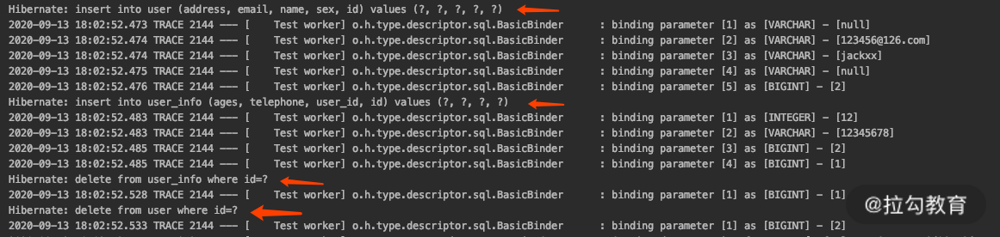
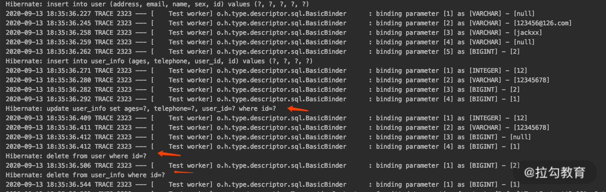

# SpringDataJPA 多表

## JPA 协议规定

@OneToOne 一般表示对象之间一对一的关联关系，它可以放在 field 上面，也可以放在 get/set 方法上面。

*   如果是配置双向关联，维护关联关系的是拥有外键的一方，而另一方必须配置 mappedBy
*   如果是单项关联，直接配置在拥有外键的一方即可。


## 一对一

### 案例介绍

举个例子：user 表是用户的主信息，user_info 是用户的扩展信息，两者之间是一对一的关系。


### 单向关联

user_info 表里面有一个 user_id 作为关联关系的外键，如果是单项关联，我们的写法如下：

```java
@Entity
@Data
@Builder
@AllArgsConstructor
@NoArgsConstructor
public class User {
   @Id
   @GeneratedValue(strategy= GenerationType.AUTO)
   private Long id;
   private String name;
   private String email;
   private String sex;
   private String address;
}
```

User 实体里面什么都没变化，不需要添加 @OneToOne 注解。我们只需要在拥有外键的一方配置就可以，所以 UserInfo 的代码如下：

```java
@Entity
@Data
@Builder
@AllArgsConstructor
@NoArgsConstructor
@ToString(exclude = "user")
public class UserInfo {
   @Id
   @GeneratedValue(strategy= GenerationType.AUTO)
   private Long id;
   private Integer ages;
   private String telephone;
   @OneToOne //维护user的外键关联关系，配置一对一
   private User user;
}
```

我们看到，UserInfo 实体对象里面添加了 @OneToOne 注解，这时我们写一个测试用例跑一下看看有什么效果：

```sql
create table user (id bigint not null, address varchar(255), email varchar(255), name varchar(255), sex varchar(255), primary key (id))
create table user_info (id bigint not null, ages integer, telephone varchar(255), user_id bigint, primary key (id))
alter table user_info add constraint FKn8pl63y4abe7n0ls6topbqjh2 foreign key (user_id) references user
```

因为我们新建了两个实体，跑任何一个 @SpringDataTest 就会看到上面有三个 sql 在执行，分别创建了两张表，而在 user_info 表上面还创建了一个外键索引。


### 双向关联

我们保持 UserInfo 不变，在 User 实体对象里面添加这一段代码即可。

```java
@OneToOne(mappedBy = "user")
private UserInfo userInfo;
```

完整的 User 实体对象就会变成如下模样。

```java
@Entity
@Data
@Builder
@AllArgsConstructor
@NoArgsConstructor
public class User {
   @Id
   @GeneratedValue(strategy= GenerationType.AUTO)
   private Long id;
   private String name;
   private String email;
   @OneToOne(mappedBy = "user")
   private UserInfo userInfo;//变化之处
   private String sex;
   private String address;
}
```

我们跑任何一个测试用例，就会看到运行结果是一样的，还是上面三条 sql。那么我们再查看一下 @OneToOne 源码，看看其支持的配置都有哪些。


### OneToOne 源码解读

```java
public @interface OneToOne {
    //表示关系目标实体，默认该注解标识的返回值的类型的类。
    Class targetEntity() default void.class;
    //cascade 级联操作策略，就是我们常说的级联操作
    CascadeType[] cascade() default {};
    //数据获取方式EAGER(立即加载)/LAZY(延迟加载)
    FetchType fetch() default EAGER;
    //是否允许为空，默认是可选的，也就表示可以为空；
    boolean optional() default true;
    //关联关系被谁维护的一方对象里面的属性名字。 双向关联的时候必填
    String mappedBy() default "";
    //当被标识的字段发生删除或者置空操作之后，是否同步到关联关系的一方，即进行通过删除操作，默认flase，注意与CascadeType.REMOVE 级联删除的区别
    boolean orphanRemoval() default false;
}
```


### mappedBy 注意事项 🔥

只有关联关系的**维护方**才能**操作两个实体之间外键**的关系。**被维护方即使设置了维护方属性进行存储也不会更新外键关联**。

mappedBy 不能与 @JoinColumn 或者 @JoinTable 同时使用，因为没有意义，关联关系不在这里面维护。

此外，**mappedBy 的值**是指**另一方的实体里面属性的字段**，而不是数据库字段，也不是实体的对象的名字。也就是维护关联关系的一方属性字段名称，**或者加了 @JoinColumn / @JoinTable 注解的属性字段名称**。如上面的 User 例子 user 里面 mappedBy 的值，就是 UserInfo 里面的 user 字段的名字。


### CascadeType用法

在 CascadeType 的用法中，CascadeType 的枚举值只有五个，分别如下：

1.  CascadeType.PERSIST 级联新建
2.  CascadeType.REMOVE 级联删除
3.  CascadeType.REFRESH 级联刷新
4.  CascadeType.MERGE 级联更新
5.  CascadeType.ALL 四项全选

其中，默认是没有级联操作的，关系表不会产生任何影响。此外，JPA 2.0 还新增了 CascadeType.DETACH，即级联实体到 Detach 状态。

了解了枚举值，下面我们来测试一下级联新建和级联删除。

首先，修改 UserInfo 里面的关键代码如下，并在 @OneToOne 上面添加

`cascade ={CascadeType.PERSIST,CascadeType.REMOVE}`

```java
@DataJpaTest
// DataJpaTest、MybatisTest 会默认使用其测试数据源替代，若要使用自己配置的，需要添加如下注解
@AutoConfigureTestDatabase(replace = AutoConfigureTestDatabase.Replace.NONE)
public class One2OneTest {

    @Autowired
    private UserInfoRepository userInfoRepository;


    @Test
    @Rollback(false)
    public void testUserRelationships() throws JsonProcessingException {
        User user = User.builder().name("jackxx").email("123456@126.com").build();
        UserInfo userInfo = UserInfo.builder().ages(12).user(user).telephone("12345678").build();
        //保存userInfo的同上也会保存User信息
        userInfoRepository.saveAndFlush(userInfo);
        //删除userInfo，同时也会级联的删除user记录
        userInfoRepository.delete(userInfo);
    }
}
```

最后，运行一下看看效果。



上面的测试在执行了 insert 的时候，会执行两条 insert 的sql 和两条 delete 的 sql，这就体现出了 CascadeType.PERSIST 和 CascadeType.REMOVE 的作用。

上面讲了**级联删除**的场景，下面我们再说一下**关联关系的删除场景**该怎么做。


### orphanRemoval 属性用法

**orphanRemoval 表示当关联关系被删除**的时候，**是否应用级联删除**，默认 false。什么意思呢？测试一下你就会明白。

首先，还沿用上面的例子，当我们删除 userInfo 的时候，把 User 置空，作如下改动。

```java
userInfo.setUser(null);
userInfoRepository.delete(userInfo);
```

其次，我们再运行测试，看看效果。

```
delete from user_info where id=?
```

这时候你就会发现，少了一条删除 user 的 sql，说明没有进行级联删除。那我们再把 UserInfo 做一下调整。

```java
public class UserInfo {
   @OneToOne(cascade = {CascadeType.PERSIST},orphanRemoval = true)
   private User user;
   //....其他没变的代码省了
}
```

然后，我们把 CascadeType.Remove 删除了，不让它进行级联删除，但是我们把 orphanRemoval 设置成 true，即当关联关系变化的时候级联更新。我们看下完整的测试用例。

```java
    @Test
    public void testUserRelationships() throws JsonProcessingException {
        User user = User.builder().name("jackxx").email("123456@126.com").build();
        UserInfo userInfo = UserInfo.builder().ages(12).user(user).telephone("12345678").build();
        userInfoRepository.saveAndFlush(userInfo);
        userInfo.setAges(13);
        userInfo.setUser(null);//还是通过这个设置user数据为空
        userInfoRepository.delete(userInfo);
}
```

这个时候我们看一下运行结果。



可以看到，结果依然是两个 inser 和两个 delete，但是中间多了一个 update。我来解释一下，因为去掉了 CascadeType.REMOVE，这个时候不会进行级联删除了。当我们把 user 对象更新成空的时候，就会执行一条 update 语句把关联关系去掉了。

而为什么又出现了级联删除 user 呢？因为我们修改了集合关联关系，orphanRemoval 设置为 true，所以又执行了级联删除的操作。这一点你可以仔细体会一下 orphanRemoval 和 CascadeType.REMOVE 的区别。

到这里，@OneToOne 关联关系介绍完了，接下来我们看一下日常工作常见的场景，先看场景一：主键和外键都是同一个字段的情况。


### 主键和外键都是同一个字段

我们假设 user 表是主表，user_info 的主键是 user_id，并且 user_id=user 表里面的 id，那我们应该怎么写？

继续沿用上面的例子，User 实体不变，我们看看 UserInfo 变成什么样了。

```java
public class UserInfo implements Serializable {
   @Id
   private Long userId;
   private Integer ages;
   private String telephone;
   @MapsId
   @OneToOne(cascade = {CascadeType.PERSIST},orphanRemoval = true)
   private User user;
}
```

这里的做法很简单，我们直接把 userId 设置为主键，在 @OneToOne 上面添加 @MapsId 注解即可。**@MapsId 注解的作用是把关联关系实体里面的 ID（默认）值 copy 到 @MapsId 标注的字段上面**（这里指的是 user_id 字段）。

接着，上面的测试用例我们跑一下，看一下效果。

```sql
create table user (id bigint not null, address varchar(255), email varchar(255), name varchar(255), sex varchar(255), primary key (id))
create table user_info (ages integer, telephone varchar(255), user_id bigint not null, primary key (user_id))
alter table user_info add constraint FKn8pl63y4abe7n0ls6topbqjh2 foreign key (user_id) references user
```

在启动的时候，我们直接创建了 user 表和 user_info 表，其中 user_info 的主键是 user_id，并且通过外键关联到了 user 表的 ID 字段，那么我们同时看一下 inser 的 sql，也发生了变化。

```sql
insert into user (address, email, name, sex, id) values (?, ?, ?, ?, ?)
insert into user_info (ages, telephone, user_id) values (?, ?, ?)
```

上面就是我们讲的实战场景一，主键和外键都是同一个字段。接下来我们再说一个场景，就是在查 user_info 的时候，我们只想知道 user_id 的值就行了，不需要查 user 的其他信息，具体我们应该怎么做呢？


### @OneToOne 延迟加载，我们只需要 ID 值

在 @OneToOne 延迟加载的情况下，我们假设只想查下 user_id，而不想查看 user 表其他的信息，因为当前用不到，可以有以下几种做法。

第一种做法：还是 User 实体不变，我们改一下 UserInfo 对象，如下所示：

```java
@Entity
@Data
@Builder
@AllArgsConstructor
@NoArgsConstructor
@ToString(exclude = "user")
public class UserInfo{
   @Id
   @GeneratedValue(strategy= GenerationType.AUTO)
   private Long id;
   private Integer ages;
   private String telephone;
   @MapsId
   @OneToOne(cascade = {CascadeType.PERSIST},orphanRemoval = true,fetch = FetchType.LAZY)
   private User user;
}
```

从上面这段代码中，可以看到做的更改如下：

-   id 字段我们先用原来的
-   @OneToOne 上面我们添加 @MapsId 注解
-   @OneToOne 里面的 fetch = FetchType.LAZY 设置延迟加载（默认）

接着，我们改造一下测试类，完整代码如下：

```java
@DataJpaTest
@TestInstance(TestInstance.Lifecycle.PER_CLASS)
public class UserInfoRepositoryTest {
    @Autowired
    private UserInfoRepository userInfoRepository;
    @BeforeAll
    @Rollback(false)
    @Transactional
    void init() {
        User user = User.builder().name("jackxx").email("123456@126.com").build();
        UserInfo userInfo = UserInfo.builder().ages(12).user(user).telephone("12345678").build();
        userInfoRepository.saveAndFlush(userInfo);
    }
    /**
     * 测试用User关联关系操作
     *
     * @throws JsonProcessingException
     */
    @Test
    @Rollback(false)
    public void testUserRelationships() throws JsonProcessingException {
        UserInfo userInfo1 = userInfoRepository.getOne(1L);
        System.out.println(userInfo1);
        System.out.println(userInfo1.getUser().getId());
}
```

然后，我们跑一下测试用例，看看测试结果。

```sql
insert into user (address, email, name, sex, id) values (?, ?, ?, ?, ?)
insert into user (address, email, name, sex, id) values (?, ?, ?, ?, ?)

-- 两条inser照旧，而只有一个select
select userinfo0_.user_id as user_id3_6_0_, userinfo0_.ages as ages1_6_0_, userinfo0_.telephone as telephon2_6_0_ from user_info userinfo0_ where userinfo0_.user_id=?
```

最后你会发现，打印的结果符合预期。

```
UserInfo(id=1, ages=12, telephone=12345678)
1
```

接下来介绍第二种做法，这种做法很简单，只要在 UserInfo 对象里面直接去掉 @OneToOne 关联关系，新增下面的字段即可。

```java
@Column(name = "user_id")
private Long userId;
```

这就没有关联关系了


第三做法是利用 Hibernate，它给我们提供了一种字节码增强技术，通过编译器改变 class 解决了延迟加载问题。这种方式有点复杂，需要在编译器引入 hibernateEnhance 的相关 jar 包，以及编译器需要改变 class 文件并添加 lazy 代理来解决延迟加载。我不太推荐这种方式，因为太复杂，你知道有这回事就行了。

以上我们掌握了这么多用法，那么最佳实践是什么？双向关联更好还是单向关联更好？根据最近几年的应用，我总结出了一些最佳实践，我们来看一下。


### @OneToOne 的最佳实践

**第一，我要说一种 Java 面向对象的设计原则：开闭原则。**

即对扩展开放，对修改关闭。**如果我们一直使用双向关联，两个实体的对象耦合太严重了**。想象一下，随着业务的发展，User 对象可能是原始对象，**围绕着 User 可能会扩展出各种关联对象**。**难道 User 里面每次都要修改，去添加双向关联关系吗**？肯定不是，否则时间长了，对象与对象之间的关联关系就是一团乱麻。

所以，我们**尽量、甚至不要用双向关联，如果非要用关联关系的话，只用单向关联就够了**。双向关联正是 JPA 的强大之处，但同时也是问题最多，最被人诟病之处。所以我们要用它的优点，而不是学会了就一定要使用。

**第二，我想说 CascadeType 很强大，但是我也建议保持默认。**

即没有级联更新动作，没有级联删除动作。还有 orphanRemoval 也要尽量保持默认 false，不做级联删除。因为这两个功能很强大，但是我个人觉得这违背了面向对象设计原则里面的“职责单一原则”，除非你非常非常熟悉，否则你在用的时候会时常感到惊讶——数据什么时间被更新了？数据被谁删除了？遇到这种问题查起来非常麻烦，因为是框架处理，有的时候并非预期的效果。

一旦生产数据被莫名更新或者删除，那是一件非常糟糕的事情。因为这些级联操作会使你的方法名字没办法命名，而且它不是跟着业务逻辑变化的，而是跟着实体变化的，这就会使方法和对象的职责不单一。

**第三，我想告诉你，所有用到关联关系的地方，能用 Lazy 的绝对不要用 EAGER，否则会有 SQL 性能问题，会出现不是预期的 SQL。**

以上三点是我总结的避坑指南，有经验的同学这时候会有个疑问：外键约束不是不推荐使用的吗？如果我的外键字段名不是约定的怎么办？别着急，我们再看一下 @JoinColumn 注解和 @JoinColumns 注解。


### @JoinCloumns & JoinColumn

这两个注解是集合关系，他们可以同时使用，@JoinColumn 表示单字段，@JoinCloumns 表示多个 @JoinColumn，我们来一一看一下。

我们还是先直接看一下 @JoinColumn 源码，了解下这一注解都有哪些配置项。

```java
public @interface JoinColumn {
    //关键的字段名,默认注解上的字段名，在@OneToOne代表本表的外键字段名字；
    String name() default "";
    //与name相反关联对象的字段，默认主键字段
    String referencedColumnName() default "";
    //外键字段是否唯一
    boolean unique() default false;
    //外键字段是否允许为空
    boolean nullable() default true;
    //是否跟随一起新增
    boolean insertable() default true;
    //是否跟随一起更新
    boolean updatable() default true;
    //JPA2.1新增，外键策略
    ForeignKey foreignKey() default @ForeignKey(PROVIDER_DEFAULT);
}
```

其次，我们看一下 @ForeignKey(PROVIDER_DEFAULT) 里面枚举值有几个。

```java
public enum ConstraintMode {
    //创建外键约束
   CONSTRAINT,
    //不创建外键约束
   NO_CONSTRAINT,
   //采用默认行为
   PROVIDER_DEFAULT
}
```

然后，我们看看这个注解的语法，就可以解答我们上面的两个问题。修改一下 UserInfo，如下所示：

```java
public class UserInfo{
    @Id
    @GeneratedValue(strategy= GenerationType.AUTO)
    private Long id;
    private Integer ages;
    private String telephone;
    @OneToOne(cascade = {CascadeType.PERSIST},orphanRemoval = true,fetch = FetchType.LAZY)
    @JoinColumn(foreignKey = @ForeignKey(ConstraintMode.NO_CONSTRAINT),name = "my_user_id")
    private User user;
    //...其他不变
}
```

可以看到，我们在其中指定了字段的名字：my_user_id，并且指定 NO_CONSTRAINT 不生成外键。而测试用例不变，我们看下运行结果。

```sql
create table user (id bigint not null, address varchar(255), email varchar(255), name varchar(255), sex varchar(255), primary key (id))
create table user_info (id bigint not null, ages integer, telephone varchar(255), my_user_id bigint, primary key (id))
```

这时我们看到 user_info 表里面新增了一个字段 my_user_id，insert 的时候也能正确 inser my_user_id 的值等于 user.id。

```sql
insert into user_info (ages, telephone, my_user_id, id) values (?, ?, ?, ?)
```

而 @JoinColumns 是 JoinColumns 的复数形式，就是通过两个字段进行的外键关联，这个不常用，我们看一个 demo 了解一下就好。

```java
@Entity
public class CompanyOffice {
   @ManyToOne(fetch = FetchType.LAZY)
   @JoinColumns({
         @JoinColumn(name="ADDR_ID", referencedColumnName="ID"),
         @JoinColumn(name="ADDR_ZIP", referencedColumnName="ZIP")
   })
   private Address address;
}
```

上面的实例中，CompanyOffice 通过 ADDR_ID 和 ADDR_ZIP 两个字段对应一条 address 信息，解释了一下@JoinColumns的用法。

如果你了解了 @OneToOne 的详细用法，后面要讲的几个注解就很好理解了，因为他们有点类似，那么我们接下来看看 @ManyToOne 和 @OneToMany 的用法。


## 一对多

### JPA 协议

*   维护关联关系的是拥有外键的一方，而另一方必须配置 mappedBy


### 案例介绍

客户和联系人的案例（注意，客户和联系人是属于同一公司的）

-   客户：买了商品的一家公司
-   联系人：买了商品的这家公司的员工（可有多个）

一对多关系，一个客户可以具有多个联系人，一个联系人从属于一家公司


### 分析步骤

1.  明确表关系：一对多关系
2.  确定表关系（外键）
    -   **主表**：客户表
    -   **从表**：联系人表，在从表添加**外键**
3.  编写实体类，再实体类中描述表关系（**组合**）
    -   客户：再客户的实体类中包含一个联系人的集合
    -   联系人：在联系人的实体类中包含一个客户的对象
4.  配置映射关系
    -   使用 **JPA 注解配置一对多映射关系**


### @OneToMany & @ManyToOne

@ManyToOne 代表多对一的关联关系，而 @OneToMany 代表一对多，一般两个成对使用表示双向关联关系。而 JPA 协议中也是明确规定：**维护关联关系的是拥有外键的一方（从表），而另一方（主表）必须配置 mappedBy**。体会不到看下面的实战及问题分析即可明了。

看下面的源码。

```java
public @interface ManyToOne {

    Class targetEntity() default void.class;

    CascadeType[] cascade() default {};

    FetchType fetch() default EAGER;

    boolean optional() default true;

}

 public @interface OneToMany {

    Class targetEntity() default void.class;

 	//cascade 级联操作策略：(CascadeType.PERSIST、CascadeType.REMOVE、CascadeType.REFRESH、CascadeType.MERGE、CascadeType.ALL) 如果不填，默认关系表不会产生任何影响。
    CascadeType[] cascade() default {};

	//数据获取方式EAGER(立即加载)/LAZY(延迟加载)
    FetchType fetch() default LAZY;

    //关系被谁维护，单项的。注意：只有关系维护方才能操作两者的关系。
    String mappedBy() default "";

	//是否级联删除。和CascadeType.REMOVE的效果一样。两种配置了一个就会自动级联删除
    boolean orphanRemoval() default false;

}
```

我们看到上面的字段和 @OneToOne 里面的基本一样，用法是一样的，不过需要注意以下几点：

1.  @ManyToOne 一定是维护外键关系的一方，所以没有 mappedBy 字段；
2.  @ManyToOne 删除的时候一定不能把 One 的一方删除了，所以也没有 orphanRemoval 的选项；
3.  @ManyToOne 的 Lazy 效果和 @OneToOne 的一样，所以和上面的用法基本一致；
4.  @OneToMany 的 Lazy 是有效果的。


### 实战：保存

实体类如下，目前配置了**双向关联**（@OneToMany、@ManyToOne），**且主从表都可以维护外键（不推荐）**

```java
@Getter
@Setter
@NoArgsConstructor
@AllArgsConstructor
@Builder
@Entity
public class Customer {


    /* 客户编号（主键）*/
    @Id
    @GeneratedValue(strategy = GenerationType.IDENTITY)
    private Long Id;

    /* 客户名称（公司名称） */
    private String name;

    /* 客户信息来源 */
    private String source;

    /* 客户所属行业 */
    private String industry;

    /* 客户级别 */
    private String level;

    /* 客户联系地址 */
    private String address;

    /* 客户联系电话 */
    private String phone;


    // 不推荐的配置，主表没有放弃维护外键
    @OneToMany
    @JoinColumn(name = "custId")
    private Set<LinkMan> linkManSet;
}
```

```java
@Getter
@Setter
@NoArgsConstructor
@AllArgsConstructor
@Builder
@Entity
public class LinkMan {

    /* 联系人编号(主键) */
    @Id
    @GeneratedValue(strategy = GenerationType.IDENTITY)
    private Long id;

    /* 联系人姓名 */
    private String name;

    /* 联系人性别 */
    private String gender;

    /* 联系人办公电话 */
    private String phone;

    /* 联系人手机 */
    private String mobile;

    /* 联系人邮箱 */
    private String email;

    /* 联系人职位 */
    private String position;

    /* 联系人备注 */
    private String remark;


    @ManyToOne
    @JoinColumn(name = "cust_id")
    private Customer customer;
}
```

测试

```java
@DataJpaTest
// DataJpaTest、MybatisTest 会默认使用其测试数据源替代，若要使用自己配置的，需要添加如下注解
@AutoConfigureTestDatabase(replace = AutoConfigureTestDatabase.Replace.NONE)
public class One2ManyTest {

    @Autowired
    private CustomerRepository customerRepository;

    @Autowired
    private LinkManRepository linkManRepository;


    /**
     * 主表放弃维护外键后该方法无法添加外键值
     */
    @Test
    @Rollback(false)
    @Transactional
    void testSave() {
        Customer customer = Customer.builder().name("腾讯").linkManSet(new HashSet<>()).build();

        LinkMan linkMan = LinkMan.builder().name("小马").build();

        // 双向关联，主表维护外键
        customer.getLinkManSet().add(linkMan);

        customerRepository.save(customer);
        linkManRepository.save(linkMan);
        // 保存外键时没有直接 insert 而是2条 insert 后执行了 update！

    }

    /**
     * 推荐使用的方式
     */
    @Test
    @Rollback(false)
    @Transactional
    void testSave2() {
        Customer customer = Customer.builder().name("腾讯").build();

        LinkMan linkMan = LinkMan.builder()
                .name("小马")
                .customer(customer)// 双向关联，从表维护外键
                .build();

        customerRepository.save(customer);
        linkManRepository.save(linkMan);
        // 保存外键时只用了2条 update！

    }

}
```


### 问题分析

testSave 自动生成的sql：

```sql
CREATE TABLE customer (
	id BIGINT NOT NULL auto_increment,
	address VARCHAR ( 255 ),
	industry VARCHAR ( 255 ),
	LEVEL VARCHAR ( 255 ),
	NAME VARCHAR ( 255 ),
	phone VARCHAR ( 255 ),
source VARCHAR ( 255 ),
PRIMARY KEY ( id )) ENGINE = INNODB;

CREATE TABLE link_man (
	id BIGINT NOT NULL auto_increment,
	email VARCHAR ( 255 ),
	gender VARCHAR ( 255 ),
	mobile VARCHAR ( 255 ),
	NAME VARCHAR ( 255 ),
	phone VARCHAR ( 255 ),
	position VARCHAR ( 255 ),
	remark VARCHAR ( 255 ),
cust_id BIGINT,
PRIMARY KEY ( id )) ENGINE = INNODB;

-- 外键约束
alter table link_man add constraint FKd378jah5xd7bsqjolfsop35i foreign key (cust_id) references customer (id)

-- 保存
insert into customer (address, industry, level, name, phone, source) values (?, ?, ?, ?, ?, ?)
insert into link_man (cust_id, email, gender, mobile, name, phone, position, remark) values (?, ?, ?, ?, ?, ?, ?, ?)
update link_man set cust_id=? where id=?
```

可见，**目前生成的建表语句竟然有3条**，本应该只有2条！并且保存外键时**没有直接 insert 而是2条 insert 后执行了 update**！

因此该方式**不可取**（实际生产中建表可以不用管，但是对于保存操作就不应该用这么多条语句完成！）

testSave2 自动生成的sql：

```sql
CREATE TABLE customer (
	id BIGINT NOT NULL auto_increment,
	address VARCHAR ( 255 ),
	industry VARCHAR ( 255 ),
	LEVEL VARCHAR ( 255 ),
	NAME VARCHAR ( 255 ),
	phone VARCHAR ( 255 ),
source VARCHAR ( 255 ),
PRIMARY KEY ( id )) ENGINE = INNODB;

CREATE TABLE link_man (
	id BIGINT NOT NULL auto_increment,
	email VARCHAR ( 255 ),
	gender VARCHAR ( 255 ),
	mobile VARCHAR ( 255 ),
	NAME VARCHAR ( 255 ),
	phone VARCHAR ( 255 ),
	position VARCHAR ( 255 ),
	remark VARCHAR ( 255 ),
cust_id BIGINT,
PRIMARY KEY ( id )) ENGINE = INNODB;

-- 外键约束
alter table link_man add constraint FKd378jah5xd7bsqjolfsop35i foreign key (cust_id) references customer (id)

-- 保存
insert into customer (address, industry, level, name, phone, source) values (?, ?, ?, ?, ?, ?)
insert into link_man (cust_id, email, gender, mobile, name, phone, position, remark) values (?, ?, ?, ?, ?, ?, ?, ?)
```

可见，**目前生成的建表语句竟然有3条**，本应该只有2条！但是保存外键时**只用了2条 update**！所以推荐！


### 改进：主表放弃外键维护

```java
@Data
@NoArgsConstructor
@AllArgsConstructor
@Builder
@Entity
public class Customer {


    /* 客户编号（主键）*/
    @Id
    @GeneratedValue(strategy = GenerationType.IDENTITY)
    private Long Id;

    /* 客户名称（公司名称） */
    private String name;

    /* 客户信息来源 */
    private String source;

    /* 客户所属行业 */
    private String industry;

    /* 客户级别 */
    private String level;

    /* 客户联系地址 */
    private String address;

    /* 客户联系电话 */
    private String phone;


    // 主表应该放弃对外键的维护
    // @OneToMany
    // @JoinColumn(name = "custId")
    // private Set<LinkMan> linkManSet;

    @OneToMany(mappedBy = "customer")
    private Set<LinkMan> linkManSet;
}
```

其余不变，但是注意测试方法只有testSave2可以添加外键值了！因为只有从表才能维护外键了


### 实战：级联 ☠️

**删除从表**数据：可以随时任意删除

**删除主表**数据：

-   没有从表数据引用：随便删
-   有从表数据：
    -   在默认情况下，它会把外键字段置为null，然后删除主表数据。如果在数据库的表结构上，外键字段有非空约束，默认情况就会报错了
    -   如果配置了放弃维护关联关系的权利，则不能删除（与外键字段是否允许为null，没有关系）因为在删除时，它根本不会去更新从表的外键字段了
    -   如果还想删除，使用级联删除引用。在实际开发中，级联删除请慎用！(在一对多的情况下)

**级联**：操作一个对象的同时操作他的关联对象

-   级联操作： 1.需要**区分操作主体** 2.需要在操作主体的实体类上（主表或维护表），添加级联属性`cascade`（需要添加到多表映射关系的注解上）
-   级联添加，案例：当我保存一个客户的同时保存联系人（在代码中只需保存客户！）
-   级联删除，案例：当我删除一个客户的同时删除此客户的所有联系人，有中间表会先删除中间表（在代码中只需删除客户！）
-   级联更新，略


**默认是不进行级联操作**，需要在**操作主表配置（一般配置在主表，虽然从表也可以配置）**如下注解：

```java
@Getter
@Setter
@NoArgsConstructor
@AllArgsConstructor
@Builder
@Entity
public class Customer {


    /* 客户编号（主键）*/
    @Id
    @GeneratedValue(strategy = GenerationType.IDENTITY)
    private Long Id;

    /* 客户名称（公司名称） */
    private String name;

    /* 客户信息来源 */
    private String source;

    /* 客户所属行业 */
    private String industry;

    /* 客户级别 */
    private String level;

    /* 客户联系地址 */
    private String address;

    /* 客户联系电话 */
    private String phone;

    // 可以单独配置级联保存、删除，还可以配置更新等操作，也可以直接配置全部
    @OneToMany(mappedBy = "customer", cascade =CascadeType.ALL)
    private Set<LinkMan> linkManSet;
}
```

测试

```java
@DataJpaTest
// DataJpaTest、MybatisTest 会默认使用其测试数据源替代，若要使用自己配置的，需要添加如下注解
@AutoConfigureTestDatabase(replace = AutoConfigureTestDatabase.Replace.NONE)
public class One2ManyTest {

    @Autowired
    private CustomerRepository customerRepository;

    @Autowired
    private LinkManRepository linkManRepository;

    /**
     * 级联添加，保存一个客户的同时保存联系人
     */
    @Test
    @Rollback(false)
    @Transactional
    void testCascadeSave() {
        Customer customer = Customer.builder().name("腾讯").linkManSet(new HashSet<>()).build();

        LinkMan linkMan = LinkMan.builder()
                .name("小马")
                .customer(customer)// 双向关联，从表维护外键（这个是维护外键的，和级联没有关系！！！）
                .build();

        customer.getLinkManSet().add(linkMan);

        customerRepository.save(customer);
    }
    
    /**
     * 级联删除，删除一个客户的同时删除此客户的所有联系人。执行删除前记得把 ddl-auto 改为 update
     */
    @Test
    @Rollback(false)
    @Transactional
    void testCascadeRemove() {
        customerRepository.deleteById(1L);
    }

}
```

级联保存的sql

```sql
Hibernate: insert into customer (address, industry, level, name, phone, source) values (?, ?, ?, ?, ?, ?)
Hibernate: insert into link_man (cust_id, email, gender, mobile, name, phone, position, remark) values (?, ?, ?, ?, ?, ?, ?, ?)
```

级联删除的sql

```sql
Hibernate: select customer0_.id as id1_1_0_, customer0_.address as address2_1_0_, customer0_.industry as industry3_1_0_, customer0_.level as level4_1_0_, customer0_.name as name5_1_0_, customer0_.phone as phone6_1_0_, customer0_.source as source7_1_0_ from customer customer0_ where customer0_.id=?
Hibernate: select linkmanset0_.cust_id as cust_id9_2_0_, linkmanset0_.id as id1_2_0_, linkmanset0_.id as id1_2_1_, linkmanset0_.cust_id as cust_id9_2_1_, linkmanset0_.email as email2_2_1_, linkmanset0_.gender as gender3_2_1_, linkmanset0_.mobile as mobile4_2_1_, linkmanset0_.name as name5_2_1_, linkmanset0_.phone as phone6_2_1_, linkmanset0_.position as position7_2_1_, linkmanset0_.remark as remark8_2_1_ from link_man linkmanset0_ where linkmanset0_.cust_id=?
Hibernate: delete from link_man where id=?
Hibernate: delete from customer where id=?
```


### 最佳实践 🔥

配置并使用多的一方维护关联关系（外键），保存时直接对外键赋值；配置并使用一的一方维护关联关系，还会执行1条update语句（多余！）。所以 JPA 协议有规定：

-   若配置**单向**关联，关联关系的维护直接**配置在拥有外键的一方（从表）**即可。拉勾课程推荐使用单向关联，不推荐双向关联，主表查询时使用 sql查询。
-   若配置**双向**关联，**维护关联关系的是拥有外键的一方（从表）**，而**另一方（主表）必须配置 mappedBy 放弃外键维护**；

**尽量避免双向关联，即只用一个注解@ManyToOne**。[JPA中的OneToMany和ManyToOne的最佳实践](http://www.wangzhenhua.rocks/zh-hans/java/jpa-one-to-many-many-to-one-best-practice)

一切级联更新和 orphanRemoval 都保持默认规则，并且 fetch 采用 lazy 延迟加载（也是默认规则）。

注意：**放弃外键维护和级联操作没有半点关系**


## 多对多

### 案例介绍

用户和角色（多对多关系），不用多逼逼了，就是 RBAC 模型


### 分析步骤

1.  明确表关系：一对多关系
2.  确定表关系（中间表）
3.  编写实体类，再实体类中描述表关系（**组合**）
    -   用户：包含角色的集合
    -   角色：包含用户的集合
4.  配置映射关系
    -   使用 **JPA 注解配置一对多映射关系**


### @ManyToMany


### 实战：保存、放弃外键维护

```java
@Getter
@Setter
@NoArgsConstructor
@AllArgsConstructor
@Builder
@Entity
public class SysUser {

    @Id
    @GeneratedValue(strategy = GenerationType.IDENTITY)
    private Long userId;
    private String userName;
    private Integer age;


    @ManyToMany
    @JoinTable(name = "sys_user_role",
            joinColumns = @JoinColumn(name = "user_id"),
            inverseJoinColumns = @JoinColumn(name = "role_id"))
    private Set<SysRole> roles;
}
```

```java
@Getter
@Setter
@NoArgsConstructor
@AllArgsConstructor
@Builder
@Entity
public class SysRole {

    @Id
    @GeneratedValue(strategy = GenerationType.IDENTITY)
    private Long roleId;
    private String roleName;

    // 放弃中间表维护权
    @ManyToMany(mappedBy = "roles")
    private Set<SysUser> users;
}
```

```java
public interface SysUserRepository extends JpaRepository<SysUser,Long>, JpaSpecificationExecutor<SysUser> {
}
```

```java
public interface SysRoleRepository extends JpaRepository<SysRole,Long>, JpaSpecificationExecutor<SysRole> {
}
```

测试

```java
@DataJpaTest
// DataJpaTest、MybatisTest 会默认使用其测试数据源替代，若要使用自己配置的，需要添加如下注解
@AutoConfigureTestDatabase(replace = AutoConfigureTestDatabase.Replace.NONE)
public class Many2ManyTest {

    @Autowired
    private SysUserRepository sysUserRepository;

    @Autowired
    private SysRoleRepository sysRoleRepository;


    /**
     * 保存一个用户、一个角色
     */
    @Test
    @Rollback(false)
    @Transactional
    void testSave() {

        SysUser sysUser = SysUser.builder().userName("conanan").roles(new HashSet<>()).build();

        SysRole sysRole = SysRole.builder().roleName("架构师").users(new HashSet<>()).build();

        // 配置用户到角色的关系，可以对中间表进行维护
        sysUser.getRoles().add(sysRole);
        // 配置角色到用户的关系，可以对中间表进行维护
        // sysRole.getUsers().add(sysUser);
        // 但是不能同时维护，因为联合主键不能重复！
        // 报错 Caused by: java.sql.SQLIntegrityConstraintViolationException: Duplicate entry '1-1' for key 'sys_user_role.PRIMARY'
        // 放弃被选择一方（如角色）的中间表维护权即可！

        sysUserRepository.save(sysUser);
        sysRoleRepository.save(sysRole);
    }
}
```

生成的sql：

```sql
create table sys_user_role (user_id bigint not null, role_id bigint not null, primary key (user_id, role_id)) engine=InnoDB
create table sys_role (role_id bigint not null auto_increment, role_name varchar(255), primary key (role_id)) engine=InnoDB
create table sys_user (user_id bigint not null auto_increment, age integer, user_name varchar(255), primary key (user_id)) engine=InnoDB

alter table sys_user_role add constraint FKhh52n8vd4ny9ff4x9fb8v65qx foreign key (role_id) references sys_role (role_id)
alter table sys_user_role add constraint FKb40xxfch70f5qnyfw8yme1n1s foreign key (user_id) references sys_user (user_id)

-- 保存
insert into sys_user (age, user_name) values (?, ?)
insert into sys_role (role_name) values (?)
insert into sys_user_role (user_id, role_id) values (?, ?)
```

可见，**目前生成的建表语句竟然有5条**，本应该只有3条！


### 实战：级联 ☠️

配置同一对多

```java
@Getter
@Setter
@NoArgsConstructor
@AllArgsConstructor
@Builder
@Entity
public class SysUser {

    @Id
    @GeneratedValue(strategy = GenerationType.IDENTITY)
    private Long userId;
    private String userName;
    private Integer age;


    @ManyToMany(cascade = CascadeType.ALL)
    @JoinTable(name = "sys_user_role",
            joinColumns = @JoinColumn(name = "user_id"),
            inverseJoinColumns = @JoinColumn(name = "role_id"))
    private Set<SysRole> roles;
}
```

测试

```java
@DataJpaTest
// DataJpaTest、MybatisTest 会默认使用其测试数据源替代，若要使用自己配置的，需要添加如下注解
@AutoConfigureTestDatabase(replace = AutoConfigureTestDatabase.Replace.NONE)
public class Many2ManyTest {

    @Autowired
    private SysUserRepository sysUserRepository;

    @Autowired
    private SysRoleRepository sysRoleRepository;


    /**
     * 保存一个用户、一个角色
     */
    @Test
    @Rollback(false)
    @Transactional
    void testSave() {

        SysUser sysUser = SysUser.builder().userName("conanan").roles(new HashSet<>()).build();

        SysRole sysRole = SysRole.builder().roleName("架构师").users(new HashSet<>()).build();

        // 配置用户到角色的关系，可以对中间表进行维护
        sysUser.getRoles().add(sysRole);
        // 配置角色到用户的关系，可以对中间表进行维护
        // sysRole.getUsers().add(sysUser);
        // 但是不能同时维护，因为联合主键不能重复！
        // 报错 Caused by: java.sql.SQLIntegrityConstraintViolationException: Duplicate entry '1-1' for key 'sys_user_role.PRIMARY'
        // 放弃被选择一方（如角色）的中间表维护权即可！

        sysUserRepository.save(sysUser);
        sysRoleRepository.save(sysRole);
    }


    /**
     * 测试级联添加（保存一个用户同时保存用户相关角色及中间表关联信息）
     */
    @Test
    @Rollback(false)
    @Transactional
    void testCascadeAdd() {

        SysUser sysUser = SysUser.builder().userName("conanan").roles(new HashSet<>()).build();


        Optional<SysRole> byId = sysRoleRepository.findById(5L);

        SysRole sysRole = SysRole.builder().roleId(5L).users(new HashSet<>()).build();

        // 配置用户到角色的关系，可以对中间表进行维护。若还配置了级联，则这里也维护了级联关系
        sysUser.getRoles().add(byId.orElse(new SysRole()));
        // 配置角色到用户的关系，可以对中间表进行维护
        // sysRole.getUsers().add(sysUser);
        // 但是不能同时维护，因为联合主键不能重复！
        // 报错 Caused by: java.sql.SQLIntegrityConstraintViolationException: Duplicate entry '1-1' for key 'sys_user_role.PRIMARY'
        // 放弃被选择一方（如角色）的中间表维护权即可！

        sysUserRepository.save(sysUser);
    }

    /**
     * 测试级联删除（删除一个用户同时删除中间表关联信息及用户相关角色）
     */
    @Test
    @Rollback(false)
    @Transactional
    void testCascadeRemove() {

        sysUserRepository.deleteById(5L);
    }
}
```

保存的sql

```sql
create table sys_user_role (user_id bigint not null, role_id bigint not null, primary key (user_id, role_id)) engine=InnoDB
create table sys_role (role_id bigint not null auto_increment, role_name varchar(255), primary key (role_id)) engine=InnoDB
create table sys_user (user_id bigint not null auto_increment, age integer, user_name varchar(255), primary key (user_id)) engine=InnoDB

alter table sys_user_role add constraint FKhh52n8vd4ny9ff4x9fb8v65qx foreign key (role_id) references sys_role (role_id)
alter table sys_user_role add constraint FKb40xxfch70f5qnyfw8yme1n1s foreign key (user_id) references sys_user (user_id)

-- 保存
insert into sys_user (age, user_name) values (?, ?)
insert into sys_role (role_name) values (?)
insert into sys_user_role (user_id, role_id) values (?, ?)
```

可见，**目前生成的建表语句竟然有5条**，本应该只有3条！其余的一模一样

级联删除的sql

```sql
select sysuser0_.user_id as user_id1_5_0_, sysuser0_.age as age2_5_0_, sysuser0_.user_name as user_nam3_5_0_ from sys_user sysuser0_ where sysuser0_.user_id=?
select roles0_.user_id as user_id1_3_0_, roles0_.role_id as role_id2_3_0_, sysrole1_.role_id as role_id1_4_1_, sysrole1_.role_name as role_nam2_4_1_ from sys_user_role roles0_ inner join sys_role sysrole1_ on roles0_.role_id=sysrole1_.role_id where roles0_.user_id=?
delete from sys_user_role where user_id=?
delete from sys_role where role_id=?
delete from sys_user where user_id=?
```

有可能删除报错！因为在删除中间表后，删除角色表时，该角色可能还被其他用户引用！


## 对象导航查询 🔥

对象导航查询是根据已经加载的对象，导航到他的关联对象。它利用类与类之间的关系来检索对象。例如：我们通过ID查询方式查出一个客户，可以调用Customer类中的getLinkMans()方法来获取该客户的所有联系人。对象导航查询的使用要求是：两个对象之间必须存在关联关系。

对象导航查询

-   **从一方查询多方：默认延迟加载**
-   **从多方查询一方：默认立即加载**

可以修改配置将其改为立即加载（不推荐！），**fetch配置在多表关系中主体（或一方或多方）的注解上**

一对多中的例子，无需任何修改

```java
@DataJpaTest
// DataJpaTest、MybatisTest 会默认使用其测试数据源替代，若要使用自己配置的，需要添加如下注解
@AutoConfigureTestDatabase(replace = AutoConfigureTestDatabase.Replace.NONE)
public class ObjectNavigationTest {

    @Autowired
    private CustomerRepository customerRepository;

    @Autowired
    private LinkManRepository linkManRepository;


    /**
     * 对象导航查询默认也是使用延迟加载，使用关联对象时才查询，仅仅.调用不会执行查询
     */
    @Test
    void testSelect1() {
        Customer customer = customerRepository.getOne(1L);
        Set<LinkMan> linkManSet = customer.getLinkManSet();
        System.out.println(linkManSet);// 此时才查询
    }
}
```

从一方查询多方：默认延迟加载

```sql
select * from customer customer0_ where customer0_.id=?
select * from link_man linkmanset0_ where linkmanset0_.cust_id=?
```

从多方查询一方：默认立即加载

```sql
SELECT 
 -- 略掉字段
 *
FROM
	link_man linkman0_
	LEFT OUTER JOIN customer customer1_ ON linkman0_.cust_id = customer1_.id 
WHERE
	linkman0_.id =?
```


## 未整理

[JPA中的OneToMany和ManyToOne的最佳实践](http://www.wangzhenhua.rocks/zh-hans/java/jpa-one-to-many-many-to-one-best-practice)，还有篇博客


太复杂了，JPA 变用边写吧。。。

