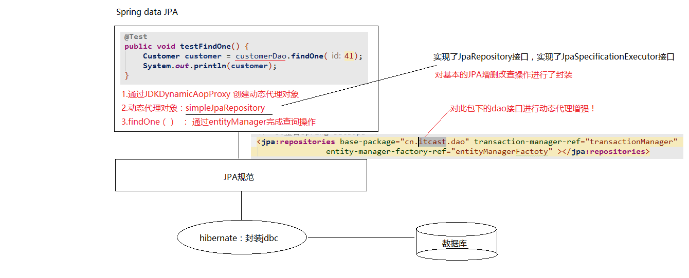

# CRUD 案例

## 常用注解 🔥

### `@Entity` 🔥

作用：指定当前类是**实体类**。

### `@Table` 🔥

作用：指定**实体类和表之间的对应关系**。

属性：

- `name`：指定数据库**表的名称**，不指定则为类名首字母小写，若是**多个单词则默认变为下划线连接**

### `@Id` 🔥

作用：指定当前字段是**主键**。

### `@GeneratedValue` 🔥

作用：指定**主键的生成策略**。

属性：

- `strategy` ：指定主键生成策略。JPA 提供的四种标准用法为`TABLE`,`SEQUENCE`,`IDENTITY`,`AUTO`。

    - `IDENTITY`：主键由数据库**自动生成**（主要是自动增长型，必须数据库底层支持，如 MySQL）

        ```java
        @Id
        @GeneratedValue(strategy = GenerationType.IDENTITY)
        private Long custId;
        ```

    - `SEQUENCE`：根据底层数据库的**序列**来生成主键，条件是数据库支持序列，如 Oracle。

        ```java
        @Id
        @GeneratedValue(strategy = GenerationType.SEQUENCE,generator="payablemoney_seq")
        @SequenceGenerator(name="payablemoney_seq", sequenceName="seq_payment")
        private Long custId;
        ```

        ```java
        //@SequenceGenerator源码中的定义
        @Target({TYPE, METHOD, FIELD})
        @Retention(RUNTIME)
        public @interface SequenceGenerator {
            //表示该表主键生成策略的名称，它被引用在@GeneratedValue中设置的“generator”值中
            String name();
            //属性表示生成策略用到的数据库序列名称。
            String sequenceName() default "";
            //表示主键初识值，默认为0
            int initialValue() default 0;
            //表示每次主键值增加的大小，例如设置1，则表示每次插入新记录后自动加1，默认为50
            int allocationSize() default 50;
        }
        ```

    - `AUTO`：主键由程序控制（测试了下使用的是 TABLE）

        ```java
        @Id
        @GeneratedValue(strategy = GenerationType.AUTO)
        private Long custId;
        ```

    - `TABLE`：使用一个特定的数据库表格来保存主键

        ```java
        @Id
        @GeneratedValue(strategy = GenerationType.TABLE, generator="payablemoney_gen")
        @TableGenerator(name = "pk_gen",
                        table="tb_generator",
                        pkColumnName="gen_name",
                        valueColumnName="gen_value",
                        pkColumnValue="PAYABLEMOENY_PK",
                        allocationSize=1
                       )
        private Long custId;
        ```

        ```java
        //@TableGenerator的定义：
        @Target({TYPE, METHOD, FIELD})
        @Retention(RUNTIME)
        public @interface TableGenerator {
            //表示该表主键生成策略的名称，它被引用在@GeneratedValue中设置的“generator”值中
            String name();
            //表示表生成策略所持久化的表名，例如，这里表使用的是数据库中的“tb_generator”。
            String table() default "";
            //catalog和schema具体指定表所在的目录名或是数据库名
            String catalog() default "";
            String schema() default "";
            //属性的值表示在持久化表中，该主键生成策略所对应键值的名称。例如在“tb_generator”中将“gen_name”作为主键的键值
            String pkColumnName() default "";
            //属性的值表示在持久化表中，该主键当前所生成的值，它的值将会随着每次创建累加。例如，在“tb_generator”中将“gen_value”作为主键的值
            String valueColumnName() default "";
            //属性的值表示在持久化表中，该生成策略所对应的主键。例如在“tb_generator”表中，将“gen_name”的值为“CUSTOMER_PK”。
            String pkColumnValue() default "";
            //表示主键初识值，默认为0。
            int initialValue() default 0;
            //表示每次主键值增加的大小，例如设置成1，则表示每次创建新记录后自动加1，默认为50。
            int allocationSize() default 50;
            UniqueConstraint[] uniqueConstraints() default {};
        }
        /*==================================================================*/
        //这里应用表tb_generator，定义为 ：
        CREATE TABLE  tb_generator (
            id NUMBER NOT NULL,
            gen_name VARCHAR2(255) NOT NULL,
            gen_value NUMBER NOT NULL,
            PRIMARY KEY(id)
        )
        ```


### `@Column` 🔥

作用：指定实体类属性和数据库表之间的对应关系

属性：

- `name`：指定数据库表的列名称。不指定则为属性名，若是**多个单词则默认变为下划线连接**
- `length`：长度
- `unique`：是否唯一
- `nullable`：是否可以为空
- `inserttable`：是否可以插入
- `updateable`：是否可以更新
- `columnDefinition`: 定义建表时创建此列的 DDL
- `secondaryTable`: 从表名。如果此列不建在主表上（默认建在主表），该属性定义该列所在从表的名字搭建开发环境[重点]


### `@Transient` 🔥

瞬态，即不会被映射到数据库表字段


### `@OneToMany`

建立一对多的关系映射

属性：

- `mappedBy`：🔥指定**在从表实体类中引用主表对象的名称**，一般用于**主表放弃外键维护**或**被维护表放弃维护中间表**
- **`fetch`**：指定是否采用**延迟加载**，枚举类`FetchType`
    - `LAZY`（**默认**），`EAGER`
- **`cascade`**：指定要使用的**级联**操作，枚举类`CascadeType`
    - `ALL`，`PERSIST`，`MERGE`，`REMOVE`，`REFRESH`，`DETACH`；
- `orphanRemoval`：是否使用孤儿删除，true；false（默认）
- `targetEntity`：指定多的多方的类的字节码，可省略会自动推倒


### `@ManyToOne`

建立多对一的关系

属性：

- `fetch`：指定是否采用**延迟**加载（同上）
- `cascade`：指定要使用的**级联**操作（同上）
- `optional`：关联是否可选。如果设置为 false，则必须始终存在非空关系。默认为 true
- `targetEntity`：指定一的一方实体类字节码，可省略会自动推导


### `@ManyToMany`

用于映射多对多关系

属性：

- `fetch`：指定是否采用**延迟**加载（同上）
- `cascade`：指定要使用的**级联**操作（同上）
- `targetEntity`：配置目标的实体类。映射多对多的时候不用写。可省略会自动推导


### `@OneToOne`


### `@JoinColumn` 🔥

用于定义**主键字段和外键字段的对应关系**，主要用于**从表中定义外键的引用**

属性：

- `name`：指定**外键字段的名称**，不配置则根据被维护表中属性名和`referencedColumnName`组合
- `referencedColumnName`：指定**引用主表的主键字段名称**
- `unique`：是否唯一。默认 false
- `nullable`：是否允许为空。默认 true。
- `insertable`：是否允许插入。默认 true。
- `updatable`：是否允许更新。默认 true。
- `columnDefinition`：列的定义信息。


### `@JoinTable`

针对**中间表的配置**，主要**用于维护表来设置**

属性：

- `name`：配置**中间表的名称**，不配置则自动根据维护表和被维护表的类名组合来生成
- `@joinColumns`：需要中间表的外键字段**关联当前实体类所对应表的主键字段**
- `@inverseJoinColumn`：需要中间表的外键字段**关联对方表的主键字段**


## 配置

### Maven 坐标导入

```xml
<dependency>
    <groupId>mysql</groupId>
    <artifactId>mysql-connector-java</artifactId>
    <scope>runtime</scope>
</dependency>
<dependency>
    <groupId>org.springframework.boot</groupId>
    <artifactId>spring-boot-starter-data-jpa</artifactId>
</dependency>
```


### 配置文件

```yml
spring:
  datasource:
    url: jdbc:mysql:///sleeve?characterEncoding=utf-8&serverTimezone=GMT%2B8
    username: root
    password: w111111
  jpa:
    hibernate:
      # 一般只推荐 update（但是修改字段也不会重新生成表）; create 会清空之前的表; create-drop 一般用在测试, 会话完成后清空表。
      # 其实也不推荐使用, 后续会置为 none
      ddl-auto: create-drop
    show-sql: true # 显示
```


## 建立 ORM 🔥

1. 创建客户的数据库表（不创建也行）

2. **在实体类上使用 JPA 注解的形式配置映射关系**

   所有的注解都是使用 JPA 的规范提供的注解，导入`javax.persistence`下注解包

   ```java
   @Entity
   @Table(name = "cst_customer")
   public class Customer {

       @Id
       @GeneratedValue(strategy = GenerationType.IDENTITY)
       @Column(name = "cust_id")
       private Long custId; //客户的主键

       @Column(name = "cust_name")
       private String custName;//客户名称

       @Column(name = "cust_source")
       private String custSource;//客户来源

       @Column(name = "cust_level")
       private String custLevel;//客户级别

       @Column(name = "cust_industry")
       private String custIndustry;//客户所属行业

       @Column(name = "cust_phone")
       private String custPhone;//客户的联系方式

       @Column(name = "cust_address")
       private String custAddress;//客户地址

       //getter setter
   }
   ```


## Repository 接口

别忘了接口之间是可以多继承的！！！

```java
/**
 * JpaRepository<实体类类型，主键类型>：用来完成基本CRUD操作
 * JpaSpecificationExecutor<实体类类型>：用于复杂查询（分页等查询操作）
 */
public interface CustomerDao extends JpaRepository<Customer,Long>, JpaSpecificationExecutor<Customer> {
}
```




## 基本CRUD和复杂查询

### 接口中的定义好的方法

> 以下是继承了JpaRepository接口后获得的

```java
@RunWith(SpringJUnit4ClassRunner.class)
@ContextConfiguration(locations = "classpath:applicationContext.xml")//locations可省略
public class CustomerDaoTest {

    @Autowired
    private CustomerDao customerDao;
    
    @Test
    public void testFindById() {
        Optional<Customer> optional = customerDao.findById(3L);
        System.out.println(optional.orElse(null));
    }
    

    /**
     * 根据ID查询（立即加载，底层调用find()方法）
     */
    @Test
    public void testFindOne() {
        Customer customer = customerDao.findOne(3L);
        System.out.println(customer);
    }

    /**
     * 根据ID查询（延迟加载，底层调用getReference()方法）
     * 返回的是动态代理对象；什么时候用，什么时候查询（IDEA需要去掉Debug中几个选项才可以看到）
     */
    @Test
    @Transactional
    public void testGetOne() {
        Customer customer = customerDao.getOne(3L);
        System.out.println(customer);
    }

    /**
     * 查询所有
     */
    @Test
    public void testFindAll() {
        List<Customer> customerList = customerDao.findAll();
        System.out.println(customerList);
    }

    /**
     * 保存或更新（！！！不要直接使用这个来更新，否则会将其他没有值的数据置null。）
     * 根据传递的对象是否包含主键ID，不包含则是保存；包含则是先根据ID查询数据，并更新
     *
     * 更新需要根据ID手动查找，然后修改再保存！！！
     */
    @Test
    public void testSave() {
        Customer customer = new Customer();
        customer.setCustName("黑马程序员");
        customer.setCustAddress("西安");
        customerDao.save(customer);
    }
    @Test
    public void testUpdate() {
        Customer customer = new Customer();
        customer.setCustId(8L);
        customer.setCustName("黑马程序员牛逼");
        customer.setCustAddress("西安");
        customer.setCustLevel("VIP");
        customerDao.save(customer);
    }

    /**
     * 根据ID删除（底层是先查询，若有再删除）
     */
    @Test
    public void testDelete() {
        customerDao.delete(8L);
    }

    /**
     * 统计查询
     */
    @Test
    public void testCount() {
        long count = customerDao.count();
        System.out.println(count);
    }

    /**
     * 根据ID判断是否存在该数据（可以根据查询的对象是否为null；或统计出的数量是否大于0（这里底层用的是这个））
     */
    @Test
    public void testExists() {
        boolean exists = customerDao.exists(7L);
        System.out.println(exists);
    }
}
```


### 方法名称规则查询

方法命名规则查询就是根据方法的名字，就能创建查询，是对JPQL更深层次封装。只需要按照Spring Data JPA提供的方法命名规则定义方法的名称，不需要配置JPQL语句就可以完成查询工作。Spring Data JPA在程序执行的时候会根据方法名称进行解析，并自动生成查询语句进行查询。

按照Spring Data JPA 定义的规则，查询方法以**`findBy`**开头，涉及条件查询时，**条件的属性用条件关键字连接**，要注意的是：条件**属性首字母需大写**。框架在进行方法名解析时，会先把方法名多余的前缀截取掉，然后对剩下部分进行解析。也可以**删除**。

会根据**先后顺序**传参！！名称无所谓

```java
public interface CustomerDao extends JpaRepository<Customer,Long>, JpaSpecificationExecutor<Customer> {
    /**
     * 方法名称查询（精准匹配）
     */
    Customer findByCustName(String custName);

    /**
     * 方法名称查询（like模糊匹配）
     */
    List<Customer> findByCustNameLike(String custName);

    /**
     * 方法名称查询（使用客户名称模糊匹配和客户行业精准匹配）
     */
    List<Customer> findByCustNameLikeAndCustIndustry(String custName,String custIndustry);
}

```

```java
@RunWith(SpringJUnit4ClassRunner.class)
@ContextConfiguration(locations = "classpath:applicationContext.xml")//locations可省略
public class JPQLTest {

    @Autowired
    private CustomerDao customerDao;

    /**
     * 测试方法命名查询
     */
    @Test
    public void testFindByCustName(){
        Customer customer = customerDao.findByCustName("传智播客6");
        System.out.println(customer);
    }

    /**
     * 测试方法命名查询（模糊匹配）
     */
    @Test
    public void testFindByCustNameLike(){
        List<Customer> customerList = customerDao.findByCustNameLike("传智%");
        System.out.println(customerList);
    }

    /**
     * 测试方法命名查询（使用客户名称模糊匹配和客户行业精准匹配）
     */
    @Test
    public void testFindByCustNameLikeAndCustIndustry(){
        List<Customer> customerList = customerDao.findByCustNameLikeAndCustIndustry("传智%","IT");
        System.out.println(customerList);
    }
}

```


具体的关键字，使用方法和生产成SQL如下表所示

|    **Keyword**    |                 **Sample**                 |                           **JPQL**                           |
| :---------------: | :----------------------------------------: | :----------------------------------------------------------: |
|        And        |         findByLastnameAndFirstname         |        …   where x.lastname = ?1 and x.firstname = ?2        |
|        Or         |         findByLastnameOrFirstname          |        …   where x.lastname = ?1 or x.firstname = ?2         |
|     Is,Equals     | findByFirstnameIs,   findByFirstnameEquals |                  …   where x.firstname = ?1                  |
|      Between      |           findByStartDateBetween           |           …   where x.startDate between ?1 and ?2            |
|     LessThan      |             findByAgeLessThan              |                     …   where x.age < ?1                     |
|   LessThanEqual   |           findByAgeLessThanEqual           |                     …   where x.age ⇐ ?1                     |
|    GreaterThan    |            findByAgeGreaterThan            |                     …   where x.age > ?1                     |
| GreaterThanEqual  |         findByAgeGreaterThanEqual          |                    …   where x.age >= ?1                     |
|       After       |            findByStartDateAfter            |                  …   where x.startDate > ?1                  |
|      Before       |           findByStartDateBefore            |                  …   where x.startDate < ?1                  |
|      IsNull       |              findByAgeIsNull               |                   …   where x.age is null                    |
| IsNotNull,NotNull |            findByAge(Is)NotNull            |                   …   where x.age not null                   |
|       Like        |            findByFirstnameLike             |                …   where x.firstname like ?1                 |
|      NotLike      |           findByFirstnameNotLike           |              … where   x.firstname not like ?1               |
|   StartingWith    |        findByFirstnameStartingWith         | …   where x.firstname like ?1 (parameter bound with appended %) |
|    EndingWith     |         findByFirstnameEndingWith          | …   where x.firstname like ?1 (parameter bound with prepended %) |
|    Containing     |         findByFirstnameContaining          | …   where x.firstname like ?1 (parameter bound wrapped in %) |
|      OrderBy      |        findByAgeOrderByLastnameDesc        |        …   where x.age = ?1 order by x.lastname desc         |
|        Not        |             findByLastnameNot              |                  …   where x.lastname <> ?1                  |
|        In         |        findByAgeIn(Collection ages)        |                    …   where x.age in ?1                     |
|       NotIn       |       findByAgeNotIn(Collection age)       |                  …   where x.age not in ?1                   |
|       TRUE        |             findByActiveTrue()             |                  …   where x.active = true                   |
|       FALSE       |            findByActiveFalse()             |                  …   where x.active = false                  |
|    IgnoreCase     |         findByFirstnameIgnoreCase          |           …   where UPPER(x.firstame) = UPPER(?1)            |


### JPQL 查询

- 特有的查询：需要在**Dao接口上配置方法**
- 在新添加的方法上，使用**`@Query`注解的形式配置JPQL查询语句**

```java
public interface CustomerDao extends JpaRepository<Customer,Long>, JpaSpecificationExecutor<Customer> {

    /**
     * 根据客户名称查询客户。使用JPQL查询
     * ?1代表参数的占位符，其中1对应方法中的参数索引
     */
    @Query("from Customer where custName = ?1")
    Customer findByName(String custName);

    /**
     * 根据客户名称和客户ID查询客户。使用JPQL查询
     * ?1代表参数的占位符，其中1对应方法中的参数索引。不指定则按照方法中参数位置对应
     */
    @Query("from Customer where custName = ?1 and custId=?2")
    Customer findByNameAndId(String custName,Long custId);


    /**
     * 根据ID更新客户名称。使用JPQL
     * ?1代表参数的占位符，其中1对应方法中的参数索引。不指定则按照方法中参数位置对应。“:参数名称“ 也可以当做占位符
     */
    @Query("update Customer set custName = ?1 where custId = ?2")
    @Modifying//代表是更新操作
    void updateNameById(String custName,Long custId);
}

```

```java
@RunWith(SpringJUnit4ClassRunner.class)
@ContextConfiguration(locations = "classpath:applicationContext.xml")//locations可省略
public class JPQLTest {

    @Autowired
    private CustomerDao customerDao;

    @Test
    public void testFindByName() {
        Customer customer = customerDao.findByName("传智播客6");
        System.out.println(customer);
    }

    @Test
    public void testFindByNameAndId() {
        Customer customer = customerDao.findByNameAndId("传智播客", 5L);
        System.out.println(customer);
    }

    /**
     * Spring Data JPA中使用JPQL完成 更新、删除操作需要手动添加事务，但默认执行后会回滚事务，需要添加注解设置为不回滚
     */
    @Test
    @Transactional
    @Rollback(value = false)
    public void testUpdateNameById() {
        customerDao.updateNameById("传智播客最牛逼", 5L);
    }
}

```


### SQL 语句查询

- 特有的查询：需要在**Dao接口上配置方法**
- 在新添加的方法上，使用**`@Query`注解的形式配置SQL查询语句**，还需设置`nativeQuery`属性

```java
public interface CustomerDao extends JpaRepository<Customer,Long>, JpaSpecificationExecutor<Customer> {
    /**
     * 使用SQL查询全部客户/模糊查询
     * nativeQuery：默认false为JPQL查询，true为SQL查询
     */
    //@Query(value = "select * from cst_customer", nativeQuery = true)
    @Query(value = "select * from cst_customer where cust_name like ?1", nativeQuery = true)
    List<Object[]> findBySQL(String name);
}

```

```java
@RunWith(SpringJUnit4ClassRunner.class)
@ContextConfiguration(locations = "classpath:applicationContext.xml")//locations可省略
public class JPQLTest {

    @Autowired
    private CustomerDao customerDao;
    @Test
    public void testFindBySQL() {
        List<Object[]> list = customerDao.findBySQL("传智播客%");
        for (Object[] obj : list) {
            System.out.println(Arrays.toString(obj));
        }
    }
}

```


### Specification 动态查询

> 以下是继承了JpaSpecificationExecutor接口后获得的

Spring Data JPA中可以通过`JpaSpecificationExecutor`接口查询。相比JPQL，其优势是类型安全，更加的面向对象。

- `T findOne(Specification<T> spec);`  //查询单个对象
- `List<T> findAll(Specification<T> spec);`  //查询列表
- `Page<T> findAll(Specification<T> spec, Pageable pageable);`
    - Pageable：分页参数
    - 返回值：Spring Data JPA提供的分页Bean
- `List<T> findAll(Specification<T> spec, Sort sort);`//排序查询
- `long count(Specification<T> spec);`//统计查询

对于`JpaSpecificationExecutor`，这个接口基本是围绕着`Specification`接口来定义的。我们可以简单的理解为，**`Specification`构造的就是查询条件**。

```java
/**
  *	root	：Root接口，代表查询的根对象，可以通过root获取实体中的属性
  *	query	：代表一个顶层查询对象，用来自定义查询（用的少，但是很强大）
  *	cb		：用来构建查询，此对象里有很多条件方法
  **/
public Predicate toPredicate(Root<T> root, CriteriaQuery<?> query, CriteriaBuilder cb);

```

```java
/**
 * 1.实现Specification接口（提供泛型：查询的对象类型）
 * 2.实现toPredicate方法（构造查询条件）
 * 3.需要借助方法参数中的两个参数（
 * root：获取需要查询的对象属性（不是数据库中字段名！！）
 * CriteriaBuilder：构造查询条件的，内部封装了很多的查询条件（模糊匹配，精准匹配）
 **/
@RunWith(SpringJUnit4ClassRunner.class)
@ContextConfiguration("classpath:applicationContext.xml")
public class SpecTest {

    @Autowired
    private CustomerDao customerDao;

    /**
     * 单条件查询，根据客户名称查询单个客户对象（equal）
     */
    @Test
    public void testFindOne1() {
        Specification<Customer> specification = new Specification<Customer>() {
            public Predicate toPredicate(Root<Customer> root, CriteriaQuery<?> criteriaQuery, CriteriaBuilder criteriaBuilder) {
                //1.获取比较的属性
                Path<Object> custName = root.get("custName");
                //2.构造查询条件
                //第1个参数为比较的属性（Path对象）；第2个参数为要比较的值
                return criteriaBuilder.equal(custName, "博学谷");
            }
        };
        Customer customer = customerDao.findOne(specification);
        System.out.println(customer);
    }

    /**
     * 多条件查询，根据客户名和客户所属行业查询单个客户（equal，and）
     */
    @Test
    public void testFindOne2() {

        Specification<Customer> specification = (root, criteriaQuery, criteriaBuilder) -> {
            Path<Object> custName = root.get("custName");
            Path<Object> custIndustry = root.get("custIndustry");

            Predicate predicate1 = criteriaBuilder.equal(custName, "传智播客");
            Predicate predicate2 = criteriaBuilder.equal(custIndustry, "IT");
            //组合谓词
            return criteriaBuilder.and(predicate1, predicate2);//还有or等等方法来组合
        };
        Customer customer = customerDao.findOne(specification);
        System.out.println(customer);
    }

    /**
     * 普通查询；排序查询；分页查询，根据客户名模糊匹配查询客户列表（like）；
     * equal ：直接的到path对象（属性），然后进行比较即可
     * gt，lt,ge,le,like : 得到Path对象，根据Path指定比较的参数类型，再去进行比较
     */
    @Test
    public void testFindAll1() {
        Specification<Customer> specification = ((root, criteriaQuery, criteriaBuilder) -> {
            Path<Object> custName = root.get("custName");
            return criteriaBuilder.like(custName.as(String.class), "%传智%");//或在获取Path时直接封装为String类型
        });
        //普通查询
        List<Customer> customerList1 = customerDao.findAll(specification);

        //排序查询
        //第一个参数：排序的顺序（倒序，正序）；第二个参数：排序的属性名称（不是字段名！）
        Sort sort = new Sort(Sort.Direction.DESC, "custId");
        List<Customer> customerList2 = customerDao.findAll(specification, sort);

        //分页查询
        Pageable pageable = PageRequest.of(0,2);//页码（从0开始），每页显示条数
        Page<Customer> customerPage = customerDao.findAll(specification, pageable);
        System.out.println("总记录数:" + customerPage.getTotalElements());
        System.out.println("总页数:" + customerPage.getTotalPages());
        System.out.println("分页查询的数据:" + customerPage.getContent());
    }


    /**
	 * Specification的多表查询
	 */
    @Test
    public void testFind() {
        Specification<LinkMan> specification = (root, criteriaQuery, criteriaBuilder) ->  {
                //Join代表链接查询，通过root对象获取
                //创建的过程中，第一个参数为关联对象的属性名称，第二个参数为连接查询的方式（inner，left，right）
                //JoinType.LEFT : 左外连接,JoinType.INNER：内连接,JoinType.RIGHT：右外连接
                Join<LinkMan, Customer> join = root.join("customer",JoinType.INNER);
                return criteriaBuilder.like(join.get("custName").as(String.class),"传智播客1");
            }
        };
        List<LinkMan> list = linkManDao.findAll(specification);
        for (LinkMan linkMan : list) {
            System.out.println(linkMan);
        }
    }
}

```

> 方法对应关系
>
> | 方法名称                    | Sql对应关系            |
> | --------------------------- | ---------------------- |
> | equle                       | filed =   value        |
> | gt（greaterThan ）          | filed   > value        |
> | lt（lessThan ）             | filed   < value        |
> | ge（greaterThanOrEqualTo ） | filed   >= value       |
> | le（ lessThanOrEqualTo）    | filed   <= value       |
> | notEqule                    | filed   != value       |
> | like                        | filed   like value     |
> | notLike                     | filed   not like value |


## 多表操作

在实际开发中，我们数据库的表难免会有相互的关联关系，在操作表的时候就有可能会涉及到多张表的操作。而在这种实现了ORM思想的框架中（如JPA），可以让我们通过操作实体类就实现对数据库表的操作。所以今天我们的学习重点是：掌握配置实体之间的关联关系。

- 第一步：首先确定两张表之间的关系。（如果关系确定错了，后面做的所有操作就都不可能正确。）
- 第二步：在数据库中实现两张表的关系
- 第三步：在实体类中描述出两个实体的关系
- 第四步：配置出实体类和数据库表的关系映射（重点）


### 一对多

案例：客户和联系人的案例（一对多关系，一个客户可以具有多个联系人，一个联系人从属于一家公司）

- 客户：一家公司
- 联系人：这家公司的员工

分析步骤：

1. 明确表关系：一对多关系
2. 确定表关系（外键）
    - **主表**：客户表
    - **从表**：联系人表，在从表添加**外键**
3. 编写实体类，再实体类中描述表关系（**包含关系**）
    - 客户：再客户的实体类中包含一个联系人的集合
    - 联系人：在联系人的实体类中包含一个客户的对象
4. 配置映射关系
    - 使用 **JPA 注解配置一对多映射关系**

```java
@Entity
@Table(name = "cst_customer")
public class Customer {

    @Id
    @GeneratedValue(strategy = GenerationType.IDENTITY)
    @Column(name = "cust_id")
    private Long custId; //客户的主键

    
    @OneToMany(mappedBy = "customer")//主表放弃维护外键
    private Set<LinkMan> linkMans = new HashSet<>();

    @Column(name = "cust_name")
    private String custName;//客户名称
    
    ...
}

```

```java
@Entity
@Table(name = "cst_linkman")
public class LinkMan implements Serializable {
    @Id
    @GeneratedValue(strategy = GenerationType.IDENTITY)
    @Column(name = "lkm_id")
    private Long lkmId;

    @ManyToOne
    @JoinColumn(name = "lkm_cust_id",referencedColumnName = "cust_id")
    private Customer customer;

    @Column(name = "lkm_name")
    private String lkmName;
    ...
}

```

------

```java
@RunWith(SpringJUnit4ClassRunner.class)
@ContextConfiguration("classpath:applicationContext.xml")
public class One2ManyTest {

    @Autowired
    private CustomerDao customerDao;

    @Autowired
    private LinkManDao linkManDao;

    @Test
    @Transactional//开启事务
    @Rollback(false)//不回滚
    public void testSave() {
        Customer customer = new Customer();
        customer.setCustName("腾讯");
        LinkMan linkMan = new LinkMan();
        linkMan.setLkmName("小马");

        customer.getLinkMans().add(linkMan);
        linkMan.setCustomer(customer);

        customerDao.save(customer);
        linkManDao.save(linkMan);
    }
    
    @Test
    @Transactional
    @Rollback(false)//设置为不回滚
    public void testDelete() {
        customerDao.delete(3L);
    }
}

```

**删除操作的说明如下**

- 删除从表数据：可以随时任意删除

- 删除主表数据：

    - 没有从表数据引用：随便删

    - 有从表数据：

        - 在默认情况下，它会把外键字段置为null，然后删除主表数据。如果在数据库的表结构上，外键字段有非空约束，默认情况就会报错了

        - 如果配置了放弃维护关联关系的权利，则不能删除（与外键字段是否允许为null，没有关系）因为在删除时，它根本不会去更新从表的外键字段了

        - 如果还想删除，使用级联删除引用（在实际开发中，级联删除请慎用！(在一对多的情况下)）

            

**级联**：操作一个对象的同时操作他的关联对象

- 级联操作：
    1.需要**区分操作主体**
    2.需要在操作主体的实体类上（主表或维护表），添加级联属性`cascade`（需要添加到多表映射关系的注解上）
- 级联添加，案例：当我保存一个客户的同时保存联系人（在代码中只需保存客户！）
- 级联删除，案例：当我删除一个客户的同时删除此客户的所有联系人，有中间表会先删除中间表（在代码中只需删除客户！）


### 多对多

案例：用户和角色（多对多关系）

分析步骤：

1. 明确表关系：多对多关系
2. 确定表关系（中间表）
3. 编写实体类，再实体类中描述表关系（**包含关系**）
    - 用户：包含角色的集合
    - 角色：包含用户的集合
4. 配置映射关系
    - 使用 **JPA 注解配置多对多映射关系**

```java
@Entity
@Table//不配置name则为类目首字母小写
public class User {

    @Id
    @GeneratedValue(strategy = GenerationType.IDENTITY)
    @Column//不配置字段名则为属性名
    private Long userId;

    @ManyToMany
    //维护中间表
    @JoinTable(
        name = "sys_user_role",
        //当前对象在中间表中的外键
        joinColumns = {@JoinColumn(name = "sys_user_id",referencedColumnName = "userId")},
        //对方对象在中间表中的外键
        inverseJoinColumns = {@JoinColumn(name = "sys_role_id",referencedColumnName = "roleId")}
    )
    private Set<Role> roles = new HashSet<>();
    ...
}

```

```java
@Entity
@Table
public class Role {
    @Id
    @GeneratedValue(strategy = GenerationType.IDENTITY)
    @Column
    private Long roleId;
    
    @ManyToMany(mappedBy = "roles")//被维护表放弃维护中间表！
    private Set<User> users = new HashSet<>();
    ...
}

```

其他删除/级联等同一对多，删除时会先删除中间表数据


### 对象导航查询

对象图导航检索方式是根据已经加载的对象，导航到他的关联对象。它利用类与类之间的关系来检索对象。例如：我们通过ID查询方式查出一个客户，可以调用Customer类中的getLinkMans()方法来获取该客户的所有联系人。对象导航查询的使用要求是：两个对象之间必须存在关联关系。

对象导航查询

- **从一方查询多方：默认延迟加载**
- **从多方查询一方：默认立即加载**

可以修改配置将其改为立即加载（不推荐！），**fetch配置在多表关系中主体（或一方或多方）的注解上**，查看3.3


### Specification 动态查询

如基本 CRUD 和复杂查询章节