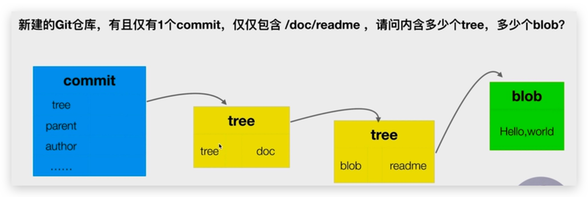

# Git

## 全量、增量方案

* 全量：每次存储当前完整信息。适合代码、文本等。Git 采用。
* 增量：第一次存储完整信息，后续只存储变化的信息。适合视频等大型二进制文件


## Git 如何识别文件差别

Git 采用文件的 SHA-1 值来区分文件内容是否被更改了。

SHA-1 和 MD5 都是 hash 函数。随人对文件内容进行 SHA-1 计算，有可能产生 hash 冲突，但是对于内容来说，概率十分小！并且还必须是存储在同一目录下的才能产生 hash 冲突！

Git 为了防止一个目录下存放过多的 SHA-1 文件，所以采用**截取 SHA-1 前2位（将其新建为目录名），后续保存为文件名**！所以完整的 SHA-1 应该是拼接起来的！

可以通过`git cat-file -t ace1ed8923df..`来查看该Hash的对象类型；`-p`查看内容；

对象类型有commit，tree，blob。Git 是一个**内容**寻址文件系统。Git 的核心部分是一个简单的键值对数据库（key-value data store），你可以向该数据库插入任意类型的内容，它会返回一个键值，通过该键值可以在任意时刻再次检索（retrieve）该内容。





## Git 简介

Git 和其它版本控制系统（包括 Subversion 和近似工具）的主要差别在于 Git 对待数据的方法。其它大部分系统以文件变更列表的方式存储信息。这类系统（CVS、Subversion、Perforce、Bazaar 等等）将它们保存的信息看作是一组基本文件和每个文件随时间逐步累积的差异。

Git 更像是把数据看作是对**小型文件系统的一组快照**。 每次你提交更新，或在 Git 中保存项目状态时，它主要对当时的全部文件制作一个快照并保存这个快照的索引。 为了高效，如果文件没有修改，Git 不再重新存储该文件，而是只保留一个链接指向之前存储的文件。 Git 对待数据更像是一个 **快照流**。


## 安装

官网有下载安装教程：https://git-scm.com/downloads，也可以使用homebrew安装。

利用`git —-version`查看安装的Git版本。


## 配置

三个作用域，缺省为`global`

* `git config --local`，只对某个仓库有效，比 global 优先级高（配置文件在.git/config下）

  * HEAD文件里存储当前操作的分支名，如`ref: refs/heads/master`
  * config文件里存放就是配置信息
  * refs文件夹里存放heads（分支）和tags文件夹
  * objects文件夹里存放commit，blob，tree等

* `git config —-global`，对当前用户所有仓库有效（配置文件在~/.gitconfig下）

* `git config —-system`，对系统所有用户的仓库有效，一般不用

若要显示config的配置，只需加上`--list`即可


### 姓名和邮箱

一般安装后需要配置name和email，配置完成后可以使用上述命令查看

```bash
git config --global user.name 'conanan'
git config --global user.email '54whn54@gmail.com'
```


### 代理

::: tip 注意

根据自己 SSR 的 Socks5 本地监听端口修改

:::

*   HTTP 和 HTTPS 代理

    ```bash
    git config --global http.proxy socks5://127.0.0.1:1086
    git config --global https.proxy socks5://127.0.0.1:1086
    
    # 如下配置在 Windows10 中起效，macOS中无效
    git config --global http.proxy http://127.0.0.1:1086
    git config --global https.proxy https://127.0.0.1:1086
    ```

*   SSH 代理

    在ssh的配置文件~/.ssh/config（没有则新建，有则添加后续）使用ProxyCommand配置：

    macOS 如下

    ```
    Host *
      AddKeysToAgent yes
      UseKeychain yes
      IdentityFile ~/.ssh/id_rsa
    Host github.com
      User git
      Port 22
      Hostname github.com
      ProxyCommand nc -x 127.0.0.1:1086 %h %p
    ```

    Windows10 如下

    ```
    Host github.com
    	User git
    	Port 22
    	Hostname github.com
    	ProxyCommand connect -S 127.0.0.1:1080 -a none %h %p
    ```

    说明：`-a none`是NO-AUTH模式，不用输密码

*   取消代理

    ```bash
    git config --global --unset http.proxy
    git config --global --unset https.proxy
    ```

    


## 常用命令

* 已有项目代码纳入 Git 管理。会在该文件夹下创建`.git`文件夹

  ```bash
  git init 项目所在文件夹
  #或
  cd 项目所在文件夹
  git init
  ```

  新建项目直接用 Git 管理。会在当前目录创建`your_project`文件夹，并在该文件夹中创建`.git`文件夹

  ```bash
  git init your_project
  ```

* 克隆仓库

  ```bash
  git clone https://github.com/libgit2/libgit2 [mylibgit] #这会在当前目录下创建一个名为 “libgit2”或自定义的目录
  ```

  

* 查看该**工作目录**中未被 Git 管理的和已被 Git 管理的文件

  ```bash
  git status
  ```

* 添加到 Git **暂存区**。后面可以跟**多个文件或文件夹，以空格隔开**；可以使用通配符`*`

  ```bash
  git add README.md
  git add -A #添加所有
  git add -u #添加所有在暂存区中改动的文件
  ```

* **提交暂存区中的文件**到 Git 仓库

  ```bash
  git commit -m 'first commit'
  ```

* 查看每次提交日志信息，有提交的Hash，作者（name + email），时间，提交的信息。

  ```bash
  git log
  ```

  

## 修改暂存区中文件名

一般会考虑修改工作目录文件名`mv`，删除暂存区中该文件`rm`，将新文件添加到暂存区。使用 Git 命令就可以很方便：

```bash
git mv readme readme.md
```


## 查看版本历史

* 查看当前分支每次提交日志信息，有提交的Hash，作者（name + email），时间，提交的信息。

  ```bash
  git log
  ```

* 查看最近n次

  ```bash
  git log -n2
  ```

* 只查看提交信息（前面还有个不知道什么的7位16进制码）

  ```bash
  git log --oneline
  ```

* 查看所有分支的log，若写分支名则是指定分支的log

  ```bash
  git log --all
  ```

* 图形化

  ```bash
  git log --graph
  ```

* 真图形化

  ```bash
  gitk
  ```

  


## 分离头指针

HEAD指向一个commit，但是没有绑定到一个分支上，在切换分支时有可能Git会删掉。根据提示创建个分支即可。


## 合并分支

### merge—基本够用

dev1 分支、dev2 分支 与 master head 分支三个进行合并！并生成一个 merge 提交！


### rebase

在 dev1 分支执行 dev2 的 rebase，会将 dev2 的 commit 提前，dev1 的 commit 追加在 dev1 后。此时 dev1 分支就是一条长链了，删除 dev2 分支，此时整个提交链路就是一条直线的线性！

只推荐对自己本地仓库进行 rebase，不要对远程仓库进行 rebase ！因为由于它会修改一些原始提交，然后更新它的数据！


### cherry-pick

在 dev1 分支执行，只合并 dev2 的某一 commit


## stash—隐藏

开发修改文件进行一半时，没有add，没有commit。此时要拉取服务器最新代码，由于本地有修改，所以拉取代码时可能报错，所以此时需要先将开发的文件进行 stash 隐藏。

```
git stash
```

拉取完代码后

```
git stash list -- 查看已经 stash 的文件
git stash apply -- 反向 stash 操作
```

