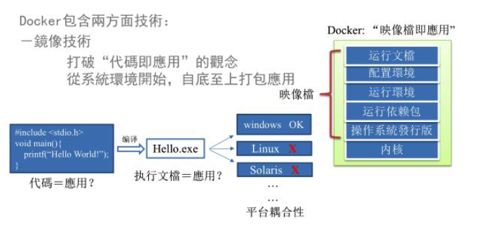
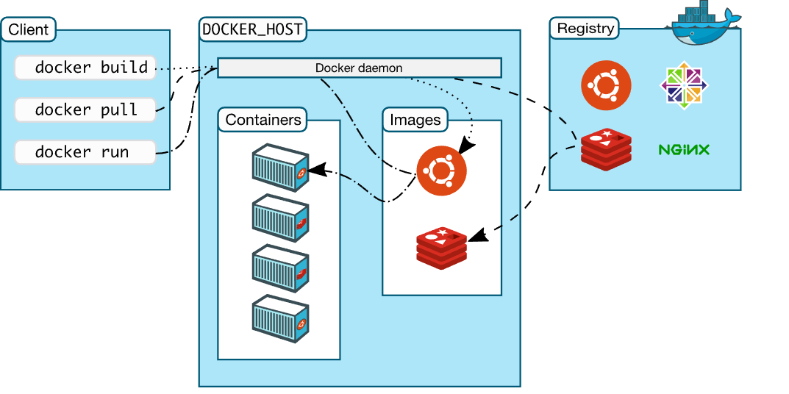
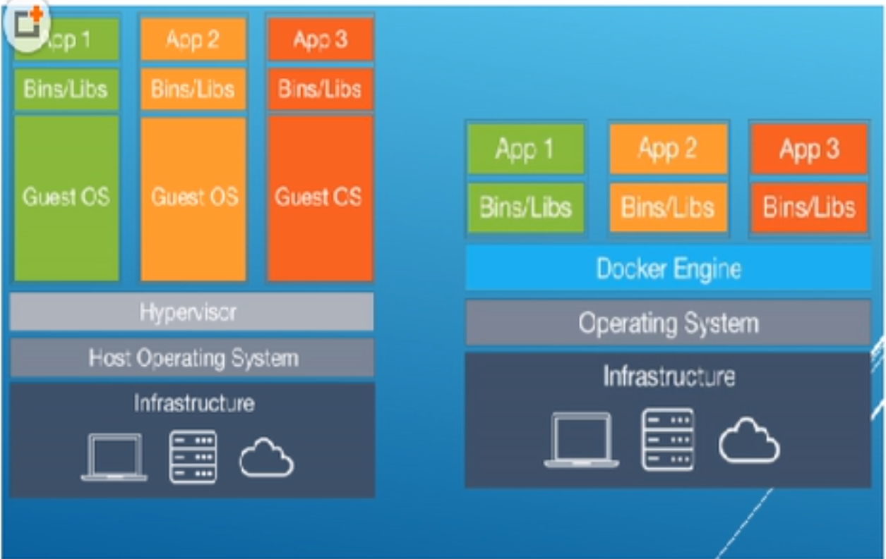
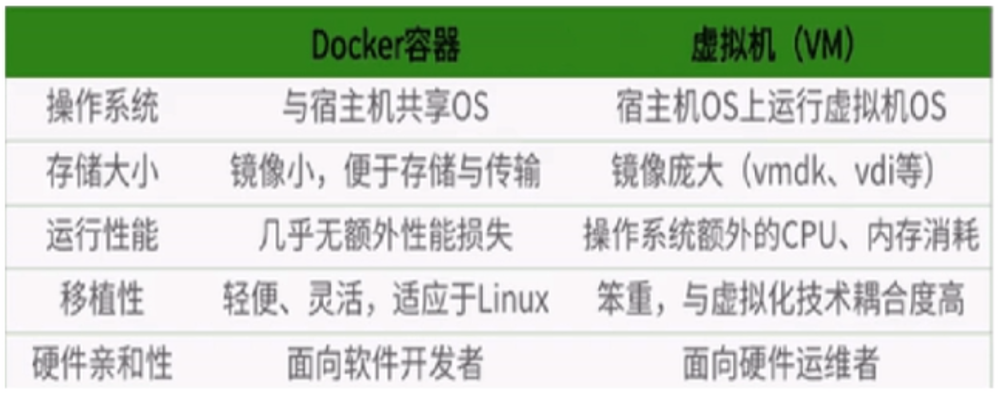
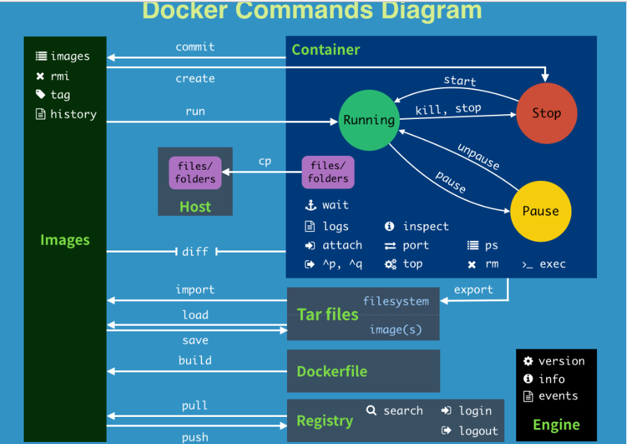

# Docker

## Docker 概述

### Docker 是什么

Docker 使用 Google 公司推出的 **Go** 语言进行开发实现，基于 Linux 内核的 `cgroup`，`namespace`，以及 `AUFS` 类的 `Union FS` 等技术，对**进程进行封装隔离**，属于操作系统层面的**虚拟化技术**。由于**隔离的进程独立于宿主和其它的隔离的进程**，因此也称其为 **容器** 。最初实现是基于 LXC，从 0.7 版本以后开始去除 LXC，转而使用自行开发的 libcontainer，从 1.11 开始，则进一步演进为使用 runC 和 containerd。Docker 在容器的基础上，进行了进一步的封装，从文件系统、网络互联到进程隔离等等，极大的简化了容器的创建和维护。使得 Docker 技术比虚拟机技术更为轻便、快捷。

下面的图片比较了 Docker 和传统虚拟化方式的不同之处。传统虚拟机技术是虚拟出一套硬件后，在其上运行一个完整操作系统，在该系统上再运行所需应用进程；而容器内的应用进程直接运行于宿主的内核，容器内没有自己的内核，而且也没有进行硬件虚拟。因此容器要比传统虚拟机更为轻便。


### Docker 能干什么

传统上认为，软件编码开发/测试结束后，所产出的成果即是程序或是能够编译执行的二进制字节码等(java为例)。而为了让这些程序可以顺利执行，开发团队也得准备完整的部署文件，让维运团队得以部署应用程式，开发需要清楚的告诉运维部署团队，用的全部配置文件+所有软件环境。不过，即便如此，仍然常常发生部署失败的状况。

Docker镜像的设计，使得Docker得以**打破过去「程序即应用」的观念**。**透过镜像(images)将作业系统核心除外，运作应用程式所需要的系统环境，由下而上打包，达到应用程式跨平台间的无缝接轨运作**。其主要目标是“**Build，Ship and Run Any App,Anywhere**”，也就是通过对应用组件的封装、分发、部署、运行等生命周期的管理，使用户的APP（可以是一个WEB应用或数据库应用等等）及其运行环境能够做到“一次封装，到处运行”。Linux 容器技术的出现就解决了这样一个问题，而 Docker 就是在它的基础上发展过来的。将应用运行在 Docker 容器上面，而 Docker 容器在任何操作系统上都是一致的，这就实现了跨平台、跨服务器。只需要一次配置好环境，换到别的机子上就可以一键部署好，大大简化了操作。**解决了运行环境和配置问题的软件容器，方便做持续集成并有助于整体发布的容器虚拟化技术。**软件可以带环境安装？也就是说，安装的时候，把原始环境一模一样地复制过来。开发人员利用 Docker 可以消除协作编码时“在我的机器上可正常工作”的问题。

**开发/运维（DevOps）**：一次构建、随处运行

- **一致的运行环境**

  应用容器化运行后，生产环境运行的应用可与开发、测试环境的应用高度一致，容器会将应用程序相关的环境和状态完全封装起来，不会因为底层基础架构和操作系统的不一致性给应用带来影响，产生新的BUG。当出现程序异常时，也可以通过测试环境的相同容器进行快速定位和修复。

- **更快速的启动时间**

    传统的虚拟机技术启动应用服务往往需要数分钟，而 Docker 容器应用，由于直接运行于宿主内核，无需启动完整的操作系统，因此可以做到秒级、甚至毫秒级的启动时间。大大的节约了开发、测试、部署的时间。

- **持续交付和部署**

    使用 Docker 可以通过定制应用镜像来实现持续集成、持续交付、部署。开发人员可以通过 Dockerfile 来进行镜像构建，并结合**持续集成**(Continuous Integration) 系统进行集成测试，而运维人员则可以直接在生产环境中快速部署该镜像，甚至结合**持续部署**(Continuous Delivery/Deployment) 系统进行自动部署。而且使用 Dockerfile 使镜像构建透明化，不仅仅开发团队可以理解应用运行环境，也方便运维团队理解应用运行所需条件，帮助更好的生产环境中部署该镜像。

- **更轻松的迁移**

    由于 Docker 确保了执行环境的一致性，使得应用的迁移更加容易。Docker 可以在很多平台上运行，无论是物理机、虚拟机、公有云、私有云（可使用 OpenStack 搭建），甚至是笔记本，其运行结果是一致的。因此用户可以很轻易的将在一个平台上运行的应用，迁移到另一个平台上，而不用担心运行环境的变化导致应用无法正常运行的情况。

- **更高效的计算资源利用**

  Docker是内核级虚拟化，其不像传统的虚拟化技术一样需要额外的Hypervisor支持，不需要进行硬件虚拟以及运行完整操作系统等额外开销，所以在一台物理机上可以运行很多个容器实例，可大大提升物理服务器的CPU和内存的利用率。

- **更便捷的升级和扩缩容**

  随着微服务架构和Docker的发展，大量的应用会通过微服务方式架构，应用的开发构建将变成搭乐高积木一样，每个Docker容器将变成一块“积木”，应用的升级将变得非常容易。当现有的容器不足以支撑业务处理时，可通过镜像运行新的容器进行快速扩容，使应用系统的扩容从原先的天级变成分钟级甚至秒级。

对比传统虚拟机总结

| 特性       | 容器               | 虚拟机      |
| :--------- | :----------------- | :---------- |
| 启动       | 秒级               | 分钟级      |
| 硬盘使用   | 一般为 `MB`        | 一般为 `GB` |
| 性能       | 接近原生           | 弱于        |
| 系统支持量 | 单机支持上千个容器 | 一般几十个  |



### Docker 引擎

Docker 引擎是一个包含以下主要组件的客户端服务器应用程序。

-   一种服务器，它是一种称为**守护进程并且长时间运行的程序**。
-   REST API 用于指定程序可以用来与守护进程通信的接口，并指示它做什么。
-   一个有命令行界面 (CLI) 工具的客户端。


### Docker 架构

-   Docker 使用客户端 - 服务器 (C/S) 架构模式，使用远程 API 来管理和创建 Docker 容器。
-   Docker 容器通过 Docker 镜像来创建。
-   容器与镜像的关系类似于面向对象编程中的对象与类。



| 标题            | 说明                                                         |
| :-------------- | :----------------------------------------------------------- |
| 镜像(Images)    | Docker 镜像是用于创建 Docker 容器的模板。                    |
| 容器(Container) | 容器是独立运行的一个或一组应用。                             |
| 客户端(Client)  | Docker 客户端通过命令行或者其他工具使用 Docker API ([https://docs.docker.com/reference/api/docker_remote_api](http://www.qfdmy.com/wp-content/themes/quanbaike/go.php?url=aHR0cHM6Ly9kb2NzLmRvY2tlci5jb20vcmVmZXJlbmNlL2FwaS9kb2NrZXJfcmVtb3RlX2FwaQ==)) 与 Docker 的守护进程通信。 |
| 主机(Host)      | 一个物理或者虚拟的机器用于执行 Docker 守护进程和容器。       |
| 仓库(Registry)  | Docker 仓库用来保存镜像，可以理解为代码控制中的代码仓库。Docker Hub([https://hub.docker.com](http://www.qfdmy.com/wp-content/themes/quanbaike/go.php?url=aHR0cHM6Ly9odWIuZG9ja2VyLmNvbS8=)) 提供了庞大的镜像集合供使用。 |
| Docker Machine  | Docker Machine是一个简化Docker安装的命令行工具，通过一个简单的命令行即可在相应的平台上安装Docker，比如VirtualBox、 Digital Ocean、Microsoft Azure。 |


### Docker 基本组成

Docker 本身是一个容器运行载体或称之为管理引擎。我们把应用程序和配置依赖打包好形成一个可交付的运行环境，这个打包好的运行环境就就是 image 镜像文件。只有通过这个镜像文件才能生成 Docker 容器。image 文件可以看作是容器的模板。Docker 根据 image 文件生成容器的实例。同一个 image 文件，可以生成多个同时运行的容器实例。

- **镜像**：Docker 镜像（Image）就是一个**只读的模板**。镜像可以**用来创建 Docker 容器**，一个镜像可以创建很多容器。
- **容器**：Docker 利用容器（Container）独立运行的一个或一组应用。**容器是用镜像创建的运行实例**。它可以被启动、开始、停止、删除。每个容器都是相互隔离的、保证安全的平台。**可以把容器看做是一个简易版的 Linux 环境**（包括root用户权限、进程空间、用户空间和网络空间等）和运行在其中的应用程序。容器的定义和镜像几乎一模一样，也是一堆层的统一视角，唯一区别在于容器的最上面那一层是可读可写的。
- **仓库**：仓库（Repository）是**集中存放镜像文件的场所**。仓库（Repository）和仓库注册服务器（Registry）是有区别的。仓库注册服务器上往往存放着多个仓库，每个仓库中又包含了多个镜像，每个镜像有不同的标签（tag）。仓库分为公开仓库（Public）和私有仓库（Private）两种形式。最大的公开仓库是 Docker Hub(https://hub.docker.com/)，存放了数量庞大的镜像供用户下载。国内的公开仓库包括阿里云 、网易云等

### Docker 的底层原理

- Docker如何工作？

Docker是一个Client-Server 结构的系统，Docker守护进程运行在主机上， 然后通过Socket连接从客户端访问，守护进程从客户端接受命令并管理运行在主机上的容器。容器是一个运行时环境，就是我们前面说到的集装箱。 


- 为什么Docker比较比VM快？

虚拟机（virtual machine）就是带环境安装的一种解决方案。它可以在一种操作系统里面运行另一种操作系统，比如在Windows 系统里面运行Linux 系统。应用程序对此毫无感知，因为虚拟机看上去跟真实系统一模一样，而对于底层系统来说，虚拟机就是一个普通文件，不需要了就删掉，对其他部分毫无影响。这类虚拟机完美的运行了另一套系统，能够使**应用程序，操作系统和硬件**三者之间的逻辑不变。虚拟机的缺点：资源占用多、冗余步骤多、启动慢。

由于前面虚拟机存在这些缺点，Linux 发展出了另一种虚拟化技术：Linux 容器（Linux Containers，缩写为 LXC）。Linux 容器不是模拟一个完整的操作系统，而是对进程进行隔离。有了容器，就可以将软件运行所需的所有资源打包到一个隔离的容器中。容器与虚拟机不同，不需要捆绑一整套操作系统，只需要软件工作所需的库资源和设置。系统因此而变得高效轻量并保证部署在任何环境中的软件都能始终如一地运行。



比较 **Docker 和传统虚拟化方式的不同之处**：

- 传统虚拟机技术是**虚拟出一套硬件**后，在其上运行一个完整操作系统，在该系统上再运行所需应用进程；Docker有着比虚拟机更少的抽象层。由于**Docker不需要Hypervisor实现硬件资源虚拟化**，运行在Docker容器上的程序直接使用的都是实际物理机的硬件资源。因此在CPU、内存利用率上Docker将会在效率上有明显优势。
- Docker**利用的是宿主机的内核**，而不需要Guest OS。因此当新建一个容器时，Docker不需要和虚拟机一样重新加载一个操作系统内核。进而避免引寻、加载操作系统内核等比较费时费资源的过程。然而当新建一个虚拟机时，虚拟机软件需要加载Guest OS，返个新建过程是分钟级别的。而Docker由于直接利用宿主机的操作系统，则省略了返个过程，因此新建一个Docker容器只需要几秒钟。
- 每个容器之间**互相隔离**，每个容器有自己的文件系统 ，容器之间进程不会相互影响，能区分计算资源。




## Docker 镜像原理

### UnionFS

UnionFS（联合文件系统）：Union文件系统（UnionFS）是一种分层、轻量级并且高性能的文件系统，它支持**对文件系统的修改作为一次提交来一层层的叠加**，同时可以将不同目录挂载到同一个虚拟文件系统下(unite several directories into a single virtual filesystem)。UnionFS 是 Docker 镜像的基础。镜像可以通过分层来进行继承，基于基础镜像（没有父镜像），可以制作各种具体的应用镜像。以我们的pull为例，在下载的过程中我们可以看到docker的镜像好像是在一层一层的在下载。

特性：一次同时加载多个文件系统，但从外面看起来，只能看到一个文件系统，联合加载会把各层文件系统叠加起来，这样最终的文件系统会包含所有底层的文件和目录。

### Docker分层镜像&镜像加载原理

- Docker的镜像实际上由一层一层的文件系统组成，这种层级的文件系统UnionFS。

- **bootfs**(boot file system)主要包含**bootloader和kernel**, bootloader主要是引导加载kernel, Linux刚启动时会加载bootfs文件系统，在Docker镜像的最底层是bootfs。这一层与我们典型的Linux/Unix系统是一样的，包含boot加载器和内核。当boot加载完成之后整个内核就都在内存中了，此时内存的使用权已由bootfs转交给内核，此时系统也会卸载bootfs。

- **rootfs** (root file system) ，在bootfs之上rootfs (root file system) ，在bootfs之上。包含的就是典型 Linux 系统中的 /dev, /proc, /bin, /etc 等标准目录和文件。rootfs就是各种不同的操作系统发行版，比如Ubuntu，Centos等等。

- 为什么 Docker 镜像要采用这种**分层结构**呢——**共享资源**

    比如：有多个镜像都从相同的 base 镜像构建而来，那么宿主机只需在磁盘上保存一份base镜像，同时内存中也只需加载一份 base 镜像，就可以为所有容器服务了。而且镜像的每一层都可以被共享。


> 平时我们安装进虚拟机的CentOS都是好几个G，为什么docker这里才200M？？
>
> 对于一个精简的OS，rootfs可以很小，只需要包括最基本的命令、工具和程序库就可以了，因为底层直接用Host的kernel，自己只需要提供 rootfs 就行了。由此可见对于不同的linux发行版, bootfs基本是一致的, rootfs会有差别, 因此不同的发行版可以公用bootfs。
>
> 平时我们安装进虚拟机的Tomcat都是几十M，为什么Docker这里几百M？？
>
> 分层结构，可能包括了Linux kernel / Ubuntu / JDK / Tomcat。

### Docker镜像的特点

Docker镜像都是**只读**的。当容器启动时，**一个新的可写层被加载到镜像的顶部**。这一层通常被称作“**容器层**”，“容器层”之下的都叫“镜像层”。


### Docker镜像Commit

- `docker commit -m "提交的描述信息” -a “作者” 容器ID 要创建的目标镜像名:[标签名]`

    提交容器副本使之成为一个新的镜像

- 案例演示

    1. 从Hub上下载tomcat镜像到本地并成功运行`docker run -it -p 8080:8080 tomcat`
    2. 故意删除上一步镜像生产tomcat容器的文档docs（需要启动后进入）
    3. 也即当前的tomcat运行实例是一个没有文档内容的容器，以它为模板commit一个没有doc的tomcat新镜像
    4. 启动我们的新镜像并和原来的对比


## Docker 安装

1. 查看[官网文档](https://docs.docker.com/install/)，有各种系统的安装介绍。

2. 配置镜像加速，在[阿里云的容器镜像服务](https://cr.console.aliyun.com/cn-hangzhou/instances/repositories)中镜像加速器按步骤配置即可。

3. 为解决每次执行 docker 命令都需要 sudo，可以将当前用户添加到 docker 组中

    ```bash
    sudo groupadd docker # 一般安装 docker 后都会自动添加该组
    sudo gpasswd -a ${USER} docker # 添加当前用户到 docker 组
    sudo service docker restart # 重启 docker 服务
    newgrp - docker # 刷新 docker 成员
    ```

    

## Docker 帮助命令

- `docker version`：docker的版本等信息
- `docker info`：docker详细信息
- `docker --help`：**帮助**

## Docker 镜像命令

### 列出镜像

- `docker images [options]`：列出**本地主机**上的镜像

  - `ls`：可省略，简写
  - `-a`：**列出本地所有的镜像（含中间映像层）**
  - `-q`：**静默**模式，**只显示镜像ID**。
  - `--digests`：显示镜像的摘要信息
  - `--no-trunc`：显示完整的镜像信息

  ```bash
  docker image ls
  # 输出如下
  REPOSITORY           TAG                 IMAGE ID            CREATED             SIZE
  redis                latest              5f515359c7f8        5 days ago          183 MB
  nginx                latest              05a60462f8ba        5 days ago          181 MB
  mongo                3.2                 fe9198c04d62        5 days ago          342 MB
  <none>               <none>              00285df0df87        5 days ago          342 MB
  ubuntu               16.04               f753707788c5        4 weeks ago         127 MB
  ubuntu               latest              f753707788c5        4 weeks ago         127 MB
  ubuntu               14.04               1e0c3dd64ccd        4 weeks ago         188 MB
  ```

  REPOSITORY：表示镜像的仓库名；TAG：镜像的标签；IMAGE ID：镜像ID；CREATED：镜像创建时间；SIZE：镜像大小

### 搜索镜像

- `docker search [OPTIONS] 镜像名字`：从https://hub.docker.com来查找镜像的！
- `--no-trunc` : 显示完整的镜像描述
  - `-s` : **列出收藏数不小于指定值的镜像**，star缩写
  - `--automated` : 只列出 automated build类型的镜像；

### 拉取镜像

- `docker pull [选项] [Docker Registry 地址[:端口号]/]仓库名[:标签]`：**下载镜像**
    - **镜像仓库地址：** 地址的格式一般是 `<域名/IP>[:端口号]`。默认地址是 Docker Hub。
    - **仓库名：** 如之前所说，这里的仓库名是两段式名称，即 `<用户名>/<软件名>`。对于 Docker Hub，如果不给出用户名，则默认为 `library`，也就是官方镜像。

### 删除镜像

- `docker image rm [选项] <镜像1> [<镜像2> ...]`：**删除镜像**，`-f`为强制删除

  其中，`<镜像>` 可以是 `镜像短 ID`（截取长 ID 首部即可）、`镜像长 ID`、`镜像名` 或者 `镜像摘要`
  
  - `docker rmi -f 镜像ID`：删除单个，不写tag默认为latest
  - `docker rmi -f 镜像名1:TAG 镜像名2:TAG `：删除多个
  - `docker rmi -f $(docker images -qa)`：删除全部
  
- 用 `docker image ls` 命令来配合

    像其它可以承接多个实体的命令一样，可以使用 `docker image ls -q` 来配合使用 `docker image rm`，这样可以成批的删除希望删除的镜像。我们在“镜像列表”章节介绍过很多过滤镜像列表的方式都可以拿过来使用。比如，我们需要删除所有仓库名为 `redis` 的镜像：

    ```bash
    docker image rm $(docker image ls -q redis)
    ```

    或者删除所有在 `mongo:3.2` 之前的镜像：

    ```bash
    docker image rm $(docker image ls -q -f before=mongo:3.2)
    ```

    

    


### 镜像、容器等体积

如果仔细观察，会注意到，这里标识的所占用空间和在 Docker Hub 上看到的镜像大小不同。比如，`ubuntu:16.04` 镜像大小，在这里是 `127 MB`，但是在 Docker Hub 显示的却是 `50 MB`。这是因为 Docker Hub 中显示的体积是压缩后的体积。在镜像下载和上传过程中镜像是保持着压缩状态的，因此 Docker Hub 所显示的大小是网络传输中更关心的流量大小。而 `docker image ls` 显示的是镜像下载到本地后，展开的大小，准确说，是展开后的各层所占空间的总和，因为镜像到本地后，查看空间的时候，更关心的是本地磁盘空间占用的大小。

另外一个需要注意的问题是，`docker image ls` 列表中的镜像体积总和并非是所有镜像实际硬盘消耗。由于 Docker 镜像是多层存储结构，并且可以继承、复用，因此不同镜像可能会因为使用相同的基础镜像，从而拥有共同的层。由于 Docker 使用 Union FS，相同的层只需要保存一份即可，因此实际镜像硬盘占用空间很可能要比这个列表镜像大小的总和要小的多。你可以通过以下命令来便捷的查看镜像、容器、数据卷所占用的空间。

*   `docker system df`：查看镜像、容器、本地卷、构建缓存的空间

    ```bash
    docker system df
    # 输出如下
    TYPE                TOTAL               ACTIVE              SIZE                RECLAIMABLE
    Images              24                  0                   1.992GB             1.992GB (100%)
    Containers          1                   0                   62.82MB             62.82MB (100%)
    Local Volumes       9                   0                   652.2MB             652.2MB (100%)
    Build Cache                                                 0B                  0B
    ```


### 虚悬镜像

上面`iamges`的镜像列表中，还可以看到一个特殊的镜像，这个镜像既没有仓库名，也没有标签，均为 `none`

```bash
<none>               <none>              00285df0df87        5 days ago          342 MB
```

这个镜像原本是有镜像名和标签的，原来为 `mongo:3.2`，随着官方镜像维护，发布了新版本后，重新 `docker pull mongo:3.2` 时，`mongo:3.2` 这个镜像名被转移到了新下载的镜像身上，而旧的镜像上的这个名称则被取消，从而成为了`none`。除了 `docker pull` 可能导致这种情况，`docker build` 也同样可以导致这种现象。由于新旧镜像同名，旧镜像名称被取消，从而出现仓库名、标签均为 `none` 的镜像。这类无标签镜像也被称为 **虚悬镜像(dangling image)** ，可以用下面的命令专门显示这类镜像：

```bash
docker image ls -f dangling=true
# 输出如下
REPOSITORY          TAG                 IMAGE ID            CREATED             SIZE
<none>              <none>              00285df0df87        5 days ago          342 MB
```

一般来说，虚悬镜像已经失去了存在的价值，是可以随意删除的，可以用下面的命令删除。

```bash
docker image prune
```


### 中间层镜像

为了加速镜像构建、重复利用资源，Docker 会利用 **中间层镜像**。所以在使用一段时间后，可能会看到一些依赖的中间层镜像。默认的 `docker image ls` 列表中只会显示顶层镜像，如果希望显示包括中间层镜像在内的所有镜像的话，需要加 `-a` 参数。

```bash
docker image ls -a
```

这样会看到很多无标签的镜像，与之前的虚悬镜像不同，这些无标签的镜像很多都是中间层镜像，是其它镜像所依赖的镜像。这些无标签镜像不应该删除，否则会导致上层镜像因为依赖丢失而出错。实际上，这些镜像也没必要删除，因为之前说过，相同的层只会存一遍，而这些镜像是别的镜像的依赖，因此并不会因为它们被列出来而多存了一份，无论如何你也会需要它们。只要删除那些依赖它们的镜像后，这些依赖的中间层镜像也会被连带删除。


### 列出部分镜像

不加任何参数的情况下，`docker image ls` 会列出所有顶级镜像，但是有时候我们只希望列出部分镜像。`docker image ls` 有好几个参数可以帮助做到这个事情。

*   根据仓库名列出镜像

    ```bash
    docker image ls ubuntu
    # 输出如下
    REPOSITORY          TAG                 IMAGE ID            CREATED             SIZE
    ubuntu              16.04               f753707788c5        4 weeks ago         127 MB
    ubuntu              latest              f753707788c5        4 weeks ago         127 MB
    ubuntu              14.04               1e0c3dd64ccd        4 weeks ago         188 MB
    ```

*   列出特定的某个镜像，也就是说指定仓库名和标签

    ```bash
    docker image ls ubuntu:16.04
    # 输出如下
    REPOSITORY          TAG                 IMAGE ID            CREATED             SIZE
    ubuntu              16.04               f753707788c5        4 weeks ago         127 MB
    ```

*   除此以外，`docker image ls` 还支持强大的过滤器参数 `--filter`，或者简写 `-f`。之前我们已经看到了使用过滤器来列出虚悬镜像的用法，它还有更多的用法。比如，我们希望看到在 `mongo:3.2` 之后建立的镜像，可以用下面的命令

    ```bash
    docker image ls -f since=mongo:3.2
    # 输出如下
    REPOSITORY          TAG                 IMAGE ID            CREATED             SIZE
    redis               latest              5f515359c7f8        5 days ago          183 MB
    nginx               latest              05a60462f8ba        5 days ago          181 MB
    ```

*   想查看某个位置之前的镜像也可以，只需要把 `since` 换成 `before` 即可。

    此外，如果镜像构建时，定义了 `LABEL`，还可以通过 `LABEL` 来过滤。

    ```bash
    docker image ls -f label=com.example.version=0.1
    ```

    


### 以特定格式显示

默认情况下，`docker image ls` 会输出一个完整的表格，但是我们并非所有时候都会需要这些内容。比如，刚才删除虚悬镜像的时候，我们需要利用 `docker image ls` 把所有的虚悬镜像的 ID 列出来，然后才可以交给 `docker image rm` 命令作为参数来删除指定的这些镜像，这个时候就用到了 `-q` 参数。

```bash
docker image ls -q
# 输出如下
5f515359c7f8
05a60462f8ba
fe9198c04d62
00285df0df87
f753707788c5
f753707788c5
1e0c3dd64ccd
```

`--filter` 配合 `-q` 产生出指定范围的 ID 列表，然后送给另一个 `docker` 命令作为参数，从而针对这组实体成批的进行某种操作的做法在 Docker 命令行使用过程中非常常见，不仅仅是镜像，将来我们会在各个命令中看到这类搭配以完成很强大的功能。因此每次在文档看到过滤器后，可以多注意一下它们的用法。

另外一些时候，我们可能只是对表格的结构不满意，希望自己组织列；或者不希望有标题，这样方便其它程序解析结果等，这就用到了 [Go 的模板语法](http://www.qfdmy.com/wp-content/themes/quanbaike/go.php?url=aHR0cHM6Ly9nb2h1Z28uaW8vdGVtcGxhdGVzL2dvLXRlbXBsYXRlcy8=)。

比如，下面的命令会直接列出镜像结果，并且只包含镜像 ID 和仓库名：

```bash
docker image ls --format "{{.ID}}: {{.Repository}}"
# 输出如下
5f515359c7f8: redis
05a60462f8ba: nginx
fe9198c04d62: mongo
00285df0df87: <none>
f753707788c5: ubuntu
f753707788c5: ubuntu
1e0c3dd64ccd: ubuntu
```

或者打算以表格等距显示，并且有标题行，和默认一样，不过自己定义列：

```bash
docker image ls --format "table {{.ID}}\t{{.Repository}}\t{{.Tag}}"
# 输出如下
IMAGE ID            REPOSITORY          TAG
5f515359c7f8        redis               latest
05a60462f8ba        nginx               latest
fe9198c04d62        mongo               3.2
00285df0df87        <none>              <none>
f753707788c5        ubuntu              16.04
f753707788c5        ubuntu              latest
1e0c3dd64ccd        ubuntu              14.04
```


## Docker 容器命令

### 查看容器

*   **列出当前所有正在运行的容器**：`docker ps [OPTIONS]`
    *   `-a` :列出当前**所有正在运行的容器+历史上运行过的**
    *   `-l` :显示最近创建的容器。
    *   `-n`：显示最近n个创建的容器。
    *   `-q` :**静默**模式，**只显示容器编号**。
    *   `--no-trunc` :不截断输出。
*   查看**容器内运行的进程**：`docker top 容器ID`
*   查看容器内部细节：`docker inspect 容器ID`。以JSON格式来查看细节
*   **进入正在运行的容器并以命令行交互**

    - `docker exec -it 容器ID [命令]`：在容器中打开新的终端，并且可以启动新的进程（利用命令）
    - `docker attach 容器ID`：直接重新进入容器启动命令的终端，不会启动新的进程
*   查看容器**日志**：`docker logs -f -t --tail 容器ID`

    - `-t` 是加入时间戳
    - `-f` 跟随最新的日志打印
    - `--tail` 数字 显示最后多少条
*   **从容器内拷贝文件到主机上（可反过来）**：`docker cp 容器ID:容器内路径 目的主机路径`


### 启动容器

- **新建并启动容器**：`docker run [OPTIONS] IMAGE [COMMAND] [ARG...]`

    - `--name=指定容器名称`: 为容器指定一个**名称**；
    - `-d`: 后台运行容器，并返回容器ID，也即**启动守护式容器**；
    - `-i`：以**交互模式运行容器**，通常与 -t 同时使用；需指定或在容器内执行/bin/bash命令。
    - `-t`：为容器重新**分配一个伪输入终端**，通常与 -i 同时使用；
    - `-P`: 随机端口映射；
    - `-p`: **指定端口映射**，有以下四种格式
        - `ip:hostPort:containerPort`
        - `ip::containerPort`
        - `hostPort:containerPort`（常用）
        - `containerPort`

- **启动守护式容器**：`docker run -d 容器名`

    问题：然后docker ps -a 进行查看, 会发现容器已经退出。因为Docker容器后台运行,就必须有一个前台进程，容器运行的命令如果不是那些一直挂起的命令（比如运行top，tail），就是会自动退出的。例如启动Ngixn，需要使用交互模式。Tomcat可以使用守护式启动。

- **启动容器**：`docker start 容器ID或者容器名`

- **重启容器**：`docker restart 容器ID或者容器名`

    当利用 `docker run` 来创建容器时，Docker 在后台运行的标准操作包括：

    *   检查本地是否存在指定的镜像，不存在就从公有仓库下载
    *   利用镜像创建并启动一个容器
    *   分配一个文件系统，并在只读的镜像层外面挂载一层可读写层
    *   从宿主主机配置的网桥接口中桥接一个虚拟接口到容器中去
    *   从地址池配置一个 ip 地址给容器
    *   执行用户指定的应用程序
    *   执行完毕后容器被终止


### 终止容器

- **退出容器**：
- `exit`：容器停止退出
  - `Ctrl+D`
  - `Ctrl+P+Q`：容器不停止退出
- 停止容器（会有延迟）：`docker stop 容器ID或者容器名`
- 强制立即停止容器：`docker kill 容器ID或者容器名`


### 删除容器

- **删除已停止的容器**：`docker rm 容器ID`，`-f`为强制删除（终止容器并删除）
- 删除多个容器：`docker rm -f $(docker ps -a -q)`或`docker ps -a -q | xargs docker rm`

*   清理所有处于终止状态的容器：`docker container prune`

    

### 常用镜像/容器

- MySQL

    `docker run -d --name=tensquare_mysql -p 3306:3306 -e MYSQL_ROOT_PASSWORD=root [mysqlname/id]`

    会设置ROOT用户的密码为root


## 常用命令表



```bash
attach    Attach to a running container                 # 当前 shell 下 attach 连接指定运行镜像
build     Build an image from a Dockerfile              # 通过 Dockerfile 定制镜像
commit    Create a new image from a container changes   # 提交当前容器为新的镜像
cp        Copy files/folders from the containers filesystem to the host path   #从容器中拷贝指定文件或者目录到宿主机中
create    Create a new container                        # 创建一个新的容器，同 run，但不启动容器
diff      Inspect changes on a container's filesystem   # 查看 docker 容器变化
events    Get real time events from the server          # 从 docker 服务获取容器实时事件
exec      Run a command in an existing container        # 在已存在的容器上运行命令
export    Stream the contents of a container as a tar archive   # 导出容器的内容流作为一个 tar 归档文件[对应 import ]
history   Show the history of an image                  # 展示一个镜像形成历史
images    List images                                   # 列出系统当前镜像
import    Create a new filesystem image from the contents of a tarball # 从tar包中的内容创建一个新的文件系统映像[对应export]
info      Display system-wide information               # 显示系统相关信息
inspect   Return low-level information on a container   # 查看容器详细信息
kill      Kill a running container                      # kill 指定 docker 容器
load      Load an image from a tar archive              # 从一个 tar 包中加载一个镜像[对应 save]
login     Register or Login to the docker registry server    # 注册或者登陆一个 docker 源服务器
logout    Log out from a Docker registry server          # 从当前 Docker registry 退出
logs      Fetch the logs of a container                 # 输出当前容器日志信息
port      Lookup the public-facing port which is NAT-ed to PRIVATE_PORT    # 查看映射端口对应的容器内部源端口
pause     Pause all processes within a container        # 暂停容器
ps        List containers                               # 列出容器列表
pull      Pull an image or a repository from the docker registry server   # 从docker镜像源服务器拉取指定镜像或者库镜像
push      Push an image or a repository to the docker registry server    # 推送指定镜像或者库镜像至docker源服务器
restart   Restart a running container                   # 重启运行的容器
rm        Remove one or more containers                 # 移除一个或者多个容器
rmi       Remove one or more images      # 移除一个或多个镜像[无容器使用该镜像才可删除，否则需删除相关容器才可继续或 -f 强制删除]
run       Run a command in a new container              # 创建一个新的容器并运行一个命令
save      Save an image to a tar archive                # 保存一个镜像为一个 tar 包[对应 load]
search    Search for an image on the Docker Hub         # 在 docker hub 中搜索镜像
start     Start a stopped containers                    # 启动容器
stop      Stop a running containers                     # 停止容器
tag       Tag an image into a repository                # 给源中镜像打标签
top       Lookup the running processes of a container   # 查看容器中运行的进程信息
unpause   Unpause a paused container                    # 取消暂停容器
version   Show the docker version information           # 查看 docker 版本号
wait      Block until a container stops, then print its exit code   # 截取容器停止时的退出状态值
```


## Dockerfile

Dockerfile 是一个文本文件，其内包含了一条条的 **指令(Instruction)**，每一条指令构建一层，因此每一条指令的内容，就是描述该层应当如何构建。就是**类似 Linux 中如何安装部署应用的过程**。

### FROM 指定基础镜像

以之前的 Nginx 镜像为例，这次我们使用 Dockerfile 来定制。在一个空白目录中，建立一个文本文件，并命名为 `Dockerfile`

```bash
mkdir mynginx
cd mynginx
touch Dockerfile
```

`Dockerfile`其内容为

```dockerfile
FROM nginx:latest
RUN echo '<h1>Hello, Docker!</h1>' > /usr/share/nginx/html/index.html
```

>   注意：该文件的内容都是在 Docker 引擎中 ，与构建时上下文有关，与宿主机无关。为何 nginx 的目录在/usr/share/nginx，是因为以命令行方式进入 run 后的 nginx 容器中，其存在于该目录下。其他应用可能不同，如 Tomcat 在/usr/local/tomcat下

所谓定制镜像，那一定是以一个镜像为基础，在其上进行定制。就像我们之前运行了一个 Nginx 镜像的容器，再进行修改一样，基础镜像是必须指定的。而 `FROM` 就是指定 **基础镜像**，因此一个 `Dockerfile` 中 `FROM` 是必备的指令，并且必须是第一条指令。可指定基础镜像的版本如`nginx:v1`，不指定版本则默认为 `latest`。

除了选择现有镜像为基础镜像外，Docker 还存在一个特殊的镜像，名为 `scratch`。这个镜像是虚拟的概念，并不实际存在，它表示一个空白的镜像。如果你以 `scratch` 为基础镜像的话，意味着你不以任何镜像为基础，接下来所写的指令将作为镜像第一层开始存在。不以任何系统为基础，直接将可执行文件复制进镜像的做法并不罕见，比如`swarm`、`coreos/etcd`。对于 Linux 下静态编译的程序来说，并不需要有操作系统提供运行时支持，所需的一切库都已经在可执行文件里了，因此直接 `FROM scratch` 会让镜像体积更加小巧。使用 Go 语言开发的应用很多会使用这种方式来制作镜像，这也是为什么有人认为 Go 是特别适合容器微服务架构语言的原因之一。


### RUN 执行命令

`RUN` 指令是用来执行命令行命令的。由于命令行的强大能力，`RUN` 指令在定制镜像时是最常用的指令之一。其格式有两种：

-   **shell 格式：** `RUN <命令>`，就像直接在命令行中输入的命令一样。刚才写的 Dockerfile 中的 `RUN` 指令就是这种格式。

    ```dockerfile
    RUN echo '<h1>Hello, Docker!</h1>' > /usr/share/nginx/html/index.html
    ```

-   **exec 格式：** `RUN ["可执行文件", "参数1", "参数2"]`，这更像是函数调用中的格式。

既然 `RUN` 就像 Shell 脚本一样可以执行命令，那么我们是否就可以像 Shell 脚本一样把每个命令对应一个 RUN 呢？比如这样：

```dockerfile
FROM debian:jessie
RUN apt-get update
RUN apt-get install -y gcc libc6-dev make
RUN wget -O redis.tar.gz "http://download.redis.io/releases/redis-3.2.5.tar.gz"
RUN mkdir -p /usr/src/redis
RUN tar -xzf redis.tar.gz -C /usr/src/redis --strip-components=1
RUN make -C /usr/src/redis
RUN make -C /usr/src/redis install
```

之前说过，Dockerfile 中每一个指令都会建立一层，`RUN` 也不例外。每一个 `RUN` 的行为，就和刚才我们手工建立镜像的过程一样：新建立一层，在其上执行这些命令，执行结束后，`commit` 这一层的修改，构成新的镜像。

而上面的这种写法，创建了 7 层镜像。这是完全没有意义的，而且很多运行时不需要的东西，都被装进了镜像里，比如编译环境、更新的软件包等等。结果就是产生非常臃肿、非常多层的镜像，不仅仅增加了构建部署的时间，也很容易出错。这是很多初学 Docker 的人常犯的一个错误。

>   **注意：** Union FS 是有最大层数限制的，比如 AUFS，曾经是最大不得超过 42 层，现在是不得超过 127 层。

上面的 `Dockerfile` 正确的写法应该是这样：

```dockerfile
FROM debian:jessie
RUN buildDeps='gcc libc6-dev make' \
    && apt-get update \
    && apt-get install -y $buildDeps \
    && wget -O redis.tar.gz "http://download.redis.io/releases/redis-3.2.5.tar.gz" \
    && mkdir -p /usr/src/redis \
    && tar -xzf redis.tar.gz -C /usr/src/redis --strip-components=1 \
    && make -C /usr/src/redis \
    && make -C /usr/src/redis install \
    && rm -rf /var/lib/apt/lists/* \
    && rm redis.tar.gz \
    && rm -r /usr/src/redis \
    && apt-get purge -y --auto-remove $buildDeps
```

首先，之前所有的命令只有一个目的，就是编译、安装 Redis 可执行文件。因此没有必要建立很多层，这只是一层的事情。因此，这里没有使用很多个 `RUN` 对一一对应不同的命令，而是仅仅使用一个 `RUN` 指令，并使用 `&&` 将各个所需命令串联起来。将之前的 7 层，简化为了 1 层。在撰写 Dockerfile 的时候，要经常提醒自己，**这并不是在写 Shell 脚本，而是在定义每一层该如何构建。**

并且，这里为了格式化还进行了换行。Dockerfile 支持 Shell 类的行尾添加 `\` 的命令换行方式，以及行首 `#` 进行注释的格式。良好的格式，比如换行、缩进、注释等，会让维护、排障更为容易，这是一个比较好的习惯。

此外，还可以看到这一组命令的最后添加了清理工作的命令，删除了为了编译构建所需要的软件，清理了所有下载、展开的文件，并且还清理了 `apt` 缓存文件。这是很重要的一步，我们之前说过，镜像是多层存储，每一层的东西并不会在下一层被删除，会一直跟随着镜像。因此镜像构建时，一定要确保每一层只添加真正需要添加的东西，任何无关的东西都应该清理掉。

很多人初学 Docker 制作出了很臃肿的镜像的原因之一，就是忘记了**每一层构建的最后一定要清理掉无关文件**。


### COPY 复制文件到容器中

-   `COPY <源路径>... <目标路径>`
-   `COPY ["<源路径1>",... "<目标路径>"]`

和 `RUN` 指令一样，也有两种格式，一种类似于命令行，一种类似于函数调用。`COPY` 指令将从构建上下文目录中 `<源路径>` 的文件/目录复制到新的一层的镜像内的 `<目标路径>` 位置。比如：

```dockerfile
COPY package.json /usr/src/app/
```

`<源路径>` 可以是多个，甚至可以是通配符，其通配符规则要满足 Go 的 `filepath.Match`规则，如：

```dockerfile
COPY hom* /mydir/
COPY hom?.txt /mydir/
```

`<目标路径>` 可以是容器内的绝对路径，也可以是相对于工作目录的相对路径（工作目录可以用 `WORKDIR` 指令来指定）。目标路径不需要事先创建，如果目录不存在会在复制文件前先行创建缺失目录。

此外，还需要注意一点，使用 `COPY` 指令，源文件的各种元数据都会保留。比如读、写、执行权限、文件变更时间等。这个特性对于镜像定制很有用。特别是构建相关文件都在使用 Git 进行管理的时候。

------

修改默认 Tomcat 容器中的 `index.jsp`

```dockerfile
COPY index.jsp /usr/local/tomcat/webapps/ROOT
```

注意：`index.jsp` 必须在 Dockerfile 文件所属的上下文中，后面的路径就是容器中的地址，和宿主机无关


### ADD（自动解压缩）

`ADD` 指令和 `COPY` 的格式和性质基本一致。但是在 `COPY` 基础上增加了一些功能。比如 `<源路径>` 可以是一个 `URL`，这种情况下，Docker 引擎会试图去下载这个链接的文件放到 `<目标路径>` 去。下载后的文件权限自动设置为 `600`，如果这并不是想要的权限，那么还需要增加额外的一层 `RUN` 进行权限调整，另外，如果下载的是个压缩包，需要解压缩，也一样还需要额外的一层 `RUN` 指令进行解压缩。所以不如直接使用 `RUN` 指令，然后使用 `wget` 或者 `curl` 工具下载，处理权限、解压缩、然后清理无用文件更合理。因此，这个功能其实并不实用，而且不推荐使用。

如果 `<源路径>` 为一个 `tar` 压缩文件的话，压缩格式为 `gzip`, `bzip2` 以及 `xz` 的情况下，`ADD` 指令将会自动解压缩这个压缩文件到 `<目标路径>` 去。在某些情况下，这个自动解压缩的功能非常有用，比如官方镜像 `ubuntu` 中：

```dockerfile
FROM scratch
ADD ubuntu-xenial-core-cloudimg-amd64-root.tar.gz /
```

但在某些情况下，如果我们真的是希望复制个压缩文件进去，而不解压缩，这时就不可以使用 `ADD` 命令了。在 Docker 官方的 `Dockerfile 最佳实践文档` 中要求，尽可能的使用 `COPY`，因为 `COPY` 的语义很明确，就是复制文件而已，而 `ADD` 则包含了更复杂的功能，其行为也不一定很清晰。最适合使用 `ADD` 的场合，就是所提及的需要自动解压缩的场合。另外需要注意的是，`ADD` 指令会令镜像构建缓存失效，从而可能会令镜像构建变得比较缓慢。因此在 `COPY` 和 `ADD` 指令中选择的时候，可以遵循这样的原则，所有的文件复制均使用 `COPY` 指令，仅在需要自动解压缩的场合使用 `ADD`。


### CMD 脚本

`CMD` 指令的格式和 `RUN` 相似，也是两种格式：

-   `shell` 格式：`CMD <命令>`

-   `exec` 格式：`CMD ["可执行文件", "参数1", "参数2"...]`

    参数列表格式：`CMD ["参数1", "参数2"...]`。在指定了 `ENTRYPOINT` 指令后，用 `CMD` 指定具体的参数。

之前介绍容器的时候曾经说过，Docker 不是虚拟机，容器就是进程。既然是进程，那么在启动容器的时候，需要指定所运行的程序及参数。`CMD` 指令就是用于指定默认的容器主进程的启动命令的。

在运行时可以指定新的命令来替代镜像设置中的这个默认命令，比如，`ubuntu` 镜像默认的 `CMD` 是 `/bin/bash`，如果我们直接 `docker run -it ubuntu` 的话，会直接进入 `bash`。我们也可以在运行时指定运行别的命令，如 `docker run -it ubuntu cat /etc/os-release`。这就是用 `cat /etc/os-release` 命令替换了默认的 `/bin/bash` 命令了，输出了系统版本信息。

在指令格式上，一般**推荐**使用 `exec` 格式，这类格式在解析时会被解析为 JSON 数组，因此一定要使用双引号 `"`，而不要使用单引号。如果使用 `shell` 格式的话，实际的命令会被包装为 `sh -c` 的参数的形式进行执行。比如：

```dockerfile
CMD echo $HOME
```

在实际执行中，会将其变更为：

```dockerfile
CMD [ "sh", "-c", "echo $HOME" ]
```

这就是为什么我们可以使用环境变量的原因，因为这些环境变量会被 shell 进行解析处理。

提到 `CMD` 就不得不提容器中应用在前台执行和后台执行的问题。这是初学者常出现的一个混淆。Docker 不是虚拟机，容器中的应用都应该以前台执行，而不是像虚拟机、物理机里面那样，用 upstart/systemd 去启动后台服务，容器内没有后台服务的概念。

一些初学者将 `CMD` 写为：

```dockerfile
CMD service nginx start
```

然后发现容器执行后就立即退出了。甚至在容器内去使用 `systemctl` 命令结果却发现根本执行不了。这就是因为没有搞明白前台、后台的概念，没有区分容器和虚拟机的差异，依旧在以传统虚拟机的角度去理解容器。

对于容器而言，其启动程序就是容器应用进程，容器就是为了主进程而存在的，主进程退出，容器就失去了存在的意义，从而退出，其它辅助进程不是它需要关心的东西。而使用 `service nginx start` 命令，则是希望 upstart 来以后台守护进程形式启动 `nginx` 服务。而刚才说了 `CMD service nginx start` 会被理解为 `CMD [ "sh", "-c", "service nginx start"]`，因此主进程实际上是 `sh`。那么当 `service nginx start` 命令结束后，`sh` 也就结束了，`sh` 作为**主进程退出了，自然就会令容器退出**。

正确的做法是直接执行 `nginx` 可执行文件，并且要求以前台形式运行。比如：

```dockerfile
CMD ["nginx", "-g", "daemon off;"]
```


### ENTRYPOINT 脚本

`ENTRYPOINT` 的格式和 `CMD` 指令格式一样，分为 `exec` 格式和 `shell` 格式。

`ENTRYPOINT` 的目的和 `CMD` 一样，都是在指定容器启动程序及参数。`ENTRYPOINT` 在运行时也可以替代，不过比 `CMD` 要略显繁琐，需要通过 `docker run` 的参数 `--entrypoint` 来指定。当指定了 `ENTRYPOINT` 后，`CMD` 的含义就发生了改变，不再是直接的运行其命令，而是将 `CMD` 的内容作为参数传给 `ENTRYPOINT` 指令，换句话说实际执行时，将变为：

```dockerfile
<ENTRYPOINT> "<CMD>"
```

那么有了 `CMD` 后，为什么还要有 `ENTRYPOINT` 呢？这种 ` <ENTRYPOINT> "<CMD>"` 有什么好处么？让我们来看几个场景。

#### 场景一：让镜像变成像命令一样使用

假设我们需要一个得知自己当前公网 IP 的镜像，那么可以先用 `CMD` 来实现：

```dockerfile
FROM ubuntu:16.04
RUN apt-get update \
    && apt-get install -y curl \
    && rm -rf /var/lib/apt/lists/*
CMD [ "curl", "-s", "http://ip.cn" ]
```

假如我们使用 `docker build -t myip .` 来构建镜像的话，如果我们需要查询当前公网 IP，只需要执行：

```bash
docker run myip
当前 IP：61.148.226.66 来自：北京市 联通
```

嗯，这么看起来好像可以直接把镜像当做命令使用了，不过命令总有参数，如果我们希望加参数呢？比如从上面的 `CMD` 中可以看到实质的命令是 `curl`，那么如果我们希望显示 HTTP 头信息，就需要加上 `-i` 参数。那么我们可以直接加 `-i` 参数给 `docker run myip` 么？

```bash
docker run myip -i
docker: Error response from daemon: invalid header field value "oci runtime error: container_linux.go:247: starting container process caused \"exec: \\\"-i\\\": executable file not found in $PATH\"\n".
```

我们可以看到可执行文件找不到的报错，`executable file not found`。之前我们说过，跟在镜像名后面的是 `command`，运行时会替换 `CMD` 的默认值。因此这里的 `-i` 替换了原来的 `CMD`，而不是添加在原来的 `curl -s http://ip.cn` 后面。而 `-i` 根本不是命令，所以自然找不到。

那么如果我们希望加入 `-i` 这参数，我们就必须重新完整的输入这个命令：

```bash
docker run myip curl -s http://ip.cn -i
```

这显然不是很好的解决方案，而使用 `ENTRYPOINT` 就可以解决这个问题。现在我们重新用 `ENTRYPOINT` 来实现这个镜像：

```dockerfile
FROM ubuntu:16.04
RUN apt-get update \
    && apt-get install -y curl \
    && rm -rf /var/lib/apt/lists/*
ENTRYPOINT [ "curl", "-s", "http://ip.cn" ]
```

这次我们再来尝试直接使用 `docker run myip -i`：

```bash
docker run myip
当前 IP：61.148.226.66 来自：北京市 联通
docker run myip -i
HTTP/1.1 200 OK
Server: nginx/1.8.0
Date: Tue, 22 Nov 2016 05:12:40 GMT
Content-Type: text/html; charset=UTF-8
Vary: Accept-Encoding
X-Powered-By: PHP/5.6.24-1~dotdeb+7.1
X-Cache: MISS from cache-2
X-Cache-Lookup: MISS from cache-2:80
X-Cache: MISS from proxy-2_6
Transfer-Encoding: chunked
Via: 1.1 cache-2:80, 1.1 proxy-2_6:8006
Connection: keep-alive
当前 IP：61.148.226.66 来自：北京市 联通
```

可以看到，这次成功了。这是因为当存在 `ENTRYPOINT` 后，`CMD` 的内容将会作为参数传给 `ENTRYPOINT`，而这里 `-i` 就是新的 `CMD`，因此会作为参数传给 `curl`，从而达到了我们预期的效果。


#### 场景二：应用运行前的准备工作

启动容器就是启动主进程，但有些时候，启动主进程前，需要一些准备工作。

比如 `mysql` 类的数据库，可能需要一些数据库配置、初始化的工作，这些工作要在最终的 mysql 服务器运行之前解决。

此外，可能希望避免使用 `root` 用户去启动服务，从而提高安全性，而在启动服务前还需要以 `root` 身份执行一些必要的准备工作，最后切换到服务用户身份启动服务。或者除了服务外，其它命令依旧可以使用 `root` 身份执行，方便调试等。

这些准备工作是和容器 `CMD` 无关的，无论 `CMD` 为什么，都需要事先进行一个预处理的工作。这种情况下，可以写一个脚本，然后放入 `ENTRYPOINT` 中去执行，而这个脚本会将接到的参数（也就是 ``）作为命令，在脚本最后执行。比如官方镜像 `redis` 中就是这么做的：

```dockerfile
FROM alpine:3.4
RUN addgroup -S redis && adduser -S -G redis redis
ENTRYPOINT ["docker-entrypoint.sh"]
EXPOSE 6379
CMD [ "redis-server" ]
```

可以看到其中为了 redis 服务创建了 redis 用户，并在最后指定了 `ENTRYPOINT` 为 `docker-entrypoint.sh` 脚本。

```sh
#!/bin/sh
# allow the container to be started with `--user`
if [ "$1" = 'redis-server' -a "$(id -u)" = '0' ]; then
    chown -R redis .
    exec su-exec redis "$0" "$@"
fi
exec "$@"
```

该脚本的内容就是根据 `CMD` 的内容来判断，如果是 `redis-server` 的话，则切换到 `redis` 用户身份启动服务器，否则依旧使用 `root` 身份执行。比如：

```bash
docker run -it redis id
uid=0(root) gid=0(root) groups=0(root)
```


### ENV

格式有两种：

-   `ENV  `
-   `ENV = =...`

这个指令很简单，就是设置环境变量而已，无论是后面的其它指令，如 `RUN`，还是运行时的应用，都可以直接使用这里定义的环境变量。

```dockerfile
ENV VERSION=1.0 DEBUG=on \
    NAME="Happy Feet"
```

这个例子中演示了如何换行，以及对含有空格的值用双引号括起来的办法，这和 Shell 下的行为是一致的。

定义了环境变量，那么在后续的指令中，就可以使用这个环境变量。比如在官方 `node` 镜像 `Dockerfile` 中，就有类似这样的代码：

```dockerfile
ENV NODE_VERSION 7.2.0
RUN curl -SLO "https://nodejs.org/dist/v$NODE_VERSION/node-v$NODE_VERSION-linux-x64.tar.xz" \
  && curl -SLO "https://nodejs.org/dist/v$NODE_VERSION/SHASUMS256.txt.asc" \
  && gpg --batch --decrypt --output SHASUMS256.txt SHASUMS256.txt.asc \
  && grep " node-v$NODE_VERSION-linux-x64.tar.xz\$" SHASUMS256.txt | sha256sum -c - \
  && tar -xJf "node-v$NODE_VERSION-linux-x64.tar.xz" -C /usr/local --strip-components=1 \
  && rm "node-v$NODE_VERSION-linux-x64.tar.xz" SHASUMS256.txt.asc SHASUMS256.txt \
  && ln -s /usr/local/bin/node /usr/local/bin/nodejs
```

在这里先定义了环境变量 `NODE_VERSION`，其后的 `RUN` 这层里，多次使用 `$NODE_VERSION` 来进行操作定制。可以看到，将来升级镜像构建版本的时候，只需要更新 `7.2.0` 即可，`Dockerfile` 构建维护变得更轻松了。

下列指令可以支持环境变量展开： `ADD`、`COPY`、`ENV`、`EXPOSE`、`LABEL`、`USER`、`WORKDIR`、`VOLUME`、`STOPSIGNAL`、`ONBUILD`。

可以从这个指令列表里感觉到，环境变量可以使用的地方很多，很强大。通过环境变量，我们可以让一份 `Dockerfile` 制作更多的镜像，只需使用不同的环境变量即可。


### VOLUME

格式为：

-   `VOLUME ["<路径1>", "<路径2>"...]`
-   `VOLUME <路径>`

之前我们说过，容器运行时应该尽量保持容器存储层不发生写操作，对于数据库类需要保存动态数据的应用，其数据库文件应该保存于卷(volume)中，后面的章节我们会进一步介绍 Docker 卷的概念。为了防止运行时用户忘记将动态文件所保存目录挂载为卷，在 `Dockerfile` 中，我们可以事先指定某些目录挂载为匿名卷，这样在运行时如果用户不指定挂载，其应用也可以正常运行，不会向容器存储层写入大量数据。

```dockerfile
VOLUME /data
```

这里的 `/data` 目录就会在运行时自动挂载为匿名卷，任何向 `/data` 中写入的信息都不会记录进容器存储层，从而保证了容器存储层的无状态化。当然，运行时可以覆盖这个挂载设置。比如：

```bash
docker run -d -v mydata:/data xxxx
```

在这行命令中，就使用了 `mydata` 这个命名卷挂载到了 `/data` 这个位置，替代了 `Dockerfile` 中定义的匿名卷的挂载配置。


### EXPOSE 声明端口

格式为 `EXPOSE <端口1> [<端口2>...]`。

`EXPOSE` 指令是声明运行时容器提供服务端口，这只是一个声明，在运行时并不会因为这个声明应用就会开启这个端口的服务。在 Dockerfile 中写入这样的声明有两个好处，一个是帮助镜像使用者理解这个镜像服务的守护端口，以方便配置映射；另一个用处则是在运行时使用随机端口映射时，也就是 `docker run -P` 时，会自动随机映射 `EXPOSE` 的端口。

此外，在早期 Docker 版本中还有一个特殊的用处。以前所有容器都运行于默认桥接网络中，因此所有容器互相之间都可以直接访问，这样存在一定的安全性问题。于是有了一个 Docker 引擎参数 `--icc=false`，当指定该参数后，容器间将默认无法互访，除非互相间使用了 `--links` 参数的容器才可以互通，并且只有镜像中 `EXPOSE` 所声明的端口才可以被访问。这个 `--icc=false` 的用法，在引入了 `docker network` 后已经基本不用了，通过自定义网络可以很轻松的实现容器间的互联与隔离。

要将 `EXPOSE` 和在运行时使用 `-p <宿主端口>:<容器端口>` 区分开来。`-p`，是映射宿主端口和容器端口，换句话说，就是将容器的对应端口服务公开给外界访问，而 `EXPOSE` 仅仅是声明容器打算使用什么端口而已，并不会自动在宿主进行端口映射。


### WORKDIR

格式为 `WORKDIR <工作目录路径>`。

使用 `WORKDIR` 指令可以来**指定工作目录**（或者称为当前目录）类似`cd`，使用`exec`进入容器后的目录。以后各层的当前目录就被改为指定的目录，如该目录不存在，`WORKDIR` 会帮你建立目录。之前提到一些初学者常犯的错误是把 `Dockerfile` 等同于 Shell 脚本来书写，这种错误的理解还可能会导致出现下面这样的错误：

```dockerfile
RUN cd /app
RUN echo "hello" > world.txt
```

如果将这个 `Dockerfile` 进行构建镜像运行后，会发现找不到 `/app/world.txt` 文件，或者其内容不是 `hello`。原因其实很简单，在 Shell 中，连续两行是同一个进程执行环境，因此前一个命令修改的内存状态，会直接影响后一个命令；而在 `Dockerfile` 中，这两行 `RUN` 命令的执行环境根本不同，是两个完全不同的容器。这就是对 `Dockerfile` 构建分层存储的概念不了解所导致的错误。

之前说过每一个 `RUN` 都是启动一个容器、执行命令、然后提交存储层文件变更。第一层 `RUN cd /app` 的执行仅仅是当前进程的工作目录变更，一个内存上的变化而已，其结果不会造成任何文件变更。而到第二层的时候，启动的是一个全新的容器，跟第一层的容器更完全没关系，自然不可能继承前一层构建过程中的内存变化。

因此如果需要改变以后各层的工作目录的位置，那么应该使用 `WORKDIR` 指令。


### 构建镜像

在 `Dockerfile` 文件所在目录执行：

```bash
docker build [选项] <上下文路径/URL/->
```

```bash
root@VM-0-3-ubuntu:/home/ubuntu/Documents/mynginx# docker build -t mynginx:v1 .
Sending build context to Docker daemon  2.048kB
Step 1/2 : FROM nginx:latest
 ---> 231d40e811cd
Step 2/2 : RUN echo '<h1>Hello, Docker!</h1>' > /usr/share/nginx/html/index.html
 ---> Using cache
 ---> 7a882127e80e
Successfully built 7a882127e80e
Successfully tagged mynginx:v1
```

此时我们构建了一个 `mynginx` 版本为`v1`的镜像


### 镜像构建上下文

如果注意，会看到 `docker build` 命令最后有一个 `.`，表示当前目录，而 `Dockerfile` 就在当前目录，因此不少初学者以为这个路径是在指定 `Dockerfile` 所在路径，这么理解其实是不准确的。如果对应上面的命令格式，你可能会发现，这是在指定 **上下文路径**。那么什么是上下文呢？

首先我们要理解 `docker build` 的工作原理。Docker 在运行时分为 Docker 引擎（也就是服务端守护进程）和客户端工具。Docker 的引擎提供了一组 REST API，被称为 `Docker Remote API`，而如 `docker` 命令这样的客户端工具，则是通过这组 API 与 Docker 引擎交互，从而完成各种功能。因此，虽然表面上我们好像是在本机执行各种 `docker` 功能，但实际上一切都是使用的远程调用形式在服务端（Docker 引擎）完成。也因为这种 C/S 设计，让我们操作远程服务器的 Docker 引擎变得轻而易举。

当我们进行镜像构建的时候，并非所有定制都会通过 `RUN` 指令完成，经常会需要将一些本地文件复制进镜像，比如通过 `COPY` 指令、`ADD` 指令等。而 `docker build` 命令构建镜像，其实并非在本地构建，而是在服务端，也就是 Docker 引擎中构建的。那么在这种客户端/服务端的架构中，如何才能让服务端获得本地文件呢？这就引入了上下文的概念。当构建的时候，用户会指定构建镜像上下文的路径，`docker build` 命令得知这个路径后，会将路径下的所有内容打包，然后上传给 Docker 引擎。这样 Docker 引擎收到这个上下文包后，展开就会获得构建镜像所需的一切文件。

如果在 `Dockerfile` 中这么写：

```dockerfile
COPY ./package.json /app/
```

这并不是要复制执行 `docker build` 命令所在的目录下的 `package.json`，也不是复制 `Dockerfile` 所在目录下的 `package.json`，而是复制 **上下文（context）** 目录下的 `package.json`。

因此，`COPY` 这类指令中的源文件的路径都是*相对路径*。这也是初学者经常会问的为什么 `COPY ../package.json /app` 或者 `COPY /opt/xxxx /app` 无法工作的原因，因为这些路径已经超出了上下文的范围，Docker 引擎无法获得这些位置的文件。如果真的需要那些文件，应该将它们复制到上下文目录中去。

现在就可以理解刚才的命令 `docker build -t mynginx:v1 .` 中的这个 `.`，实际上是在指定上下文的目录，`docker build` 命令会将该目录下的内容打包交给 Docker 引擎以帮助构建镜像。

------

如果观察 `docker build` 输出，我们其实已经看到了这个发送上下文的过程：

```
Sending build context to Docker daemon  2.048kB
```

理解构建上下文对于镜像构建是很重要的，避免犯一些不应该的错误。比如有些初学者在发现 `COPY /opt/xxxx /app` 不工作后，于是干脆将 `Dockerfile` 放到了硬盘根目录去构建，结果发现 `docker build` 执行后，在发送一个几十 GB 的东西，极为缓慢而且很容易构建失败。那是因为这种做法是在让 `docker build` 打包整个硬盘，这显然是使用错误。

一般来说，应该会将 `Dockerfile` 置于一个空目录下，或者项目根目录下。如果该目录下没有所需文件，那么应该把所需文件复制一份过来。如果目录下有些东西确实不希望构建时传给 Docker 引擎，那么可以用 `.gitignore` 一样的语法写一个 `.dockerignore`，该文件是用于剔除不需要作为上下文传递给 Docker 引擎的。

那么为什么会有人误以为 `.` 是指定 `Dockerfile` 所在目录呢？这是因为在默认情况下，如果不额外指定 `Dockerfile` 的话，会将上下文目录下的名为 `Dockerfile` 的文件作为 Dockerfile。

这只是默认行为，实际上 `Dockerfile` 的文件名并不要求必须为 `Dockerfile`，而且并不要求必须位于上下文目录中，比如可以用 `-f ../Dockerfile.php` 参数指定某个文件作为 `Dockerfile`。

当然，一般大家习惯性的会使用默认的文件名 `Dockerfile`，以及会将其置于镜像构建上下文目录中。


